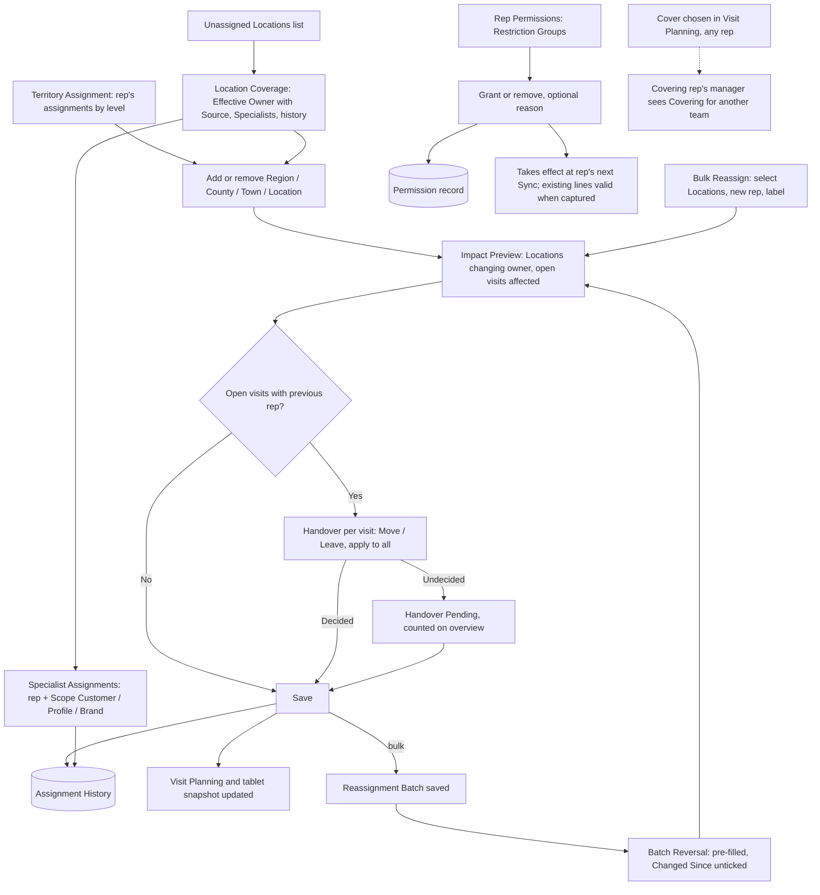

# Coverage Management: UX & User Stories

**Generated:** 17 September 2026 (amended 18 September 2026 for Range Lifecycle and Product Management; amended 23 September 2026 from the UX design sessions — see `../uxdocs/04-user-stories-amendments.md`)
**Bounded context:** Coverage Management, within Sales Operations
**Primary user:** Sales Manager (usually also a Head Office User)
**Scope:** The website screens where a manager decides which rep is responsible for which Locations, attaches specialists, moves coverage between reps, and grants product permissions. Seven screens: Territory Assignment, Location Coverage, Impact Preview & Handover, Bulk Reassign & Batch Reversal, Specialist Assignments, Rep Permissions, Unassigned Locations.

---

## 1. Bounded Context & Scope

### Bounded context

- **Domain area:** Coverage Management. It answers "who is responsible for this Location, and why?", and "what may this rep see?". It never creates Locations, products or visits; it links reps to them.
- **Ubiquitous language:**
  - **Primary Rep** — the one rep responsible for a Location: owner of its Recurring Visit Dues, Missed records and performance. Exactly one, or none (then the Location is **Unassigned**).
  - **Territory Assignment** — an assignment of a rep to a Region, County, Town, or a single Location. Determines Primary Rep by the **Most-Specific Rule**.
  - **Most-Specific Rule** — when Territory Assignments overlap, the narrowest wins: Location beats Town, Town beats County, County beats Region. Two assignments at the same level for the same unit are not allowed; adding one that another rep holds offers a **Transfer** instead of an error.
  - **Transfer** — moving Territory Assignments themselves from one rep to another (not their Locations), so Locations keep resolving through the territory and new Locations follow the new rep. Started from the giving rep (filter, select all, exclude) or pulled from the receiving rep. Selecting only some of a County's Towns creates Town assignments (carve-outs); taking a County's last remaining Towns moves the County assignment too, and taking a Region's last remaining Counties moves the Region assignment. Used for permanent changes such as a new rep replacing a leaving one.
  - **Effective Owner** — the Primary Rep a Location resolves to, always shown with its **Source** ("Aoife (via Rathdrum)").
  - **Specialist Assignment** — an additional rep attached to Locations for a **Scope**, without becoming Primary. Receives Visit Dues in that scope (e.g. a campaign for that Brand) and sees the scope's products on their Order Pad. Never receives Recurring Visit Dues.
  - **Scope** — a rule that selects Locations and products for a Specialist Assignment, built from conditions on **Customer**, **Location Profile**, **Brand** and **Area** (Region, County or Town). By default every condition must hold ("Profile: Customer campaign X · in Wicklow"); an Advanced mode allows AND/OR grouping. Always shown as a sentence with its current match count. Rule-based, so new matching Locations join automatically. Only a Brand condition adds products to the specialist's Order Pad.
  - **Brand** — a named group of products (Product Management). A product has one **Primary Brand** and may have **Alternative Brands**. Brand scope covers any membership, primary or alternative. An archived Brand keeps its products and any Specialist Assignment scoped to it, but is not offered for new scopes.
  - **Impact Preview** — shown before an assignment change is saved: which Locations change owner, and which open visits would be left with the previous rep.
  - **Leaving rep** — a transfer first asks "Is <rep> leaving?". If yes, there is no Handover decision and no Leave: every open visit at a Location changing owner moves to its new Primary Rep with Scheduled Day cleared, as a visit needed.
  - **Inherited visit** — an open visit that moved to a new rep through a transfer, batch or handover Move. Marked "inherited from <rep>"; keeps its due window; counts in the new rep's operational figures but is excluded from their performance until the visit closes.
  - **Handover** — the manager's decision per open visit when a Location changes Primary Rep: **Move** (to the new Primary Rep, Scheduled Day cleared) or **Leave** (with the previous rep). Apply-to-all available. Nothing moves automatically.
  - **Handover Pending** — an open visit still held by a rep who is no longer the Location's Primary Rep and for which no Handover decision has been made. Counted on the Visit Planning manager overview.
  - **Left Visit** — a visit the manager chose to Leave. The previous rep keeps temporary tablet access to that Location until the visit completes, is marked Missed, or is moved.
  - **Reassignment Batch** — a bulk change of Primary Rep saved as a named unit ("Colm → Aoife, maternity cover, 5 Oct 2026, 23 Locations"). Permanent; never reverts on its own. Used only for **long** absence: short leave never changes ownership and is handled by Visit Planning's absence decisions. On save, open visits move to the covering rep as inherited visits needed, with no Leave.
  - **Batch Reversal** — a manual bulk change pre-filled from a batch, sending its Locations back to the original rep. Locations reassigned again since the batch are shown as **Changed Since** and unticked by default. Reversal restores the territory-derived owner; where a territory changed meanwhile and would resolve to someone else, the preview flags it and offers a direct assignment. Open visits go through the per-visit Handover (the rep may return part-time).
  - **Assignment History** — an append-only record of every change to a Location's Primary Rep or Specialist Assignments: date, who, previous and new rep, **Cause** (direct Location assignment, territory assignment, batch, batch reversal), optional reason. Viewable per Location, per rep, per batch.
  - **Cover** — (from Visit Planning) a Visit Due temporarily held by another rep. Any rep may cover; the covering rep's own manager is notified, not asked.
  - **Restriction Group** — a named group of restricted products (Product Management), e.g. "Pharmacy-only medicines". Each restricted product belongs to at most one group. Archiving a group keeps existing permissions but they have no effect while it is archived.
  - **Restriction Permission** — a grant to a rep for one Restriction Group. Granted or removed by the rep's Sales Manager or a Head Office User; each change recorded with date, who, optional reason.
  - **Valid when captured** — (from area 1) an order line stands if the rep held the relevant ownership or permission when they captured it. Applies to reassignment and to Restriction Permission removal.
- **Upstream contexts:**
  - **Customer Directory** — Locations, Towns, Customers, Location Profiles, and the Region → County → Town hierarchy.
  - **Product Catalogue** (area 8) — Brands and their membership, Restriction Groups and their products.
  - **Identity** — which users are Sales Managers, Head Office Users, and which reps report to which manager.
- **Downstream contexts:**
  - **Visit Planning** (area 9) — Primary Rep and Specialists for routing Visit Dues; Handover Pending and cross-team cover on the overview.
  - **Rep at a Location** (area 1) — assigned Locations, Left Visits and covered Locations in the snapshot; Restriction Permissions deciding what is hidden.
  - **Performance** (area 6) — Assignment History for attributing sales to the rep who owned the Location at the time.
- **Terms that mean something different elsewhere:**
  - **Assignment** — the elaboration used it for any rep-to-Location link; here split into Territory Assignment (decides Primary) and Specialist Assignment (does not).
  - **Territory** — a geographic unit (Region, County, Town); a Location-level assignment is still a Territory Assignment for the rule but is not itself a territory.
  - **Cover** vs **Reassignment** — cover is short and keeps ownership; a long absence is a Reassignment Batch.
  - **Brand** vs **Range** vs **Category** — Brand is manufacturer/marketing grouping (many-to-many); Range is commercial and archivable; Category is product type.

### Scope

- **In scope:**
  - Adding and removing Territory Assignments at all four levels, with the Most-Specific Rule
  - Effective Owner with Source on every Location; Unassigned list
  - Impact Preview and per-visit Handover with Apply-to-all; Handover Pending
  - Temporary access for Left Visits
  - Reassignment Batches, Batch Reversal with Changed Since
  - Assignment History views
  - Specialist Assignments by Customer, Location Profile or Brand
  - Cross-team cover permission and manager notification
  - Restriction Permissions per rep, with record
- **Out of scope:**
  - Creating or editing Locations, Towns, Customers, Location Profiles (area 8)
  - Defining Brands, Restriction Groups and their product membership (area 8)
  - Visit Dues, campaigns, absences, cover itself (area 9)
  - The tablet beyond the amendments listed (area 1)
  - Performance attribution logic (area 6)
  - User accounts, roles, sign-in
- **Assumptions:**
  - Each rep reports to exactly one Sales Manager; a Head Office User can act on any rep.
  - A manager can assign only reps they manage, except when choosing a covering rep (any rep).
  - No per-product permission exceptions: a product needing different treatment gets its own Restriction Group.
  - Assignment History timestamps are precise to the minute, sufficient for area 6 attribution.
  - Specialist Assignments are not shown in Impact Preview handovers; their Visit Dues follow the scope, not ownership.

---

## 2. Personas

### Sales Manager

- **Role:** manages a team of Field Salespersons; usually also a Head Office User.
- **Responsibilities:** decides who covers what; reorganises territories; attaches specialists to brands or key customers; handles long absences by reassigning; grants product permissions after training.
- **Context on arrival:** at a desk; a rep has left, a new rep has started, or a brand push needs a specialist; several counties and hundreds of Locations in play; managers of neighbouring teams already in contact.
- **Goal:** "Every Location has someone responsible, I can see who and why, and I can move coverage around without losing track of what moved or leaving work stranded."
- **Pain points:** discovering an uncovered shop only when visits go Overdue; carving one town out of a county without redrawing everything; reversing a leave reassignment weeks later from memory; not knowing which rep was qualified for a controlled product on a given date.

---

## 3. Flow Sketch



---

## 4. Design Decisions

### Most-specific wins, always shown with its source

- **Chose:** overlapping Territory Assignments resolve to the narrowest; every Location shows its Effective Owner and the assignment that produced it; an Impact Preview shows what a change moves before it is saved.
- **Over:** preventing overlaps; shared ownership.
- **Because:** carving a town out of a county is a normal operation; one owner keeps Visit Dues, Missed records and performance unambiguous; a computed owner must be visible or managers will guess.
- **Trade-off accepted:** ownership is derived, so removing a wide assignment can silently change many owners — the preview is the mitigation.
- **Amended 23 Sep 2026:** the Territory Assignment screen is anchored on the rep (the usual trigger is a new rep). Assignments are moved by **Transfer** (push or pull, County rows expandable to Towns), not by batches of direct assignments. The Location page is the manager's single home for a Location: coverage first; an unassigned shop leads with assigning its Town; a covered shop leads with "Change just this shop" (US-001, US-002).

### Primary plus Specialist

- **Chose:** exactly one Primary Rep; any number of Specialist Assignments scoped by Customer, Location Profile or Brand, defined as rules.
- **Over:** multiple equal owners; hand-picked specialist lists.
- **Because:** the business occasionally needs a second rep for a brand or campaign; a rule picks up new matching Locations without maintenance; Recurring visits stay with one owner.
- **Trade-off accepted:** Visit Planning must route campaign visits to a Specialist where the scope matches; brand totals overlap where a product has alternative brands, so they cannot be summed.
- **Amended 23 Sep 2026:** scopes combine conditions (Customer, Location Profile, Brand, Area) with AND, with an Advanced AND/OR mode; the common need is "a profile within an area". When the campaign's link doesn't settle which of several Specialists gets a visit, the manager chooses in campaign Review (US-006).

### Nothing moves or reverts automatically

- **Chose:** an assignment change alters ownership only; open visits get a per-visit Handover decision with Apply-to-all, and undecided ones are flagged Handover Pending; reassignments are permanent, saved as named batches, and reversed by a manual bulk action.
- **Over:** moving visits immediately; effective dates; end dates that revert.
- **Because:** the manager wants control over what moves; dates are too strict for real leave; a saved batch gives the reversal screen something to pre-fill so nobody reverses from memory.
- **Trade-off accepted:** a manager who never decides leaves visits pending (visible on the overview); a batch nobody reverses stays in force.
- **Amended 23 Sep 2026:** when the previous rep is **leaving** (asked once at the start of a transfer) or on **long absence** (a batch), Leave would strand visits, so all open visits move to the new owner as visits needed, marked inherited and kept out of the new rep's performance. The per-visit Handover still applies when both reps are working: carve-outs and batch reversals (US-003, US-004, US-005).

### Left Visits keep temporary access

- **Chose:** a visit Left with the previous rep keeps that Location in their snapshot until it completes, is Missed, or is moved.
- **Over:** stranding the visit; forcing Move.
- **Because:** the same mechanism as cover already exists; without it a Leave decision is unworkable.
- **Trade-off accepted:** two reps briefly see one Location; the tablet marks it "Handover — finish visit".

### Append-only Assignment History

- **Chose:** every ownership and specialist change recorded with date, actor, previous/new rep, cause and optional reason; territory changes produce one entry per affected Location; viewable per Location, rep and batch; never edited.
- **Over:** current-state only; history only for batches.
- **Because:** "who had this shop and why" must be answerable later; area 6 needs who owned a Location when a sale happened; the reversal screen reads from it.
- **Trade-off accepted:** a county assignment writes many entries.

### Cross-team cover by notification

- **Chose:** any rep can be chosen as covering rep; their manager sees "Covering for another team" on that rep's row with Location, window and requesting manager.
- **Over:** own-team only; cross-team approval.
- **Because:** cover is rare and short — most absences are Extend or Keep, and long absences are reassignments; managers are already in contact.
- **Trade-off accepted:** a manager can be handed unplanned work; the notification makes it visible, not blocked.

### Restriction Groups as named permissions, valid when captured

- **Chose:** restricted products grouped; permission granted per group by the rep's manager or head office; each grant/removal recorded; removal takes effect at next Sync and already-captured lines still send.
- **Over:** one all-or-nothing flag; head-office-only grants; server rejection on removal.
- **Because:** restrictions exist for different reasons (legal qualification vs value); manager and head office are usually the same person; one consistent capture rule is easier for reps than exceptions.
- **Trade-off accepted:** a line for a controlled product can be sent by a rep whose permission was withdrawn after capture; head office sees it in area 3.

---

## 5. User Stories

### US-001: Assign a territory or Location to a rep

| Field | Value |
|---|---|
| **Story** | As a Sales Manager, I want to assign a Region, County, Town or single Location to a rep so that every shop in it has a responsible rep without listing shops one by one |
| **Priority** | Must Have |
| **Status** | Ready |
| **Dependencies** | Geography and Locations (Customer Directory) |

**Acceptance criteria:**

*Scenario 1: County assignment*
```
Given County Wicklow has 140 Locations and none are assigned
When I assign Wicklow to Colm
Then the Impact Preview shows "140 Locations become Colm's"
And on save all 140 show Effective Owner "Colm (via Wicklow)"
```

*Scenario 2: Town carved out*
```
Given Wicklow is assigned to Colm
When I assign the Town Rathdrum to Aoife
Then the preview shows "23 Locations move from Colm to Aoife"
And on save Murphy's Pharmacy shows "Aoife (via Rathdrum)" and Doyle's Shop (Laragh) still "Colm (via Wicklow)"
```

*Scenario 3: Duplicate at the same level*
```
Given Rathdrum is assigned to Aoife
When I try to assign Rathdrum to Brian
Then I see "Rathdrum is already assigned to Aoife — remove that assignment first or assign Locations individually"
```

*Scenario 4: Remove an assignment*
```
Given Rathdrum is assigned to Aoife inside Colm's Wicklow
When I remove Aoife's Rathdrum assignment
Then the preview shows "23 Locations move from Aoife to Colm" and on save they resolve via Wicklow
```

*Scenario 5: Remove leaving Unassigned*
```
Given Wexford is assigned only to Brian
When I remove it
Then the preview shows "96 Locations become Unassigned" and asks me to confirm
```

**Edge cases addressed:** a Location-level assignment always wins; removing a wide assignment with nothing beneath produces Unassigned Locations and a confirmation.

**Additional route (23 Sep 2026):** campaign creation (Visit Planning US-011) may create a direct Location assignment where the Location was previously unassigned. It produces the same effective ownership and append-only Assignment History as this screen.

**UX amendments (23 Sep 2026)** — settled in the UX design sessions; full record in `../uxdocs/04-user-stories-amendments.md`.

> The most common trigger for territory work is a new rep, often replacing one who is leaving. A permanent replacement moves the **assignments themselves**, so Locations keep resolving through the territory and new Locations follow the new rep. Bulk reassign (US-004) stays for temporary moves, because it creates direct Location assignments. Settled in `../uxdocs/05-manager.md` M6.1–M6.5.

*Scenario CV001-A*
```
Given I am on Colm's Territory assignment page
When I filter his assignments and choose "Transfer..."
Then a review opens with every assignment in the filtered set selected
And I can remove individual rows before choosing the receiving rep
```

*Scenario CV001-B*
```
Given Colm holds Wicklow (County)
When I view his assignments
Then Wicklow can be expanded to its Towns, each with its Location count
And Towns carved out to another rep are marked with that rep
```

*Scenario CV001-C*
```
Given Colm holds Wicklow (County)
When I transfer the whole County to Niamh
Then the Wicklow County assignment moves to Niamh
And its Locations show "Niamh (via Wicklow)", while carve-outs keep their owners
```

*Scenario CV001-D*
```
Given Colm holds Wicklow (County)
When I transfer only Bray, Greystones and Wicklow Town to Niamh
Then each becomes a Town assignment to Niamh
And the Wicklow County assignment stays with Colm
```

*Scenario CV001-E*
```
Given Bray, Greystones and Wicklow Town have already been transferred to Niamh
When I transfer every remaining Town Colm holds through Wicklow to Ciara
Then the Wicklow County assignment moves to Ciara as well
And the impact preview states "Wicklow (County) moves to Ciara with its last Towns."
```

*Scenario CV001-E2*
```
Given Colm holds South East (Region), and Wicklow (County) has already been transferred to Ciara
When I transfer Wexford, the last County Colm holds through South East, to Ciara
Then the South East Region assignment moves to Ciara as well
And the impact preview states "South East (Region) moves to Ciara with its last Counties."
```

*Scenario CV001-F*
```
Given I am on Niamh's page and Rathdrum (Town) is assigned to Aoife
When I choose "Add assignment"
Then Rathdrum is listed as "Rathdrum — Aoife's"
And choosing it asks "Transfer Rathdrum from Aoife to Niamh?" and continues to the impact preview and handover
```

*Scenario CV001-G*
```
Given I am on Niamh's page
When I choose "Take over from another rep..." and pick Colm
Then the transfer review opens on Colm's assignments with Niamh already set as the receiving rep
```

*Scenario CV001-H*
```
Given any transfer
When I confirm it after the impact preview
Then open visits with the previous rep go to Handover (US-003)
And each Location whose owner changes gets an Assignment History entry
```

**Superseded:** US-001 scenario 3's dead-end message ("remove that assignment first") when adding an area already held at the same level. The transfer offer in scenario CV001-F replaces it.

---

### US-002: See who covers a Location and why

| Field | Value |
|---|---|
| **Story** | As a Sales Manager, I want each Location to show its Effective Owner with the assignment that produced it, plus any Specialists, so that I never have to work the rule out in my head |
| **Priority** | Must Have |
| **Status** | Ready |
| **Dependencies** | US-001, US-006 |

**Acceptance criteria:**

*Scenario 1: Derived owner*
```
When I open Murphy's Pharmacy
Then I see "Primary: Aoife (via Rathdrum)"
And "Specialists: Brian (Brand: SunCo)"
```

*Scenario 2: Direct assignment*
```
Given Byrne's Chemist was assigned directly to Colm
Then it shows "Primary: Colm (assigned directly)"
```

*Scenario 3: Unassigned*
```
Given no assignment reaches Walsh's Shop
Then it shows "Primary: Unassigned" with an Assign action
```

*Scenario 4: History on the Location*
```
When I open History on Murphy's Pharmacy
Then I see entries newest first, e.g. "17 Sep 2026 14:02 — Colm → Aoife — via Rathdrum assignment — by M. Byrne"
```

**UX amendments (23 Sep 2026)** — settled in the UX design sessions; full record in `../uxdocs/04-user-stories-amendments.md`.

> M-07 answers "who covers this shop, and why?" and carries the Location's manager actions, so a manager never has to remember which screen holds which fact about a shop. It stays about coverage: visits are monitored in Visit Planning. Settled in `../uxdocs/05-manager.md` M7.1–M7.5.

*Scenario CV002-A*
```
Given I open Murphy's Pharmacy
When the page loads
Then I see its Primary Rep with source and its Specialists first
And I can add a one-off visit and open History from the same page
```

*Scenario CV002-B*
```
Given Walsh's Shop in Laragh is unassigned and 4 other Laragh Locations are too
When I open Walsh's Shop
Then "Assign Laragh (Town) to..." is offered first, with "4 other Locations in Laragh are unassigned"
And "Assign just this shop to..." is offered beside it
```

*Scenario CV002-C*
```
Given Murphy's Pharmacy shows "Aoife (via Rathdrum)"
When I choose to change its owner
Then "Change just this shop to..." is offered first and creates a direct Location assignment
And "Transfer Rathdrum (Town, 23 Locations) to..." is offered beside it and continues to the transfer's impact preview
```

*Scenario CV002-D*
```
Given I open a Location page
When it renders
Then it shows no list of open Visit Dues and no last-Call line
```

---

### US-003: Decide the handover of open visits

| Field | Value |
|---|---|
| **Story** | As a Sales Manager, I want to choose, per open visit, whether it moves to the new Primary Rep or stays with the previous one, with one choice applicable to all, so that a reassignment never strands a visit |
| **Priority** | Must Have |
| **Status** | Ready |
| **Dependencies** | US-001; Visit Dues (area 9) |

**Acceptance criteria:**

*Scenario 1: Preview lists open visits*
```
Given 23 Rathdrum Locations move from Colm to Aoife
And 9 have open Visit Dues with Colm, 2 Overdue, 3 with a Scheduled Day
When I reach the Impact Preview
Then I see "9 open visits with Colm: 2 Overdue, 3 scheduled" and a Handover list
```

*Scenario 2: Apply to all then exceptions*
```
When I choose Apply to all: Move, then change Murphy's Pharmacy (scheduled Thu 24 Sep) to Leave
Then on save 8 visits move to Aoife with Scheduled Day cleared
And Murphy's stays with Colm as a Left Visit
```

*Scenario 3: Undecided*
```
When I save without deciding 4 visits
Then those 4 are Handover Pending
And Colm's row on the Visit Planning overview shows "4 handover pending"
```

*Scenario 4: Decide later*
```
When I open the Handover Pending list and choose Move for the 4
Then they move to Aoife and the count clears
```

*Scenario 5: Left Visit access*
```
Given Murphy's Pharmacy is a Left Visit with Colm
When Colm syncs
Then Murphy's appears on his tablet marked "Handover — finish visit" until he records a Call there or it is Missed or moved
```

**UX amendments (23 Sep 2026)** — settled in the UX design sessions; full record in `../uxdocs/04-user-stories-amendments.md`.

> The most common reason for handover is a rep leaving and being replaced. "Leave with Colm" is meaningless once Colm has gone, and the new rep's schedule is built fresh anyway. Late visits handed over shouldn't count against the rep who inherits them. Settled in `../uxdocs/05-manager.md` M8.1–M8.2.

*Scenario CV003-A*
```
Given I start a transfer of Colm's assignments
When the transfer begins
Then I am asked "Is Colm leaving?"
```

*Scenario CV003-B*
```
Given I answered that Colm is leaving
When I reach the impact preview
Then Leave is not offered and there is no per-visit handover list
And the preview states how many open visits move to the new owner as visits needed, including how many are Overdue
```

*Scenario CV003-C*
```
Given I confirm a transfer where Colm is leaving
When it is saved
Then every open Visit Due at a Location changing owner moves to that Location's new Primary Rep with its Scheduled Day cleared and its due window unchanged
And none becomes Handover Pending
```

*Scenario CV003-D*
```
Given I answered that Colm is not leaving
When I reach the impact preview
Then the US-003 handover applies unchanged: Move or Leave per visit, Apply to all, and undecided visits become Handover Pending
```

*Scenario CV003-E*
```
Given Byrne's recurring visit was Overdue when it moved from Colm to Niamh
When it appears on Niamh's planner, the Visit Planning overview or the visit detail
Then it is marked "inherited from Colm"
And it counts in Niamh's Overdue figure on the overview
```

*Scenario CV003-F*
```
Given Niamh inherited Byrne's open Visit Due
When it is completed or marked Missed
Then its outcome is excluded from Niamh's performance
And the inherited marker ends when the visit closes
```

*Scenario CV003-G*
```
Given Niamh inherited Byrne's
When a new Visit Due is generated there after the handover
Then it is not marked inherited and counts in her performance normally
```

*Scenario CV003-H*
```
Given Arklow is carved out from Colm to Niamh and Colm is not leaving
When I choose Move for Carey's Pharmacy's open Visit Due in the handover
Then it moves to Niamh with its due window unchanged, marked "inherited from Colm"
And it is excluded from Niamh's performance until it closes, as in CV003-F
```

---

### US-004: Bulk reassign as a named batch

| Field | Value |
|---|---|
| **Story** | As a Sales Manager, I want to move a chosen set of Locations from one rep to another in one action, saved as a named batch, so that a rep's leave or departure is handled in minutes and can be traced later |
| **Priority** | Must Have |
| **Status** | Ready |
| **Dependencies** | US-001, US-003 |

**Acceptance criteria:**

*Scenario 1: Filter and reassign*
```
When I select Colm's Locations filtered to Location Profile "Large pharmacy", 23 of them, choose Aoife, label "Paternity cover"
Then the Impact Preview shows "23 Locations move from Colm to Aoife" with the Handover list
And on save a batch "Colm → Aoife, Paternity cover, 5 Oct 2026, 23 Locations" exists
```

*Scenario 2: Direct assignments created*
```
Given those 23 were Colm's via Wicklow
Then each now shows "Aoife (assigned directly, batch: Paternity cover)"
```

*Scenario 3: Empty selection*
```
When I proceed with 0 Locations selected
Then I see "Select at least one Location"
```

*Scenario 4: History per Location*
```
Then each of the 23 Locations has a History entry citing the batch as cause
```

**UX amendments (23 Sep 2026)** — settled in the UX design sessions; full record in `../uxdocs/04-user-stories-amendments.md`.

> Short leave never changes ownership. It's handled by the absence flow (Visit Planning US-006/US-007: Extend, Keep or Cover per visit), and the rep's schedule restarts on return. Bulk reassign is for long absence, where the batch is the record that makes reversal possible. On reversal both reps are working, and the returning rep may be part-time. Settled in `../uxdocs/05-manager.md` M9.1–M9.4.

*Scenario CV004-A*
```
Given Colm is on short leave
When I handle his affected visits
Then I use the absence decisions (Extend, Keep, Cover), and no ownership changes and no batch is created
```

*Scenario CV004-B*
```
Given I bulk-reassign 23 of Colm's Locations to Aoife as "Maternity cover"
When I reach the impact preview
Then Leave is not offered and there is no per-visit handover
And on save every open visit at those Locations moves to Aoife with Scheduled Day cleared, marked "inherited from Colm"
```

---

### US-005: Reverse a batch by hand

| Field | Value |
|---|---|
| **Story** | As a Sales Manager, I want to open a past batch and send its Locations back to the original rep in one action, with any reassigned since left out, so that undoing a leave reassignment doesn't rely on memory |
| **Priority** | Should Have |
| **Status** | Ready |
| **Dependencies** | US-004 |

**Acceptance criteria:**

*Scenario 1: Pre-filled reversal*
```
Given batch "Paternity cover" moved 23 Locations Colm → Aoife
When I choose Reverse on it
Then a Bulk Reassign screen opens with the 23 ticked, target Colm, label "Reversal of: Paternity cover"
```

*Scenario 2: Changed Since*
```
Given 3 of the 23 were later moved from Aoife to Brian
Then those 3 appear under "Changed since" and are unticked
And I can tick them if I want them back with Colm
```

*Scenario 3: Partial reversal*
```
When I untick Hickey's Pharmacy Rathdrum and save
Then 22 move back to Colm, Hickey's stays with Aoife, and the batch shows "22 of 23 reversed"
```

*Scenario 4: Restores derived ownership*
```
Given Colm still holds Wicklow
When a Location is reversed to Colm
Then its direct assignment is removed and it shows "Colm (via Wicklow)" again
```

**Open questions:** whether a reversal should restore the derived owner (Scenario 4) or create a direct assignment to the original rep — assumed restore.

**UX amendments (23 Sep 2026)** — settled in the UX design sessions; full record in `../uxdocs/04-user-stories-amendments.md`.

> Short leave never changes ownership. It's handled by the absence flow (Visit Planning US-006/US-007: Extend, Keep or Cover per visit), and the rep's schedule restarts on return. Bulk reassign is for long absence, where the batch is the record that makes reversal possible. On reversal both reps are working, and the returning rep may be part-time. Settled in `../uxdocs/05-manager.md` M9.1–M9.4.

*Scenario CV005-A*
```
Given I reverse "Maternity cover"
When I reach the impact preview
Then Aoife's open visits at the returning Locations are listed for Move or Leave, with Apply to all
And undecided visits become Handover Pending
And visits that Move are marked "inherited from Aoife"
```

*Scenario CV005-B*
```
Given Colm still holds Wicklow (County)
When a Location from the batch is reversed
Then Aoife's direct assignment is removed and the Location shows "Colm (via Wicklow)"
```

*Scenario CV005-C*
```
Given Wicklow (County) was transferred to Niamh during the batch
When I reverse the batch
Then the preview states "3 Locations would resolve to Niamh via Wicklow"
And each of those rows offers "Assign to Colm directly" or "Leave with Niamh"
```

**Superseded:** US-005's open question ("restore the derived owner or create a direct assignment"): the owner is restored and exceptions are flagged (scenario CV005-B, C).

---

### US-006: Attach a Specialist to Locations by scope

| Field | Value |
|---|---|
| **Story** | As a Sales Manager, I want to attach a rep to Locations by Customer, Location Profile or Brand without making them the owner so that a brand push or key account gets a specialist alongside the Primary Rep |
| **Priority** | Should Have |
| **Status** | Ready |
| **Dependencies** | Brands (Product Management US-004); campaign routing (Visit Planning US-011) |

**Acceptance criteria:**

*Scenario 1: Brand scope*
```
When I create a Specialist Assignment "Brian — Brand: SunCo"
Then every Location with a Primary Rep shows Brian as Specialist for SunCo
And Brian's Order Pad includes every product belonging to SunCo, primary or alternative brand
```

*Scenario 2: Customer scope*
```
When I create "Aoife — Customer: Hickey's Pharmacies"
Then Aoife is Specialist on all 12 Hickey's Locations, and on any Location later added to that Customer
```

*Scenario 3: Campaign routed to specialist*
```
Given a Visit Campaign linked to Brand SunCo
When its visits are created
Then each goes to the Location's SunCo Specialist where one exists, else to its Primary Rep
```

*Scenario 4: Overlapping brand scopes*
```
Given product "SunCo/GlowCo SPF30" has Primary Brand SunCo and Alternative Brand GlowCo
And Brian is Specialist for SunCo and Ciara for GlowCo
Then both see the product and both may be routed campaign visits for it
And performance reporting is flagged that brand totals overlap
```

*Scenario 5: Remove specialist*
```
When I remove Brian's SunCo assignment
Then open campaign visits routed to him via that scope become Handover Pending
```

**UX amendments (23 Sep 2026)** — settled in the UX design sessions; full record in `../uxdocs/04-user-stories-amendments.md`.

> The common specialist need is "every Location with profile X in an area", which the source's single-condition scopes can't express. Richer scopes make it more likely that several specialists match one campaign visit. Settled in `../uxdocs/05-manager.md` M10.1–M10.2.

*Scenario CV006-A*
```
Given I create a Specialist Assignment for Brian
When I add the conditions Profile "Customer campaign X" and Area "Wicklow"
Then Brian is Specialist on every Location holding that profile in Wicklow, and only those
And before saving I see the scope as a sentence with the number of Locations it matches
```

*Scenario CV006-B*
```
Given the default builder is open
When I choose "Advanced"
Then I can combine conditions with AND and OR, and group them
```

*Scenario CV006-C*
```
Given Brian's scope is Profile "Customer campaign X" in Wicklow
When a Location in Wicklow gains that profile
Then Brian becomes its Specialist without any further action
```

*Scenario CV006-D*
```
Given a specialist scope has no Brand condition
When the specialist syncs
Then no products are added to their Order Pad because of that scope
```

*Scenario CV006-E*
```
Given a SunCo campaign and a Location where Ciara (Brand: SunCo) and Brian (Profile: Customer campaign X · in Wicklow) are both Specialists
When I review the campaign's visits
Then Ciara is preselected for that Location's visit and the row notes "also matches Brian"
```

*Scenario CV006-F*
```
Given two Specialists at a Location both match the campaign's link, or the campaign has no link and two Specialists are at the Location
When I review the campaign's visits
Then the row shows "2 specialists match — choose" with no preselection
And I can't advance until I have chosen
```

*Scenario CV006-G*
```
Given no Specialist at a Location matches the campaign's link
When I review the campaign's visits
Then the visit starts with the Location's Primary Rep
```

**Superseded:** US-006's single-condition Scope (Customer **or** Location Profile **or** Brand). Scenario 3's routing is refined by scenario CV006-E to G.

---

### US-007: Find and fix Unassigned Locations

| Field | Value |
|---|---|
| **Story** | As a Sales Manager, I want a list of Locations with no Primary Rep so that no shop is silently uncovered |
| **Priority** | Must Have |
| **Status** | Ready |
| **Dependencies** | US-001 |

**Acceptance criteria:**

*Scenario 1: List grouped by Town*
```
Given 5 Locations have no Primary Rep
When I open Unassigned
Then I see them grouped by Town, each with its Customer and Location Profile, and an Assign action
```

*Scenario 2: Assign from the list*
```
When I choose Assign on Walsh's Shop and pick Colm
Then it shows "Colm (assigned directly)" and leaves the list
```

*Scenario 3: Assign the Town instead*
```
When I choose "Assign Laragh to…" from Walsh's row and pick Colm
Then all Unassigned Locations in Laragh resolve to Colm via Laragh
```

*Scenario 4: None*
```
Given every Location has a Primary Rep
Then the list shows "All Locations have a responsible rep"
```

**UX amendments (23 Sep 2026)** — settled in the UX design sessions; full record in `../uxdocs/04-user-stories-amendments.md`.

> An unassigned Location generates no visits, so it never becomes Overdue and never shows on the overview's exception columns. A list that has to be opened can't stop it being silently uncovered. Settled in `../uxdocs/05-manager.md` M15.1–M15.3; row actions follow M7.2.

*Scenario CV007-A*
```
Given 6 Locations in my area have no Primary Rep
When I open the Visit Planning overview
Then its header shows "6 Locations unassigned in your area" linking to the Unassigned list
```

*Scenario CV007-B*
```
Given every Location has a Primary Rep
When I open the Visit Planning overview
Then no unassigned line appears
```

*Scenario CV007-C*
```
Given Walsh's Shop and 4 other Laragh Locations are unassigned
When I view the Unassigned list
Then Walsh's row leads with "Assign Laragh (Town) to..." and states the Town's unassigned count, with "Assign just this shop to..." beside it
```

*Scenario CV007-D*
```
Given Niamh reports to me and holds Arklow and Rathdrum (Towns), and no one holds Wicklow (County)
When a Location in Aughrim, a Town nobody holds, becomes unassigned
Then it counts in the unassigned line on my overview
```

*Scenario CV007-E*
```
Given no rep holds any Town in the same County as an unassigned Location, but one of my reps holds a Territory Assignment in its Region
When I open the Visit Planning overview
Then that Location counts in my unassigned line
```

*Scenario CV007-F*
```
Given no rep holds anything in an unassigned Location's County or Region
When a Head Office User opens the Visit Planning overview
Then that Location counts as "with no nearby team" and appears on no Sales Manager's line
```

*Scenario CV007-G*
```
Given my reps and another manager's reps both hold Towns in Wicklow (County)
When a Location in Wicklow becomes unassigned
Then it counts on both managers' overviews
```

*Scenario CV007-H*
```
Given my overview shows "4 Locations unassigned in your area" and 6 more are unassigned elsewhere
When I follow the link
Then the Unassigned list opens showing only my 4
And "All unassigned" shows all 10
```

---

### US-008: View a rep's coverage and history

| Field | Value |
|---|---|
| **Story** | As a Sales Manager, I want to see a rep's Territory Assignments, resulting Locations, Specialist scopes, and what they gained or lost over time so that I can review a rep's book at a glance |
| **Priority** | Should Have |
| **Status** | Ready |
| **Dependencies** | US-001, US-006 |

**Acceptance criteria:**

*Scenario 1: Summary*
```
When I open Colm
Then I see "Wicklow (County), Byrne's Chemist (Location)", "117 Locations as Primary", "Specialist: none", "Reports to: M. Byrne"
```

*Scenario 2: Carved-out shown*
```
Then Wicklow shows "140 Locations, 23 carved out (Rathdrum → Aoife)"
```

*Scenario 3: History*
```
When I open History
Then I see gained/lost entries, e.g. "5 Oct 2026 — lost 23 to Aoife — batch: Paternity cover"
```

*Scenario 4: No assignments*
```
Given a new rep with nothing assigned
Then I see "No assignments yet" with Add assignment
```

---

### US-009: Grant or remove a Restriction Permission

| Field | Value |
|---|---|
| **Story** | As a Sales Manager or Head Office User, I want to grant a rep permission for a Restriction Group, with a record of who granted it and when, so that only qualified reps see and sell those products |
| **Priority** | Must Have |
| **Status** | Ready |
| **Dependencies** | Restriction Groups (Product Management US-008); hiding on the tablet (area 1 US-019) |

**Acceptance criteria:**

*Scenario 1: Grant*
```
When I grant Colm "Pharmacy-only medicines" with reason "Completed training 15 Sep 2026"
Then the record shows date, my name and the reason
And after Colm's next Sync those products appear on his tablet
```

*Scenario 2: Remove, valid when captured*
```
Given Colm has an In Progress Order line for a Pharmacy-only product
When I remove the permission and Colm syncs
Then the product disappears from his tablet
And the existing line shows "No longer available to you" and still sends
```

*Scenario 3: Record view*
```
When I open Colm's permissions
Then I see each group with Granted / Not granted and the last change entry
```

*Scenario 4: Manager outside team*
```
Given I am a Sales Manager who does not manage Ciara and not a Head Office User
When I open Ciara's permissions
Then I can view but not change them
```

**UX amendments (23 Sep 2026)** — settled in the UX design sessions; full record in `../uxdocs/04-user-stories-amendments.md`.

> Permissions have two triggers: onboarding one rep (per-rep view, the source) and a cohort completing training (per-group view, added). Both views share one record. Settled in `../uxdocs/05-manager.md` M14.1; removal states its consequence first (M14.2).

*Scenario CV009-A*
```
Given I open the Restriction Group "Pharmacy-only medicines"
When the page loads
Then I see the reps with Granted / Not granted and each one's last change
```

*Scenario CV009-B*
```
Given I select Colm, Aoife, Ciara, Brian and Niamh on the group's page
When I grant with reason "Completed training 15 Sep 2026"
Then each of the five has a separate grant record with the date, my name and that reason
```

*Scenario CV009-C*
```
Given I granted a permission from the group's page
When I open that rep's permissions
Then the grant appears there as Granted with the same record
```

*Scenario CV009-D*
```
Given I am a Sales Manager who does not manage Ciara and not a Head Office User
When I open the group's page
Then Ciara is listed but can't be selected for a change
```

*Scenario CV009-E*
```
Given Colm is granted Pharmacy-only medicines and has 2 lines from that group on In Progress orders
When I remove the permission and save
Then I am first told "Colm will lose Pharmacy-only medicines at his next Sync. 2 lines already on In Progress orders will still send."
```

*Scenario CV009-F*
```
Given I have selected Colm, Aoife and Niamh on the Pharmacy-only medicines group page
When I remove the permission from all three and save
Then I am first told once how many reps lose it at their next Sync and how many In Progress lines will still send
```

---

### US-010: See cross-team cover on my reps

| Field | Value |
|---|---|
| **Story** | As a Sales Manager, I want to see when one of my reps has been asked to cover a visit for another team so that the extra load is visible when I look at their week |
| **Priority** | Could Have |
| **Status** | Ready |
| **Dependencies** | Cover (area 9) |

**Acceptance criteria:**

*Scenario 1: Notification line*
```
Given manager M. Byrne set Aoife (my rep) to cover Murphy's Pharmacy 5–9 Oct 2026
When I open my overview
Then Aoife's row shows "Covering for another team: Murphy's Pharmacy, 5–9 Oct, requested by M. Byrne"
```

*Scenario 2: Not an approval*
```
Then there is no Approve or Decline action; the cover already applies
```

*Scenario 3: Ended*
```
When 9 October passes
Then the line no longer appears
```

---

## 6. Requires Clarification

1. **Brands and Restriction Groups (resolved):** defined in Product Management with archive-not-delete; US-006 and US-009 are now Ready.
2. ~~**Batch reversal ownership:** should a reversal restore the derived owner or create a direct assignment (US-005, assumed restore)?~~ **Resolved 23 Sep 2026:** restore, and flag Locations whose territory now resolves to someone else, offering a direct assignment to the returning rep.
3. **Area 6:** attribute sales by Assignment History at the time of the Accepted Order; brand totals overlap and must not be summed. *23 Sep 2026:* inherited visits closed by the new rep are excluded from their performance.
4. **Area 9 and area 1 amendments (applied):** campaign routing to Specialists, Handover Pending and cross-team cover on the overview; Restriction Groups and Left Visits on the tablet.
5. **Resolved 23 Sep 2026:** a Region moves with its last Counties, as a County moves with its last Towns (CV001-E2). The inherited marker also applies to visits moved by Handover Move in a carve-out (CV003-H). The unassigned count is scoped to each manager's area, derived from the nearest held geography: same County, then Region, else Head Office (CV007-D to G).

---

## 7. Recommended Next Steps

1. Confirm the batch reversal ownership rule (item 2) with a manager who has done a real leave reassignment.
2. Design the area 6 attribution rule from Assignment History (item 3).
3. Take Location master data next; it closes the remaining Location Profile dependency.
