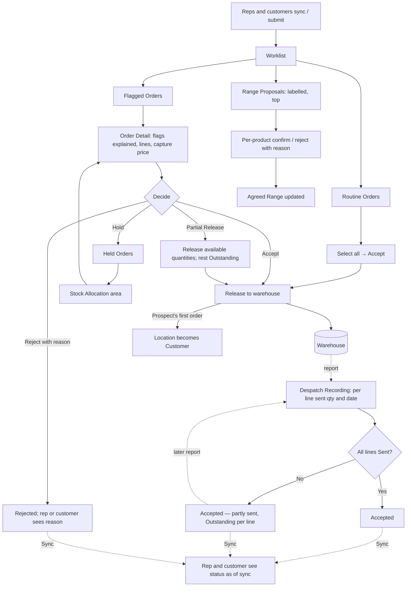

# Head Office Order Processing: UX & User Stories

**Generated:** 18 September 2026 (amended same day for Pricing, Promotions, Prospecting and Self-service; **amended 23 September 2026 from the UX design sessions: no order needs a person** — see `../uxdocs/04-user-stories-amendments.md`, BR-NEW-001 and US-NEW-005)

> **Read first (23 Sep 2026):** orders are no longer accepted by a person. Every flag has an automatic disposition (below), the Worklist holds only range proposals, duplicate matches and account requests, and Order Detail is a read-only record. Text below that describes accepting, bulk-accepting or deciding orders is superseded where marked.
**Bounded context:** Ordering — head office side
**Primary user:** Head Office User
**Scope:** The website screens where head office gets the day's orders to the warehouse, handles the few that need a person, decides Range Proposals, and records what the warehouse has despatched. Six screens: Worklist, Order Detail, Despatch Recording, Range Proposal Decision, Duplicate Review, Held Orders.

---

## 1. Bounded Context & Scope

### Bounded context

- **Domain area:** Ordering, from the moment an Order arrives at head office until every line has been despatched. It also receives Range Proposals (Master & Branch Ordering). "Review" is the exception; "processing" is the norm, so the area is named for what it mostly does.
- **Ubiquitous language:**
  - **Worklist** — the queue of items awaiting head office. *Amended 23 Sep 2026:* it holds only **Range Proposals**, **Duplicate Matches** and **Customer User account requests**, each labelled with its type. Orders no longer appear on it. When empty it reads "Nothing needs a decision."
  - **Disposition** — (added 23 Sep 2026) what happens automatically to an order carrying a flag. **Route** (Stock Shortfall, Oversold): accepted; the short quantity becomes Outstanding and goes to Stock Allocation. **Auto-resolve** (Unavailable Line): accepted; the line is removed with its reason recorded and the rep is prompted to tell the customer. **Annotate** (Large, Watched Product, Rep-flagged, New Location, Prospect Conversion): recorded on the order; no human step. **Divert**: none — Price Override and Free of Charge no longer divert, because their limits are enforced at capture (Pricing).
  - **Duplicate Match** — a new Prospect that matched an existing Location at Sync (Prospecting & Leads). Head office decides whether it is another rep's live account, a lapsed customer to hand over, an existing prospect to merge, or genuinely new, and the rep is told. The existing Location's last order date and previous ordering frequency are shown so a lapsed account can be judged against its own pattern.
  - ~~**Routine Order** — a Pending Order with no flags. Processed in bulk.~~ *Superseded 23 Sep 2026: every order is processed automatically.*
  - ~~**Flagged Order** — a Pending Order with one or more **Flags**. Opened individually.~~ *Superseded 23 Sep 2026: flags drive a Disposition, not a person.*
  - **Flag** — a reason a person should look. One of: **Large** (size relative to a **Baseline**), **Watched Product** (a product head office has marked for review), **Rep-flagged** (set by the rep, by informal agreement, sparingly), **Price Override** (a rep-entered price below the resolved one), **Free of Charge** (a rep-added zero-priced line), **New Location** (until a small number of orders have been Accepted), **Unavailable Line** (a product that became Unavailable after capture), **Oversold** (a Run-out line where Remaining went negative), **Prospect Conversion** (the Location's first order, which would convert it to a Customer), **Stock Shortfall** (a line the warehouse feed shows cannot be filled now; only when a feed exists).
  - **Baseline** — for the Large flag: the Location's or Range's Target for the period where one exists (comparison detail in area 6); otherwise the same period in previous years; otherwise no Large flag.
  - ~~**Accept at which price** — for an Order carrying a Price Override or a Free of Charge line, acceptance also decides the line: accept at the rep's price, or at the resolved price; accept the Order with the FOC line, or without it. Each such line is decided individually; the approved price is what is captured and what counts in actuals. An approved FOC line still consumes stock and reduces a Run-out Remaining.~~ *Superseded 23 Sep 2026: rep prices and FOC lines are applied within allowances at capture and recorded on the order as facts.*
  - **Accept** — the Order is approved, locked for the rep and customer, and its **Release** goes to the warehouse. A Prospect's Location becomes a Customer on Accept. *Amended 23 Sep 2026:* acceptance is automatic on receipt, applying each flag's Disposition.
  - **Release** — the quantities sent to the warehouse for an Accepted Order. Full by default; **Partial Release** sends what is available and leaves the rest **Outstanding** on the line. An Order is never split.
  - **Outstanding** — per line, quantity Accepted but not yet **Sent**.
  - **Despatch** — head office recording, from the warehouse's report, what was actually sent against an Order's lines and when. May be recorded several times for one Order.
  - **Order states** — Pending → **Accepted** (all lines Sent) / **Accepted — partly sent** (some Outstanding) / **Held** / **Rejected** (with reason) / Cancelled (by the rep or customer while Pending). A Held Order returns to Pending when released.
  - **Hold** — parking an Order, usually for a Stock Shortfall, for the Stock Allocation area to work with. Held Orders are not editable by the rep. *Open 23 Sep 2026:* whether Hold survives with no flag driving it (Requires Clarification 9).
  - **Reject** — with a reason, visible to the rep or customer. Whole Order only; there is no line-level reject (use Partial Release and Outstanding instead). *Open 23 Sep 2026:* whether Reject survives (Requires Clarification 9).
  - **Range Proposal** — from Master & Branch Ordering; decided per product: confirm or reject each, with a reason per rejected line.
  - **Valid when captured** — an Order is judged against the rules and prices in force when the rep captured it. Flags inform; they never auto-reject.
- **Upstream contexts:**
  - **Rep at a Location** (area 1) and **Self-service** (area 7) — Pending Orders, with Ordered By / For.
  - **Master & Branch Ordering** — Range Proposals.
  - **Range Lifecycle** — availability states, Run-out Remaining.
  - **Targets** (area 6) — Baseline for the Large flag.
  - **Warehouse system** — stock levels for the Stock Shortfall flag (optional feed); despatch reports (via head office, manually in this phase).
- **Downstream contexts:**
  - **Warehouse system** — Releases.
  - **Rep at a Location** / **Self-service** — Order status including partial fulfilment, rejection reasons, proposal outcomes.
  - **Customer Directory** — Prospect → Customer conversion.
  - **Master & Branch Ordering** — confirmed Agreed Range.
  - **Stock Allocation** (own area) — Held and Outstanding lines by product.
  - **Performance** (area 6) — Accepted Orders as actuals.
- **Terms that mean something different elsewhere:**
  - **Review** — here only Flagged Orders and Proposals are reviewed; everything else is processed.
  - **Sent** — for the rep (area 1) "Sent" means uploaded to head office; here "Sent" means despatched by the warehouse. The tablet shows the latter as "sent to customer" to avoid the clash.
  - **Release** — nothing to do with un-holding; it is the warehouse hand-off.
  - **Hold** — an order state; not a Contact or Location state.

### Scope

- **In scope:**
  - Worklist with routine bulk Accept and flagged section; proposals at top
  - All Flags and their Baselines; Watched Product marking
  - Order Detail: flags with explanation, lines, Ordered By / For, capture price
  - Accept (full or Partial Release), Hold, Reject with reason
  - Despatch Recording per Order, multiple times, with Outstanding per line
  - Range Proposal decision per product
  - Duplicate Match decision, with the existing Location's ordering pattern shown
  - Price Override and Free of Charge decisions per line
  - Prospect conversion on Accept
  - Held Orders list with link to Stock Allocation
- **Out of scope:**
  - Allocating short stock across competing orders and the live stock feed (Stock Allocation area)
  - Fulfilment, delivery, invoicing (external)
  - Editing an Order's lines or quantities at head office (not allowed; use Partial Release)
  - Rep or customer editing (areas 1 and 7)
  - Purchasing from suppliers
- **Assumptions:**
  - "New Location" means until 3 Orders have been Accepted (system setting).
  - The Large multiplier and the seasonal window are system settings; the target comparison rule is defined in area 6.
  - Despatches are entered by head office from warehouse reports; a feed may replace entry later without changing the model.
  - Without a warehouse stock feed there is no Stock Shortfall flag; Orders are released in full and the warehouse manages shortfalls, reported back as partial Despatches.
  - A Watched Product is a head-office mark on the product (Product Management adds the field).

---

## 2. Personas

### Head Office User

- **Role:** processes orders and keeps the warehouse fed; usually also a Sales Manager.
- **Responsibilities:** clears the day's routine orders; looks at the flagged ones; decides Range Proposals; records what the warehouse despatched; answers reps asking "did it go?".
- **Context on arrival:** a morning worklist after reps synced the evening before; a warehouse report of yesterday's despatches; one proposal from a chain negotiation; a handful of flags.
- **Goal:** "Get the day's orders to the warehouse quickly, catch the few that need a person, and keep reps and customers honestly informed about what's been sent."
- **Pain points:** opening every order to find the three that matter; seasonal orders flagged every year; a chain proposal buried among orders; explaining to a rep why half an order arrived.

---

## 3. Flow Sketch



---

## 4. Design Decisions

### Three item types, one queue

- **Chose:** Orders, Range Proposals and Duplicate Matches share the worklist, each with a visible type label, with proposals and matches sorted above orders.
- **Over:** separate queues per type.
- **Because:** one place to work from; a pending proposal blocks every branch's default and a pending match leaves a rep unsure whether to keep calling on a shop, so both outrank a single order; sorting alone breaks under filters, so the label is required.
- **Trade-off accepted:** three decision shapes on one screen — accept/hold/reject, per-product confirm, and a four-way duplicate decision.

### Discretion is decided line by line

- **Chose:** a Price Override or Free of Charge line flags the Order; acceptance decides each such line individually — at the rep's price or the resolved one, with the FOC line or without.
- **Over:** accepting or rejecting the whole Order because of one discretionary line.
- **Because:** the rest of the order is usually fine and the customer is waiting; rejecting it wholesale to refuse a €2 discount is disproportionate.
- **Trade-off accepted:** a rep may have promised something the customer does not get; they see the outcome and the reason at next Sync, as with any rejection.
- **Superseded 23 Sep 2026:** guardrails over gatekeepers — discretion is limited at capture (Pricing: discount allowance, FOC allowance), so there is nothing to decide line by line.

### Process by default, review by exception

- **Chose:** Routine Orders are accepted in bulk with one action; only Flagged Orders and Range Proposals are opened; flags name their reason.
- **Over:** opening and deciding every order.
- **Because:** most orders need processing, not judgement; per-order review is a bottleneck when reps sync a day's work at once.
- **Trade-off accepted:** an unflagged problem goes through; the flag set is the mitigation and can grow.
- **Amended 23 Sep 2026:** taken to its conclusion — no order needs a person. Every flag has a Disposition (Route, Auto-resolve, Annotate), and "Accept all routine" is gone. Keeping any flag as a human diversion was rejected, including Large. Slips are caught by the rep instead: Review marks unusually high quantities against the Location's last 3 accepted orders (area 1). Concepts: alarm fatigue; gatekeeper vs guardrail; exception routing.

### Large is relative, and targets are the preferred baseline

- **Chose:** Large compares against the Location's or Range's Target for the period where one exists, else the same period in previous years, else no flag; no dismiss-and-remember.
- **Over:** a flat threshold; recent-orders baseline; dismissal memory.
- **Because:** a chain's central order and a village shop's are not comparable; seasonal spikes recur yearly, so a recent-orders baseline flags them and a dismissal memory would have expired; targets exist from day one and are set by someone who knows the shop.
- **Trade-off accepted:** a target is a goal, not a norm, so the comparison rule must be settled in area 6; a Location with neither target nor history is covered only by the New Location flag.

### Rep-flagging is real but informal

- **Chose:** a rep can mark an order "please look at this"; its use is governed by agreement, not by the system.
- **Over:** no rep flag; a required reason or approval.
- **Because:** the rep sometimes knows something the data doesn't; a formal mechanism invites overuse.
- **Trade-off accepted:** overuse is a management conversation, not a system control.

### One Order, never split; fulfilment tracked per line

- **Chose:** Partial Release and Despatch record sent and Outstanding quantities on each line; the Order stays one record with a "partly sent" state; the rep sees "12 of 36 outstanding" as of their sync.
- *Amended 24 Sep 2026 (BR-NEW-007 in `../uxdocs/04-user-stories-amendments.md`):* the tablet shows "as of sync" wording only when the rep's last Sync was before today, and then as a date ("as of Mon 21 Sep").
- **Over:** splitting into back orders; head office editing quantities.
- **Because:** the customer and rep look up one order; a chain of splits is confusing and loses the capture date and price; editing quantities silently changes what was promised.
- **Trade-off accepted:** the state model is richer; there is no line-level reject.

### Hold is the seam to Stock Allocation

- **Chose:** a Stock Shortfall (when a feed exists) is a flag, and Hold parks the order for the allocation view, which decides across competing orders and returns it here as a Partial Release or Hold; without a feed, orders are released in full and shortfalls come back as partial Despatches.
- **Over:** allocating from the order screen; blocking on shortfall.
- **Because:** who gets short stock is a cross-order decision that cannot be made one order at a time; stock is often only temporarily short.
- **Trade-off accepted:** two areas share the order's lifecycle; the boundary must be kept explicit in both.
- **Amended 23 Sep 2026:** Stock Shortfall and Oversold are routed automatically: the order is accepted, what's available is released, and the short quantity goes to allocation as Outstanding. Partial Release as a manual decision is replaced by this routing.

### Despatch is entered at head office, feed-ready

- **Chose:** head office records what the warehouse reports, per order, with outstanding lines pre-filled at their full remaining quantity so "everything shipped" is one action.
- **Over:** assuming Release equals Sent; waiting for an integration.
- **Because:** head office is where the warehouse reports today; a feed later replaces typing, not the model; reps must be able to answer "has it gone?".
- **Trade-off accepted:** manual entry lags reality by a report cycle.

---

## 5. User Stories

### US-001: Process routine orders in bulk

| Field | Value |
|---|---|
| **Story** | As a Head Office User, I want to accept all unflagged Pending Orders in one action so that the day's routine orders reach the warehouse in minutes |
| **Priority** | Must Have |
| **Status** | **Superseded 23 Sep 2026** — orders are accepted automatically (US-008); the Worklist no longer holds orders |
| **Dependencies** | Warehouse outbound integration (or export) |

**Acceptance criteria:**

*Scenario 1: Bulk accept*
```
Given 62 Pending Orders, 55 unflagged
When I open the Worklist and choose Accept all routine
Then I am asked "Accept 55 orders and release to warehouse?" and on confirm all 55 are Accepted and released
And the 7 flagged remain in the Flagged section
```

*Scenario 2: Select a subset*
```
When I tick 20 routine orders and Accept
Then only those 20 are accepted
```

*Scenario 3: Nothing routine*
```
Given every Pending Order is flagged
Then the routine section shows "No routine orders" and bulk Accept is not offered
```

*Scenario 4: Rep sees acceptance*
```
When the rep syncs
Then the Order shows "Accepted — as of 07:42 sync"
```

*Scenario 5: Self-service orders included*
```
Given 3 of the 55 came from customer self-service
Then they are processed identically and the Customer User sees Accepted on the website
```

---

### US-002: See why an order is flagged

| Field | Value |
|---|---|
| **Story** | As a Head Office User, I want each flagged order to state its flags in plain terms so that I know what to look at before opening it |
| **Priority** | Must Have |
| **Status** | **Superseded in part 23 Sep 2026** — flags are still computed and shown as plain-sentence annotations on the order record (US-008 scenario 6), but they no longer place orders in a Flagged section. Scenario 6a is superseded: Price Override and Free of Charge are not flags |
| **Dependencies** | Targets (area 6) for the Large baseline; Product Management for Watched Product |

**Acceptance criteria:**

*Scenario 1: Flags listed*
```
Given an Order for Murphy's Pharmacy
When it appears in the Flagged section
Then it shows "Large — 3.2× target for October · Unavailable line — Autumn Cough Syrup 100ml · Rep-flagged"
```

*Scenario 2: New Location*
```
Given Walsh's Shop has 1 Accepted Order
Then its next Order is flagged "New location — 2nd order"
```

*Scenario 3: No baseline*
```
Given a Location with no target and no prior-year history
Then no Large flag is raised, whatever the size
```

*Scenario 4: Seasonal with history*
```
Given Byrne's Chemist ordered €2,400 of suncare last May and €2,600 this May, with no target
Then no Large flag is raised
```

*Scenario 5: Oversold*
```
Given a Run-out product with Remaining −20 after this Order
Then the Order is flagged "Oversold — Kids SPF50 Spray 150ml, 20 over"
```

*Scenario 6a: Price override or free goods*
```
Given a rep set a line to €9.00 against a resolved €11.20, and added 2 units of a new product free of charge
Then the Order is flagged "Price override — SPF30, €9.00 vs €11.20 · Free of charge — 2 × SPF30 v2, 'Sample of new line'"
```

*Scenario 6: Prospect*
```
Given the Order is a Prospect Location's first
Then it is flagged "Prospect — accepting converts to customer"
```

**Open questions:** the Large comparison rule against a target (area 6); whether Rep-flagged carries a free-text note (assumed yes, optional).

---

### US-003: Decide a flagged order

| Field | Value |
|---|---|
| **Story** | As a Head Office User, I want to open a flagged order, see its lines with the price and availability at capture, and accept, partially release, hold or reject it so that exceptions are handled deliberately |
| **Priority** | Must Have |
| **Status** | **Superseded 23 Sep 2026** — Order Detail is a read-only record (US-008 scenarios 6 and 7); Partial Release is replaced by routing short quantities to allocation; Unavailable lines are removed automatically. Whether Hold and Reject survive is open (Requires Clarification 9) |
| **Dependencies** | US-002 |

**Acceptance criteria:**

*Scenario 1: Accept despite an Unavailable line*
```
Given a line for a product that became Unavailable after capture
When I open the Order
Then the line shows "Unavailable since 10:00 — valid when captured" and I can Accept the whole Order
```

*Scenario 2: Partial Release*
```
Given a Stock Shortfall flag on "SPF30 Sun Lotion 200ml": ordered 36, warehouse 24
When I choose Partial Release and set 24 on that line
Then the Order is Accepted — partly sent with 12 Outstanding on that line; 24 is released
```

*Scenario 3: Hold*
```
When I choose Hold with note "Awaiting delivery 20 Oct"
Then the Order is Held, not editable by the rep, and listed under Held Orders with a link to Stock Allocation for that product
```

*Scenario 4: Reject*
```
When I Reject with reason "Account on hold"
Then the Order is Rejected and the rep sees the reason at next Sync; a Prospect's Location stays a Prospect
```

*Scenario 5: Prospect conversion*
```
Given the Prospect flag
When I Accept
Then the Location becomes a Customer in Customer Directory and the rep sees "Now a customer"
```

*Scenario 5b: Decide discretionary lines*
```
Given the Order carries a Price Override and a Free of Charge line
When I accept at the resolved price for the override and accept the Order without the FOC line
Then €11.20 is captured on that line, the FOC line is removed, and the rep sees both outcomes with reasons
```

*Scenario 6: No line editing*
```
Then quantities and lines cannot be changed; Partial Release only reduces what is released now, never the Order
```

---

### US-004: Record despatches from the warehouse report

| Field | Value |
|---|---|
| **Story** | As a Head Office User, I want to record what the warehouse actually sent against an order's lines, as many times as needed, so that reps and customers can see what has gone and what is still outstanding |
| **Priority** | Must Have |
| **Status** | Ready |
| **Dependencies** | US-001 |

**Acceptance criteria:**

*Scenario 1: Everything shipped*
```
Given an Accepted Order with 6 lines all Outstanding
When I open Record Despatch
Then every line is pre-filled at its Outstanding quantity with today's date
And on confirm the Order is Accepted (all Sent)
```

*Scenario 2: Partial despatch*
```
When I change SPF30 from 36 to 24 and confirm
Then that line shows "24 sent 12 Oct, 12 outstanding" and the Order is Accepted — partly sent
```

*Scenario 3: Second despatch*
```
When the remaining 12 arrive and I record them on 19 Oct
Then the line shows "24 sent 12 Oct · 12 sent 19 Oct" and the Order is Accepted
```

*Scenario 4: More than outstanding*
```
When I enter 40 for a line with 36 outstanding
Then it is rejected with "Only 36 outstanding"
```

*Scenario 5: Rep and customer view*
```
When the rep syncs
Then the Order shows "Accepted, partly sent — 12 of 36 SPF30 outstanding — as of 07:42 sync"
```

---

### US-005: Decide a Range Proposal

| Field | Value |
|---|---|
| **Story** | As a Head Office User, I want Range Proposals at the top of my worklist, decided product by product with a reason for anything rejected, so that chain agreements are controlled without blocking their branches |
| **Priority** | Must Have |
| **Status** | Ready |
| **Dependencies** | Master & Branch Ordering US-002 |

**Acceptance criteria:**

*Scenario 1: At the top, labelled*
```
Given 62 Pending Orders and 2 Range Proposals
When I open the Worklist
Then the 2 proposals are first, labelled "Range proposal — Hickey's Pharmacies" and "Range proposal — Doyle Group", and keep the label under any sort or filter
```

*Scenario 2: Per product*
```
When I confirm 2 adds and reject 1 drop with reason "Contracted until year end"
Then the proposal is Partly Confirmed, the Agreed Range updates, and the rep sees the outcome and reason on their Call
```

*Scenario 3: Proposer no longer holds the master*
```
Given the proposing rep has lost the master since syncing
Then the proposal is still decided and the outcome is shown on the Call for whoever now holds it
```

---

### US-005b: Decide a Duplicate Match

| Field | Value |
|---|---|
| **Story** | As a Head Office User, I want a rep's new prospect shown beside the Location it matched, with that Location's ordering pattern, so that I can tell a live account from a lapsed one and reply to the rep |
| **Priority** | Must Have |
| **Status** | Ready |
| **Dependencies** | Prospecting & Leads US-006; Coverage Management |

**Acceptance criteria:**

*Scenario 1: Match in the queue*
```
Given a rep synced a prospect that matched an existing Location
Then it appears above the orders labelled "Duplicate match — Byrne's Chemist, Rathdrum" with both records side by side
```

*Scenario 2: Judged against its own pattern*
```
Then the existing Location shows "Primary: Colm · Last order 14 Mar 2026 · previously ordered roughly every 5 weeks"
And no stale flag is applied by the system
```

*Scenario 3: Four outcomes*
```
Then I can choose: keep with the current rep, hand the Location to the cold-calling rep, merge with an existing prospect, or dismiss the match so the prospect stands
And the rep sees the outcome and its reason at next Sync
```

---

### US-006: Work Held Orders

| Field | Value |
|---|---|
| **Story** | As a Head Office User, I want a list of Held Orders with why each is held and a link to allocation so that nothing parked is forgotten |
| **Priority** | Should Have |
| **Status** | **Affected 23 Sep 2026** — depends on whether Hold survives (Requires Clarification 9); if it is removed, this story's trigger needs redefining or the story retires |
| **Dependencies** | US-003; Stock Allocation area |

**Acceptance criteria:**

*Scenario 1: List*
```
Then Held Orders shows each with its hold note, days held, short products, and "Allocate" linking to Stock Allocation for that product
```

*Scenario 2: Return to worklist*
```
When allocation releases 24 of 36
Then the Order becomes Accepted — partly sent and leaves Held
```

*Scenario 3: Location closes while held*
```
Given the Location is marked Closed
Then the Held Order is flagged "Location closed" for a Reject or Release decision
```

---

### US-006b: Approve a Customer User account

| Field | Value |
|---|---|
| **Story** | As a Sales Manager, I want to approve or decline online ordering access a rep has set up so that access is given deliberately |
| **Priority** | Must Have |
| **Status** | Ready |
| **Dependencies** | Self-service US-001 |

**Acceptance criteria:**

*Scenario 1: Approve*
```
Given a rep created an account for Mary Walsh
Then it appears in my queue showing her Contact, her Locations, and what she would be able to order for
And on approval an invitation is sent
```

*Scenario 2: Decline*
```
When I decline with a reason
Then no account exists and the rep sees the reason
```

*Scenario 3: Head office scope*
```
Given the Contact is at a Master Location
Then the request states "Hickey's Head Office and its 12 branches"
```

---

### US-007: Mark a Watched Product

| Field | Value |
|---|---|
| **Story** | As a Head Office User, I want to mark a product so that any order containing it is flagged so that controlled or problem lines always get a look |
| **Priority** | Could Have |
| **Status** | Ready |
| **Dependencies** | Product Management product record |

**Acceptance criteria:**

*Scenario 1: Mark and flag*
```
When I mark "Controlled Pain Relief 30s" as Watched with note "Check licence"
Then every new Pending Order containing it is flagged "Watched product — Check licence"
```

*Scenario 2: Unmark*
```
When I remove the mark
Then new Orders are no longer flagged; already-flagged ones keep the flag
```

---

### US-008: Orders within policy go through without acceptance

| Field | Value |
|---|---|
| **Story** | As a Head Office User, I want orders that are within policy to go through without my acceptance so that my worklist only holds things that genuinely need a decision |
| **Priority** | Must Have |
| **Status** | Ready (added 23 Sep 2026 from the UX design sessions; replaces the order-decision parts of US-001 to US-003) |
| **Dependencies** | Pricing (discount and FOC allowances enforced at capture); Stock Allocation; area 1 "not supplied" prompt |

**Acceptance criteria:**

*Scenario 1: Annotate only*
```
Given a synced order has no flags, or only annotate flags
When it is received
Then it is accepted and released to the warehouse without a human step, and its flags are recorded on the order
```

*Scenario 2: Route a shortfall*
```
Given a synced order has a line flagged Stock Shortfall or Oversold
When it is received
Then the order is accepted, what's available is released, and the short quantity becomes Outstanding and appears in allocation
```

*Scenario 3: Auto-resolve an unavailable line*
```
Given a synced order has a line that is now Unavailable
When it is received
Then the order is accepted, that line is removed with its reason recorded, and the capturing rep is prompted to tell the customer
```

*Scenario 4: Worklist without orders*
```
When I open the Worklist
Then it contains only range proposals, duplicate matches and customer account requests, each labelled with its type
```

*Scenario 5: Nothing to decide*
```
Given there are no range proposals, duplicate matches or account requests
When I open the Worklist
Then it reads "Nothing needs a decision." with no action offered
```

*Scenario 6: Order Detail is a record*
```
When I open an order's detail
Then it shows the lines as captured, any line removed automatically with its reason, applied rep prices and free-of-charge lines with their working, the annotations as plain sentences, and "Total as captured" and "Total accepted" labelled separately
```

*Scenario 7: No decision controls*
```
When I view an order's detail
Then there are no Accept, Partial Release or per-line override and free-goods decisions
```

**Edge cases addressed:** a free-of-charge line whose stock runs out is removed as unavailable like any line, and the rep is prompted.

---

## 6. Requires Clarification

1. **Area 6:** the Large comparison rule against a target (goal vs norm, cumulative vs per-order).
2. **Stock Allocation area:** cross-order allocation view, the live stock feed, how Held Orders return.
3. **Warehouse outbound:** integration or export format for Releases.
4. **Rep-flag note:** optional free text assumed.
5. **Area 1 amendments:** "Accepted, partly sent" status with per-line outstanding; rep flag on Ready to Send; "sent to customer" wording to avoid the Sent clash; price override and free-of-charge outcomes shown on the order. *Amended 23 Sep 2026:* rep prices and FOC lines are shown as facts, not outcomes; removed lines prompt the rep ("not supplied").
6. **Area 7 (resolved):** Customer Users see the same statuses and reasons; self-service orders have no Capturing Rep and nothing in the queue assumes one.
7. **Product Management amendment:** Watched Product mark on the product record.
8. **Free goods reporting:** whether head office needs a view of free goods by rep or period (Pricing item 8).
9. **Hold and Reject (23 Sep 2026):** do they survive on Order Detail with no flag driving them? Affects US-003 and US-006.
10. **Orders on the Worklist (23 Sep 2026):** do orders appear at all, e.g. as a read-only feed, or only via search and the customer record?

---

## 7. Recommended Next Steps

1. Take Targets & Performance (area 6) next; two items here (Large baseline) and one in Coverage (attribution) wait on it.
2. Then Stock Allocation, once the warehouse feed's availability is known.
3. Apply the area 1, 7 and Product Management amendments (items 5–7) in the next batch.
4. Confirm the warehouse outbound mechanism with the warehouse system's owner.
