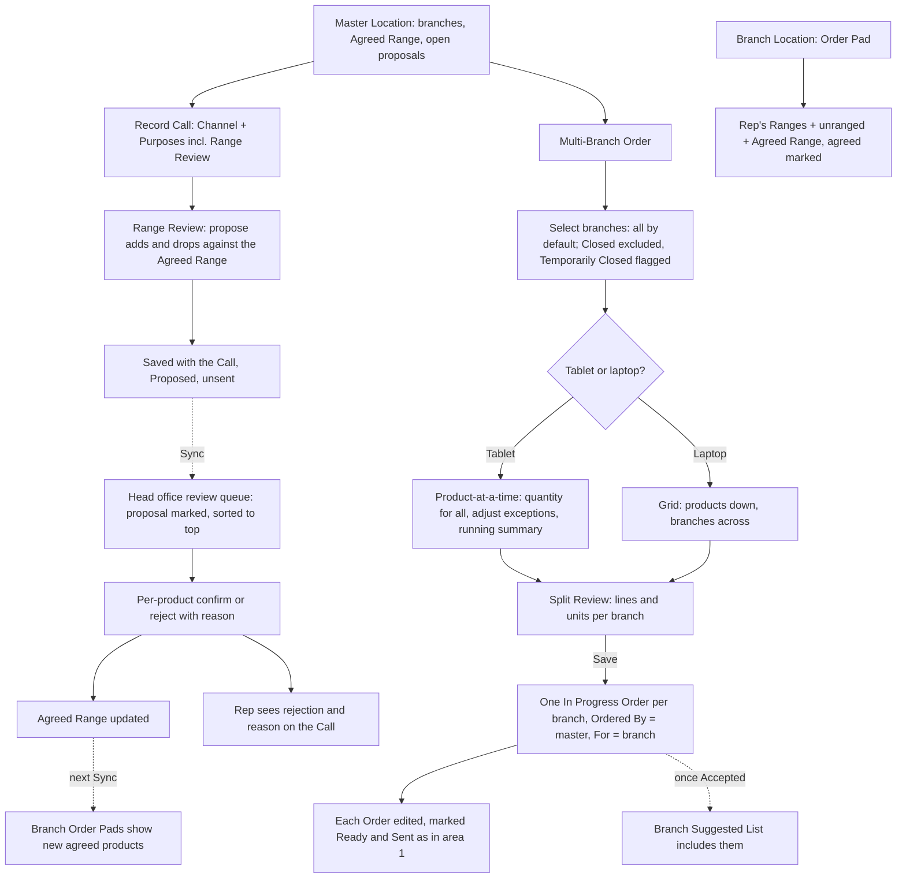

# Master & Branch Ordering: UX & User Stories

**Generated:** 18 September 2026 (amended 23 September 2026 from the UX design sessions — see `../uxdocs/04-user-stories-amendments.md`)
**Bounded context:** Ordering (chain relationship), with Sales Operations for the Range Review call
**Primary users:** Field Salesperson (at a master); Head Office User (confirming proposals)
**Scope:** How a rep works with a chain's head office or main shop: agreeing what the chain carries, and ordering for many branches in one sitting. Six screens: Master Location view, Range Review on the Call, Multi-Branch Order (tablet), Multi-Branch Order (laptop), Split Review, and the agreed-range markers on the branch Order Pad.

---

## 1. Bounded Context & Scope

### Bounded context

- **Domain area:** Ordering, extended for the master–branch relationship. The relationship itself is recorded in Customer Directory; this area is what a rep and head office *do* with it.
- **Ubiquitous language:**
  - **Master Location** / **Branch Location** — from Customer Directory. A master may be a head office holding no stock or a main shop that does.
  - **Agreed Range** — a confirmed, named list of products a chain has agreed to carry across its branches. A Master Location may hold multiple separate Agreed Ranges, and a product may belong to several of them (26 Sep 2026 amendment). Each range guides ordering but does not limit it: branches may order outside the ranges; Availability and Restriction Permissions remain the only hard limits.
  - **Range Review** — a third Call Purpose, alongside Pitch and Stock Check, in which the rep and the chain's buyer discuss the Agreed Range. An ordinary Call: any Channel, corrections until Sync, Follow-up Calls, Competitor Notes, and an Order may be attached.
  - **Range Proposal** — the set of **Proposed Changes** (products to add, products to drop) recorded on a Range Review call. States: **Proposed**, **Confirmed**, **Partly Confirmed**, **Rejected** (with reason). Visible only to the proposing rep and head office until confirmed.
  - **Proposal Review** — head office deciding a Range Proposal per product, in the order review queue (area 3), marked as a proposal and sorted to the top.
  - **Multi-Branch Order** — one ordering session at a master, with quantities per branch, split on save into one ordinary Order per branch.
  - **Ordered By / For** — every Order records the Location where it was taken (Ordered By) and the Location it is for (For). For ordinary orders they are the same. Performance counts at For.
  - **Capturing Rep** — the rep who actually took the Order, recorded on it. For a master's order this differs from the rep the sale is attributed to; Targets & Performance shows it to managers as a "captured" figure so a rep who wins central business is visible.
  - **Same-for-all, then adjust** — the tablet entry pattern: pick a product, enter one quantity applied to every selected branch, change the exceptions.
  - **Split Review** — the summary shown before a Multi-Branch Order is saved: lines and units per branch.
  - **Branch Order Pad** — at a Branch Location, the Order Pad shows the union of the rep's Ranges, unranged products, and the chain's Agreed Range, with agreed products marked "In <chain>'s agreed range".
- **Upstream contexts:**
  - **Customer Directory** — master/branch relationship, branch list, Closed and Temporarily Closed states.
  - **Range Lifecycle / Product Management** — availability, Restriction Groups, prices.
  - **Coverage Management** — which rep is Primary for each branch (a master order can land in another rep's book).
- **Downstream contexts:**
  - **Head Office Order Review** (area 3) — receives Range Proposals alongside Orders.
  - **Rep at a Location** (area 1) — the Agreed Range and markers in the Morning Snapshot; split Orders feed each branch's Suggested List through the existing last-3-Accepted-Orders rule.
  - **Performance** (area 6) — Orders attributed to the For Location.
- **Terms that mean something different elsewhere:**
  - **Range** — a catalogue Range (Product Catalogue) is head office's commercial grouping; an Agreed Range is one of a chain's named lists. Both may contain the same products.
  - **Proposal** — a Range Proposal is not an Order; it changes a default, not stock movement.
  - **Order** — a Multi-Branch Order is a session, not an Order; it produces Orders.

### Scope

- **In scope:**
  - Master Location view: branches, Agreed Range, open proposals
  - Range Review purpose on the Call, with Proposed Changes
  - Proposal states, rep visibility, rejection reasons
  - Head office per-product confirmation (the decision; the queue itself is area 3)
  - Branch Order Pad union and markers
  - Multi-Branch Order on tablet (offline) and laptop (grid), sharing branch selection, Split Review and outcome
  - Ordered By / For on every Order
  - Snapshot additions: branches of a master, their Suggested Lists, the Agreed Range
- **Out of scope:**
  - Recording the master/branch relationship (Customer Directory)
  - Design of the order review queue (area 3)
  - Chain-level pricing and deals (Pricing & Promotions)
  - Ordinary single-Location ordering (area 1)
  - Delivery, invoicing, or consolidated invoicing for chains
  - Self-service ordering by a chain's head office (area 7)
- **Assumptions:**
  - ~~A chain has one Agreed Range across all branches in this phase.~~ **Superseded 26 Sep 2026:** a Master Location may hold multiple separate Agreed Ranges (BR-NEW-008 in `../uxdocs/04-user-stories-amendments.md`). Per-branch variations remain an open question.
  - An Agreed Range may contain products outside every rep's Ranges.
  - A master that is also a shop takes its own orders exactly as a branch would (Ordered By = For = itself).
  - A branch's Primary Rep sees a master-placed Order in that branch's history like any other; no notification.
  - The tablet snapshot for a rep who holds a master includes that master's branches even where the rep is not their Primary Rep.

---

## 2. Personas

### Field Salesperson (at a master)

- **Role:** the area 1 rep, holding a chain's head office or main shop, possibly covering a wide territory that overlaps other reps' branches.
- **Responsibilities:** negotiates what the chain carries; takes a central order for many branches; keeps the buyer informed of what is confirmed.
- **Context on arrival:** a sit-down with a buyer, tablet in hand, possibly offline; twelve branches, thirty products, a buyer who talks product-by-product ("all shops take 24 of the new line, except Arklow").
- **Goal:** "Agree what the chain will carry and get an order out to every branch in one sitting, without promising anything head office hasn't confirmed."
- **Pain points:** entering the same order twelve times; a grid that doesn't fit a tablet; a buyer asking whether last month's agreement went through.

### Head Office User

- **Role:** reviews what reps bring back from chains.
- **Responsibilities:** confirms or rejects Range Proposals per product; keeps chain agreements controlled.
- **Context on arrival:** the order review queue; a proposal from a rep who has already had the conversation with the buyer.
- **Goal:** "Keep control of what chains are agreed to carry without becoming a bottleneck for their branches."
- **Pain points:** proposals lost among orders; having to accept or reject a whole agreement when one product is the problem.

---

## 3. Flow Sketch



---

## 4. Design Decisions

### Agreed Range is a default; the branch pad is a union

- **Chose:** the Agreed Range guides but never limits; at a branch the Order Pad shows the rep's Ranges, unranged products and the whole Agreed Range, with agreed products marked.
- **Over:** the Agreed Range as a constraint; opening the pad on the Agreed Range; showing only the rep's Ranges with agreed products marked.
- **Because:** chains give branches some independence; the same guide-not-limit rule as rep Ranges keeps one mental model; a product the chain has agreed is the likeliest thing a branch orders, so it must be on the pad even when outside the rep's Ranges.
- **Trade-off accepted:** a longer pad at chain branches; no filter to isolate the agreed list (the markers do that job).

### Range Review is a Call Purpose, and its changes are proposals

- **Chose:** a third purpose alongside Pitch and Stock Check; the rep records Proposed Changes; head office confirms per product; only the confirmed Agreed Range is shown to reps.
- **Over:** a separate record type; rep changes taking effect directly; head office transcribing notes; pending additions shown on pads.
- **Because:** an ordinary Call reuses channel, corrections, follow-ups and competitor notes; the agreement is often contractual and priced; the rep's position mirrors taking an order — captured, subject to confirmation; no rep should tell a branch something head office hasn't agreed.
- **Trade-off accepted:** a delay between agreement and effect; a branch ordering in the gap sees no marker (the product is still orderable).

### Proposals share the order queue, marked and prioritised

- **Chose:** Range Proposals appear in head office's order review queue (area 3) with a visible type label and sorted to the top; decidable per product.
- **Over:** a separate queue.
- **Because:** one place to approve things; a pending proposal blocks every branch's default and the rep's ability to confirm with the buyer, so it outranks a single order; sorting alone breaks under filters, so the label is required.
- **Trade-off accepted:** area 3 must handle two item types with different decision shapes.

### Multi-branch entry differs by surface, shares the outcome

- **Chose:** tablet — branch selection, product-at-a-time, same-for-all then adjust, running summary; laptop — a products-by-branches grid; both end in Split Review and one In Progress Order per branch.
- **Over:** one layout for both; branch-first entry; a grid on the tablet.
- **Because:** the buyer talks product-by-product; 360 cells is unusable on a tablet and wastes a laptop; the split outcome is what matters and must be identical.
- **Trade-off accepted:** two entry screens to build and keep consistent; a session started offline on the tablet is only openable on the laptop after Sync.

### Split orders are ordinary Orders

- **Chose:** after the split, each Order is a normal In Progress Order for its branch, carrying Ordered By = master for provenance; it feeds the branch's Suggested List through the existing rule; the branch's own rep handles reordering; no flag or notification.
- **Over:** a special "central order" type; alerting the branch rep.
- **Because:** at that point it is just an order; the Suggested List already picks up the last 3 Accepted Orders; provenance answers "who placed this?" without ceremony.
- **Trade-off accepted:** a branch rep can re-order what head office just ordered if they don't read the history; the Suggested List's "Ordered recently" label mitigates it.

---

## 5. User Stories

### US-001: View a master's branches and Agreed Range

| Field | Value |
|---|---|
| **Story** | As a Field Salesperson, I want the Master Location screen to show its branches, the confirmed Agreed Range and any open proposals so that I walk into the buyer's office knowing what stands |
| **Priority** | Must Have |
| **Status** | Ready |
| **Dependencies** | Customer Directory master/branch; area 1 Location screen and snapshot |

**Acceptance criteria:**

*Scenario 1: Master overview*
```
Given Hickey's Head Office has 12 branches and an Agreed Range of 42 products
When I open it on the tablet offline
Then I see "12 branches" (with Closed excluded and 1 "Closed until 14 Oct" flagged), "Agreed range: 42 products", and "1 proposal awaiting head office"
```

*Scenario 2: Agreed Range detail*
```
When I open the Agreed Range
Then I see the 42 products with availability state and price, and any that are Unavailable are labelled
```

*Scenario 3: Branch not in my book*
```
Given 4 of the 12 branches have another Primary Rep
Then they are listed with "Primary: Aoife" and I can still include them in a Multi-Branch Order
```

*Scenario 4: Not a master*
```
Given an ordinary Location
Then no branches or Agreed Range section is shown
```

**UX amendment (26 Sep 2026)** — the Master Location may hold multiple separate, named Agreed Ranges, with products allowed in several (BR-NEW-008, C5.4/C5.10). Each customer buyer with access to the chain grid may designate a personal default (C5.5–C5.6); one buyer's choice does not affect another. Until they set one, the first dropdown option is shown without saving a preference (C5.7, current design, may be revisited). Scenarios 1–2 remain examples for a chain with one range; they no longer limit cardinality.

*Scenario 5: Several confirmed Agreed Ranges*
```
Given Hickey's Head Office has separate confirmed Agreed Ranges “Everyday” and “2026 Christmas gift packs”
When I open the Master Location
Then both ranges are available by name, each with its own confirmed products
```

*Scenario 6: Shared product membership*
```
Given Hand Cream 75ml is confirmed in both Hickey's Everyday and “2026 Christmas gift packs” Agreed Ranges
When I open either range
Then Hand Cream is a member of that range
```

---

### US-002: Record a Range Review and propose changes

| Field | Value |
|---|---|
| **Story** | As a Field Salesperson, I want to record what the buyer agreed to add or drop from the chain's range as a proposal on my Call so that head office can confirm it and I never tell a branch something unconfirmed |
| **Priority** | Must Have |
| **Status** | Ready |
| **Dependencies** | US-001; area 1 Call (US-006) |

**Acceptance criteria:**

*Scenario 1: Propose adds and drops*
```
Given a Call at Hickey's Head Office with Purpose "Range Review"
When I add "SPF30 Sun Lotion v2 200ml" and "Kids SPF50 Spray v2 100ml" and drop "SPF30 Sun Lotion 200ml"
Then the Call saves with a Range Proposal of 2 adds and 1 drop, state Proposed, unsent
And the Call review shows "Range review: 2 adds, 1 drop — subject to head office confirmation"
```

*Scenario 2: Combined purposes*
```
When I record Channel "Phone", Purposes "Range Review" and "Pitch"
Then both sections are shown and saved on one Call
```

*Scenario 3: Unavailable product proposed*
```
When I try to add a product that is Unavailable
Then it cannot be selected and shows its availability label
```

*Scenario 4: Corrections and follow-ups*
```
Given the Call is saved but not synced
When I open Edit Call
Then I can change or remove proposed lines; adding a forgotten product goes on a Follow-up Call as a new proposal
```

*Scenario 5: Proposal visible only to me and head office*
```
When Aoife opens Hickey's Rathdrum
Then her Order Pad shows the Agreed Range without my proposed additions
```

---

### US-003: Confirm a Range Proposal per product

| Field | Value |
|---|---|
| **Story** | As a Head Office User, I want to confirm or reject each product in a Range Proposal, from the same queue I review orders in, so that chain agreements stay under control without holding up the ones that are fine |
| **Priority** | Must Have |
| **Status** | Draft |
| **Dependencies** | Head Office Order Review (area 3) queue design |

**Acceptance criteria:**

*Scenario 1: In the queue, marked and first*
```
Given 14 Pending Orders and 1 Range Proposal
When I open the review queue
Then the proposal is at the top labelled "Range proposal — Hickey's Pharmacies" and stays labelled if I re-sort
```

*Scenario 2: Partly confirm*
```
When I confirm the 2 adds and reject the drop with reason "Contracted until year end"
Then the proposal is Partly Confirmed, the Agreed Range gains 2 products and keeps the third
And the rep sees on the Call: "2 confirmed, 1 rejected — Contracted until year end"
```

*Scenario 3: Confirm all*
```
When I confirm every line
Then the proposal is Confirmed and branch Order Pads show the new products marked "In Hickey's agreed range" at their next Sync
```

*Scenario 4: Reject all*
```
When I reject every line with a reason
Then the proposal is Rejected and the Agreed Range is unchanged
```

**Open questions:** whether area 3 needs a reason per rejected line or one per proposal (assumed per line).

---

### US-004: See agreed products on a branch Order Pad

| Field | Value |
|---|---|
| **Story** | As a Field Salesperson at a chain branch, I want the Order Pad to include every product the chain has agreed, marked as such, alongside my own ranges so that I order what the branch is meant to stock even when it's outside my ranges |
| **Priority** | Must Have |
| **Status** | Ready |
| **Dependencies** | US-003; area 1 US-012 |

**Acceptance criteria:**

*Scenario 1: Union*
```
Given my Ranges cover 180 products, 40 are unranged, and Hickey's Agreed Range has 42, of which 15 are outside my Ranges
When I open New Order at Hickey's Rathdrum
Then the pad lists 235 products; the 42 are marked "In Hickey's agreed range"
```

*Scenario 2: Ordinary shop*
```
When I open New Order at an independent pharmacy
Then the pad is the area 1 pad with no agreed-range markers
```

*Scenario 3: Agreed product now Unavailable*
```
Given one agreed product became Unavailable
Then it shows with its availability label and cannot be added; the marker remains so head office can tidy the Agreed Range
```

*Scenario 4: Outside the agreement*
```
When I add a product not in the Agreed Range
Then it is added normally with no warning
```

---

### US-005: Build a Multi-Branch Order on the tablet

| Field | Value |
|---|---|
| **Story** | As a Field Salesperson sitting with a chain's buyer, I want to enter one quantity per product for all branches and adjust the exceptions, offline, so that a twelve-shop order takes one conversation |
| **Priority** | Must Have |
| **Status** | Ready |
| **Dependencies** | US-001; area 1 Order entry and Sync |

**Acceptance criteria:**

*Scenario 1: Select branches*
```
When I start a Multi-Branch Order at Hickey's Head Office
Then all 12 branches are ticked; Hickey's Bray (Closed) is not listed; Hickey's Arklow shows "Closed until 14 Oct" and stays ticked
And I untick 2
```

*Scenario 2: Same for all, then adjust*
```
When I pick "SPF30 Sun Lotion v2 200ml", enter 24 for all, and change Wicklow Town to 36
Then the line shows "24 × 9 branches, 1 adjusted (Wicklow Town 36)" and expands to the per-branch list
```

*Scenario 3: Remove a branch from one line*
```
When I set Rathdrum to 0 on that line
Then Rathdrum is excluded from that product only and the summary reads "24 × 8, 1 adjusted, 1 none"
```

*Scenario 4: Running summary*
```
Given 6 products entered
Then the session header shows "6 products · 10 branches · 1,380 units"
```

*Scenario 5: Offline*
```
Given no signal
Then the session is saved on the tablet as I go and survives closing the app
```

---

### US-006: Build a Multi-Branch Order on the laptop

| Field | Value |
|---|---|
| **Story** | As a Field Salesperson at a desk, I want a grid of products against branches so that I can see and adjust a whole chain's order at once |
| **Priority** | Should Have |
| **Status** | Ready |
| **Dependencies** | US-005 outcome; website order pages |

**Acceptance criteria:**

*Scenario 1: Grid*
```
When I start a Multi-Branch Order for Hickey's on the website
Then I see selected branches across, products down, quantity cells, row and column totals
```

*Scenario 2: Fill a row*
```
When I enter 24 in the row's "All" cell
Then every branch cell on that row becomes 24 and I can overwrite any cell
```

*Scenario 3: Continue a tablet session*
```
Given I started the session on the tablet and synced
When I open it on the website
Then the grid shows what I entered, and further edits are saved to the same session
```

*Scenario 4: Accessibility*
```
Then every cell is reachable by keyboard and the "All" entry is available without a mouse
```

**UX amendments (23 Sep 2026)** — settled in the UX design sessions; full record in `../uxdocs/04-user-stories-amendments.md`.

> A chain may have 140 agreed products, but a session orders about 30. The grid opens near that size, and a bulk fill never destroys deliberate exceptions. The grid layout itself is deferred to usage feedback (M11.2). Settled in `../uxdocs/05-manager.md` M11.1 and M11.3.

*Scenario MB006-A*
```
Given Hickey's branches have Accepted Orders
When I start a Multi-Branch Order on the website
Then the rows are the products on any branch's last 3 Accepted Orders, with every cell empty
```

*Scenario MB006-B*
```
Given the grid is open
When I search for a product that isn't listed
Then I can add it as a row
```

*Scenario MB006-C*
```
Given the grid is open
When I choose "Show full Agreed Range"
Then the rest of Hickey's agreed products appear as empty rows
```

*Scenario MB006-D*
```
Given SPF30's "All" is 24 and I changed Rathdrum to 12 and Arklow to 0
When I change "All" to 36
Then the other 8 branches become 36, Rathdrum stays 12 and Arklow stays 0
And the row shows "36 × 8 branches, 2 adjusted" with the adjusted cells marked
```

*Scenario MB006-E*
```
Given a row has adjusted cells
When I choose "Clear adjustments"
Then every branch cell on the row takes the "All" value
```

**Superseded:** US-006 scenario 2's "every branch cell on that row becomes 24", when the row already has hand-edited cells.

---

### US-007: Review the split and save

| Field | Value |
|---|---|
| **Story** | As a Field Salesperson, I want to see what each branch will receive before the session becomes twelve orders so that I catch a wrong quantity before it's spread across a chain |
| **Priority** | Must Have |
| **Status** | Ready |
| **Dependencies** | US-005, US-006 |

**Acceptance criteria:**

*Scenario 1: Split Review*
```
When I tap Review
Then I see one row per branch: "Rathdrum — 6 lines, 138 units", "Arklow — 5 lines, 114 units", … and can open any to see its lines
```

*Scenario 2: Save*
```
When I save
Then 10 In Progress Orders exist, one per branch, each with Ordered By "Hickey's Head Office", For its branch, me as Capturing Rep, dated today, and linked to the Call if one is open
And the session is closed
```

*Scenario 3: Branch with no lines*
```
Given Arklow has 0 across every product
Then Arklow shows "No order" in the review and no Order is created for it
```

*Scenario 4: Then ordinary*
```
When I open the Rathdrum Order
Then I can edit it, mark it Ready to Send, and it syncs and is reviewed as any Order in area 1
```

*Scenario 5: Provenance at the branch*
```
When Aoife (Rathdrum's Primary Rep) opens Rathdrum's order history after Sync
Then she sees the Order with "Ordered by Hickey's Head Office" and, once Accepted, its products on the next Suggested List as "Ordered recently"
```

---

### US-008: Master that is also a shop

| Field | Value |
|---|---|
| **Story** | As a Field Salesperson at a main shop that is also the chain's master, I want to do the shop's own stock check and order as normal, and the chain's Range Review and Multi-Branch Order in the same visit so that one call covers both roles |
| **Priority** | Should Have |
| **Status** | Ready |
| **Dependencies** | US-002, US-005; area 1 Call and Stock Check |

**Acceptance criteria:**

*Scenario 1: All purposes available*
```
Given Hickey's Wicklow Town is the master and a shop
When I record a Call
Then Pitch, Stock Check and Range Review are all offered
```

*Scenario 2: Own order and chain order*
```
When I take the shop's own Order and a Multi-Branch Order in the same Call
Then the shop's Order has Ordered By = For = Wicklow Town, and the split Orders have For = each branch; Wicklow Town may also be a selected branch in the split
```

*Scenario 3: Head office holds no stock*
```
Given Hickey's Head Office has Type "Head office"
Then Stock Check is still offered but its Suggested List is empty with "No stock held here"
```

---

## 6. Requires Clarification

1. **Area 3:** queue design for two item types; reason per line or per proposal; whether proposals can be delegated to a different reviewer.
2. **Per-branch variations of Agreed Ranges:** still open; having multiple ranges at the Master Location does not itself establish different lists per branch or store format.
3. **Chain pricing:** whether a chain agreement carries prices (Pricing & Promotions).
4. **Session recovery:** a Multi-Branch session left unfinished on the tablet — assumed it stays open until saved or discarded, with a count on Home.
5. **Area 1 amendments (applied):** Range Review purpose on the Call; agreed-range markers and union on the Order Pad; Ordered By / For and Capturing Rep on Orders; Multi-Branch session entry from a Master Location; branches and Agreed Range in the snapshot.
6. **Customer Directory amendment:** the Agreed Range lives on the Master Location record.
7. **Laptop grid layout (23 Sep 2026):** version 1 is the flat products × branches grid; nested alternatives (product rows with branch sub-rows, or branch groups with product sub-rows) are deliberately deferred until there is usage feedback.
8. **Multiple Agreed Ranges (26 Sep 2026):** the one-range assumption is superseded, and products may belong to several ranges. Resolve how a Range Review and proposal identifies its target range, and how the branch pad, rep/manager grid, master view and snapshot expose several ranges with overlapping membership. The customer dropdown's sort order is deferred; its current first option is the fallback before a personal default is set. Do not silently reinterpret the earlier single-range examples as union or default-only rules.

---

## 7. Recommended Next Steps

1. Design Head Office Order Review (area 3) next; it now has Orders, Range Proposals, oversold run-out lines and post-capture Unavailable lines waiting for it.
2. Apply the area 1 and Customer Directory amendments (items 5 and 6) in the next batch.
3. Prototype the tablet product-at-a-time entry with a real buyer conversation before committing to the running-summary layout.
4. Confirm item 2 with the sales team before defining per-branch variations; the one-list-per-chain assumption has been superseded by BR-NEW-008.
