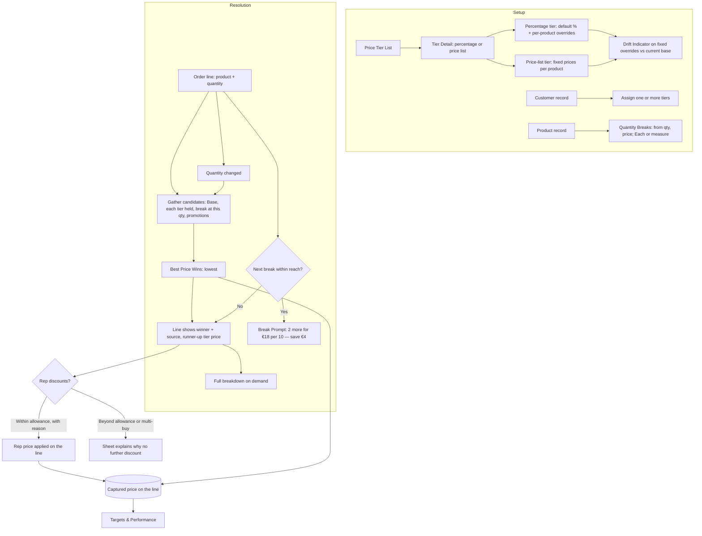

# Pricing: UX & User Stories

**Generated:** 18 September 2026 (amended same day for Promotions; amended 23 September 2026 from the UX design sessions: rep discount allowance and free-of-charge rules — see `../uxdocs/04-user-stories-amendments.md`, BR-NEW-002 and BR-NEW-003)
**Bounded context:** Pricing, within Ordering
**Primary users:** Head Office User (tiers, breaks); Sales Manager (commercial policy: discount allowance and free-of-charge allowance); Field Salesperson (quoting and applying discounts within allowance)
**Scope:** How a line's price is determined and explained, including rep discretion. Seven screens: Price Tier List, Price Tier Detail, Tier Assignment on the Customer, Quantity Breaks on the product, Price display on the Order Pad and line (with breakdown), Price Override and Free of Charge entry (applied within allowances; no approval since 23 Sep 2026).

---

## 1. Bounded Context & Scope

### Bounded context

- **Domain area:** Pricing. It decides what one line costs and makes that explainable. Promotions are a separate area that uses this area's resolution rule; Base Price maintenance belongs to Product Management.
- **Ubiquitous language:**
  - **Base Price** — the product's list price with history and future dating (Product Management). The fallback when nothing better applies.
  - **Price Tier** — a named commercial grouping ("Tier A", "Suncare Deal 2027") assigned to a **Customer**, so all its Locations share it. A Customer may hold **several tiers**. Each tier is set up in one of two ways:
    - **Percentage tier** — a default percentage off Base Price, with optional **Per-Product Overrides** (a different percentage, or a fixed price, for named products). Tracks Base Price changes automatically.
    - **Price-list tier** — fixed prices for named products; anything not listed falls back to Base Price.
  - **Quantity Break** — a price that applies from a quantity upward, for **Each** products (10 for €20, 30 for €35) and **measure-based** products (10 kg for €10, 20 kg for €18). Set on the product.
  - **Candidate Price** — any price that could apply to a line: Base, each tier the Customer holds, any Quantity Break, any promotion (Promotions area).
  - **Best Price Wins** — the line takes the **lowest** Candidate Price. Prices never compound; exactly one applies.
  - **Evaluated at quantity** — resolution happens at the line's current quantity, so the winner can change as the quantity changes.
  - **Winning Source** — the named origin of the applied price, shown on the line ("Autumn promotion", "Tier A", "Break: 10+", "List price").
  - **Break Prompt** — a message relative to what is already on the line ("2 more for €18 per 10 — save €4"), never an abstract price list.
  - **Drift Indicator** — on a fixed tier price, the effective discount it now represents against the current Base Price, so a stale price is visible.
  - **Price Override** — a rep-entered price on a line, **lower than the resolved price only**, with a reason, **applied immediately within the rep's discount allowance** (amended 23 Sep 2026; no head office approval). The button says Apply. The sheet shows the lowest price the rep can offer before they type, and a blocked sheet explains why, so the rep has a sentence for the customer.
  - **Discount allowance** — a percentage off the resolved price that a rep may apply, set by a manager through a **commercial policy profile** (working name, e.g. "Allow 10% rep discount and 12 FOC units per rep per month"); product membership enables the action, and products outside a policy can't be discounted by the rep. Rules: (1) **base price** is the best non-promotional price — tier, list or quantity break, since breaks are bulk pricing, not an offer; (2) no promotion: down to the allowance off the base; (3) promotion no larger than the allowance: the rep's discount stacks on the promotion price; (4) promotion larger than the allowance: no stacking, but the rep can still reach the allowance off the base if that is lower than the promotion — only if the promotion is lower still is the line blocked (a promotion never leaves the rep worse off); (5) buy X get Y, bundle, mix and match: never take a rep discount; (6) spend threshold: qualification is checked before rep discounts. Because of rule 3 the effective maximum discount is nearly twice the allowance.
  - **Free of Charge (FOC) line** — (amended 23 Sep 2026) only for products in the **Discontinuing** state, to clear stock. A manager sets an FOC **quantity allowance per rep per calendar month** through the commercial policy profile; within the rep's remaining allowance the line is applied, with no head office decision. An FOC item is an **ordinary order line at €0.00**: stock, availability, allocation, despatch and removal behave exactly as for any other line. Its quantity counts against the monthly allowance while the line exists; reducing or removing it releases the quantity. It is discretion, not a promotion.
  - **Capture** — the applied price is recorded on the line when the Order is captured and does not change afterwards (valid when captured).
- **Upstream contexts:**
  - **Product Management** — Base Price with history, Unit of Measure and Quantity Step.
  - **Customer Directory** — Customers and their Locations.
  - **Promotions** (own area) — promotional Candidate Prices.
- **Downstream contexts:**
  - **Rep at a Location** (area 1) — prices, tiers and breaks in the Morning Snapshot; price display and override on the Order Pad and line.
  - **Head Office Order Processing** — records applied rep prices and FOC lines on the order; no longer decides them (amended 23 Sep 2026).
  - **Targets & Performance** — order value from captured prices.
  - **Self-service** (area 7) — the same resolution for Customer Users.
- **Terms that mean something different elsewhere:**
  - **Tier** — a commercial grouping of Customers; unrelated to Location Profile (servicing) or Location Type (what the place is).
  - **Override** — a price change on a line; unrelated to a Location's override of a profile default.
  - **Break** — a quantity threshold, not a breakage or a rest period.

### Scope

- **In scope:**
  - Creating percentage and price-list tiers, with per-product overrides
  - Assigning several tiers to a Customer
  - Quantity Breaks per product, for Each and measure-based units
  - Best Price Wins resolution at line quantity
  - Price display: winner, source, runner-up tier price, full breakdown on demand
  - Break Prompts relative to the current line
  - Drift Indicators on fixed tier prices
  - Price Override entry within the rep's allowance, and its effect on actuals
  - Free of Charge lines on Discontinuing products within a monthly per-rep allowance
  - Everything above working offline from the snapshot
- **Out of scope:**
  - All four promotion shapes and their setup (Promotions area); head-office-run offers of any kind
  - Base Price maintenance (Product Management)
  - Invoicing, credit terms, payment, tax
  - Margin and cost price
  - Currency other than the single trading currency
- **Assumptions:**
  - A tier is either percentage-based or a price list, chosen at creation and changeable later.
  - A per-product override may be a percentage or a fixed price.
  - Breaks are set per product, not per tier; a break price competes with tier prices like any candidate.
  - Prices are exclusive of tax throughout; tax is the external invoicing system's concern.
  - An override reason is required and free text.
  - A Customer's tiers apply to self-service orders identically.

---

## 2. Personas

### Head Office User

- **Role:** maintains commercial terms; usually also a Sales Manager.
- **Responsibilities:** sets up tiers and assigns them; sets quantity breaks. (Amended 23 Sep 2026: no longer approves overrides; limits are enforced at capture.)
- **Context on arrival:** a negotiated deal to record; a base price rise that may have made fixed tier prices too generous.
- **Goal:** "Hold agreed terms without maintaining a thousand prices, and keep discretion visible."
- **Pain points:** tier prices quietly drifting as base prices move; a price list that goes stale the moment a product changes; not knowing whether a rep's discount was justified.

### Field Salesperson

- **Role:** the area 1 rep, quoting at the counter.
- **Responsibilities:** quotes the right price, explains it, and applies a discount within their allowance when a sale needs one.
- **Context on arrival:** offline, a customer asking why the price differs from last time, or pushing for a better one.
- **Goal:** "Quote the right price and be able to explain it."
- **Pain points:** a price they cannot account for; missing a quantity break the customer would have taken; promising a discount that head office then refuses.

---

## 3. Flow Sketch



---

## 4. Design Decisions

### Best for the customer wins; nothing compounds

- **Chose:** every applicable price is a candidate and the lowest applies; a line carries exactly one price.
- **Over:** strict precedence by specificity; stacking discounts.
- **Because:** the customer never does worse than an offer they qualify for; compounding produces discounts nobody intended and a figure the rep cannot explain; head office can run a promotion without checking it against every tier.
- **Trade-off accepted:** a tier price that is worse than base or than a promotion never applies, so head office needs the drift indicator and the promotions overlap warning to see it.

### Tiers are per Customer, several allowed, two shapes

- **Chose:** a Price Tier is assigned to a Customer (so all its Locations share it); a Customer may hold several; each tier is either a percentage off base with per-product overrides, or a list of fixed per-product prices.
- **Over:** one tier per Customer; tiers on the Location; percentage-only; price-list-only.
- **Because:** terms are negotiated with the buying organisation; a narrow tier ("Suncare Deal 2027") lets special terms live apart from the general tier; percentages track base changes, price lists express product-by-product negotiations, and real agreements are both.
- **Trade-off accepted:** more candidate prices per line to evaluate offline; overlapping tiers are resolved silently by best-price-wins.

### Price is resolved at the line's quantity

- **Chose:** resolution runs at the current quantity, so a Quantity Break is just another candidate and the winner can change as the rep types.
- **Over:** resolving once per product and applying breaks afterwards.
- **Because:** a break is a price conditional on quantity, not a discount on a price; one rule covers everything.
- **Trade-off accepted:** the price shown moves while editing; the source label makes the reason visible.

### Offers are shown relative to the order, not as a price list

- **Chose:** a Break Prompt states what adding more would give, in money ("2 more for €18 per 10 — save €4"), and appears only when the next break is within reach of what is already on the line.
- **Over:** showing the full break table; showing nothing until the threshold is crossed.
- **Because:** the rep is mid-conversation and needs a sentence they can say aloud; a table is homework; silence loses a sale the customer would have taken.
- **Trade-off accepted:** "within reach" needs a threshold; assumed the next break only.

### The line explains itself, briefly

- **Chose:** the line shows the winning price and its source, plus the runner-up when that is a tier price; the full candidate list is one tap away.
- **Over:** a bare price; every candidate listed.
- **Because:** the customer knows their tier price and will ask after it; other candidates are rarely questioned; clutter on a small screen costs more than it gives.
- **Trade-off accepted:** the rep taps through in the rare case a fuller justification is needed.

### Free goods are discretion, not a promotion

- **Chose:** a rep giving stock away adds a zero-priced FOC line with a reason, flagged and approved exactly like a Price Override; it may carry Run-out and Unavailable products, and its quantity reduces Run-out Remaining.
- **Over:** a fifth promotion shape; bonus quantities on an existing line.
- **Because:** a promotion is head office setting a rule in advance for whoever qualifies, while this is a rep deciding at the counter — the same category as dropping a price; the two uses (sampling a new line, clearing discontinued stock) both give away a *different* product, not extra units of one ordered; allowing unavailable products is deliberate, since shifting remaining stock is exactly the point.
- **Trade-off accepted:** head office gains a third decision shape; giveaways consume stock that must still be tracked.
- **Amended 23 Sep 2026 (supersedes the above):** free of charge exists only to clear Discontinuing stock; it is an ordinary €0.00 line within a monthly per-rep allowance, applied without approval. Sampling new lines and FOC on Unavailable products are no longer allowed.

### Overrides go down only, and head office decides

- **Chose:** a rep may enter a price below the resolved price, with a reason; the line is marked subject to approval; the Order is flagged for head office, who accept at the override or at the resolved price; the approved price is captured and counts in actuals.
- **Over:** no overrides; overrides within a limit; free overrides.
- **Because:** discretion sometimes closes a sale, but a discount is a commercial decision; an upward override would undo best-price-wins by hand; approval mirrors how orders already work, so the rep's position with the customer is unchanged ("subject to confirmation").
- **Trade-off accepted:** the customer waits for confirmation; head office gains a new decision shape (accept-at-which-price) in the order queue.
- **Amended 23 Sep 2026 (supersedes the above):** guardrail over gatekeeper — the rep applies a discount up to a manager-set allowance, enforced on the tablet, and no human decides it afterwards. Rejected: an absolute minimum price per product; promotions consuming the allowance; measuring multi-buys by effective discount.

---

## 5. User Stories

### US-001: Create a Price Tier

| Field | Value |
|---|---|
| **Story** | As a Head Office User, I want to set up a tier either as a percentage off list or as a list of agreed prices so that a negotiated deal is recorded once and applied everywhere |
| **Priority** | Must Have |
| **Status** | Ready |
| **Dependencies** | Base Price (Product Management US-002) |

**Acceptance criteria:**

*Scenario 1: Percentage tier*
```
When I create Tier "B" as 8% off base
Then every product prices at 8% below its current base for customers holding Tier B
And a base price change flows through automatically
```

*Scenario 2: Per-product override*
```
When I add an override on Tier B: "Suncare" products at 15%, and "SPF30 Sun Lotion 200ml" at a fixed €10.50
Then those products use their overrides and everything else uses 8%
```

*Scenario 3: Price-list tier*
```
When I create Tier "Suncare Deal 2027" as a price list with 20 products priced individually
Then those 20 use their listed prices and all other products fall back to Base Price
```

*Scenario 4: Override worse than base*
```
When I enter a fixed override of €13.00 where base is €12.50
Then I see "This is above list price and will never apply" and can save or correct it
```

*Scenario 5: Change tier shape*
```
When I change Tier B from percentage to price list
Then I am warned that the default percentage will no longer apply and unlisted products revert to base
```

---

### US-002: See when a fixed tier price has drifted

| Field | Value |
|---|---|
| **Story** | As a Head Office User, I want each fixed tier price shown against the current base so that I can see where a base rise has quietly made a deal more generous |
| **Priority** | Should Have |
| **Status** | Ready |
| **Dependencies** | US-001 |

**Acceptance criteria:**

*Scenario 1: Drift shown*
```
Given Tier B prices SPF30 at a fixed €10.50 and base was €12.50 when set
When base rises to €13.20
Then the tier row shows "€10.50 — now 20% off (was 16% when set)"
```

*Scenario 2: Percentage rows*
```
Then percentage-based rows show no drift indicator, since they track base
```

*Scenario 3: Sort by drift*
```
When I sort the tier's products by drift
Then the most divergent fixed prices appear first
```

---

### US-003: Assign tiers to a Customer

| Field | Value |
|---|---|
| **Story** | As a Head Office User, I want to give a Customer one or more tiers so that all its Locations get the agreed terms |
| **Priority** | Must Have |
| **Status** | Ready |
| **Dependencies** | US-001; Customer Directory |

**Acceptance criteria:**

*Scenario 1: Assign*
```
When I assign Tier B and "Suncare Deal 2027" to Hickey's Pharmacies
Then all 13 of its Locations price against both tiers, best price winning per line
```

*Scenario 2: See the effect*
```
Then the Customer shows "Tiers: B, Suncare Deal 2027" and a sample of products with the price each would get
```

*Scenario 3: Remove a tier*
```
When I remove "Suncare Deal 2027"
Then new orders price without it; orders already captured keep their captured prices
```

*Scenario 4: No tier*
```
Given a Customer with no tier
Then its Locations price at Base Price, plus any break or promotion
```

---

### US-004: Set quantity breaks on a product

| Field | Value |
|---|---|
| **Story** | As a Head Office User, I want to set prices that apply from a quantity upward, for counted and measured products, so that bulk buying is rewarded consistently |
| **Priority** | Must Have |
| **Status** | Ready |
| **Dependencies** | Unit of Measure (Product Management US-003) |

**Acceptance criteria:**

*Scenario 1: Each product*
```
Given "Throat Lozenges 36s" is sold Each at €2.20
When I set breaks "from 10: €2.00" and "from 30: €1.75"
Then a line of 12 prices at €2.00 and a line of 30 at €1.75
```

*Scenario 2: Measure-based*
```
Given "Loose Herbal Tea" is sold per kg at €4.80 with step 0.5
When I set "from 10 kg: €4.00" and "from 20 kg: €3.60"
Then 12 kg prices at €4.00 per kg
```

*Scenario 3: Overlapping or rising breaks*
```
When I set "from 30: €2.30" above a "from 10: €2.00"
Then I see "This break is higher than the one below it and will never apply"
```

*Scenario 4: Break below a tier price*
```
Given a customer's tier prices it at €1.90
When they order 12
Then the tier price wins at €1.90, not the €2.00 break
```

---

### US-005: See and understand the price on a line

| Field | Value |
|---|---|
| **Story** | As a Field Salesperson, I want each line to show the price, where it came from, and what else was considered so that I can answer the customer without guessing |
| **Priority** | Must Have |
| **Status** | Ready |
| **Dependencies** | US-001, US-003, US-004; area 1 Order entry |

**Acceptance criteria:**

*Scenario 1: Winner and source*
```
Given base €12.50, Tier B €11.20 and a live promotion at €9.99
When I add the product
Then the line shows "€9.99 — Autumn promotion (better than your tier price €11.20)"
```

*Scenario 2: Tier wins*
```
Given no promotion
Then the line shows "€11.20 — Tier B (list €12.50)"
```

*Scenario 3: Base wins*
```
Given no tier or promotion applies
Then the line shows "€12.50 — list price" with no runner-up
```

*Scenario 4: Full breakdown*
```
When I tap the price
Then I see every candidate considered, each named, with the winner marked
```

*Scenario 5: Offline*
```
Given no signal
Then all resolution happens on the tablet from the morning snapshot, including every tier the customer holds
```

*Scenario 6: Order Pad*
```
Then the Order Pad shows each product's resolved price at quantity 1 for this customer, not the base price
```

---

### US-006: Be prompted when a break is within reach

| Field | Value |
|---|---|
| **Story** | As a Field Salesperson, I want to be told in money terms what ordering a little more would give so that I can offer it while the customer is in front of me |
| **Priority** | Should Have |
| **Status** | Ready |
| **Dependencies** | US-004, US-005 |

**Acceptance criteria:**

*Scenario 1: Within reach*
```
Given breaks at 10 for €2.00 and the line is 8 at €2.20
Then the line shows "2 more for €2.00 each — save €4.00 on 10"
```

*Scenario 2: Crossed*
```
When I change the quantity to 10
Then the price becomes €2.00, the source reads "Break: 10+", and the prompt now refers to the next break at 30
```

*Scenario 3: Measure-based*
```
Given 8 kg on a line with a break at 10 kg
Then the prompt reads "2 kg more for €4.00 per kg — save €8.00 on 10 kg"
```

*Scenario 4: Not within reach*
```
Given the line is 2 and the first break is at 30
Then no prompt is shown
```

*Scenario 5: Tier beats the break*
```
Given the customer's tier price already beats every break
Then no prompt is shown
```

---

### US-007: Ask for a price override

| Field | Value |
|---|---|
| **Story** | As a Field Salesperson, I want to apply a lower price with a reason, within my discount allowance, so that I can close a sale on the spot *(amended 23 Sep 2026; originally "marked as needing approval")* |
| **Priority** | Should Have |
| **Status** | Ready |
| **Dependencies** | US-005; Head Office Order Processing |

**Acceptance criteria:**

*Scenario 1: Enter an override*
```
Given the resolved price is €11.20
When I enter €9.00 with reason "Matching competitor quote"
Then the line reads "€9.00 — override, subject to approval (resolved €11.20)"
And the Order is flagged Price Override for head office
```

*Scenario 2: Upward not allowed*
```
When I enter €12.00 against a resolved €11.20
Then it is rejected with "An override can only be lower than the resolved price"
```

*Scenario 3: Reason required*
```
When I save an override with no reason
Then it is rejected with "Give a reason for the override"
```

*Scenario 4: Offline*
```
Given no signal
Then the override is saved with the order and uploads at next Sync
```

*Scenario 5: Remove it*
```
When I remove the override before Sync
Then the line returns to the resolved price
```

**UX amendments (23 Sep 2026)** — settled in the UX design sessions; full record in `../uxdocs/04-user-stories-amendments.md`.

> Overrides change from *requested* (head office decides) to *applied* within the rep's allowance (BR-NEW-002). The override sheet has four states: stacks, falls back, blocked by promotion, blocked by multi-buy.

*Scenario PR007-A*
```
Given I open the override sheet on a line
When it renders
Then it shows the resolved price with its source and the lowest price I can offer, before I type anything
```

*Scenario PR007-B*
```
Given I enter a price no lower than the lowest I can offer, with a reason
When I tap Apply
Then the price is applied to the line immediately and no head office decision is created
```

*Scenario PR007-C*
```
Given I enter a price below the lowest I can offer
When I try to apply it
Then Apply is unavailable
```

*Scenario PR007-D*
```
Given the line has a promotion no larger than my allowance
When the sheet renders
Then the lowest price is my allowance off the promotion price, and the sheet says so
```

*Scenario PR007-E*
```
Given the line has a promotion larger than my allowance, and my allowance off the tier or break price is lower than the promotion price
When the sheet renders
Then the lowest price is my allowance off that base, and the sheet names the base ("10% off the bulk price")
```

*Scenario PR007-F*
```
Given the line has a promotion larger than my allowance, and the promotion price is lower than anything my allowance can reach
When the sheet renders
Then it explains that no further discount can be added, with no price field and a Close action
```

*Scenario PR007-G*
```
Given the line is part of a buy X get Y, bundle or mix-and-match promotion
When the sheet renders
Then it names the promotion and explains a rep discount can't be added, with no price field
```

*Scenario PR007-H*
```
Given a rep price has been applied to a line
When I open the price provenance sheet
Then the applied price is shown as a calculation: the base or promotion price, my discount, and my reason
```

**Superseded:** scenario 1's "subject to approval" wording and Price Override flag for head office; any criterion in which head office accepts or declines an override ("accept at €9.00" / "accept at resolved €11.20"), and any status on T-08 describing an override's outcome.

**Edge cases addressed:** SPF30 at 24 units — the Autumn promotion €9.99 (11% off tier) exceeds a 10% allowance, but 10% off the €10.08 break is €9.07, so the rep can offer €9.07 (rule 4). A buy 10 get 1 free (about 9%) blocks the rep's discount although a price promotion of the same size wouldn't (rule 5, accepted).

---

### US-008: Decide a price override

| Field | Value |
|---|---|
| **Story** | As a Head Office User, I want to accept an order at the rep's price or at the resolved price so that discretion stays visible and controlled |
| **Priority** | Should Have |
| **Status** | **Superseded 23 Sep 2026** — overrides are applied within the rep's allowance (US-007) and no longer decided by head office |
| **Dependencies** | Head Office Order Processing US-003 |

**Acceptance criteria:**

*Scenario 1: Approve*
```
Given an Order flagged Price Override
When I open it
Then I see the line's override, resolved price, reason and the difference in value
And accepting at the override captures €9.00 on the line
```

*Scenario 2: Decline the override*
```
When I choose Accept at resolved price
Then the Order is Accepted with €11.20 captured, and the rep sees "Override declined — accepted at €11.20"
```

*Scenario 3: Several overrides on one order*
```
Given 3 lines carry overrides
Then each is decided individually and the order's total value updates as I decide
```

*Scenario 4: Actuals*
```
Then the approved price is what counts towards targets and actuals
```

**Open questions:** whether declining an override should notify the rep before the customer is told (assumed they see it at next Sync, as with any rejection).

---

### US-009: Give a product free of charge

| Field | Value |
|---|---|
| **Story** | As a Field Salesperson, I want to add a discontinuing product at no charge, within my monthly allowance, so that I can move the last of it *(amended 23 Sep 2026; originally included sampling new lines, with head office's agreement)* |
| **Priority** | Should Have |
| **Status** | Ready |
| **Dependencies** | US-007; Head Office Order Processing; Range Lifecycle Run-out |

**Acceptance criteria:**

*Scenario 1: Sample a new product*
```
Given I am building an order at Murphy's Pharmacy
When I add "SPF30 Sun Lotion v2 200ml" as Free of Charge, quantity 2, reason "Sample of new line"
Then the line reads "€0.00 — free of charge, subject to approval" and the Order is flagged for head office
```

*Scenario 2: Clear discontinued stock*
```
Given "Kids SPF50 Spray 150ml" is in Run-out with Remaining 120
When I add 6 as Free of Charge with reason "Clearing remaining stock"
Then the line is accepted even though the product is being run out
And on acceptance Remaining falls to 114
```

*Scenario 3: Unavailable product allowed*
```
Given a product is Unavailable
Then it cannot be added as a paid line but can be added as Free of Charge
```

*Scenario 4: Reason required*
```
When I save an FOC line with no reason
Then it is rejected with "Give a reason for the free goods"
```

*Scenario 5: Head office decides*
```
When head office opens the Order
Then they can accept it with the FOC line, or accept it without the line
And the rep sees the outcome at next Sync
```

*Scenario 6: Actuals*
```
Then an approved FOC line contributes €0.00 to actuals while its quantity still leaves the warehouse
```

**UX amendments (23 Sep 2026)** — settled in the UX design sessions; full record in `../uxdocs/04-user-stories-amendments.md`.

> BR-NEW-003.

*Scenario PR009-A*
```
Given I choose Add free-of-charge line
When the picker opens
Then it lists only products in the Discontinuing state, and states that only discontinuing products can be given free
```

*Scenario PR009-B*
```
Given the picker is open
When it renders
Then it shows my remaining free-of-charge allowance for this calendar month (BR: monthly allowance per rep)
```

*Scenario PR009-C*
```
Given adding the quantity would exceed my remaining monthly allowance
When I try to add it
Then it can't be added
```

*Scenario PR009-D*
```
Given the free-of-charge line is within my remaining monthly allowance
When I add it
Then it is applied to the order and no head office decision is created
```

**Superseded:** scenario 1 (sampling a new product), scenario 3 (FOC on an Unavailable product) and scenario 5 (head office decides); free-of-charge lines on any product with a free-text reason. An FOC line is an ordinary line at €0.00: if it becomes unavailable at processing it is removed like any line and the rep is prompted; its quantity returns to the allowance at the next Sync.

---

## 6. Requires Clarification

1. **Promotions area:** the four offer shapes (buy X get Y, bundle, mix and match, spend threshold), their setup, the overlap warning when a product is already in other promotions, and how an order-level discount affects per-product actuals.
2. **"Within reach" threshold** for Break Prompts: the next break only, assumed.
3. **Tax:** all prices assumed exclusive; confirm the external system handles it.
4. **Area 1 amendments:** resolved prices and tiers in the snapshot; price, source and runner-up on the line; Break Prompts; override entry; Order Pad showing resolved prices.
5. ~~**Head Office Order Processing amendment:** Price Override flag and the accept-at-which-price decision.~~ **Superseded 23 Sep 2026:** no head office decision; limits are enforced at capture.
6. **Area 7 (resolved):** Customer Users see the same resolution with no tier names or breakdown, and may not request an override or free goods.
7. **Promotions:** the four head-office offer shapes are designed in the Promotions area and resolve through Best Price Wins here.
8. **FOC stock control:** whether head office needs a view of free goods given per rep or per period (not designed).
9. **Commercial policy profile (23 Sep 2026):** does it replace or extend the catalogue's existing one-per-product Product Profile, or become a separate rule/membership model? The name is provisional. The tablet snapshot must carry the applicable policy rules and membership, and each rep's month-to-date FOC use.

---

## 7. Recommended Next Steps

1. Apply the area 1 and Head Office amendments (items 4 and 5), now including Free of Charge lines.
2. Consider whether free goods need their own reporting (item 8).
3. Confirm tax handling (item 3) with whoever owns the invoicing system.
4. Prototype the line's price display on a tablet with a real tier and promotion in play; it is the densest single element in the app.
