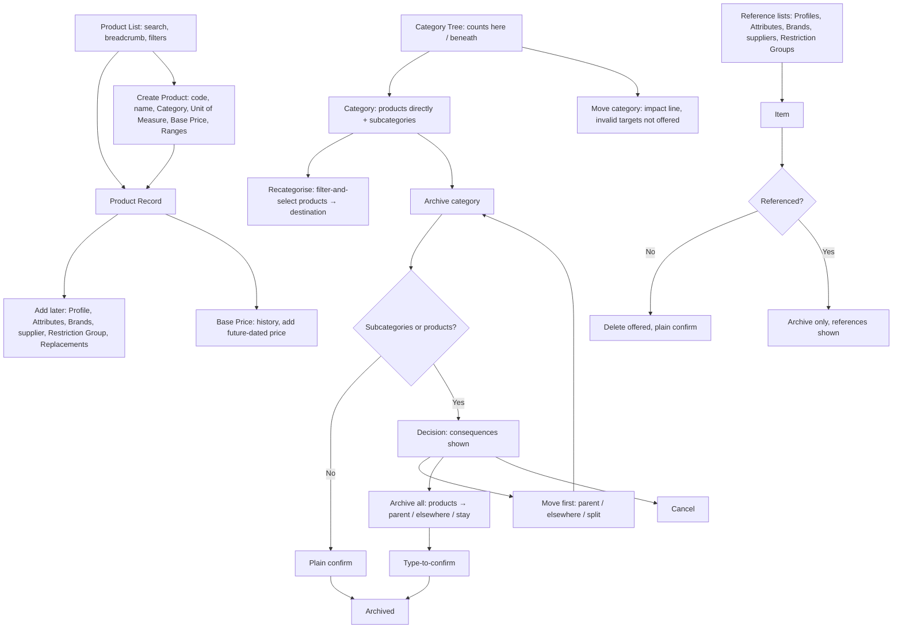

# Product Management: UX & User Stories

**Generated:** 18 September 2026
**Bounded context:** Product Catalogue — product records and the reference data they depend on
**Primary user:** Head Office User
**Scope:** The website screens where head office lists and edits products, keeps the Category tree findable, maintains Brands, suppliers and Restriction Groups, sets base prices, and archives reference data safely. Six screens: Product List, Product Record, Category Tree, Category Archive Decision, Brand & Restriction Group management, Reference Data lists.

---

## 1. Bounded Context & Scope

### Bounded context

- **Domain area:** Product Catalogue, the master record side. What a product *is*. Whether it is on sale is the Range Lifecycle area; what it costs a given customer is the Pricing & Promotions area.
- **Ubiquitous language:**
  - **Product** — an orderable, countable item with its own code. Pack sizes are separate Products. Has one Category, one Product Profile, one Primary Brand (optional), any Alternative Brands, one supplier (optional), at most one Restriction Group, a Unit of Measure, a Base Price history, and any number of Product Attributes.
  - **Product Profile** — a single classification from a head-office-maintained list (e.g. *Ambient*, *Chilled*, *Fragile*). One per Product.
  - **Product Attribute** — a named value on a Product (e.g. *Weight: 200 g*, *Shelf life: 24 months*). Attribute names are maintained by head office; values per Product. The foundation for Phase 2 variant axes.
  - **Category** — a node in a tree of unlimited depth, designed for 5–6 levels. May hold Products directly (a **branch** with products) and subcategories at the same time. Shown with its **Breadcrumb** ("Health > Skincare > Suncare > Lotions").
  - **Move** (Category) — relocating a Category under a new parent, taking its whole subtree and products with it. A Category can never be moved into its own subtree.
  - **Recategorise** — moving selected Products to another Category by filter-and-select. The way a branch is split.
  - **Brand** — a named group of Products. A Product has one **Primary Brand** and any number of **Alternative Brands**. Brand membership is any of these (Coverage Management scopes rely on this).
  - **Supplier** — a reference list; a Product has one. Used as a filter for building Ranges.
  - **Restriction Group** — a named group of restricted Products; each restricted Product belongs to at most one. Reps see them only with the matching Restriction Permission (Coverage Management).
  - **Base Price** — the list price, one value at a time with an **Effective From** date. History is never overwritten; an order line records the price in effect when captured. Future-dated prices are allowed and reach tablets in the Morning Snapshot so they apply on the right day.
  - **Unit of Measure** — *Each* (countable) or a measure (kg, litre, metre). Measure-based Products carry a **Quantity Step** (e.g. 0.5 kg) and a **Minimum Quantity** (defaults to the step). Quantities are multiples of the step.
  - **Archive** (reference data) — taking an item out of use for new records while keeping it on existing ones, labelled Archived. Applies to Categories, Product Profiles, Attribute names, Brands, suppliers, Restriction Groups.
  - **Delete** — permanent removal, offered only when nothing references the item.
  - **Phase 2: Product Variant Group** — a parent Product with Variant Axes (e.g. Size, Colour) whose combinations are orderable Variants. Not designed here; the model allows for it (see Design Decisions).
- **Upstream contexts:**
  - None for master data; this area is the origin. Ordering and Sales Operations supply reference counts ("used by 240 orders") for archive screens.
- **Downstream contexts:**
  - **Range Lifecycle** — Products, Brands and supplier for filter-and-select; availability lifecycle lives there.
  - **Rep at a Location** (area 1) — Category tree for browsing, breadcrumbs, Unit of Measure and Quantity Step for quantity controls, Base Price for quoting, Attributes for customer questions.
  - **Coverage Management** (area 5) — Brands and Restriction Groups as scopes and permissions.
  - **Pricing & Promotions** — Base Price as the starting point for customer group prices, promotions and quantity breaks.
  - **Self-service** (area 7) — the same catalogue.
- **Terms that mean something different elsewhere:**
  - **Profile** — Product Profile is a classification; Location Profile (Visit Planning) carries defaults. Unrelated.
  - **Archive** — for a Range it changes availability (Range Lifecycle); for reference data it only stops new use.
  - **Price** — here the Base Price; what a given customer pays is Pricing & Promotions.
  - **Variant** vs **pack size** — pack sizes are separate Products by decision; variants are a Phase 2 grouping.

### Scope

- **In scope:**
  - Product List with search and breadcrumb; Product Record create and edit
  - Product Profile list; Attribute names and per-product values
  - Category tree: create, rename, Move with impact line, Recategorise, products on branches, counts of "here" and "beneath"
  - Category archive with the move-first / archive-all decision and product destination choices
  - Brands (primary/alternative), suppliers, Restriction Groups
  - Base Price with history and future dating
  - Unit of Measure, Quantity Step, Minimum Quantity
  - Archive-not-delete for all reference data
- **Out of scope:**
  - Ranges and product availability (Range Lifecycle)
  - Customer group prices, promotions, quantity breaks (Pricing & Promotions)
  - Product Variant Groups (Phase 2)
  - Location Profiles, Location Types, Contact Types, geography (Location master data area)
  - Warehouse stock, barcode scanning, images
  - Import from supplier files
- **Assumptions:**
  - A Head Office User maintains everything here; no per-field permissions.
  - Product codes are unique and entered by head office (not generated).
  - A Product must have a Category; Profile, Brand, supplier and Restriction Group are optional.
  - Tablet display of branch products, breadcrumbs, decimal quantities and units is amended in area 1.
  - Attribute names are global, not per Category, in this phase.

---

## 2. Personas

### Head Office User

- **Role:** maintains the catalogue; usually also a Sales Manager.
- **Responsibilities:** lists new products from supplier information; keeps the Category tree usable as it grows; sets and changes list prices; keeps Brands, suppliers and restricted groups accurate; retires reference data without breaking history.
- **Context on arrival:** a supplier price list or new-line notice; a tree that has grown to 5 or 6 levels with duplicate leaf names; reps out with this morning's snapshot; months of orders that reference whatever is about to be changed.
- **Goal:** "List new products correctly first time, keep the catalogue findable as it grows, and change prices and structure without breaking what's already been sold."
- **Pain points:** forgetting a field that reps then ask about; a "Lotions" category that exists in three branches; a price change that silently rewrites old orders; deleting something and finding reports broken months later.

---

## 3. Flow Sketch



---

## 4. Design Decisions

### Unlimited depth, designed for six, breadcrumbs everywhere

- **Chose:** the tree allows any depth; screens and the tablet are designed for 5–6 levels; every product and category shows its full path; products may sit on branches; opening a category shows subcategories first, then products directly in it, with "here" and "beneath" counts.
- **Over:** capping depth; leaf-only products.
- **Because:** real catalogues subdivide after products exist; a bare leaf name is ambiguous across branches; reps need to reach products without six blind taps.
- **Trade-off accepted:** browsing a top-level category returns most of the catalogue; the tablet leans on search.

### Move carries the subtree; splitting is a separate action

- **Chose:** moving a category takes subcategories and products with it, after an impact line ("4 subcategories and 180 products"); a category cannot be dropped into its own subtree (targets not offered); splitting uses Recategorise by filter-and-select.
- **Over:** recreate-and-move; blocking moves of non-empty categories.
- **Because:** reorganising is routine; the scale of a move is otherwise invisible; two clear tools beat one ambiguous one.
- **Trade-off accepted:** a large move changes many breadcrumbs at once.

### Archive-not-delete, with Delete hidden when referenced

- **Chose:** any reference item in use can only be archived; Delete is not shown at all when references exist; archived items stay on existing records, labelled, and remain usable in filters and reports.
- **Over:** delete with a warning; cascading deletes.
- **Because:** broken references surface months later on historical Calls and Orders; structural prevention beats a warning nobody reads.
- **Trade-off accepted:** archived items accumulate; lists default to hiding them.

### Branch archive as a decision, with type-to-confirm on the wide path

- **Chose:** archiving a category with children shows the consequences and three paths — move first, archive all, cancel; for archive-all the manager chooses where products go (parent, elsewhere, or stay in the archived category with its consequence stated) and confirms by typing; subcategories get the same choices independently.
- **Over:** requiring the branch be emptied first; automatic move to parent.
- **Because:** both outcomes are legitimate; "stay" is easy to pick without realising products vanish from browsing; archiving a subtree is far-reaching and its damage shows gradually, unlike a Range archive.
- **Trade-off accepted:** a multi-step screen for what is sometimes a small change.

### Dated Base Price, routine edits, future prices reach the tablet

- **Chose:** each price has an Effective From date; history is kept; adding a price is a routine edit with no confirmation; future-dated prices go in the Morning Snapshot so the tablet switches on the day.
- **Over:** a single overwritable price; confirmations on change; tablet uses whatever it synced.
- **Because:** "what did this cost when that order was placed" must always be answerable; the manager knows why they're changing it; a rep quoting yesterday's price on the day of a rise is an avoidable conversation.
- **Trade-off accepted:** a past-dated price does not rewrite orders already captured (valid when captured); pricing beyond the base is another area.

### Unit of Measure with a step; pack sizes stay separate

- **Chose:** Each or a measure; measure-based products carry a Quantity Step and Minimum; pack sizes are separate Products.
- **Over:** selling units per product; free decimal entry.
- **Because:** the real need is weight/volume selling; a step gives usable tablet increments and stops 2.4718 kg orders; the catalogue already treats pack sizes as products.
- **Trade-off accepted:** area 1's quantity controls and validation need amending for decimals and units.

### Profile plus Attributes; variants deferred but not blocked

- **Chose:** one Product Profile classification plus name/value Attributes; Product Variant Groups are Phase 2, but the model keeps an optional parent reference on Product, attributes as name/value pairs, and order/stock-check lines referencing the orderable Product.
- **Over:** fixed attribute columns; building variants now.
- **Because:** clothing and configurable products will need grouping on the tablet, which reaches every area 1 screen; the three allowances cost nothing now and are painful to retrofit.
- **Trade-off accepted:** a t-shirt in five sizes is five rows on the Order Pad until Phase 2.

---

## 5. User Stories

### US-001: Create a product with the minimum record

| Field | Value |
|---|---|
| **Story** | As a Head Office User, I want to list a new product with only what I know at the time — code, name, Category, unit, price and Range — so that it reaches reps quickly and the rest is added later |
| **Priority** | Must Have |
| **Status** | Ready |
| **Dependencies** | Category tree (US-005); Range Lifecycle US-003 for the Range picker |

**Acceptance criteria:**

*Scenario 1: Minimum create*
```
When I enter code "SUN-0342", name "SPF30 Sun Lotion v2 200ml", Category "Health > Skincare > Suncare > Lotions", Unit Each, Base Price €12.50 from today, and tick Range "Summer 2027"
Then the product is saved and appears in reps' Order Pads for that Range at next Sync
```

*Scenario 2: Duplicate code*
```
When I enter code "SUN-0342" which exists
Then I see "Code SUN-0342 is already used by SPF30 Sun Lotion v2 200ml"
```

*Scenario 3: No Range*
```
When I save without a Range
Then the product is saved as unranged with the note "Unranged — orderable by all reps"
```

*Scenario 4: Missing Category*
```
When I save without a Category
Then it is rejected with "Choose a category"
```

*Scenario 5: Add the rest later*
```
When I open the saved product
Then Profile, Attributes, Brands, supplier, Restriction Group and Replacements are shown as empty sections I can fill
```

---

### US-002: Set and change the Base Price

| Field | Value |
|---|---|
| **Story** | As a Head Office User, I want to add a new price with the date it applies from, keeping every previous price, so that old orders keep their price and a rise takes effect on the right day |
| **Priority** | Must Have |
| **Status** | Ready |
| **Dependencies** | US-001; Morning Snapshot (area 1) |

**Acceptance criteria:**

*Scenario 1: Future-dated rise*
```
Given the current price is €12.50
When I add €13.20 effective 1 November 2026
Then the record shows "€12.50 · rising to €13.20 on 1 Nov" and the history lists both
And a rep who syncs on 31 October sees €12.50 on 31 October and €13.20 on 1 November
```

*Scenario 2: Order keeps its price*
```
Given an order line was captured on 28 October at €12.50
When 1 November passes
Then that line still shows €12.50
```

*Scenario 3: Past-dated price*
```
When I add €12.00 effective 1 September 2026
Then it is inserted in history and becomes the price for 1 Sep – 31 Oct
And existing orders in that window are unchanged, with a note "Existing orders keep the price captured"
```

*Scenario 4: Same date twice*
```
When I add a price with the same Effective From as an existing one
Then I see "A price already starts on 1 Nov 2026 — edit it instead"
```

*Scenario 5: Measure-based price*
```
Given the product's unit is kg
Then the price is shown and entered as "€4.80 per kg"
```

---

### US-003: Set Unit of Measure, step and minimum

| Field | Value |
|---|---|
| **Story** | As a Head Office User, I want to mark a product as sold by a measure with a step and minimum so that reps order sensible quantities and the tablet shows the right unit |
| **Priority** | Should Have |
| **Status** | Ready |
| **Dependencies** | US-001; area 1 quantity controls |

**Acceptance criteria:**

*Scenario 1: Measure-based*
```
When I set Unit kg, Quantity Step 0.5, Minimum 1.0
Then reps can order 1.0, 1.5, 2.0 kg and the tablet's control steps by 0.5 from 1.0
```

*Scenario 2: Minimum defaults to step*
```
When I set Unit kg, Step 0.5 and leave Minimum blank
Then Minimum is 0.5
```

*Scenario 3: Invalid minimum*
```
When I set Step 0.5 and Minimum 0.7
Then it is rejected with "Minimum must be a multiple of the step"
```

*Scenario 4: Each*
```
Given Unit Each
Then step and minimum are hidden and quantities are whole numbers of 1 or more
```

*Scenario 5: Change unit with history*
```
Given the product has orders as Each
When I change Unit to kg
Then I see "12 orders reference this product as Each — they are unchanged" and the change applies to new orders only
```

---

### US-004: Maintain Profile, Attributes, Brands, supplier and Restriction Group

| Field | Value |
|---|---|
| **Story** | As a Head Office User, I want to classify a product and record its facts on one screen so that reps can answer customer questions and other areas can group products correctly |
| **Priority** | Should Have |
| **Status** | Ready |
| **Dependencies** | US-001, US-008 |

**Acceptance criteria:**

*Scenario 1: Classify*
```
When I set Profile "Chilled", Primary Brand "SunCo", Alternative Brand "GlowCo", supplier "Irish Health Supplies", Restriction Group none
Then all are saved and shown on the record
```

*Scenario 2: Attributes*
```
When I add Weight 200 g, Shelf life 24 months, Barcode 5391234567890
Then they appear as name/value rows and are included in the Morning Snapshot for reps
```

*Scenario 3: Primary brand required if any brand*
```
When I add an Alternative Brand with no Primary Brand
Then I see "Choose a primary brand first"
```

*Scenario 4: Restriction Group*
```
When I set Restriction Group "Pharmacy-only medicines"
Then the product is hidden from reps without that permission at their next Sync
```

*Scenario 5: Archived reference item*
```
Given Profile "Frozen" is archived
Then it is not offered for new selection, but a product already set to Frozen still shows "Frozen (archived)"
```

---

### US-005: Browse and edit the Category tree

| Field | Value |
|---|---|
| **Story** | As a Head Office User, I want a tree that shows how many products are in each category and beneath it, with products allowed on branches, so that I can see where the catalogue is and keep it findable |
| **Priority** | Must Have |
| **Status** | Ready |
| **Dependencies** | None |

**Acceptance criteria:**

*Scenario 1: Counts*
```
When I open "Suncare"
Then I see "180 products beneath · 12 here", its 4 subcategories, then the 12 products directly in it under "In Suncare"
```

*Scenario 2: Breadcrumb disambiguates*
```
Given "Lotions" exists under Suncare and under Body Care
When I search "Lotions"
Then both appear with their full paths
```

*Scenario 3: Add a subcategory to a category with products*
```
Given "Suncare" has 12 products directly in it
When I add subcategory "After Sun"
Then it is created and the 12 stay in Suncare with an inline offer "Recategorise products?"
```

*Scenario 4: Rename*
```
When I rename "Lotions" to "Lotions & Creams"
Then every product's breadcrumb updates and no order or call is changed
```

*Scenario 5: Depth*
```
When I add a sixth level
Then it is accepted and the tree shows it with its breadcrumb
```

---

### US-006: Move a category with its subtree

| Field | Value |
|---|---|
| **Story** | As a Head Office User, I want to move a category under a new parent, taking everything beneath it, after seeing what that moves so that reorganising is one action with no surprises |
| **Priority** | Should Have |
| **Status** | Ready |
| **Dependencies** | US-005 |

**Acceptance criteria:**

*Scenario 1: Move with impact*
```
When I choose Move on "Suncare" and pick "Health > Skincare"
Then I see "Moving Suncare will move 4 subcategories and 180 products to Health > Skincare"
And on confirm all breadcrumbs beneath update
```

*Scenario 2: Own subtree not offered*
```
When I choose Move on "Suncare"
Then "Suncare" and its subcategories are not selectable as destinations
```

*Scenario 3: Move to root*
```
When I pick "Top level" as destination
Then Suncare becomes a root category
```

---

### US-007: Recategorise products in bulk

| Field | Value |
|---|---|
| **Story** | As a Head Office User, I want to select products in a category by filter and move them to another category so that I can split a branch that has grown too big |
| **Priority** | Should Have |
| **Status** | Ready |
| **Dependencies** | US-005 |

**Acceptance criteria:**

*Scenario 1: Split by filter*
```
Given "Suncare" holds 60 products directly
When I filter name contains "Spray", 18 match, all ticked, and choose destination "Suncare > Sprays"
Then the 18 move and Suncare shows "42 here"
```

*Scenario 2: Untick exceptions*
```
When I untick 2 before moving
Then 16 move and 2 stay
```

*Scenario 3: Destination archived*
```
When I pick an archived category as destination
Then it is not offered
```

---

### US-008: Maintain reference lists with archive-not-delete

| Field | Value |
|---|---|
| **Story** | As a Head Office User, I want to add, edit and retire Profiles, Attribute names, Brands, suppliers and Restriction Groups, with retirement archiving anything in use so that history never breaks |
| **Priority** | Must Have |
| **Status** | Ready |
| **Dependencies** | Reference counts from Ordering and Sales Operations |

**Acceptance criteria:**

*Scenario 1: Delete when unused*
```
Given Brand "TestCo" has no products
When I open it
Then Delete is offered and, on confirm, it is removed
```

*Scenario 2: Archive when used*
```
Given Brand "SunCo" has 24 products
When I open it
Then Delete is not shown; Archive is, with "Used by 24 products and 1 specialist assignment"
And on confirm SunCo is archived, stays on the 24 products labelled Archived, and is not offered for new products
```

*Scenario 3: Archived list hidden by default*
```
When I open Brands
Then archived brands are hidden with a "Show archived (3)" toggle
```

*Scenario 4: Un-archive*
```
When I un-archive "SunCo"
Then it is offered again for new products
```

*Scenario 5: Restriction Group with permissions*
```
Given Restriction Group "High-value equipment" has 3 reps with permission
When I archive it
Then I see "3 permissions will be kept but have no effect while archived"
```

---

### US-009: Archive a category with children

| Field | Value |
|---|---|
| **Story** | As a Head Office User, I want to be shown what archiving a branch would do and choose whether to move things first or archive everything, deciding where products go so that nothing disappears without my saying so |
| **Priority** | Must Have |
| **Status** | Ready |
| **Dependencies** | US-005, US-006, US-007 |

**Acceptance criteria:**

*Scenario 1: Decision shown*
```
Given "Suncare" has 4 subcategories and 180 products beneath
When I choose Archive
Then I see "Archiving Suncare will also archive 4 subcategories and take 180 products out of this branch" with Move first, Archive all, Cancel
```

*Scenario 2: Move first*
```
When I choose Move first, move 2 subcategories to "Body Care" and recategorise the 12 direct products to "Body Care > Lotions"
Then I return to the decision with the reduced consequences "2 subcategories, 168 products"
```

*Scenario 3: Archive all with products to parent*
```
When I choose Archive all, products → "Move to parent (Health > Skincare)", subcategories → archive
Then I must type "Suncare" to confirm
And on confirm Suncare and 4 subcategories are archived and 180 products sit in Health > Skincare
```

*Scenario 4: Products stay*
```
When I choose products → "Stay in Suncare"
Then I see "180 products stay in Suncare. They remain orderable and searchable but won't appear when browsing categories"
And on typed confirm they remain in the archived category, searchable with breadcrumb "Suncare (archived)"
```

*Scenario 5: Root category*
```
Given "Health" is a root category
When I archive all
Then "Move to parent" is not offered and I must pick a destination or Stay
```

*Scenario 6: Leaf with no products*
```
Given a category with no children and no products
When I choose Archive
Then a plain confirmation is shown
```

---

### US-010: Find products

| Field | Value |
|---|---|
| **Story** | As a Head Office User, I want to search products by code, name, brand or supplier and see each with its breadcrumb and status so that I find the right record among near-duplicates |
| **Priority** | Must Have |
| **Status** | Ready |
| **Dependencies** | US-001 |

**Acceptance criteria:**

*Scenario 1: Search*
```
When I type "SPF30"
Then I see every matching product with code, breadcrumb, Primary Brand, availability state and current price
```

*Scenario 2: Filter by category beneath*
```
When I filter Category "Suncare"
Then all 180 products beneath it are listed, each with its own breadcrumb
```

*Scenario 3: Include archived*
```
When I tick "Include unavailable and archived-category products"
Then products in Unavailable state or in archived categories appear, labelled
```

---

## 6. Phase 2: Product Variant Groups (not designed here)

- **Model:** a parent Product with Variant Axes (e.g. Size, Colour); each combination an orderable Variant with its own code and price; Category, Brand, supplier, Ranges and availability on the parent.
- **Allowed for now:** Product has an optional parent reference; Attributes are name/value pairs; order lines and Stock Check entries reference the orderable Product.
- **Reach when built:** Order Pad and search rows, Stock Check rows, Suggested List membership, Low marks and Replacements per variant (all area 1).
- **Boundary:** pack sizes and disk sizes remain separate Products; a configurable base product with fixed option sets is a variant case.

---

## 7. Requires Clarification

1. **Pricing & Promotions area:** customer group prices, simple promotions, multi-product offers, quantity breaks (Each and measure), how they surface on the Order Pad and self-service, and offline behaviour.
2. **Location master data area:** Location Profiles (Visit Frequency, Visit Duration, Low Stock Thresholds), Location Types, Contact Types, geography, geocoding.
3. **Attribute names per Category:** global now; confirm whether Category-scoped attributes are wanted before Phase 2.
4. **Product code source:** entered by head office (assumed) or generated.
5. **Area 1 amendments:** breadcrumbs in search and browsing; subcategories first then "In <category>" products, showing everything beneath by default with counts; decimal quantities with unit and step; "greater than zero" validation; Base Price and future-dated prices in the snapshot; Attributes visible on the product.
6. **Range Lifecycle amendment:** Run-out Quantity in the product's unit.

---

## 8. Recommended Next Steps

1. Apply the full amendment backlog to areas 1, 5, 9 and Range Lifecycle in one pass — now including item 5 and 6 above and the earlier items from Coverage Management and Range Lifecycle.
2. Take Location master data next; it closes the last open dependency for Visit Planning and area 1.
3. Then Pricing & Promotions, which now has a defined boundary and touches the tablet heavily.
4. Confirm the product code source and Category-scoped attributes with head office before build.
