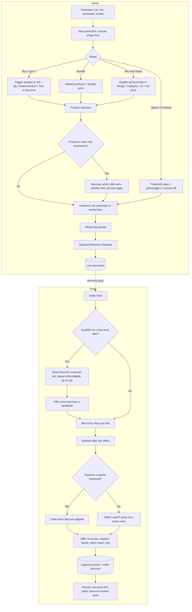

# Promotions: UX & User Stories

**Generated:** 18 September 2026
**Bounded context:** Promotions, within Pricing
**Primary users:** Head Office User (setting them up); Field Salesperson (explaining them)
**Scope:** Head office running offers that apply automatically to qualifying orders, and how those offers read on the rep's order. Six screens: Promotion List, Promotion Setup, Product Selection (with overlap warning), Audience Selection, Order Offer Summary, Order line markers.

---

## 1. Bounded Context & Scope

### Bounded context

- **Domain area:** Promotions. Head office sets rules in advance; they apply automatically. Discretionary giveaways by a rep are **not** promotions — they are Free of Charge lines, which live with Price Override in the Pricing area.
- **Ubiquitous language:**
  - **Promotion** — a rule that reduces what a customer pays, live for a whole-day **Period**, with an **Audience** and one of four **Shapes**.
  - **Audience** — **All customers** (the usual case) or one or more named **Price Tiers**. Nothing finer. A tier used only as an audience need not carry any prices.
  - **Shapes:**
    - **Buy X get Y** — buy a quantity of one product (or any from a set), get another product free or at a set price.
    - **Bundle** — a fixed set of named products together at a set price.
    - **Mix and Match** — any N products from a defined **Eligible Set** for a set price.
    - **Spend Threshold** — an order reaching a value gets a percentage or fixed amount off the order.
  - **Line-level offer** — Buy X get Y, Bundle and Mix and Match. Each produces a **Candidate Price** for the lines involved, resolved by Pricing's **Best Price Wins**.
  - **Order-level offer** — a Spend Threshold. It sits outside Best Price Wins: lines resolve first, then the discount applies to the order total.
  - **Automatic application** — a qualifying order gets the offer without the rep accepting anything.
  - **Best-for-the-customer selection** — where an order has more eligible products than a set needs, the highest-priced eligible items go into the set; the remainder are charged at their own resolved prices.
  - **Repeats** — an offer applies as many times as the order allows (12 eligible items = two sets of 6), subject to an optional **Maximum Repeats** per order, normally blank.
  - **Threshold basis** — a Spend Threshold measures the order total **after** all line-level offers, so it measures what the customer actually spends.
  - **Offer Summary** — the order's statement of what applied, what it saved, and what is within reach, including an offer lost when the total moves the wrong way.
  - **Overlap warning** — shown at setup when a product is already in other live promotions, stating which offer would win and whether the new one would ever apply.
  - **Gross line value** — the sum of line prices before any order-level discount. Targets and Performance measure this; the order discount is tracked separately.
- **Upstream contexts:**
  - **Pricing** — Base Price, Price Tiers (as audience and as competing candidates), Quantity Breaks, Best Price Wins.
  - **Product Catalogue** — products, Ranges and Categories for building eligible sets; availability states.
  - **Customer Directory** — Customers and their tiers.
- **Downstream contexts:**
  - **Rep at a Location** (area 1) — promotions in the Morning Snapshot; offer markers and the Offer Summary on the order.
  - **Head Office Order Processing** — orders arrive with offers already applied and captured.
  - **Targets & Performance** — gross line value as actuals; order-level discounts tracked apart.
  - **Self-service** (area 7) — the same offers apply to Customer Users.
- **Terms that mean something different elsewhere:**
  - **Promotion** — head office's rule; a rep's giveaway is a Free of Charge line (Pricing).
  - **Range** — a catalogue Range may define an eligible set, but a promotion is not a Range.
  - **Bundle** — a fixed priced set here; not a pack size (which is a separate Product).

### Scope

- **In scope:**
  - Creating each of the four shapes, with period and audience
  - Eligible sets built by product, Range or Category
  - Overlap warning at setup
  - Automatic application, best-for-the-customer selection, repeats and the optional cap
  - Spend thresholds measured after line offers, held at order level
  - Offer Summary and line markers on the order
  - Offline behaviour from the snapshot
- **Out of scope:**
  - Base prices, tiers, quantity breaks, price overrides (Pricing)
  - Rep-given Free of Charge lines (Pricing)
  - Invoicing, margin, promotional funding or supplier rebates
  - Promotion performance reporting (a Targets & Performance extension, not designed)
- **Assumptions:**
  - Periods are whole days; a promotion never starts or ends mid-day, so a morning snapshot is correct all day.
  - A promotion applies to rep and self-service orders alike; no channel targeting.
  - Free items in a Buy X get Y are priced at zero but still consume stock and count against a Run-out Remaining.
  - Maximum Repeats is blank by default.
  - A promotion cannot be edited once live except to end it early (see clarification).

---

## 2. Personas

### Head Office User

- **Role:** runs the trading calendar; usually also a Sales Manager.
- **Responsibilities:** sets up seasonal and tactical offers; decides who gets them; makes sure an offer will actually apply.
- **Context on arrival:** a new season, a supplier deal, or slow stock to move; a catalogue where products already sit in other live offers.
- **Goal:** "Run an offer and know it will actually apply."
- **Pain points:** an offer that never fires because a better one masks it; discovering afterwards that a repeating offer ran away on a chain's central order.

### Field Salesperson

- **Role:** the area 1 rep.
- **Responsibilities:** makes sure the customer gets what they qualify for; explains the total.
- **Context on arrival:** offline, mid-conversation, a total that just changed because of a line they added.
- **Goal:** "Make sure the customer gets it, and be able to explain the total."
- **Pain points:** a free line appearing that looks like a mistake; a discount vanishing when they add a product; not knowing the customer was €20 short of an offer.

---

## 3. Flow Sketch



---

## 4. Design Decisions

### Audience is all customers or named tiers

- **Chose:** a promotion runs for everyone, or for one or more Price Tiers.
- **Over:** targeting by Customer, Location Profile, region or channel.
- **Because:** most promotions are general; where they are targeted it follows commercial terms, which tiers already express; finer targeting multiplies setup and makes "why did they get a better price?" harder to answer.
- **Trade-off accepted:** a one-customer deal is a tier price or an override, not a promotion.

### Whole-day periods

- **Chose:** promotions start and end on day boundaries.
- **Over:** timed starts and ends.
- **Because:** the tablet works from a morning snapshot; a mid-day change would leave a rep quoting a price the system no longer honours.
- **Trade-off accepted:** no flash offers.

### Applied automatically, explained afterwards

- **Chose:** a qualifying order takes the offer without the rep accepting; the Offer Summary states what applied and what it saved; added free lines are marked as belonging to the offer.
- **Over:** offering it for the rep to accept.
- **Because:** the customer should always get what they qualify for, consistent with Best Price Wins; a rep mid-conversation should not have to spot offers.
- **Trade-off accepted:** totals move as lines are added, sometimes downward in ways that need explaining — the summary carries that load.

### Best for the customer, and offers repeat

- **Chose:** where more items are eligible than a set needs, the highest-priced go into the set; offers repeat while the order allows, subject to an optional cap that is normally blank.
- **Over:** first-come selection; applying once per order; a mandatory cap.
- **Because:** it matches Best Price Wins; a customer buying twice as much should get the offer twice; an uncapped offer can still run away on a chain's central order, so the cap exists for the rare case.
- **Trade-off accepted:** adding one product can reshuffle which items sit in a set and change several lines at once; explained at order level, not line by line.

### Spend thresholds sit at order level, measured after line offers

- **Chose:** lines keep their resolved prices; the discount appears once at the order total; the threshold measures the subtotal after all line-level offers; the summary shows how much more would qualify, and says when an offer has been lost.
- **Over:** spreading the discount across lines; measuring before line offers.
- **Because:** lines keep the prices the rep quoted; measuring after offers is what the customer actually spends and survives being checked; a line offer can push a total below a threshold, and silence there would blindside the rep.
- **Trade-off accepted:** per-product actuals sum to the gross figure, not the order total; Targets & Performance measures gross line value with the discount tracked separately.

### Overlap is warned about at setup, not prevented

- **Chose:** adding a product already in live promotions shows which offer would win and whether the new one would ever apply; head office can proceed.
- **Over:** blocking overlaps; a bare "this product is in other promotions" notice.
- **Because:** overlaps are legitimate when they cover different quantities or periods, and a mistake when one simply masks another — only a comparison tells them apart; Best Price Wins means an overlap is never an error, just possibly pointless.
- **Trade-off accepted:** head office can still create an offer that never fires.

---

## 5. User Stories

### US-001: Create a Buy X get Y promotion

| Field | Value |
|---|---|
| **Story** | As a Head Office User, I want to set up "buy a quantity of one product and get another free or cheap" so that I can push a line or introduce a new product |
| **Priority** | Must Have |
| **Status** | Ready |
| **Dependencies** | Pricing US-001 (tiers as audience); Product Catalogue |

**Acceptance criteria:**

*Scenario 1: Free reward*
```
When I create "Buy 10 SPF30 Sun Lotion 200ml, get 2 After Sun 200ml free", all customers, 1–31 October 2026
Then an order with 10 SPF30 gains 2 After Sun at €0.00, marked "Autumn offer — free"
```

*Scenario 2: Discounted reward*
```
When the reward is set at €2.00 rather than free
Then the 2 After Sun price at €2.00 each, marked with the offer
```

*Scenario 3: Repeats*
```
Given an order with 25 SPF30
Then the offer applies twice: 4 After Sun at €0.00, with 5 SPF30 not contributing
```

*Scenario 4: Capped*
```
Given Maximum Repeats is 2 and the order has 40 SPF30
Then 4 After Sun are added and the summary reads "Applied 2 times (maximum)"
```

*Scenario 5: Reward already on the order*
```
Given the rep already added 3 After Sun at full price
Then 2 of them become offer-priced and 1 stays at its resolved price
```

*Scenario 6: Trigger from a set*
```
When the trigger is "any 10 from Range Summer 2027"
Then any mix of 10 from that Range qualifies
```

---

### US-002: Create a Bundle promotion

| Field | Value |
|---|---|
| **Story** | As a Head Office User, I want to price a fixed set of products together so that a themed group sells as one |
| **Priority** | Should Have |
| **Status** | Ready |
| **Dependencies** | US-001 |

**Acceptance criteria:**

*Scenario 1: Bundle applies*
```
Given a bundle "SPF30 + After Sun + Kids Spray for €20.00", normally €24.70
When all three are on the order
Then the three lines price to €20.00 in total, marked as the bundle, and the summary reads "Bundle applied — saving €4.70"
```

*Scenario 2: Incomplete*
```
Given only two of the three are on the order
Then no bundle applies and each line takes its own resolved price
And the summary reads "Add Kids Spray to complete the bundle — saving €4.70"
```

*Scenario 3: Repeats*
```
Given 2 of each product
Then the bundle applies twice
```

*Scenario 4: A bundle product unavailable*
```
Given Kids Spray becomes Unavailable during the promotion
Then the bundle can no longer be completed; the promotion list flags it "Cannot apply — Kids Spray unavailable"
```

---

### US-003: Create a Mix and Match promotion

| Field | Value |
|---|---|
| **Story** | As a Head Office User, I want "any N from this set for a price" so that customers can choose within an offer |
| **Priority** | Should Have |
| **Status** | Ready |
| **Dependencies** | US-001 |

**Acceptance criteria:**

*Scenario 1: Best for the customer*
```
Given "any 6 from Category Suncare for €15.00"
And the order has 8 eligible items priced from €2.20 to €4.80
Then the 6 highest-priced go into the offer at €15.00 total
And the remaining 2 keep their own resolved prices
```

*Scenario 2: Repeats*
```
Given 12 eligible items
Then the offer applies twice at €15.00 each
```

*Scenario 3: Partially eligible*
```
Given 5 eligible items
Then no offer applies and the summary reads "1 more Suncare product for the 6 for €15.00 offer"
```

*Scenario 4: Eligible set by Range or Category*
```
When I define the set as a Range, a Category, or a list of products
Then all three are accepted and the set is resolved at order time
```

*Scenario 5: Adding a line reshuffles*
```
When the rep adds a higher-priced eligible item
Then it enters the set, a cheaper one leaves and is charged normally, and the summary explains the change
```

---

### US-004: Create a Spend Threshold promotion

| Field | Value |
|---|---|
| **Story** | As a Head Office User, I want an order reaching a value to get a discount so that larger orders are rewarded without touching line prices |
| **Priority** | Should Have |
| **Status** | Ready |
| **Dependencies** | Pricing resolution |

**Acceptance criteria:**

*Scenario 1: Threshold met*
```
Given "Spend €500, get 5% off", all customers
And an order subtotal of €520.00 after line offers
Then the order shows "Subtotal €520.00 · Spend 500 offer −5% (€26.00) · Total €494.00"
```

*Scenario 2: Measured after line offers*
```
Given an order of €520.00 before line offers and €480.00 after
Then the threshold is not met
And the summary reads "€480 after offers — €20 more for 5% off"
```

*Scenario 3: Offer lost*
```
Given the order qualified at €505.00
When the rep adds a product that triggers a bundle, bringing the subtotal to €492.00
Then the discount is removed and the summary reads "5% off no longer applies — €8 more to qualify again"
```

*Scenario 4: Fixed amount*
```
When the reward is €25.00 off rather than a percentage
Then the order shows the fixed deduction
```

*Scenario 5: Actuals*
```
Then per-product actuals use the gross line value of €520.00 and the €26.00 discount is tracked separately
```

---

### US-005: Set a promotion's audience and period

| Field | Value |
|---|---|
| **Story** | As a Head Office User, I want to choose who gets an offer and when it runs so that tier deals stay with those customers and nothing starts early |
| **Priority** | Must Have |
| **Status** | Ready |
| **Dependencies** | Pricing US-001, US-003 |

**Acceptance criteria:**

*Scenario 1: All customers*
```
When I leave the audience as All customers
Then every customer qualifies, including self-service
```

*Scenario 2: Tier audience*
```
When I set the audience to Tier A and Tier B
Then only customers holding one of those tiers qualify; others price without the offer
```

*Scenario 3: Whole days*
```
When I set 1–31 October 2026
Then the offer is live from the start of 1 October to the end of 31 October, with no time of day
```

*Scenario 4: Scheduled*
```
Given a promotion starting next month
Then it is listed as Scheduled and does not appear in any snapshot's live offers, though its dates are carried so tablets apply it on the day
```

*Scenario 5: End early*
```
When I end a live promotion today
Then it stops applying from tomorrow, and orders already captured keep their prices
```

---

### US-006: Be warned when a product is already in other promotions

| Field | Value |
|---|---|
| **Story** | As a Head Office User, I want to be told which offer would win when a product is in several so that I don't set up an offer that never fires |
| **Priority** | Should Have |
| **Status** | Ready |
| **Dependencies** | US-001 to US-004 |

**Acceptance criteria:**

*Scenario 1: New offer would be masked*
```
Given SPF30 is in "Autumn Deal" giving €9.99
When I add it to a new offer giving €10.50
Then I see "SPF30 is in 2 other live promotions. Autumn Deal gives €9.99; this offer gives €10.50, so it won't apply."
And I can proceed anyway
```

*Scenario 2: Overlap is fine*
```
Given the other offer applies only from quantity 30 and mine from 10
Then the warning states both and notes each applies at different quantities
```

*Scenario 3: Different audiences*
```
Given the other offer is Tier A only and mine is all customers
Then the warning notes the audiences differ and both may apply to different customers
```

*Scenario 4: No overlap*
```
Then no warning is shown
```

---

### US-007: Understand offers on an order

| Field | Value |
|---|---|
| **Story** | As a Field Salesperson, I want the order to say what offers applied, what they saved, and what's within reach so that I can explain the total and offer the customer more |
| **Priority** | Must Have |
| **Status** | Ready |
| **Dependencies** | US-001 to US-004; area 1 Order entry |

**Acceptance criteria:**

*Scenario 1: Applied offers listed*
```
Given a bundle and a mix-and-match both applied
Then the Offer Summary reads "2 offers applied — saving €19.70" and expands to name each with its saving
```

*Scenario 2: Free lines marked*
```
Given 2 After Sun were added by an offer
Then those lines read "€0.00 — Autumn offer (free)" and are visibly not rep-entered
```

*Scenario 3: Within reach*
```
Given the order is 1 item short of a mix-and-match set
Then the summary reads "1 more Suncare product for the 6 for €15.00 offer"
```

*Scenario 4: Offer lost*
```
When an added line drops the order below a spend threshold
Then the summary states the discount no longer applies and how much would restore it
```

*Scenario 5: Offline*
```
Given no signal
Then all offers resolve on the tablet from the morning snapshot, including their periods
```

*Scenario 6: Several available*
```
Given the order partly qualifies for 3 offers
Then a single line reads "3 offers available on this order", expanding to the detail
```

---

### US-008: Browse and manage promotions

| Field | Value |
|---|---|
| **Story** | As a Head Office User, I want to see live, scheduled and ended promotions with what each is doing so that the trading calendar is visible in one place |
| **Priority** | Could Have |
| **Status** | Ready |
| **Dependencies** | US-001 to US-005 |

**Acceptance criteria:**

*Scenario 1: List by status*
```
When I open Promotions
Then Live is shown by default, with Scheduled and Ended filters, each showing shape, audience, period and product count
```

*Scenario 2: Cannot apply*
```
Given a bundle whose product is Unavailable
Then it is flagged "Cannot apply" in the Live list
```

*Scenario 3: Masked offer*
```
Given every product in an offer is beaten by another live offer
Then it is flagged "May never apply"
```

---

## 6. Requires Clarification

1. **Editing a live promotion:** assumed only "end early" is allowed; confirm whether products or prices may be changed mid-flight.
2. **Promotion reporting:** what each offer cost and sold is not designed; a Targets & Performance extension.
3. **Supplier funding / rebates:** out of scope; confirm they are tracked elsewhere.
4. **Area 1 amendments (applied):** promotions and their periods in the snapshot; offer markers on lines; the Offer Summary on the order.
5. **Targets & Performance amendment (applied):** actuals use gross line value; order-level discounts tracked separately.
6. **Pricing amendment (applied):** rep-given Free of Charge lines are designed in Pricing US-009, not here.

---

## 7. Recommended Next Steps

1. Apply the Pricing amendment for Free of Charge lines (item 6) with the next batch, alongside the area 1 and Targets amendments.
2. Take Prospecting & Leads (area 2) or Self-service (area 7) next; Stock Allocation still waits on the warehouse feed.
3. Confirm item 1 before build; mid-flight edits change what a synced tablet believes.
4. Prototype the Offer Summary alongside Pricing's line display; together they are the densest part of the order screen.
