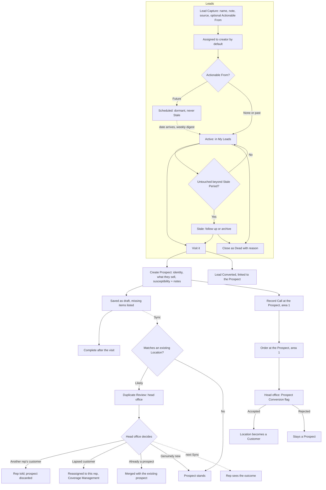

# Prospecting & Leads: UX & User Stories

**Generated:** 18 September 2026
**Bounded context:** Prospecting, within Sales Operations
**Primary users:** Field Salesperson (working and creating leads and prospects); Sales Manager (sourcing, assigning, deciding duplicates)
**Scope:** How new business gets found and turned into customers. Six screens: My Leads, Lead Capture, Lead Detail, Create Prospect (in-shop), Complete Prospect (afterwards), Duplicate Review (head office).

---

## 1. Bounded Context & Scope

### Bounded context

- **Domain area:** Prospecting. It covers everything before a Location becomes a Customer. Once converted, the Location belongs to Customer Directory and the rep works it as any other.
- **Ubiquitous language:**
  - **Lead** — a note about a possible opportunity that **nobody has visited yet**: a tip from a shopkeeper, a unit being fitted out, a shop opening in six months. It is **not a Location** and needs no address; whatever is known is enough. Created by a rep or a manager.
  - **Lead Source** — where it came from, in the creator's words ("mentioned by Murphy's Rathdrum").
  - **Actionable From** — an optional date before which a Lead is dormant: out of the working list and never Stale. For opportunities that exist but are not yet workable.
  - **Lead states** — **Active** (workable now), **Scheduled** (Actionable From in the future), **Converted** (visited, became a Prospect), **Dead** (closed with a reason), **Stale** (Active and untouched beyond the **Stale Period**).
  - **Stale Period** — how long an Active Lead may sit untouched before being flagged. Set by the manager for the team, overridable by each rep for their own leads. Measured from the Actionable From date where one exists, otherwise from creation or last activity.
  - **Prospect** — a **Location** created when someone actually calls on a place that is not a Customer. Carries identity (name, address, contact details), **what they currently sell**, a **Susceptibility** rating and notes.
  - **Susceptibility** — the rep's judgement of how likely the place is to buy: **High / Medium / Low**, with free-text notes carrying the reasoning.
  - **What they sell** — free text with an optional link to a Product, Range or Category, reusing the Competitor Note shape from area 1 so competitor presence reads the same for prospects and customers.
  - **Prospect draft** — a Prospect saved with only what the rep captured in the shop. It shows what is still missing until completed, usually later the same day.
  - **Conversion (Lead → Prospect)** — visiting a Lead creates a Prospect and closes the Lead against it. The link is made by the act of visiting, not matched afterwards.
  - **Conversion (Prospect → Customer)** — a Prospect's first Accepted Order converts its Location to a Customer (Head Office Order Processing). A Rejected order leaves it a Prospect.
  - **Duplicate Match** — at Sync, the server compares a new Prospect against existing Locations by name, address and Town. A likely match goes to head office as a queue item; the rep is not blocked and cannot know in advance.
  - **Stale Customer** — a manager's judgement, never a system state: an existing Location whose ordering has lapsed relative to **its own** pattern. The Duplicate Review screen shows last order date and previous frequency so the judgement can be made at a glance.
- **Upstream contexts:**
  - **Customer Directory** — existing Locations and geography for duplicate matching; Towns for prospect creation.
  - **Coverage Management** — which rep holds an existing Location.
- **Downstream contexts:**
  - **Customer Directory** — the Prospect's Location, and its conversion to a Customer.
  - **Rep at a Location** (area 1) — Calls and Orders at a Prospect work exactly as at a Customer.
  - **Head Office Order Processing** — Prospect Conversion flag on the first order; Duplicate Match as a queue item.
  - **Coverage Management** — a stale customer handed to the cold-calling rep is a reassignment.
- **Terms that mean something different elsewhere:**
  - **Lead** — here an unvisited opportunity; the elaboration used it loosely for anything not yet a customer.
  - **Cold call** — a Call at a Prospect; the Call itself is an ordinary Call (area 1) with its usual channel and purposes.
  - **Stale** — for a Lead it is a system flag against a set period; for a Customer it is a manager's judgement with no flag.
  - **Convert** — used for two different steps: Lead → Prospect (by visiting) and Prospect → Customer (by an Accepted order).

### Scope

- **In scope:**
  - Lead capture by rep or manager, quick and offline, with whatever is known
  - Lead assignment, defaulting to the creator, reassignable
  - Actionable From; Active, Scheduled, Dead, Stale states; Stale Period settings
  - My Leads working list; scheduled leads becoming active via the weekly digest
  - Converting a Lead by visiting
  - Prospect creation in-shop as a draft, and completion afterwards
  - Susceptibility rating and notes; what they sell
  - Duplicate matching at Sync and head office's Duplicate Review
  - Prospect → Customer on first Accepted order; rejection leaves it a Prospect
- **Out of scope:**
  - The Location record after conversion (Customer Directory)
  - Assigning the converted Customer, or reassigning a stale customer (Coverage Management)
  - Order review itself (Head Office Order Processing)
  - Targets on leads, conversion rates or pipeline value (a Targets & Performance extension, not designed)
  - Buying or importing lead lists
- **Assumptions:**
  - Susceptibility is High / Medium / Low; no numeric scale.
  - A Prospect's Location has no Location Profile until head office sets one, so it generates no Recurring Visit Dues (it appears on the No Visit Schedule gap list).
  - A rep may record Calls and Orders at their own Prospects without any assignment step.
  - Duplicate matching is advisory; head office decides.
  - A Lead may be converted by a rep other than the one it is assigned to.

---

## 2. Personas

### Field Salesperson

- **Role:** the area 1 rep, developing new business between scheduled visits.
- **Responsibilities:** notes tips and openings; calls on places that are not yet customers; judges how likely they are to buy; takes a first order.
- **Context on arrival:** in a car park after a visit, offline, with thirty seconds and a shop name; or standing in a shop that has never bought from us, wanting to record enough to come back to.
- **Goal:** "Keep a list of places worth calling on, work them, and turn the good ones into customers."
- **Pain points:** a lead list that fills with dead entries until it is ignored; typing a full customer record while standing at a counter; being told weeks later that the shop was already someone's account.

### Sales Manager

- **Role:** manages the team; usually also a Head Office User.
- **Responsibilities:** adds leads from their own sources; assigns them; decides what a duplicate actually is; hands lapsed accounts to whoever is knocking on the door.
- **Context on arrival:** a rep's prospect has matched an existing Location; the question is whether it is another rep's live account, an old one nobody has served in a year, or a genuine duplicate.
- **Goal:** "Make sure opportunities are pursued and nothing is chased twice."
- **Pain points:** two reps working the same shop; a lapsed customer nobody noticed had stopped ordering.

---

## 3. Flow Sketch



---

## 4. Design Decisions

### A Lead is not a Location; a Prospect is

- **Chose:** a Lead is a note about somewhere nobody has visited, needing no address and no Location record; visiting it creates a Prospect, which is a Location, and closes the Lead against it.
- **Over:** treating leads and prospects as one record with a status; a manual soft link between them.
- **Because:** a tip may be "a new chemist opening on Main Street" with no name — a Location record would reject that, and a Prospect should not exist for a place nobody has been; making the link a by-product of visiting removes the elaboration's manual-matching question entirely.
- **Trade-off accepted:** two record types with similar-looking information; the transition point (a visit) must be the only way to convert.

### Prospect capture is a draft completed afterwards

- **Chose:** the rep saves whatever they have in the shop; the Prospect lists what is still missing until it is completed, usually later the same day.
- **Over:** requiring a full record at creation; a minimal record with no prompt to finish it.
- **Because:** a form demanding everything fails at a counter, and one with no prompt leaves half-finished records; the same gap-list pattern already works for head office.
- **Trade-off accepted:** incomplete prospects exist for a while; the missing-items list is the only thing driving completion.

### Susceptibility is a rating plus notes

- **Chose:** High / Medium / Low, with free-text notes; "what they sell" reuses the Competitor Note shape (free text with an optional product, Range or Category link).
- **Over:** free text alone; a 1–5 scale.
- **Because:** a rating makes the list workable — hottest first — while the notes carry the reasoning the rep needs weeks later; five points invite false precision on a thirty-second judgement, and the middle is used inconsistently; one format for competitor presence means head office reads prospects and customers the same way.
- **Trade-off accepted:** three points are coarse; the notes carry any nuance.

### Cold-calling is never blocked; duplicates go to head office

- **Chose:** the rep creates the Prospect with no check; at Sync the server matches it and sends a likely match to head office's queue; head office decides and the rep is told the outcome.
- **Over:** blocking cold calls on assigned Locations (the elaboration's assumption); auto-rejecting duplicates.
- **Because:** the rep cannot see other reps' Locations and is offline anyway, so a block is unenforceable at the point of action; a match is often an opportunity — a lapsed customer — rather than an error; matching is imperfect, so a person must decide.
- **Trade-off accepted:** a rep may do work on a shop that turns out to be covered; head office's reply is the mitigation, and it arrives at the next Sync.

### Stale is judged, not calculated — for customers

- **Chose:** no automatic stale-customer state and no threshold; the Duplicate Review shows the Location's last order date and its previous ordering frequency so the manager can judge.
- **Over:** flagging customers stale after a fixed period.
- **Because:** a yearly buyer quiet for six months is normal and a monthly buyer quiet for six months is not; the manager holds that knowledge; the same compare-against-its-own-pattern approach is used for the Large-order flag.
- **Trade-off accepted:** lapsed accounts are only noticed when a rep knocks on the door or a manager looks.

### Stale leads are flagged, with a period their owner sets, and Actionable From protects the future

- **Chose:** an Active Lead untouched beyond the Stale Period is flagged to follow up or archive; the period is set by the manager for the team and overridable per rep; a Lead with a future Actionable From is Scheduled, out of the working list, and never Stale.
- **Over:** a fixed system period; flagging every ageing lead.
- **Because:** a lead list nobody prunes stops being read; a tight urban patch and a wide rural one warrant different periods; a shop opening in six months is not neglected, just not due — flagging it would teach the rep to ignore the flag.
- **Trade-off accepted:** a rep who sets a long period effectively turns the flag off; scheduled leads rely on the weekly digest to resurface.

---

## 5. User Stories

### US-001: Capture a lead quickly

| Field | Value |
|---|---|
| **Story** | As a Field Salesperson or Sales Manager, I want to note a possible opportunity with whatever I know, in seconds and offline, so that tips don't get lost between visits |
| **Priority** | Must Have |
| **Status** | Ready |
| **Dependencies** | Area 1 Sync |

**Acceptance criteria:**

*Scenario 1: Minimal capture*
```
Given I am offline in a car park
When I create a lead "New chemist, Main Street Arklow" with source "Mentioned by Murphy's Rathdrum"
Then it is saved as Active, assigned to me, as unsent work
```

*Scenario 2: Name only*
```
When I enter just a name and save
Then it is accepted; no address, contact or town is required
```

*Scenario 3: Future opportunity*
```
When I set Actionable From to 1 April 2027
Then the lead is Scheduled, does not appear in My Leads, and is never flagged Stale
```

*Scenario 4: Assign elsewhere*
```
Given the lead is in another rep's county
When I change the assignee to Brian
Then it appears in Brian's leads after Sync
```

*Scenario 5: Manager capture*
```
When a manager creates a lead and assigns it to Aoife
Then it appears in Aoife's leads with the manager as creator
```

---

### US-002: Work my leads

| Field | Value |
|---|---|
| **Story** | As a Field Salesperson, I want a list of the leads I can act on now, with stale ones surfaced, so that the list stays worth reading |
| **Priority** | Must Have |
| **Status** | Ready |
| **Dependencies** | US-001 |

**Acceptance criteria:**

*Scenario 1: Active list*
```
Given 12 Active leads, 3 Scheduled and 4 Dead
When I open My Leads
Then I see the 12, with Scheduled and Dead behind filters
```

*Scenario 2: Stale flagged*
```
Given my Stale Period is 8 weeks
And a lead has had no activity for 9 weeks
Then it is flagged Stale with "No activity for 9 weeks — follow up or archive"
```

*Scenario 3: Scheduled becomes active*
```
Given a lead with Actionable From 1 April 2027
When that date passes
Then it becomes Active and appears in the weekly digest as "1 lead is now actionable"
```

*Scenario 4: Close as dead*
```
When I close a lead with reason "Unit never opened"
Then it becomes Dead with the reason and leaves the working list
```

*Scenario 5: Stale period override*
```
Given my manager's team setting is 8 weeks
When I set my own to 12 weeks
Then my leads use 12 weeks and other reps are unaffected
```

---

### US-003: Convert a lead by visiting it

| Field | Value |
|---|---|
| **Story** | As a Field Salesperson, I want visiting a lead to create the prospect and close the lead against it so that the two are linked without anyone matching records |
| **Priority** | Must Have |
| **Status** | Ready |
| **Dependencies** | US-001, US-004 |

**Acceptance criteria:**

*Scenario 1: Convert*
```
Given lead "New chemist, Main Street Arklow"
When I choose Visit and create the prospect
Then the prospect is created pre-filled with what the lead held
And the lead becomes Converted, linked to the prospect
```

*Scenario 2: Link visible both ways*
```
Then the prospect shows "From lead: mentioned by Murphy's Rathdrum" and the lead shows the prospect it became
```

*Scenario 3: Converted by another rep*
```
Given the lead is assigned to Brian
When I visit and convert it
Then the prospect is mine, the lead is Converted, and Brian sees who converted it
```

*Scenario 4: Scheduled lead visited early*
```
Given a Scheduled lead
When I visit it anyway
Then it converts normally
```

---

### US-004: Create a prospect in the shop

| Field | Value |
|---|---|
| **Story** | As a Field Salesperson, I want to record a place I've just called on with what I learned, saving whatever I have, so that I can finish it later without losing the visit |
| **Priority** | Must Have |
| **Status** | Ready |
| **Dependencies** | Customer Directory Locations; area 1 Call |

**Acceptance criteria:**

*Scenario 1: In-shop capture*
```
Given I am offline at a shop that is not a customer
When I enter name, Town, susceptibility High, note "Owner keen on the suncare range, currently stocks mostly own-brand"
Then the prospect is saved as a draft with those details, as unsent work
```

*Scenario 2: Missing items listed*
```
Then the prospect shows "To complete: address, contact details, location type"
```

*Scenario 3: What they sell*
```
When I add "Stocks Boots own-brand suncare" linked to Category Suncare
Then it is saved in the same shape as a Competitor Note
```

*Scenario 4: Record a call*
```
When I record a Call at the new prospect
Then it behaves exactly as a Call at a Customer Location, with channel, purposes and competitor notes
```

*Scenario 5: Town required*
```
When I save without a Town
Then it is rejected with "Choose a town" — the prospect needs a territory
```

*Scenario 6: GPS*
```
When I capture the position from my device
Then it is stored with Precision "Confirmed on site" as for any Location
```

---

### US-005: Complete a prospect after the visit

| Field | Value |
|---|---|
| **Story** | As a Field Salesperson, I want to fill in the rest of a prospect later so that the record is usable without me typing it all at the counter |
| **Priority** | Should Have |
| **Status** | Ready |
| **Dependencies** | US-004 |

**Acceptance criteria:**

*Scenario 1: Finish it*
```
Given a draft prospect missing address and contact
When I add them that evening
Then the missing-items list clears and the prospect is complete
```

*Scenario 2: Still listed until done*
```
Given the draft is still incomplete after Sync
Then it appears in my own to-finish list with its missing items
```

*Scenario 3: Change susceptibility*
```
When I change the rating from High to Medium with a note
Then the change and note are kept, with the earlier note retained
```

---

### US-006: Decide a duplicate

| Field | Value |
|---|---|
| **Story** | As a Sales Manager, I want to see when a new prospect matches an existing Location, with that Location's ordering history, so that I can tell a live account from a lapsed one and reply to the rep |
| **Priority** | Must Have |
| **Status** | Ready |
| **Dependencies** | US-004; Head Office Order Processing queue; Coverage Management |

**Acceptance criteria:**

*Scenario 1: Match raised*
```
Given a rep syncs a prospect "Byrne's Chemist, Rathdrum"
And an existing Location matches on name and Town
Then a Duplicate Match item appears in the queue with both records side by side
```

*Scenario 2: History shown for judgement*
```
Then the existing Location shows "Primary: Colm · Last order 14 Mar 2026 · previously ordered roughly every 5 weeks"
```

*Scenario 3: Lapsed customer handed over*
```
When I decide it is a lapsed customer and reassign it to the cold-calling rep
Then the prospect is discarded, the existing Location moves to that rep (Coverage Management), and the rep sees "Already a customer — now assigned to you, last ordered 14 Mar 2026"
```

*Scenario 4: Another rep's live account*
```
When I decide it stays with Colm
Then the prospect is discarded and the rep sees "Already a customer, covered by Colm"
```

*Scenario 5: Genuinely new*
```
When I dismiss the match
Then the prospect stands as a new Location
```

*Scenario 6: Two reps, same day*
```
Given two reps create the same prospect
Then both match each other at Sync and I merge them, keeping one prospect with both reps' notes
```

---

### US-007: Order against a prospect and convert it

| Field | Value |
|---|---|
| **Story** | As a Field Salesperson, I want to take a first order at a prospect so that an accepted order turns it into a customer |
| **Priority** | Must Have |
| **Status** | Ready |
| **Dependencies** | Area 1 Order entry; Head Office Order Processing US-003 |

**Acceptance criteria:**

*Scenario 1: First order*
```
When I take an order at a prospect
Then it behaves as any order — Order Pad, prices, In Progress, Ready to Send
And at head office it is flagged "Prospect — accepting converts to customer"
```

*Scenario 2: Accepted*
```
When head office accepts it
Then the Location becomes a Customer and I see "Now a customer" at my next Sync
```

*Scenario 3: Rejected*
```
When head office rejects it with a reason
Then the Location stays a Prospect and I see the reason
```

*Scenario 4: After conversion*
```
Then the Location needs a Location Profile before visits are scheduled, and appears on head office's No Visit Schedule gap list
```

---

## 6. Requires Clarification

1. **Prospect ownership:** a prospect is implicitly the creating rep's; confirm whether it needs a formal Primary Rep before conversion, or whether Coverage Management assigns it at conversion.
2. **Matching rules:** what counts as a likely match (name plus Town assumed); tolerance for spelling.
3. **Conversion reporting:** leads converted, prospects converted, and by whom — a Targets & Performance extension, not designed.
4. **Prospect pricing:** which tier, if any, a prospect prices against before it is a Customer. Assumed Base Price plus general promotions.
5. **Area 1 amendments (applied):** lead capture and My Leads on the tablet (US-021); prospect creation and completion (US-022); leads and prospects in the Sync payload.
6. **Head Office Order Processing amendment (applied):** Duplicate Match is a queue item type alongside Orders and Range Proposals (US-005b).

---

## 7. Recommended Next Steps

1. Settle prospect pricing (item 4) before build; it affects what the rep can quote at a first call.
2. Apply the area 1 and Head Office amendments (items 5 and 6) with the next batch.
3. Take Self-service (area 7) next; Stock Allocation still waits on the warehouse feed.
4. Confirm the matching rules (item 2) with whoever knows how messy the existing Location names are.
