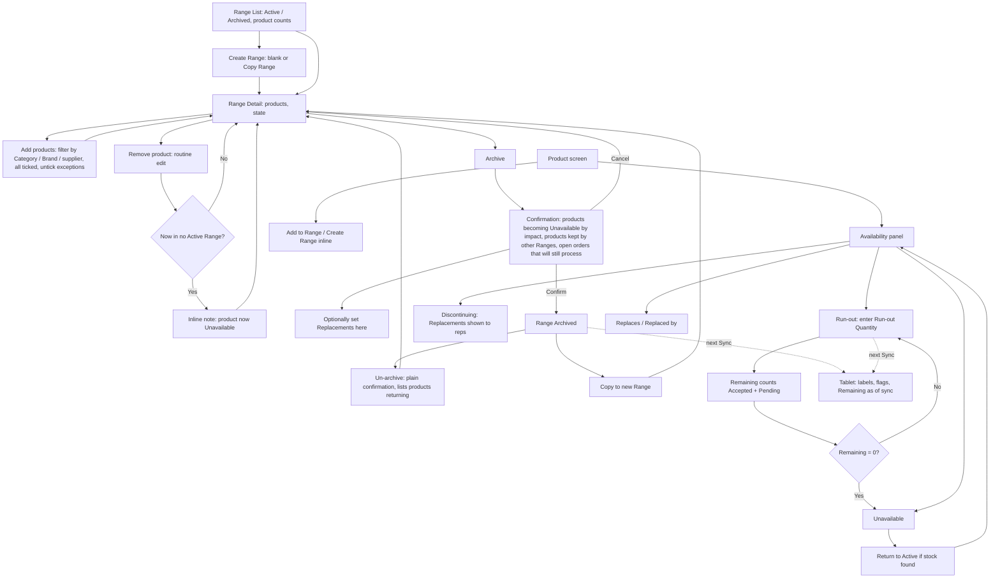

# Range Lifecycle: UX & User Stories

**Generated:** 17 September 2026 (amended 18 September 2026 for Product Management and Self-service)
**Bounded context:** Product Catalogue — Range and product availability lifecycle
**Primary user:** Head Office User (usually also a Sales Manager)
**Scope:** The website screens where head office builds Ranges, takes them off sale, runs products out, and links replacements. Six screens: Range List, Range Detail, Add Products, Create/Copy Range, Archive Confirmation, Product Availability panel.

---

## 1. Bounded Context & Scope

### Bounded context

- **Domain area:** Product Catalogue, specifically what is on sale, what is going, and what replaces it. Product creation and editing, Categories, Brands, Restriction Groups and supplier belong to the product management area.
- **Ubiquitous language:**
  - **Range** — a named commercial grouping of products (e.g. "Summer 2026"). States: **Active**, **Archived**. Assigned to reps (Order Pad) and customers (self-service).
  - **Archive** — taking a Range off sale. Its products become Unavailable only if they have no other Active Range and are not otherwise available.
  - **Un-archive** — an undo for a recent mistaken archive. Restores the Range; each product's availability is re-evaluated under the Availability Rule. Not for reusing a season.
  - **Copy Range** — creates a new Range pre-filled with another's products. The route for a returning season ("Summer 2027" from "Summer 2026").
  - **Product Availability State** — one of:
    - **Active** — orderable normally.
    - **Discontinuing** — orderable, flagged as going, Replacements shown. No stock limit yet.
    - **Run-out** — orderable while a **Run-out Quantity** lasts; flagged "limited stock, no restock, not guaranteed until confirmed by head office"; Replacements shown.
    - **Temporarily Unavailable** — not orderable now, but coming back, with an optional **Expected Back** date. Set and cleared by head office by hand, as Run-out Quantities are, and extended when the date slips. The product is otherwise unchanged: its Ranges, price and Replacements stand.
    - **Unavailable** — not orderable, gone for good. Countable in Stock Checks. Replaces area 1's "Retired".
  - **Run-out Quantity** — entered by head office when a product enters Run-out, in the product's Unit of Measure (340 units, or 340 kg).
  - **Remaining** — Run-out Quantity minus quantity on Accepted and Pending orders since the run-out began, in the same unit. A rejected or cancelled order releases its quantity. Shown to reps as an estimate as of their last Sync; the tablet says so in words only when that Sync was before today ("as of Mon 21 Sep", BR-NEW-007 in `../uxdocs/04-user-stories-amendments.md`, 24 Sep 2026). Unavailable when Remaining reaches zero.
  - **Direct Retirement** — head office moving a product to Discontinuing, Run-out or Unavailable regardless of its Ranges.
  - **Availability Rule** — a product is Unavailable if it is directly Unavailable, or if it belongs to at least one Range and every Range it belongs to is Archived, or if it is in Run-out with Remaining at zero. It is not orderable while Temporarily Unavailable. Otherwise it is orderable in its own state. Unranged products are orderable unless directly retired.
  - **Replacement** — a link from a product to one or more products that supersede it. Shown on both ends as **Replaced by** and **Replaces**. Settable at any time, including before the old product leaves Active.
  - **Impact** — for a product about to become Unavailable: Locations stocking it (last Stock Check > 0), Accepted orders in the last 30 days, open orders (In Progress, Ready to Send, Pending) containing it.
  - **Open orders go through** — lines captured while a product was orderable are processed regardless of later archive, retirement or run-out exhaustion (area 1's "valid when captured").
- **Upstream contexts:**
  - **Product management** — products, Categories, Brands, supplier, Restriction Groups.
  - **Ordering** — order states and quantities for Impact and Remaining.
  - **Sales Operations** — Stock Check counts for Impact.
- **Downstream contexts:**
  - **Rep at a Location** (area 1) — availability state, Run-out flag and Remaining, Replacements, all via the Morning Snapshot.
  - **Coverage Management** (area 5) and **Visit Planning** (area 9) — Ranges as scopes.
  - **Self-service** (area 7) — the same availability rules.
  - **Head office order review** (area 3) — orders containing products that became Unavailable after capture.
- **Terms that mean something different elsewhere:**
  - **Retired** — area 1 used it for "never orderable". Superseded by **Unavailable**; "retired directly" survives only as a verb for head office's action.
  - **Archive** — applies to Ranges only; products are retired, discontinued or run out, never archived.
  - **Stock** — here the Run-out Quantity head office enters, not a warehouse figure; the system holds no live stock.

### Scope

- **In scope:**
  - Range List with status and product counts
  - Create Range, Copy Range, Un-archive
  - Add products by filter-and-select (Category, Brand, supplier); remove as routine edit
  - Add to Range or create a Range from the product screen
  - Archive with impact confirmation
  - Product availability changes: Discontinuing, Run-out with quantity, Temporarily Unavailable with an Expected Back date, Unavailable, back to Active
  - Remaining calculation and its exposure to reps
  - Replacement links from either end, including during archive
- **Out of scope:**
  - Creating and editing products, Categories, Brands, supplier, Restriction Groups (product management area)
  - Assigning Ranges to reps or customers (areas 5, 7)
  - Warehouse stock, fulfilment, invoicing
  - Head office order acceptance (area 3)
  - Pricing
- **Assumptions:**
  - A Head Office User maintains Ranges; a Sales Manager may hold that role.
  - "Recent" for Un-archive emphasis is 30 days; both Un-archive and Copy remain available at any age.
  - Impact's order window is 30 days.
  - Supplier is a reference list on the product (Product Management).
  - A product's availability change reaches tablets at their next Sync; the tablet's own display rules are in area 1.

---

## 2. Personas

### Head Office User

- **Role:** maintains the catalogue; usually also a Sales Manager.
- **Responsibilities:** builds the season's Range, takes the old one down, decides what runs out and what is replaced, keeps reps' Order Pads accurate.
- **Context on arrival:** a season change or a new product listing; a supplier has told them a line is ending; 250+ products, some in several Ranges; reps already out with this morning's snapshot.
- **Goal:** "Get the season's Range up and the old one down without taking anything off sale by accident, and make sure reps know what replaces what and what is running out."
- **Pain points:** not knowing what an archive actually removes; a superseded product still being ordered alongside its replacement; stock written off because nobody could order it; reusing last year's Range and losing the record of what it was.

---

## 3. Flow Sketch



---

## 4. Design Decisions

### Availability follows any Active Range, not every Range

- **Chose:** a product stays orderable while any Range it belongs to is Active; it becomes Unavailable only when all its Ranges are Archived or it is retired directly.
- **Over:** the elaboration's rule that one archived Range makes its products unsellable everywhere.
- **Because:** archiving a seasonal Range should not take core products off sale; the elaboration itself flagged the old rule as a risk.
- **Trade-off accepted:** a product cannot be taken off sale by archiving one Range; that is what Direct Retirement is for.

### Archive always shows impact, never escalates

- **Chose:** one confirmation for every archive: the products becoming Unavailable ordered by impact (Locations stocking, recent orders, open orders), the products kept alive by other Ranges, and the note that open orders will still process. No type-to-confirm, no configurable threshold.
- **Over:** a friction ladder scaled by count or impact.
- **Because:** an impact threshold has no meaningful value to set; the manager with the facts makes the call; un-archive is available as undo.
- **Trade-off accepted:** a distracted manager can archive a high-impact Range with one click; the ordered list is the mitigation.

### Un-archive is undo; a season is a copy

- **Chose:** Un-archive restores a Range as it was, with a plain confirmation; Copy Range creates a new Range pre-filled for a returning season; Un-archive is emphasised on recently archived Ranges, Copy on older ones, both always available.
- **Over:** reusing archived Ranges; a hard cut-off on undo.
- **Because:** an archived Range is a closed record of what was sold under that name; editing it for a new year corrupts history.
- **Trade-off accepted:** a Range per season accumulates; the list must filter Archived by default.

### Product lifecycle with a manager-entered run-out

- **Chose:** Active → Discontinuing (orderable, flagged) → Run-out (orderable while a Run-out Quantity lasts, flagged not guaranteed) → Unavailable; Remaining counts Accepted plus Pending; exhaustion flips to Unavailable automatically; open orders still process.
- **Over:** an absolute "retired = never orderable"; live warehouse stock; head office flipping by hand; counting Accepted only.
- **Because:** unsold stock is worth selling; the system holds no warehouse stock; Pending counts reduce overselling; the tablet works from a morning snapshot so Remaining can only ever be an estimate.
- **Trade-off accepted:** offline reps can oversell; the flag wording must make reps tell customers it is not guaranteed; head office may reject over-quantity lines in area 3.

### Temporarily Unavailable is separate from Unavailable

- **Chose:** a fifth state for stock that is out but coming back, with an optional Expected Back date entered by head office and extendable when it slips; the product keeps its Ranges, price and Replacements.
- **Over:** one Unavailable state covering both cases.
- **Because:** "back around 25 October" tells the customer to wait and "no longer available" tells them to buy something else — collapsing them loses a sale either way; the system holds no warehouse stock, so a person enters it exactly as they enter a Run-out Quantity.
- **Trade-off accepted:** another state to maintain; a date that slips must be extended by hand, as with a Location's temporary closure.

### Replacements from either end, any time

- **Chose:** a link set on either product shows on both as Replaces / Replaced by; settable on the product record at any time and offered on the archive confirmation; not required.
- **Over:** links only during archive; one-directional display.
- **Because:** a new product often arrives before the old one goes; a seasonal Range often has no replacement; a link visible from one end only looks missing from the other.
- **Trade-off accepted:** links can be set for products still Active, so the tablet must show them only from Discontinuing onward (area 1).

### Three routes into a Range; removal is routine

- **Chose:** filter-and-select, Copy Range, and add-to-Range or create-Range inline from the product screen; removing a product is an edit with an inline note if it becomes Unavailable.
- **Over:** one product at a time; a confirmation on removal.
- **Because:** Ranges are built in bulk; the moment of creating a product is when it gets forgotten; removal is single, deliberate and reversible.
- **Trade-off accepted:** a removal can make a product Unavailable with no prompt; the inline note is the only signal.

---

## 5. User Stories

### US-001: Create a Range and fill it by filter-and-select

| Field | Value |
|---|---|
| **Story** | As a Head Office User, I want to create a Range and add products by filtering on Category, Brand or supplier, unticking exceptions, so that a 200-product season is set up in minutes |
| **Priority** | Must Have |
| **Status** | Ready |
| **Dependencies** | Brands and supplier (Product Management US-004); archived Brands, suppliers and Categories are not offered as filters |

**Acceptance criteria:**

*Scenario 1: Filter and add*
```
When I create "Summer 2027" and filter Category "Suncare"
Then 64 products are listed, all ticked
And when I untick 4 and add
Then "Summer 2027" has 60 products and is Active
```

*Scenario 2: Already in the Range*
```
Given 10 of the filtered products are already in the Range
Then they are shown as "Already in range" and not double-added
```

*Scenario 3: Unavailable products in the filter*
```
Given 2 filtered products are Unavailable
Then they are shown with their state and unticked by default
```

*Scenario 4: Duplicate name*
```
When I create a Range named "Summer 2026" which exists
Then I see "A range with this name already exists"
```

*Scenario 5: Empty filter*
```
When the filter matches 0 products
Then I see "No products match" and nothing is added
```

---

### US-002: Copy a Range

| Field | Value |
|---|---|
| **Story** | As a Head Office User, I want to create a new Range pre-filled from an existing one so that a returning season starts from last year's list without reopening last year's Range |
| **Priority** | Should Have |
| **Status** | Ready |
| **Dependencies** | US-001 |

**Acceptance criteria:**

*Scenario 1: Copy an archived Range*
```
Given "Summer 2026" is Archived with 58 products
When I choose Copy and name it "Summer 2027"
Then "Summer 2027" is created Active with the 58 products and "Summer 2026" is unchanged
```

*Scenario 2: Unavailable products flagged*
```
Given 6 of the 58 are Unavailable
Then the new Range's product list shows them with their state so I can remove them
```

*Scenario 3: Copy an active Range*
```
When I copy an Active Range
Then the copy is created the same way; both stay Active
```

---

### US-003: Add a product to a Range from the product screen

| Field | Value |
|---|---|
| **Story** | As a Head Office User, I want to add a product to Ranges, or create a Range, while creating or editing the product so that new products aren't left out of a Range by accident |
| **Priority** | Should Have |
| **Status** | Ready |
| **Dependencies** | Product screen (product management) |

**Acceptance criteria:**

*Scenario 1: Add to existing Ranges*
```
When I create "SPF30 Sun Lotion v2 200ml" and tick Ranges "Summer 2027" and "Core Stock"
Then the product belongs to both on save
```

*Scenario 2: Create a Range inline*
```
When I choose Create range, enter "Autumn 2027" and save the product
Then "Autumn 2027" exists, Active, containing this product
```

*Scenario 3: No Range chosen*
```
When I save without any Range
Then the product is unranged and orderable by everyone, and the screen says so
```

---

### US-004: Remove a product from a Range

| Field | Value |
|---|---|
| **Story** | As a Head Office User, I want to remove a product from a Range as a simple edit, with a note if that leaves it unavailable, so that small corrections don't need a ceremony |
| **Priority** | Must Have |
| **Status** | Ready |
| **Dependencies** | US-001 |

**Acceptance criteria:**

*Scenario 1: Still available elsewhere*
```
Given "SPF30 Sun Lotion 200ml" is in "Summer 2026" and "Core Stock"
When I remove it from "Summer 2026"
Then it is removed with no confirmation and remains orderable via Core Stock
```

*Scenario 2: Now in no Active Range*
```
Given "Kids SPF50 Spray 150ml" is only in "Summer 2026"
When I remove it
Then it is removed and an inline note reads "Kids SPF50 Spray 150ml is now in no active range and is Unavailable"
```

*Scenario 3: Undo the removal*
```
When I add it back
Then it is orderable again
```

---

### US-005: Archive a Range with impact shown

| Field | Value |
|---|---|
| **Story** | As a Head Office User, I want the archive confirmation to show exactly what will become unavailable, ordered by how much it matters, and what stays on sale so that I take a season down without surprises |
| **Priority** | Must Have |
| **Status** | Ready |
| **Dependencies** | US-001; order and Stock Check data |

**Acceptance criteria:**

*Scenario 1: Mixed impact*
```
Given "Summer 2026" has 58 products, 38 only in this Range and 20 also in "Core Stock"
When I choose Archive
Then I see "38 products become Unavailable · 20 stay on sale via other ranges · 3 open orders contain these products and will still be processed"
And the 38 are listed highest impact first, e.g. "SPF30 Sun Lotion 200ml — stocked in 87 locations, 14 orders in 30 days, 2 open orders"
And each count expands to its products
```

*Scenario 2: Nothing becomes unavailable*
```
Given every product in the Range is also in an Active Range
When I choose Archive
Then I see "No products become Unavailable" and a plain Confirm
```

*Scenario 3: Set Replacements during archive*
```
When I open "SPF30 Sun Lotion 200ml" in the list and set Replaced by "SPF30 Sun Lotion v2 200ml"
Then the link is saved whether or not I complete the archive
```

*Scenario 4: Confirm*
```
When I confirm
Then "Summer 2026" is Archived, the 38 are Unavailable, the 20 unchanged
And reps see the change at their next Sync
```

*Scenario 5: Directly retired product in the Range*
```
Given one product was already Unavailable by Direct Retirement
Then it is listed under "Already unavailable" and not counted in the 38
```

---

### US-006: Un-archive a Range

| Field | Value |
|---|---|
| **Story** | As a Head Office User, I want to undo a mistaken archive quickly so that a wrong click doesn't take a season off sale for a day |
| **Priority** | Should Have |
| **Status** | Ready |
| **Dependencies** | US-005 |

**Acceptance criteria:**

*Scenario 1: Recent undo*
```
Given "Summer 2026" was Archived 2 hours ago
When I open it
Then Un-archive is the emphasised action and Copy to new Range is secondary
And when I confirm "Un-archive — 38 products return to sale"
Then the Range is Active and those 38 are orderable
```

*Scenario 2: Directly retired product stays retired*
```
Given one of the 38 had also been retired directly
Then it remains Unavailable and the confirmation says "1 product stays Unavailable (retired directly)"
```

*Scenario 3: Old archive*
```
Given a Range was Archived 14 months ago
When I open it
Then Copy to new Range is emphasised, Un-archive secondary with "Archived 14 months ago — copy instead?"
```

*Scenario 4: Rep and customer assignments restored*
```
When a Range is un-archived
Then reps and customers who held it see its products on their Order Pads again at next Sync
```

**Open questions:** whether Range assignments to reps/customers persist through archive (assumed yes).

---

### US-007: Mark a product Discontinuing

| Field | Value |
|---|---|
| **Story** | As a Head Office User, I want to flag a product as going, with its replacement, while it is still orderable so that reps run stock down and pitch the new line in advance |
| **Priority** | Should Have |
| **Status** | Ready |
| **Dependencies** | US-010 |

**Acceptance criteria:**

*Scenario 1: Set Discontinuing*
```
Given "SPF30 Sun Lotion 200ml" is Active with Replaced by "SPF30 Sun Lotion v2 200ml"
When I set it Discontinuing
Then it remains orderable and reps' Order Pads show "Discontinuing — replaced by SPF30 Sun Lotion v2 200ml" at next Sync
```

*Scenario 2: No Replacement yet*
```
When I set Discontinuing on a product with no Replacement
Then it is accepted and reps see "Discontinuing" with no replacement named
```

*Scenario 3: Back to Active*
```
When I return it to Active
Then the flag is removed at next Sync
```

---

### US-008: Put a product into Run-out with a quantity

| Field | Value |
|---|---|
| **Story** | As a Head Office User, I want to enter the quantity left for a product with no restock so that reps can sell it while it lasts and it stops being orderable when it's gone |
| **Priority** | Must Have |
| **Status** | Ready |
| **Dependencies** | Ordering states (Pending/Accepted) |

**Acceptance criteria:**

*Scenario 1: Enter run-out*
```
When I set "Kids SPF50 Spray 150ml" to Run-out with quantity 340
Then the quantity is shown as "340 units" (or "340 kg" for a measure-based product)
And Remaining is 340 and reps see "Limited stock, no restock — not guaranteed until confirmed by head office. About 340 left as of [sync time]"
```

*Scenario 2: Remaining counts Accepted and Pending*
```
Given orders totalling 120 Accepted and 60 Pending contain it since run-out began
Then Remaining is 160
```

*Scenario 3: Rejection releases*
```
When a Pending order with 20 units is Rejected
Then Remaining is 180
```

*Scenario 4: Exhausted*
```
When Accepted plus Pending reaches 340
Then the product becomes Unavailable and disappears from Order Pads at next Sync
```

*Scenario 5: Oversold offline*
```
Given Remaining is 30 at 07:42
And two reps each capture 25 offline that day
When both Sync
Then both lines are sent (valid when captured) and Remaining shows -20 for head office to resolve in order review
```

*Scenario 6: Adjust quantity*
```
When I change the Run-out Quantity to 400
Then Remaining is recalculated from the same orders
```

---

### US-008b: Mark a product Temporarily Unavailable

| Field | Value |
|---|---|
| **Story** | As a Head Office User, I want to mark a product as out of stock but coming back, with the date I expect it, so that reps and customers wait for it instead of buying elsewhere |
| **Priority** | Must Have |
| **Status** | Ready |
| **Dependencies** | None |

**Acceptance criteria:**

*Scenario 1: Set with a date*
```
When I set "SPF30 Sun Lotion 200ml" Temporarily Unavailable, Expected Back 25 October 2026
Then it cannot be ordered
And customers see "Back in stock around 25 October"; reps see the same with their sync time
```

*Scenario 2: No date known*
```
When I set it Temporarily Unavailable with no date
Then it shows "Temporarily out of stock" with no date
```

*Scenario 3: Date slips*
```
When the stock does not arrive and I change the date to 8 November 2026
Then the new date is shown; no separate escalation
```

*Scenario 4: Back in stock*
```
When I return it to Active
Then it is orderable again at its normal price, in its existing Ranges
```

*Scenario 5: Not the same as Unavailable*
```
Then it is not listed among products made Unavailable by an archive, and its Replacements are shown as helpful alternatives rather than successors
```

*Scenario 6: Open orders*
```
Given lines captured before it went out of stock
Then those lines still process, as with any availability change
```

---

### US-009: Retire a product directly

| Field | Value |
|---|---|
| **Story** | As a Head Office User, I want to make a single product unavailable regardless of its Ranges, seeing its impact first, so that a superseded line stops being ordered without archiving anything |
| **Priority** | Must Have |
| **Status** | Ready |
| **Dependencies** | US-005 impact data |

**Acceptance criteria:**

*Scenario 1: Retire with impact*
```
Given "SPF30 Sun Lotion 200ml" is Active in "Core Stock"
When I set it Unavailable
Then I see "Stocked in 87 locations · 14 orders in 30 days · 2 open orders will still be processed" and can set Replaced by
And on confirm it is Unavailable while Core Stock stays Active
```

*Scenario 2: Un-archive does not revive it*
```
Given it was also in an Archived Range that is later un-archived
Then it stays Unavailable
```

*Scenario 3: Reinstate*
```
When I return it to Active
Then it is orderable again via its Active Ranges
```

---

### US-010: Link Replacements from either end

| Field | Value |
|---|---|
| **Story** | As a Head Office User, I want to record that one product replaces another from whichever product I'm looking at, and see it on both, so that reps are always shown the right successor |
| **Priority** | Must Have |
| **Status** | Ready |
| **Dependencies** | Product screen |

**Acceptance criteria:**

*Scenario 1: Set from the new product*
```
When on "SPF30 Sun Lotion v2 200ml" I set Replaces "SPF30 Sun Lotion 200ml"
Then the old product shows Replaced by "SPF30 Sun Lotion v2 200ml"
```

*Scenario 2: Several replacements*
```
When on "Kids SPF50 Spray 150ml" I set Replaced by "v2 100ml" and "v2 250ml"
Then both new products show Replaces "Kids SPF50 Spray 150ml"
```

*Scenario 3: Before retirement*
```
Given both products are Active
Then the link is saved and reps see nothing until the old product leaves Active
```

*Scenario 4: Replacement itself unavailable*
```
Given "v2 100ml" later becomes Unavailable with its own Replaced by "v3 100ml"
Then the old product still shows Replaced by "v2 100ml (Unavailable — replaced by v3 100ml)"
```

*Scenario 5: Self-link*
```
When I try to set a product as its own Replacement
Then it is rejected
```

---

### US-011: Browse Ranges by status

| Field | Value |
|---|---|
| **Story** | As a Head Office User, I want the Range list to show Active Ranges by default with counts of available and unavailable products so that I see the live catalogue without last year's clutter |
| **Priority** | Should Have |
| **Status** | Ready |
| **Dependencies** | US-001 |

**Acceptance criteria:**

*Scenario 1: Default view*
```
When I open Ranges
Then I see Active Ranges with "58 products · 6 unavailable" per row, and an Archived filter
```

*Scenario 2: Archived view*
```
When I filter Archived
Then I see archived Ranges with archive date and the number of products still Unavailable because of them
```

*Scenario 3: Empty Range*
```
Given an Active Range with 0 products
Then its row shows "0 products — not visible to reps"
```

---

## 6. Requires Clarification

1. **Supplier and Brand (resolved):** defined in Product Management; US-001 is Ready.
2. **Range assignments through archive:** do rep and customer assignments persist so un-archive restores them (assumed yes)?
3. **Impact window:** 30 days assumed for recent orders.
3b. **Temporarily Unavailable:** confirm whether an Expected Back date that passes should prompt head office, or stay silent until they update it (assumed silent).
4. **Area 1 amendments (applied):** Unavailable with its two causes, Discontinuing and Run-out flags, Replacements from Discontinuing onward, Remaining in the snapshot.
5. **Area 3:** oversold run-out lines and orders for products made Unavailable after capture need an explicit head office rule.
6. **Elaboration:** US-02, US-05 and US-18 acceptance criteria need rewriting for the any-Active-Range rule and the product lifecycle.

---

## 7. Recommended Next Steps

1. Spike Remaining calculation against Pending/Accepted transitions and rejection releases before US-008.
2. Carry item 5 (oversold and post-capture Unavailable lines) into area 3.
3. Rewrite the elaboration's US-02, US-05 and US-18 (item 6).
