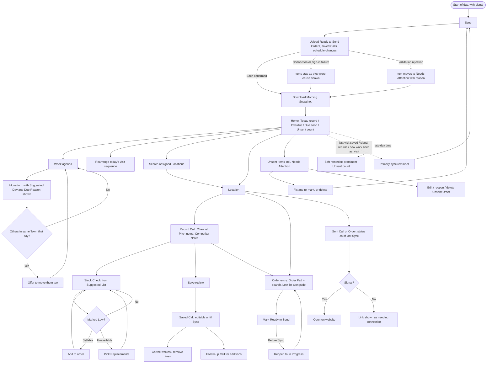

# Rep at a Location (Tablet): UX & User Stories

**Generated:** 16 September 2026 (amended 17–19 September 2026 for Visit Planning, Coverage Management, Range Lifecycle, Product Management, Master & Branch Ordering, Head Office Order Processing, Targets, Pricing, Promotions, Prospecting and Self-service; amended 23 September 2026 from the UX design sessions — see `../uxdocs/04-user-stories-amendments.md`)
**Bounded context:** Sales Operations (field visit), with Ordering at its edge
**Primary user:** Field Salesperson
**Scope:** The tablet app a Field Salesperson uses to sync, find and schedule visits, record Calls and Stock Checks, and build Orders offline. Six screens: Sync & Unsent Items, Home (with week agenda), Location, Call & Stock Check, Order Entry, and Sent Item view.

---

## 1. Bounded Context & Scope

### Bounded context

- **Domain area:** Sales Operations, specifically the field visit. Orders are drafted here and belong to Ordering once Sent.
- **Ubiquitous language:**
  - **Call** — a recorded contact between a Field Salesperson and a Location. Has a **Call Channel** (*In person* or *Phone*) and one or both **Call Purposes** (*Pitch* with notes, *Stock Check*). May have Competitor Notes and an Order attached, or neither.
  - **Correction** — changing a value already in a saved Call (a count, the Channel, a Low mark, note text) or removing a line. Allowed until Sync on the tablet; after Sync, on the website.
  - **Follow-up Call** — a new Call linked to an earlier one at the same Location, recording anything *added* after the original was saved (a forgotten pitch, an unchecked product, a new Competitor Note).
  - **Competitor Note** — free-text entry on a Call about competitor products seen at the Location. A Call may have several. Each has one **link type**: *None*, *Products* (one or more), *Range* (one), or *Category* (one).
  - **Stock Check** — per-product counts captured during a Call. Starts from a **Suggested List**: products on the last Stock Check at that Location (counted or Not checked) plus products on its last 3 Accepted Orders.
  - **Not checked** — a Suggested List line saved without a count. Stays on the next visit's Suggested List.
  - **Low** — a mark the rep sets on a counted line meaning "reorder this". Always the rep's judgement.
  - **Low Stock Hint** — text shown when a count is at or below the **Low Stock Threshold** for that product resolved from the Location's **Location Profiles** (groupings such as "Large pharmacy" that may also carry Visit Frequency and Visit Duration defaults; see Visit Planning). *Amended 23 Sep 2026:* a Location may hold several profiles; the highest threshold wins, so the hint appears earliest. Never pre-ticks Low.
  - **Low tab** — (added 23 Sep 2026) a tab in Order entry beside Order pad and Search all, listing every item marked Low on this visit with exactly one state: not added, ADDED (with quantity), REMOVED, REPLACED (naming the replacement), or CAN'T ADD (with the reason). Its count shows only not added and CAN'T ADD. A catch-up list: most Low items are added at tick-time through the quantity popover.
  - **Not supplied** — (added 23 Sep 2026) a line removed automatically at processing because the product became unavailable. Counted on Home's exception strip and shown on the sent item with "Let the customer know."
  - **Order** — a request for products and quantities for a Location, dated the day it was taken. Tablet states:
    - **In Progress** — being built; survives any number of Syncs.
    - **Ready to Send** — finished by the rep; uploads at next Sync. Can be reopened to In Progress before Sync.
    - **Sent** — uploaded and confirmed; read-only on the tablet. Its later lifecycle (Pending, Accepted, Rejected, Cancelled) belongs to Ordering.
    - **Needs Attention** — rejected by the server for a validation reason; the rep must fix and re-mark, or delete.
    - **Unsent** — umbrella for In Progress, Ready to Send and Needs Attention; what reminders and counts refer to.
  - **Order Pad** — the opening view of Order entry: products in the rep's assigned Ranges plus unranged products. Search reaches beyond it.
  - **Sellability** — a product can be ordered unless it is **Unavailable** or hidden as **Restricted**. Range assignment is a guide, not a limit.
  - **Outside your ranges** — neutral marker on a product not in the rep's assigned Ranges. Does not disable anything.
  - **"As of sync" wording** — *(amended 24 Sep 2026, BR-NEW-007 in `../uxdocs/04-user-stories-amendments.md`)* shown only when the last Sync was before today, and then as the date ("as of Mon 21 Sep"). The "as of 07:42 sync" wording quoted in scenarios below applies only on such days, with the date in place of the time.
  - **Availability State** — set in the Product Catalogue; the tablet shows it as of the last Sync:
    - **Active** — orderable normally.
    - **Discontinuing** — orderable, flagged "Discontinuing" with its Replacements.
    - **Run-out** — orderable, flagged "Limited stock, no restock — not guaranteed until confirmed by head office. About N left as of HH:MM sync", with Replacements. **Remaining** is head office's estimate and is never treated as a promise.
    - **Temporarily Unavailable** — not orderable now but coming back, shown as "Back in stock around 25 Oct (as of 07:42 sync)" where head office has given a date.
    - **Unavailable** — not orderable, gone. Countable in Stock Checks. Reason shown as "no longer in an active range" or "retired". Replaces the earlier term *Retired*.
  - **Unit of Measure** — *Each* (whole quantities of 1 or more) or a measure (kg, litre, metre) with a **Quantity Step** and **Minimum**; quantities are multiples of the step and always shown with the unit.
  - **Resolved Price** — the price for this customer at this quantity, worked out on the tablet from the snapshot: Base Price, every **Price Tier** the Customer holds, any **Quantity Break**, and any live **Promotion**, with the lowest winning (**Best Price Wins**). The line shows the winner and its source, the runner-up tier price where there is one, and the full candidate list on demand.
  - **Break Prompt** — a line-level message relative to what is already ordered ("2 more for €2.00 each — save €4.00 on 10").
  - **Offer Summary** — an order-level statement of which promotions applied and what they saved, what is within reach, and any offer lost because the order changed.
  - **Price Override** — a rep-entered price **below** the resolved price, with a reason. *Amended 23 Sep 2026:* **applied** within the rep's discount allowance (the button says Apply), never sent for approval; the sheet shows the lowest price the rep can offer before they type, and explains a block in a sentence the rep can give the customer (Pricing).
  - **Free of Charge line** — *Amended 23 Sep 2026:* only for **Discontinuing** products, within the rep's monthly FOC allowance, applied without approval. An ordinary line at €0.00: stock, availability, allocation, despatch and removal behave as for any line.
  - **Capturing Rep** — recorded on every Order the rep takes, distinct from the Location the Order counts at.
  - **Sent to customer** — what the warehouse has despatched against an Accepted Order, shown per line as "24 sent 12 Oct · 12 outstanding". Distinct from the tablet's own **Sent**, which means uploaded to head office.
  - **Breadcrumb** — a product's full category path ("Health > Skincare > Suncare > Lotions"), shown in search and browsing; the tree can be 5–6 levels deep and products may sit on branch categories.
  - **Restricted Product** — a product in a **Restriction Group**. Hidden entirely from reps without the matching **Restriction Permission** (granted per group by their manager or head office), everywhere on the tablet and excluded from their Morning Snapshot.
  - **Replacement** — an ordinary product linked from another as its successor. A product may have several direct Replacements. A Replacement that is itself Unavailable shows its own Replacements. Replacements are shown to reps only once the old product is Discontinuing, Run-out or Unavailable.
  - **Sync** — a deliberate action: upload all Ready to Send Orders, saved Calls and schedule changes first, then download the **Morning Snapshot** the tablet works from offline. Always downloads, even if some uploads fail.
  - **Valid when captured** — an item is judged against the snapshot it was built from. A later availability change, run-out exhaustion, reassignment of a Location or removal of a Restriction Permission does not block sending.
  - **Visit Due** — a Location the manager has asked the rep to visit within a **Due Window**, optionally with a **Due Reason** ("Autumn range order deadline") and a **Suggested Day**. The rep sets its **Scheduled Day**. A Call there within the window completes it; it becomes **Overdue** if the window ends without one. **Due soon** = no Scheduled Day and due within 14 days.
  - **Visit Campaign** — a manager-created group of One-off Visit Dues with a purpose ("Autumn range launch") and an **Outcome List**. Defined in Visit Planning.
  - **Campaign Outcome** — one entry from an open campaign's Outcome List, recorded on a Call. A completing outcome completes that campaign Visit Due; a non-completing one (e.g. *Follow up*) records it and leaves it open. One per campaign per Call.
  - **Cover** — a Visit Due temporarily held by this rep for another rep's Location. The Location appears in the snapshot for the window only.
  - **Left Visit** — a visit the manager left with this rep after the Location was reassigned to someone else. The Location stays in the snapshot, marked "Handover — finish visit", until the visit completes, is Missed or is moved.
  - **Lead** — a note about somewhere nobody has visited yet, captured in seconds and offline; it is not a Location. Visiting one creates a **Prospect** and closes the Lead against it.
  - **Prospect** — a Location the rep created by calling on a place that is not a Customer, carrying identity, what they sell, and a **Susceptibility** rating (High / Medium / Low) with notes. Saved as a draft and completed after the visit.
  - **Schedule Conflict** — a notice that a manager's change (cover, cancel, window moved) has overtaken this rep's offline day change. Shows both versions; clears when either amends the visit.
  - **Visit sequence** — the order of stops within a day. Defaults to grouping by Town; the rep can rearrange. (The word "order" is reserved for the customer's Order.)
- **Upstream contexts:**
  - **Product Catalogue** — products with breadcrumbs, Attributes, Unit of Measure and Base Price; Ranges; Availability State with Remaining; Restriction Groups; Replacement links; Low Stock Thresholds by Location Profile.
  - **Customer Directory** — assigned Locations with Town, address, Main Contact and Location Profile.
  - **Visit Planning** (area 9) — Visit Due entries with Due Window, Due Reason and Suggested Day; open Visit Campaigns with Outcome Lists; covered Locations for their window; Schedule Conflict notices; the count of cycle decisions waiting.
  - **Pricing and Promotions** — Price Tiers the Customer holds, Quantity Breaks, live promotions with their whole-day periods.
  - **Master & Branch Ordering** — a master's branches, its Agreed Range, and open Range Proposals.
  - **Ordering** — latest known status of Sent Orders and last 3 Accepted Orders per Location.
- **Downstream contexts:**
  - **Ordering** — receives Sent Orders (arriving as Pending).
  - **Sales Operations** records — receive Calls, Stock Check entries, Competitor Notes, Campaign Outcomes.
  - **Visit Planning** — receives Scheduled Day and visit sequence changes.
- **Terms that mean something different elsewhere:**
  - **Call** — everyday meaning is a phone call; here it is any recorded sales contact.
  - **Order** — in fulfilment, what is picked and shipped; here, what the rep captured. Never used to mean sequence.
  - **Complete** — avoided; a Call *completes* a Visit Due, an Order is *Ready to Send*.
  - **Cart** — reserved for self-service (area 7).
  - **Range vs Category** — Range is a commercial grouping that can be archived; Category is the permanent product-type tree.

### Scope

- **In scope:**
  - Sync (upload first, always download), failure causes, Needs Attention handling
  - Sync reminders (primary and soft)
  - Home: today as a record of the day, Overdue, Due soon, Due Reason markers, Unsent count, cycle-decision and conflict counts, search across assigned Locations, visit sequence
  - Week agenda with single-visit "Move to…" and same-Town prompt
  - Location view
  - Recording a Call: Channel, Pitch notes, Stock Check from Suggested List, Low marks, Competitor Notes, Campaign Outcomes, save review
  - Corrections to saved Calls before Sync; Follow-up Calls
  - Unavailable, Discontinuing and Run-out products, Replacement flags and picker
  - Order entry: Order Pad with resolved prices, search beyond ranges, Ready to Send, reopen, edit, delete
  - Price display, Break Prompts and the Offer Summary; Price Overrides and Free of Charge lines
  - Lead capture and My Leads; creating and completing Prospects; Calls and Orders at a Prospect
  - Range Review calls and Multi-Branch Orders at a Master Location
  - Read-only Sent Calls and Orders with "as of" status and "Open on website" link
  - Restricted Product hiding
- **Out of scope:**
  - Week-level planning, manager creation of Visit Dues, campaigns, cover and absences, the Cycle End Digest (area 9)
  - Correcting synced Calls or editing Pending Orders on the website (reached via link)
  - Cold calls, Prospects, Leads (area 2)
  - Head office review, including orders with products made Unavailable after capture, oversold run-out lines, or outside the rep's ranges (area 3)
  - Maintaining Replacement links, availability, Location Profiles, Low Stock Thresholds, Restriction Groups and permissions, range archiving (Range Lifecycle, Product Management, Coverage Management)
  - Self-service ordering (area 7); maps on the tablet
  - Setting up tiers, breaks and promotions (Pricing, Promotions); target setting and performance views (Targets & Performance, website only)
  - Head office decisions on overrides, free goods, duplicates and proposals
- **Assumptions:**
  - The rep is signed in with assignments, Ranges and permissions already in place; one tablet per rep.
  - Offline storage is reliable; Unsent work survives app restart.
  - Each item records the snapshot it was captured against, so the server can apply "valid when captured".
  - The server confirms each uploaded item individually.
  - "Last 3 Accepted Orders" and "14 days" are system settings.
  - A product may carry a Replacement link while still Active; the tablet shows it only from Discontinuing onward.
  - Website sign-in on link-out is handled by the web platform.
  - Price resolution runs entirely on the tablet from the snapshot; no pricing call is made at order time.
  - A rep's own target progress is not shown on the tablet (website only).

---

## 2. Personas

### Field Salesperson

- **Role:** Salesperson assigned Locations and/or Territories, plus Ranges and possibly Restricted-product permission.
- **Responsibilities:** visits or phones customer Locations; pitches; counts stock; notes competitor activity; takes Orders; keeps up with the Visit List.
- **Context on arrival:** often standing in a shop, sometimes with no signal; tablet in one hand; synced that morning; knows the customer but not everything they stock; 250+ products in play.
- **Goal:** "Get through the visit — log what I did, count what matters, note what the competition is doing, take the order — without losing anything, then get it to head office."
- **Pain points:** unreliable signal; remembering what to check; not knowing if an order went through; a closed shop forcing a reshuffle of nearby visits; forgetting to mention a product until after leaving.

---

## 3. Flow Sketch



---

## 4. Design Decisions

### Deliberate Sync that always downloads

- **Chose:** one manual Sync; upload first, then download regardless of upload outcome; failures reported by cause (connection, sign-in, validation) with the action each needs.
- **Over:** background sending; withholding the snapshot until every upload succeeds.
- **Because:** the rep reviews work before it leaves; upload-first can never overwrite unsent work; a stalled upload shouldn't leave the rep on yesterday's data; "Sync failed" without a cause gives the rep nothing to act on.
- **Trade-off accepted:** head office sees work later; unsent work exists on one device; Unsent items may reference data the new snapshot has changed (handled contextually, below).

### Valid when captured

- **Chose:** an item is accepted against the snapshot it was built from. Products made Unavailable, run-out exhausted, Locations reassigned or permissions removed afterwards do not block sending; the tablet marks them informationally ("Unavailable since you added it — will still be sent"). New additions follow the new snapshot.
- **Over:** rejecting or flagging such items as conflicts.
- **Because:** the rep and customer agreed the order in good faith; availability changes are known in advance so the case is rare; head office resolves it in area 3.
- **Trade-off accepted:** each item must carry its snapshot reference; head office occasionally sees orders for unavailable or oversold stock.

### Contextual, not interruptive, feedback

- **Chose:** Sync results report only Sync outcomes (sent, failed with cause, Needs Attention). Data changes surface where the rep works: on the order line, in search, on the Stock Check, on the Location.
- **Over:** a conflict list after every Sync.
- **Because:** these changes block nothing, so an interruption is noise; a note beside the thing it concerns is noticed when it matters.
- **Trade-off accepted:** a rep who never reopens an affected order won't see the note before it sends.

### Three Unsent states and read-only after Sync, for Calls and Orders alike

- **Chose:** Orders move In Progress → Ready to Send → Sent, with reopen allowed before Sync; Calls are saved once, corrections allowed until Sync, additions via Follow-up Call; after Sync both are read-only with "Open on website" and an "as of HH:MM sync" status.
- **Over:** every saved order uploading; Calls fully editable; Pending Orders editable offline.
- **Because:** a half-agreed order shouldn't send by accident; a Call is a record of what happened, so additions belong to a new Call; offline edits to synced items would silently lose to head office actions.
- **Trade-off accepted:** one "Mark ready" tap per order; a finished order left In Progress sits unsent (reminders name In Progress orders); pitch-note text relies on the rep to distinguish a typo fix from a forgotten pitch.

### Corrections constrained by the interface

- **Chose:** Edit Call lets the rep change values and remove lines, and offers "Record a follow-up call" where "Add" would be.
- **Over:** a rule the rep has to remember.
- **Because:** constraints prevent the error rather than reporting it.
- **Trade-off accepted:** a rep who wants to add one forgotten count creates a second Call.

### Suggested List, Not checked, and Low as the rep's judgement

- **Chose:** Stock Check opens on last Stock Check lines (counted or Not checked) plus last 3 Accepted Orders, labelled by source; uncounted lines save as Not checked; any product is countable with Unavailable / Outside your ranges labels; the Low Stock Hint (threshold per Location Profile) is text only, never pre-ticked; marking Low offers "Add to order"; Order entry opens empty with Low lines alongside.
- **Over:** blank search; time-window suggestions; dropping uncounted lines; system-decided Low; auto-filled orders.
- **Because:** recognition over recall; per-Location order history beats a fixed window; Not checked preserves history and reads as a gap; automation bias makes pre-ticked hints into decisions nobody made.
- **Trade-off accepted:** larger snapshot; the most recent not-yet-Accepted order doesn't feed the list; thresholds need master-data upkeep.

### Ranges guide; Unavailable and Restricted limit

- **Chose:** the Order Pad shows the rep's Ranges plus unranged products; search reaches any non-Restricted product and it can be added; Unavailable products are countable and never orderable, shown with reason and Replacements; Discontinuing and Run-out products stay orderable with their flags, and Run-out shows Remaining as an estimate as of sync with wording that tells the rep to warn the customer; Restricted products are hidden everywhere and excluded from the snapshot.
- **Over:** range assignment as a hard limit (the elaboration's assumption); hiding unavailable products; showing restricted products as unavailable; treating Remaining as a guarantee.
- **Because:** the business treats ranges as a guide; old stock on shelves is useful to know, and unsold run-out stock is worth selling; legally restricted products shouldn't sit on a device that hides them.
- **Trade-off accepted:** search results include products outside the rep's ranges; elaboration stories US-02, US-05 and US-11 and area 3/7 assumptions need revisiting.

### Replacements as ordinary products

- **Chose:** a product shows only its direct Replacements; an Unavailable Replacement shows its own; the picker on an Unavailable Low line lists direct Replacements, Unavailable ones unselectable with their own link. Status never conveyed by colour alone.
- **Over:** chain-following to current products; an add action on the flag.
- **Because:** one rule, no special product kind; progressive disclosure keeps counts readable.
- **Trade-off accepted:** a two-step chain takes two taps.

### Rep owns scheduling; reminders follow the rep's day

- **Chose:** rep sets Scheduled Day with Suggested Day shown beside the picker; tablet handles single moves plus same-Town prompt; moving past the due date warns and allows, more strongly when a Due Reason exists; visit sequence defaults to Town grouping, rep-adjustable with Move up/down as a non-drag alternative. Primary reminders fire after the last Scheduled Visit's Call, on signal return, and on new work after the last visit (once per hour max); a soft late-day reminder is a more prominent Unsent count, not a notification.
- **Over:** manager-fixed schedule; full planning on tablet; blocking overdue moves; fixed reminder time.
- **Because:** proportional friction; small screens suit one change at a time; too many reminders become noise.
- **Trade-off accepted:** big reshuffles need the laptop; Town grouping misses neighbours across a boundary; a rep with no visits and no late-day glance may miss the soft reminder.

### Competitor Notes: free text with one link type

- **Chose:** several free-text notes per Call, each linking to None, Products (multi), one Range or one Category; picker lists this Call's counted products first; switching link type asks before clearing picks; archived Ranges stay on old notes with their label but aren't offered for new ones.
- **Over:** structured competitor fields; mixed link types on one note.
- **Because:** fast to capture; linking gives head office reporting by our product, Range or Category; one type per note keeps it readable.
- **Trade-off accepted:** no reliable reporting by competitor; reporting completeness depends on reps linking.

---

## 5. User Stories

### US-001: Sync my tablet

| Field | Value |
|---|---|
| **Story** | As a Field Salesperson, I want one Sync that sends my finished work and then refreshes my data so that head office gets my Calls and Orders and I work from current Locations and products |
| **Priority** | Must Have |
| **Status** | Ready |
| **Dependencies** | None |

**Acceptance criteria:**

*Scenario 1: Upload then download*
```
Given my tablet has signal
And I have 2 saved Calls, 1 Ready to Send Order and 1 In Progress Order
When I tap Sync
Then the 2 Calls and the Ready to Send Order upload and each is marked Sent as the server confirms it
And the In Progress Order stays on the tablet unchanged
And the Morning Snapshot is downloaded
And Home shows "Last synced 07:42"
```

*Scenario 2: Connection lost mid-upload*
```
Given I have 3 items to upload
When signal drops after the server confirms 1
Then that item is Sent, the other 2 keep their state
And I see "2 items not sent — poor connection. They'll send next Sync."
And the download is attempted when signal allows
```

*Scenario 3: Sign-in expired*
```
Given my sign-in has expired
When I tap Sync
Then nothing uploads
And I see "Sign in again to send 3 items" with a Sign in action
And all my work stays on the tablet
```

*Scenario 4: Server rejects one item*
```
Given one Order refers to a Location that head office has deleted
When I Sync
Then that Order moves to Needs Attention with "Location no longer exists"
And the other items upload normally
And the snapshot is downloaded
```

*Scenario 5: Item valid when captured*
```
Given "Autumn Cough Syrup 100ml" was sellable at my 07:42 Sync and its range was archived at 10:00
And I added it to an Order at 14:00 and marked it Ready to Send
When I Sync at 17:00
Then the Order is accepted by the server and marked Sent
And head office handles the unavailable line
```

**Edge cases addressed:**
- Partial uploads never duplicate items.
- No signal shows "No connection — your work is saved on this tablet".
- A snapshot download never alters Unsent items.

**Non-functional notes:**
- Snapshot includes assigned Locations (Town, address, Main Contact, Location Profile), covered and Left-Visit Locations with Suggested List and recent history, non-Restricted products and categories, Suggested List data including Unavailable/outside-range products on those lists and their Replacements, Availability States with Remaining, Base Prices including future-dated changes, Attributes, Units and steps, Low Stock Thresholds, Visit Due entries, open Visit Campaigns with Outcome Lists, last 3 Accepted Orders per Location, Sent item statuses with despatch progress, conflict notices and the cycle-decision count, Price Tiers held by each Customer, Quantity Breaks, live and scheduled promotions with their whole-day periods, a master's branches and Agreed Range, and the rep's Leads.
- Progress shown as "Sending 2 of 3".

---

### US-002: Be reminded to Sync

| Field | Value |
|---|---|
| **Story** | As a Field Salesperson, I want a reminder when I have Unsent work at the natural end of my day so that Orders don't sit on the tablet overnight |
| **Priority** | Should Have |
| **Status** | Ready |
| **Dependencies** | US-001, US-003 |

**Acceptance criteria:**

*Scenario 1: Last visit saved*
```
Given I have 3 Scheduled Visits today and 2 Unsent items
When I save the Call at the third visit
Then I see "2 items not sent to head office — 1 order still in progress" with Sync now
```

*Scenario 2: Signal returns*
```
Given I have 1 Ready to Send Order and have been without signal
When the tablet regains signal
Then I see the reminder with Sync now
And it is not shown again within the next hour even if signal flickers
```

*Scenario 3: Work after the last visit*
```
Given the last-visit reminder fired at 15:05
When I save a phone Order at 16:20
Then the reminder is shown again
```

*Scenario 4: Soft reminder*
```
Given no Scheduled Visits today and 1 Unsent Order
When the time reaches the head-office late-day time
Then the Unsent count on Home changes to "1 not sent today" in text
And no notification is shown
```

*Scenario 5: Nothing unsent*
```
Given I have 0 Unsent items
When I save my last visit's Call
Then no reminder is shown
```

**Edge cases addressed:**
- No reminder before morning Sync.
- Once-per-hour limit on primary reminders.

**Open questions:**
- The late-day time for the soft reminder.

---

### US-003: See today as a record and what's at risk

| Field | Value |
|---|---|
| **Story** | As a Field Salesperson, I want Home to show today's visits, what I've done, Overdue and Due soon items so that I know where I'm going, what I've captured and what I might miss |
| **Priority** | Must Have |
| **Status** | Ready |
| **Dependencies** | US-001; Visit Planning (area 9) |

**Acceptance criteria:**

*Scenario 1: Today's plan*
```
Given today is Tuesday 22 September 2026
And I have Scheduled Visits at Murphy's Pharmacy (Rathdrum), Byrne's Chemist (Rathdrum) and Doyle's Shop (Laragh)
When I open Home
Then I see the 3 under Today grouped by Town, with the Unsent count
```

*Scenario 2: Record of the day*
```
Given I saved a Call and a Ready to Send Order at Murphy's Pharmacy at 09:40
And took a phone Order from Nolan's Pharmacy (not scheduled) at 11:15
When I open Home
Then Murphy's Pharmacy is marked Done with its Order and state shown beneath
And Nolan's Pharmacy appears under Today as unplanned, at 11:15, with its Order state
```

*Scenario 3: Overdue and Due soon*
```
Given Kelly's Chemist had a Due Window ending 15 September 2026 with no Call
And Walsh's Shop is due 3 October 2026 with no Scheduled Day
When I open Home
Then Kelly's Chemist appears under Overdue with "Due 15 Sep"
And Walsh's Shop appears under Due soon with "Due 3 Oct"
```

*Scenario 4: Due Reason marker*
```
Given Murphy's Pharmacy's Visit Due has Due Reason "Autumn range order deadline"
When I view it on Home or the agenda
Then I see "Deadline: Autumn range order deadline" beside it
```

*Scenario 5: Nothing scheduled*
```
Given no Scheduled Visits today
When I open Home
Then I see "No visits scheduled today"
And Overdue, Due soon, search and any unplanned activity are still shown
```

*Scenario 6: Website counts*
```
Given 3 cycle decisions are waiting in my digest and 1 Schedule Conflict exists
When I open Home
Then I see "3 cycle decisions waiting — on the website" and "1 schedule conflict" beside the Unsent count
And neither is a notification
```

*Scenario 7a: Left Visit after reassignment*
```
Given Murphy's Pharmacy was reassigned to Aoife and my manager left its open visit with me
When I open Home
Then Murphy's appears marked "Handover — finish visit" until I record a Call there or it is Missed or moved
```

*Scenario 7: Covered Location*
```
Given I am covering Byrne's Chemist for Aoife from 5 to 9 October 2026
When I open Home on 6 October
Then Byrne's Chemist appears under Today marked "Covering for Aoife"
And after 9 October it no longer appears in my lists or search
```

**Edge cases addressed:**
- A Visit Due with a window under 14 days is Due soon immediately.
- Follow-up Calls complete a Visit Due like any Call.
- Past days show the same record in the agenda.

**Non-functional notes:**
- Rows are large one-handed touch targets; the Location name is the dominant element.

**UX amendments (23 Sep 2026)** — settled in the UX design sessions; full record in `../uxdocs/04-user-stories-amendments.md`.

> With no human acceptance at head office, a line can be removed automatically when its product became unavailable. For most shops the rep is the only channel to the customer, and the total has changed since the rep quoted it, so the rep is actively prompted.

*Scenario 8: Not supplied count*
```
Given a line on one of my orders was removed because the product was unavailable
When the tablet next syncs
Then Home shows a "not supplied" count in the exception strip alongside the unsent, cycle-decision and conflict counts
```

*Scenario 9: Open the count*
```
Given the "not supplied" count is above zero
When I tap it
Then I see each affected order with its Location, the removed line or lines, and the reason
```

*Scenario 10: Sent item wording*
```
Given I open an affected order
Then the removed line reads "Not supplied — [reason]. Removed from the order. Let the customer know."
```

*Scenario 11: Nothing removed*
```
Given no lines have been removed from my orders
Then no "not supplied" count is shown
```

**UX amendments (24 Sep 2026)** — what clears the count (Requires Clarification 8, resolved). Reps phone the shop the same day, so the rep declares it; the next Call at the Location is a backstop. The count counts orders.

*Scenario 12: Told them*
```
Given an order in the "not supplied" list or open on the Sent Order has removed lines not yet marked told
When I tap "Told them"
Then every such removed line on that order is recorded as told with the time
And the order no longer counts toward the "not supplied" count
```

*Scenario 13: Mis-tap recovery*
```
Given I have just marked an order told in the "not supplied" list
Then the order stays in the list, greyed, showing "Told [time]" with "Undo", until I leave the list
When I tap "Undo" in the list or on the Sent Order
Then the told record is removed and the order counts again
```

*Scenario 14: Call backstop*
```
Given one or more orders at a Location have removed lines not yet marked told
When I log a Call at that Location, by visit or by phone
Then those lines are recorded as told by that Call and the orders no longer count
```

*Scenario 15: Later removal on a told order*
```
Given an order whose removed lines are all marked told
When a later sync removes a further line from it
Then the order counts again with only the new line flagged
And the earlier lines keep their told record
```

*Scenario 16: Viewing is not telling*
```
Given I open an affected order
When I leave it without tapping "Told them"
Then the order still counts
```


---

### US-004: Find and open any assigned Location

| Field | Value |
|---|---|
| **Story** | As a Field Salesperson, I want to search all my assigned Locations offline and open one so that I can record an unplanned Call or take a phone Order |
| **Priority** | Must Have |
| **Status** | Ready |
| **Dependencies** | US-001 |

**Acceptance criteria:**

*Scenario 1: Search offline*
```
Given 312 assigned Locations in my snapshot and no signal
When I type "Murphy"
Then I see Murphy's Pharmacy (Rathdrum) and Murphy's Stores (Aughrim)
```

*Scenario 2: Open a Location*
```
Given Doyle's Shop is assigned to me
When I open it
Then I see address, Main Contact, any Visit Due with Due Reason, recent Calls and Orders, and Record Call and New Order actions
```

*Scenario 3: No match*
```
Given no assigned Location contains "Quinn"
When I type "Quinn"
Then I see "No assigned locations match 'Quinn'" with a note that only assigned Locations are searchable
```

*Scenario 4: Location reassigned since snapshot*
```
Given Doyle's Shop was reassigned away from me in the new snapshot
And I have an Unsent Order for it
When I open Doyle's Shop
Then I see "No longer assigned to you — your existing order will still be sent"
And New Order and Record Call are not offered
```

**Non-functional notes:**
- Results update within 1 second for 500 Locations.

---

### US-005: Move a visit to another day

| Field | Value |
|---|---|
| **Story** | As a Field Salesperson, I want to move a scheduled visit and optionally nearby visits with it so that a closed shop doesn't send me back to the same Town twice |
| **Priority** | Should Have |
| **Status** | Ready |
| **Dependencies** | US-001; Visit Planning (area 9) |

**Acceptance criteria:**

*Scenario 1: Single move*
```
Given Doyle's Shop (Laragh) is scheduled Tuesday 22 September 2026, alone in Laragh that day
When I choose Move to… and select Thursday 24 September 2026
Then it appears under Thursday and the change is Unsent
```

*Scenario 2: Same-Town prompt*
```
Given Murphy's, Byrne's and Nolan's (all Rathdrum) are scheduled Tuesday 22 September 2026
When I move Murphy's to Thursday 24 September 2026
Then I am asked "2 other visits in Rathdrum are scheduled Tuesday. Move them too?"
And Move all moves all 3; Just this one moves only Murphy's
```

*Scenario 3: Suggested Day shown, not pre-filled*
```
Given my manager suggested Wednesday 23 September 2026
When I open Move to…
Then I see "Suggested: Wed 23 Sep" beside the picker and no day is pre-selected
```

*Scenario 4: Past the due date, no reason*
```
Given the Due Window ends 25 September 2026 with no Due Reason
When I select Monday 28 September 2026
Then I see "This is after the due date (25 Sep) — the visit will become Overdue" and can confirm or pick another day
```

*Scenario 5: Past the due date, with reason*
```
Given the Due Window ends 25 September 2026 with Due Reason "Autumn range order deadline"
When I select Monday 28 September 2026
Then I see "This is after the due date (25 Sep). Due by then because: Autumn range order deadline." and can still confirm
```

*Scenario 6: Conflict on Sync*
```
Given I moved Murphy's Pharmacy to Thursday 8 October 2026 while offline
And my manager set that visit to Cover by Aoife before I synced
When I Sync
Then the visit shows "Conflict — your change: Thu 8 Oct; manager's change: covered by Aoife" and the cover applies
And the notice clears once either of us amends the visit
```

**Edge cases addressed:**
- Works offline via Town in the snapshot.
- Moved-in visits join the end of their Town group in the target day's sequence.
- A changed Suggested Day never raises a conflict.

---

### US-006: Record a Call

| Field | Value |
|---|---|
| **Story** | As a Field Salesperson, I want to record a Call with its Channel and what I did so that my activity is logged whether I visited or phoned |
| **Priority** | Must Have |
| **Status** | Ready |
| **Dependencies** | US-004 |

**Acceptance criteria:**

*Scenario 1: In-person pitch*
```
Given I am at Murphy's Pharmacy on 22 September 2026
When I record Channel "In person" with Pitch notes "Presented autumn cold & flu range"
And I confirm the save review
Then the Call is saved with date, my name, Channel and notes
And Murphy's Visit Due is marked Done
```

*Scenario 2: Phone Stock Check only*
```
Given I phone Byrne's Chemist
When I record Channel "Phone", no notes, and a Stock Check of 4 products
Then the Call saves with Channel "Phone" and 4 entries
```

*Scenario 3: Save review*
```
Given I have Channel "In person", notes, 13 counted, 3 Not checked, 2 Low and 1 Competitor Note
When I tap Save
Then I see a summary "In person · Pitch notes · 13 counted, 3 not checked · 2 Low · 1 competitor note" with Save and Back
```

*Scenario 4: No Channel*
```
Given I have entered notes but no Channel
When I try to save
Then the Call is not saved and I see "Choose In person or Phone"
```

*Scenario 5: Nothing recorded*
```
Given Channel "In person" and no notes, counts or Competitor Notes
When I try to save
Then I see "Add pitch notes, a stock check or a competitor note"
```

*Scenario 6: Campaign Outcome*
```
Given Murphy's Pharmacy has open campaign "Autumn range launch" with outcomes Pitched — ordered, Pitched — declined, Follow up
When I record a Call
Then a Campaigns section shows the campaign name, its Due Reason and the three outcomes
And when I choose "Pitched — declined" and save, the campaign Visit Due is complete
```

*Scenario 7: Campaign outcome forgotten*
```
Given an open campaign and no outcome chosen
When I tap Save
Then the save review includes "Autumn range launch: no outcome" and I can go back or save
And the campaign Visit Due stays open; an outcome can be added later on a Follow-up Call
```

**Edge cases addressed:**
- The Campaigns section appears only when the Location has an open campaign; two campaigns show two outcome choices.
- A single Call completes every open Recurring Visit Due at the Location; campaign Visit Dues need their outcome.

**Non-functional notes:**
- Channel is two large options, none pre-selected.

**UX amendments (24 Sep 2026)** — "Stock mentioned" on a phone Call; full record in `../uxdocs/04-user-stories-amendments.md` (Area 1 US-006, US-007). Scenario 2 now means four products mentioned (marked or counted), not a counted Stock Check.

> A rep can't count stock down a phone line; the shopkeeper most likely says "we're low on X" or "we're out of Y". Counts stay possible at one extra tap in case that proves wrong.

*Scenario 8: Stock mentioned*
```
Given I am recording a Call at Doyle's with a Suggested List of 16 products
When I choose Channel "Phone"
Then the stock section reads "Stock mentioned" and lists the same 16 products with a filter box
And each row offers Low, Out, Add to order and "Add count", with no stepper
```

*Scenario 9: Filter then search*
```
Given Channel "Phone"
When I type in the filter box
Then the list narrows to matching products, and if none match I can search the catalogue and add the product as a row
```

*Scenario 10: Out*
```
Given Channel "Phone"
When I mark Sudocrem 125g Out
Then it is also marked Low and recorded with a count of 0
```

*Scenario 11: Only what was mentioned is saved*
```
Given Channel "Phone", SPF30 marked Low, Sudocrem marked Out and 14 rows untouched
When I tap Review and save
Then the review reads "Phone · 2 marked Low (1 out)"
And only the 2 marked products are recorded; the 14 are not saved as Not checked
```

*Scenario 12: Switching Channel*
```
Given I have entered counts or marks
When I switch Channel between In person and Phone
Then nothing I entered is lost
```

---

### US-007: Stock Check from a Suggested List

| Field | Value |
|---|---|
| **Story** | As a Field Salesperson, I want a Stock Check to start from what this Location usually has so that I don't miss what I'd otherwise have to remember |
| **Priority** | Must Have |
| **Status** | Ready |
| **Dependencies** | US-001, US-006 |

**Acceptance criteria:**

*Scenario 1: Merged list*
```
Given Murphy's last Stock Check had 10 counted and 2 Not checked lines
And its last 3 Accepted Orders contained 5 products, 3 of which were on that Stock Check
When I start a Stock Check
Then I see 14 products, each once, labelled "Last visit", "Ordered recently" or both
```

*Scenario 2: Products I can't order*
```
Given "SPF30 Sun Lotion 200ml" (Unavailable) and "Pharmacy Rx Balm" (outside my ranges) are on the list
When I view them
Then the first shows "Unavailable — no longer in an active range" and the second "Outside your ranges"
And I can count both
```

*Scenario 3: Adjust the list*
```
Given 14 suggested products
When I remove 2 and add "Vitamin D 1000IU 90s" by search or category browsing
Then the Stock Check has 13 products
```

*Scenario 4: Not checked*
```
Given 13 products with 3 uncounted
When I save the Call
Then the review shows "10 counted, 3 not checked"
And the 3 are saved as Not checked and appear on the next visit's Suggested List
```

*Scenario 5: Invalid count*
```
When I enter -2 for a product
Then it is rejected with "Enter 0 or more"
```

*Scenario 6: No history*
```
Given Doyle's Shop has no Stock Check and no Accepted Orders
When I start a Stock Check
Then I see "No suggested products yet — search or browse to add"
```

**Edge cases addressed:**
- 250+ products handled by search plus category browsing.
- The most recent not-yet-Accepted Order doesn't feed the list.
- Restricted products never appear.

---

### US-008: Mark a line Low and add it to the Order

| Field | Value |
|---|---|
| **Story** | As a Field Salesperson, I want to mark a product Low and add it to this visit's Order straight away so that I reorder it while I'm looking at it |
| **Priority** | Must Have |
| **Status** | Ready |
| **Dependencies** | US-007, US-012 |

**Acceptance criteria:**

*Scenario 1: Mark and add*
```
Given I counted 3 of "Cold & Flu Relief 16s" at Murphy's Pharmacy
When I mark it Low and tap Add to order with quantity 24
Then an In Progress Order for Murphy's Pharmacy is created with that line, linked to this Call
```

*Scenario 2: Existing In Progress Order*
```
Given Murphy's already has an In Progress Order with 2 lines
When I add "Throat Lozenges 36s" quantity 12 from its Low line
Then the Order has 3 lines and no second Order is created
```

*Scenario 3: Already on the Order*
```
Given "Cold & Flu Relief 16s" is on the Order with quantity 24
When I view its Low line
Then I see "On order (24)" instead of Add to order
```

*Scenario 4: Low removed later*
```
When I remove the Low mark
Then the Order line stays at 24
```

*Scenario 5: Outside my ranges*
```
Given "Pharmacy Rx Balm" (outside my ranges) is marked Low
When I tap Add to order with quantity 6
Then the line is added, marked "Outside your ranges"
```

*Scenario 6: Invalid quantity*
```
When I enter 0 for an Each product
Then I see "Enter a quantity of 1 or more"
And for a kg product I see "Enter at least 1.0 kg in steps of 0.5 kg"
```

**UX amendments (23 Sep 2026)** — settled in the UX design sessions; full record in `../uxdocs/04-user-stories-amendments.md`.

> Add to order opens a **quantity popover** rather than adding immediately. The rep confirms the quantity with the customer verbally anyway, so the popover costs no extra time. Suggested quantities were considered and dropped: the data holds a low-stock threshold, which is a floor, not a target level, and a pre-filled number anchors the rep.

*Scenario 7: Quantity popover*
```
Given I have ticked Low on a stock-check line for an orderable product
When I tap Add to order
Then a quantity popover opens showing the product name, the count I recorded, the resolved price with its source, and an empty quantity field
```

*Scenario 8: Never pre-filled*
```
Given any route into the quantity popover
When it opens
Then the quantity field is empty
```

*Scenario 9: Break prompt as I type*
```
Given the quantity popover is open
When I enter a quantity that brings a quantity break into reach
Then the break prompt appears beneath the price and updates as I type
```

*Scenario 10: Confirm*
```
Given I have entered a valid quantity
When I tap Add to order
Then the line is added at that quantity and the item shows as ADDED with its quantity on the Low tab
```

*Scenario 11: Cancel*
```
When I tap Cancel in the popover
Then nothing is added and the item remains not added
```

*Scenario 12: Measure validation*
```
Given the product is measure-based
When I enter a quantity below the minimum or off the step
Then the existing measure validation message is shown and Add to order is unavailable until corrected
```

*Scenario 13: Same popover from the Low tab*
```
Given an item on the Low tab is not added or REMOVED
When I tap Add
Then the same quantity popover opens
```

*Scenario 14: Popover closes on add (24 Sep 2026)*
```
Given the quantity popover is open, from a stock-check line or from the Low tab
When I tap Add to order with a valid quantity
Then the popover closes and I return to where I opened it
```


---

### US-009: See a Low Stock Hint

| Field | Value |
|---|---|
| **Story** | As a Field Salesperson, I want a hint when a count looks low so that I notice items I might overlook without the tablet deciding for me |
| **Priority** | Could Have |
| **Status** | Blocked |
| **Dependencies** | US-007; Location Profiles and Low Stock Thresholds (area 8) |

**Acceptance criteria:**

*Scenario 1: Hint shown*
```
Given Murphy's Pharmacy has Location Profile "Large pharmacy"
And the threshold for "Cold & Flu Relief 16s" in that profile is 6
When I enter a count of 3
Then I see "Below usual level" beside the count and Low stays unticked
```

*Scenario 2: Override*
```
When I save without marking it Low
Then the line saves as not Low and no Order line is added
```

*Scenario 3: No threshold*
```
Given "Vitamin D 1000IU 90s" has no threshold in that profile
When I enter 1
Then no hint is shown
```

**UX amendments (24 Sep 2026)** — hint wording and placement (T6.3; `../uxdocs/04-user-stories-amendments.md`, Area 1 US-009). **Superseded:** Scenario 1's "Below usual level" beside the count.

*Scenario 4: Hint wording and placement*
```
Given the resolved threshold for "Cold & Flu Relief 16s" at Murphy's Pharmacy is 6
When I enter a count of 3
Then I see "Below low-stock level (6)" under the Low tick, and Low stays unticked
```

**Open questions:**
- Whether Location Profile is the existing Location Type or a new attribute.
- Whether per-Location overrides exist (area 8).

---

### US-010: See availability states and count unavailable stock

| Field | Value |
|---|---|
| **Story** | As a Field Salesperson, I want each product's availability shown clearly — unavailable stock countable but not orderable, discontinuing and run-out stock orderable with an honest flag — so that I count what's on the shelf and never promise what head office can't supply |
| **Priority** | Should Have |
| **Status** | Ready |
| **Dependencies** | US-007; Range Lifecycle |

**Acceptance criteria:**

*Scenario 1: Unavailable is countable*
```
Given "SPF30 Sun Lotion 200ml" is Unavailable because every Range it was in is archived
When it appears on the Stock Check
Then it shows "Unavailable — no longer in an active range" with text and icon, and I can enter 8
```

*Scenario 2: Unavailable is not orderable*
```
When I search for it in Order entry
Then it appears as unavailable with the same label and cannot be added
```

*Scenario 3: Directly retired*
```
Given "Autumn Cough Syrup 100ml" was retired directly by head office
Then it shows "Unavailable — retired" with its Replacements
```

*Scenario 4: Discontinuing*
```
Given "Kids SPF50 Spray 150ml" is Discontinuing with Replacement "Kids SPF50 Spray v2 100ml"
When I open the Order Pad
Then it is orderable and shows "Discontinuing — replaced by Kids SPF50 Spray v2 100ml"
```

*Scenario 5: Run-out*
```
Given "Throat Lozenges 36s" is in Run-out with Remaining 120 at my 07:42 Sync
When I add it to an Order
Then the line shows "Limited stock, no restock — not guaranteed until confirmed by head office. About 120 left as of 07:42 sync"
And I can enter any quantity; the tablet does not cap it
```

*Scenario 5b: Temporarily out of stock*
```
Given "SPF30 Sun Lotion 200ml" is Temporarily Unavailable with Expected Back 25 October 2026
Then it shows "Back in stock around 25 Oct (as of 07:42 sync)" and cannot be added to an Order
And it can still be counted in a Stock Check
```

*Scenario 6: Changed after I added it*
```
Given "Autumn Cough Syrup 100ml" is on an In Progress Order from before this morning's Sync
And the new snapshot marks it Unavailable
When I open the Order
Then the line shows "Unavailable since you added it — will still be sent" with its Replacements listed
And I cannot add that product to any other Order
```

**Edge cases addressed:**
- Remaining is an estimate: several reps may sell against it offline; head office resolves oversold lines in area 3.
- A product Active at Sync but changed later is a known, rare case handled by valid when captured.

**Non-functional notes:**
- Availability labels use text and an icon, never colour alone; the Run-out wording is shown in full on the order line, not truncated to a number.

---

### US-011: See and order Replacements for an unavailable or discontinuing product

| Field | Value |
|---|---|
| **Story** | As a Field Salesperson, I want to see what replaces a product that is Unavailable, Discontinuing or in Run-out, and pick Replacements when I reorder so that the customer moves onto current stock |
| **Priority** | Should Have |
| **Status** | Ready |
| **Dependencies** | US-008, US-010; Replacement links (Range Lifecycle US-010) |

**Acceptance criteria:**

*Scenario 1: Single Replacement*
```
Given "SPF30 Sun Lotion 200ml" has 1 Replacement "SPF30 Sun Lotion v2 200ml"
Then its Stock Check line shows "Replaced by SPF30 Sun Lotion v2 200ml"
```

*Scenario 2: Several, expanding in place*
```
Given "SPF50 Kids Spray 150ml" has Replacements "v2 100ml" and "v2 250ml"
When I tap "Replaced by 2 products"
Then both are listed beneath the line
```

*Scenario 3: Add from a Low line*
```
Given "SPF50 Kids Spray 150ml" is marked Low
When I tap Add to order, select the 100ml with 12 and the 250ml with 6
Then both lines are added and the Unavailable product is not
```

*Scenario 4: Replacement outside my ranges*
```
Given "SPF30 Sun Lotion v2 200ml" is in "Pharmacy Exclusive", not assigned to me
When I open the picker
Then it is selectable and marked "Outside your ranges"
```

*Scenario 5: Replacement itself Unavailable*
```
Given v1 is replaced by v2, and v2 is Unavailable and replaced by v3
When I open v1's picker
Then v2 is shown unselectable as "Unavailable — replaced by v3", and opening it offers v3
```

**Edge cases addressed:**
- The flag has no add action.
- Restricted Replacements never appear.
- Replacements must be in the snapshot.

---

### US-012: Build an Order

| Field | Value |
|---|---|
| **Story** | As a Field Salesperson, I want to build an Order from my Order Pad or by searching the catalogue, during a Call or on its own, and mark it ready when done so that head office only receives what I've finished |
| **Priority** | Must Have |
| **Status** | Ready |
| **Dependencies** | US-004 |

**Acceptance criteria:**

*Scenario 1: Order Pad*
```
Given my Ranges contain 180 products and 40 products are unranged
When I open New Order for Byrne's Chemist
Then the Order Pad lists those 220 products by category with quantity controls, and a search field
And each product shows its resolved price for this customer and its breadcrumb
```

*Scenario 1b: Browsing a deep tree*
```
Given "Suncare" has 4 subcategories and 12 products directly in it, 180 beneath
When I open Suncare
Then I see the 4 subcategories first, then "In Suncare (12)", and "180 products" as the total beneath
And search results show each product's breadcrumb so "Lotions" under Suncare and under Body Care are distinguishable
```

*Scenario 1c: Measure-based product*
```
Given "Loose Herbal Tea" is sold per kg with step 0.5 and minimum 1.0
When I add it
Then the quantity control steps 1.0, 1.5, 2.0 kg and the unit is shown; 1.2 kg is rejected with "Enter multiples of 0.5 kg"
And the price shows "€4.80 per kg"
```

*Scenario 2: Beyond the Order Pad*
```
Given "Pharmacy Rx Balm" is in a range not assigned to me and is not Restricted
When I search "Rx Balm" and add quantity 6
Then the line is added, marked "Outside your ranges"
```

*Scenario 3: Within a Call*
```
Given I am recording a Call with 2 Low lines, 1 already added
When I open Order entry
Then I see the In Progress Order with 1 line and a Low list alongside showing one as added, one not
And the Order is linked to the Call
```

*Scenario 4: Standalone phone Order*
```
When I open Byrne's Chemist, choose New Order, add "Vitamin D 1000IU 90s" quantity 12 and save
Then an In Progress Order dated today is saved with no Call linked
```

*Scenario 4b: Price shown with its source*
```
Given base €12.50, the customer's Tier B price €11.20, and a live promotion at €9.99
When I add the product
Then the line reads "€9.99 — Autumn promotion (better than your tier price €11.20)"
And tapping the price lists every candidate considered with the winner marked
```

*Scenario 4c: Break Prompt*
```
Given breaks at 10 for €2.00 and the line is 8 at €2.20
Then the line reads "2 more for €2.00 each — save €4.00 on 10"
And at 10 the price becomes €2.00, sourced "Break: 10+"
```

*Scenario 4d: Offer Summary*
```
Given a bundle applied and the order is 1 item short of a mix-and-match set
Then the order shows "1 offer applied — saving €4.70" and "1 more Suncare product for the 6 for €15.00 offer"
And if an added line drops the order below a spend threshold, the summary says so and how much would restore it
```

*Scenario 4e: Override and free goods*
```
When I set a line to €9.00 with reason "Matching competitor quote", and add 2 of a new product as Free of Charge with reason "Sample of new line"
Then both lines read "subject to approval" and the Order is flagged for head office
And an override above the resolved price is rejected
```

*Scenario 5: Mark Ready to Send*
```
Given an In Progress Order with 3 lines
When I tap Mark ready to send
Then its state is Ready to Send and it appears in the Unsent count as ready
```

*Scenario 6: Empty Order*
```
When I try to mark an Order with 0 lines ready
Then I see "Add at least one product"
```

**Edge cases addressed:**
- Unavailable products shown with reason; Discontinuing and Run-out flagged (US-010).
- Restricted products absent from pad and search.
- Quantity validation is "greater than zero" for measure-based products and "1 or more" for Each.
- Low lines offered, never auto-added.

**Non-functional notes:**
- Search within 1 second for 260 products.
- Quantity controls usable standing.
- "Remove line" placed away from quantity controls.

**UX amendments (23 Sep 2026)** — settled in the UX design sessions; full record in `../uxdocs/04-user-stories-amendments.md`.

> **Low tab:** a catch-up list beside Order pad and Search all for anything marked Low but not added at tick-time. **Review marker:** with no human acceptance at head office, Review is the last point a slip (48 typed as 480) can be caught; Large stays an annotation.

*Scenario 7: Low tab states*
```
Given the order follows a stock check with items marked Low
When I open the Low tab
Then every Low item is listed with exactly one state: not added; ADDED with its quantity; REMOVED; REPLACED naming the replacement and its quantity; or CAN'T ADD with the availability reason
```

*Scenario 8: Low tab count*
```
When any items are not added or CAN'T ADD
Then the Low tab label shows a count of those items only; ADDED, REMOVED and REPLACED are not counted
```

*Scenario 9: Removed*
```
Given a Low item was added to the order
When I remove its line from the order
Then the item shows REMOVED with an Add action
```

*Scenario 10: Replaced*
```
Given I marked Low on an unavailable product and added a replacement
When I open the Low tab
Then the item shows REPLACED with the replacement product and quantity
```

*Scenario 11: Can't add*
```
Given a Low item is unorderable and no replacement was added
When I open the Low tab
Then it shows CAN'T ADD with the reason and a Find replacement action, and no quantity control
```

*Scenario 12: No bulk add*
```
Given there are several not added items
Then there is no action that adds them all at once
```

*Scenario 13: Unticking Low keeps the line*
```
Given a Low item's product is on the order
When I untick Low on the stock-check line
Then the order line is unchanged
```

*Scenario 14: Unusually high quantity marked on Review*
```
Given a line's quantity is well above what this Location ordered of that product on its last 3 accepted orders
When I view Review order
Then the line shows "Usually about [N] here"
```

*Scenario 15: No history, no marker*
```
Given the Location has no accepted order containing the product
When I view Review order
Then no marker is shown on that line
```

*Scenario 16: High only*
```
Given a line's quantity is well below the Location's usual
When I view Review order
Then no marker is shown
```

*Scenario 17: Never blocks*
```
Given one or more lines are marked
When I tap Mark Ready to Send
Then the order is marked Ready to Send without any confirmation or acknowledgement step
```

*Scenario 18: Offline*
```
Given the tablet has no connection
When I view Review order
Then markers are still calculated from the order history already in the snapshot
```

**Superseded:** scenario 4e's "both lines read 'subject to approval' and the Order is flagged for head office". A rep price within the allowance and an FOC line on a Discontinuing product within the monthly allowance are applied immediately (Pricing US-007, US-009).

**Edge cases addressed (23 Sep 2026):** the first order of a product at a Location has no marker, since there's nothing to compare against; the "well above" threshold is an implementation detail.

**UX amendments (24 Sep 2026)** — Low tab on an order with no Call (Requires Clarification 10, resolved). The tab stays and carries the gaps from the Location's most recent Call; full record in `../uxdocs/04-user-stories-amendments.md` (US-NEW-002 AC-8–12).

*Scenario 19: Gaps carried from the last Call*
```
Given Carey's most recent Call on Tue 15 Sep left Nappy Wipes and Sudocrem not added and Aftersun CAN'T ADD
And Sudocrem was ordered at Carey's on 18 Sep
When I start an Order at Carey's with no Call and open the Low tab
Then it reads "Still open from your call at Carey's - Tue 15 Sep"
And it lists Nappy Wipes (not added) and Aftersun (CAN'T ADD) only, counted in the tab label
```

*Scenario 20: No age limit*
```
Given the most recent Call at the Location was 10 weeks ago
When I start an Order with no Call
Then its gaps are still carried, labelled with that Call's date
```

*Scenario 21: Nothing to carry*
```
Given the Location has no earlier Call, or its most recent Call has no gaps left
When I open the Low tab on an Order with no Call
Then it shows Low (0) and "No stock check with this order." with a Record call link
```

*Scenario 22: Call recorded during the Order*
```
Given the Low tab on an Order with no Call shows carried items
When I use Record call and save a Call at the Location
Then the Order is linked to that Call and the Low tab shows that Call's Low items in place of the carried ones
```


---

### US-013: Edit, reopen or delete an Unsent Order

| Field | Value |
|---|---|
| **Story** | As a Field Salesperson, I want to change, reopen or delete an Order before I Sync so that I fix mistakes before head office sees them |
| **Priority** | Must Have |
| **Status** | Ready |
| **Dependencies** | US-012 |

**Acceptance criteria:**

*Scenario 1: Change a quantity*
```
Given an In Progress Order with "Cold & Flu Relief 16s" at 24
When I change it to 36 and save
Then the Order shows 36
```

*Scenario 2: Reopen*
```
Given a Ready to Send Order for Murphy's Pharmacy that has not synced
When I tap Reopen
Then it returns to In Progress and I can edit it
```

*Scenario 3: Delete*
```
Given an In Progress Order with 3 lines
When I choose Delete order and confirm
Then it is removed and nothing is sent
```

*Scenario 4: Last line*
```
Given an Order with 1 line
When I remove it
Then I am asked "Remove the last line and delete this order?"
```

*Scenario 5: Sent Order*
```
Given an Order Sent at 07:42
When I open it
Then no edit, reopen or delete controls are shown
```

---

### US-014: Check a Sent Call or Order

| Field | Value |
|---|---|
| **Story** | As a Field Salesperson, I want to see a Sent item's last known status and open it on the website so that I answer customers honestly and make changes when I have signal |
| **Priority** | Must Have |
| **Status** | Ready |
| **Dependencies** | US-001; website order and call pages (outside this area) |

**Acceptance criteria:**

*Scenario 1: Status with age*
```
Given an Order was Pending at my 07:42 Sync
When I open it at 14:00
Then I see "Pending — as of 07:42 sync" and read-only lines
```

*Scenario 2: Open on website*
```
Given signal
When I tap Open on website
Then the Order opens on the website with its current status
```

*Scenario 3: No signal*
```
When I view a Sent item offline
Then Open on website is shown as unavailable with "Needs a connection"
```

*Scenario 4: Rejected*
```
Given an Order was Rejected with reason "Account on hold" before my Sync
Then I see "Rejected — as of 07:42 sync" and the reason
```

*Scenario 4b: Partly sent to customer*
```
Given head office accepted the Order and the warehouse has despatched 24 of 36 on one line
Then I see "Accepted, partly sent — as of 07:42 sync" and the line reads "24 sent to customer 12 Oct · 12 outstanding"
```

*Scenario 4c: Discretion decided*
```
Given I had entered a price override of €9.00 and a free-of-charge line
When head office accepted at the resolved €11.20 and without the free line
Then I see "Override declined — accepted at €11.20" and "Free goods not approved", each with its reason
```

*Scenario 5: Sent Call*
```
Given a Call Sent at 07:42
When I open it
Then it is read-only with Open on website and a Record follow-up call action
```

**UX amendments (23 Sep 2026)** — settled in the UX design sessions; full record in `../uxdocs/04-user-stories-amendments.md`.

*Scenario A1014-A*
```
Given a line on the order was removed as unavailable
When I open the sent item
Then the line reads "Not supplied — [reason]. Removed from the order. Let the customer know."
```

*Scenario A1014-B*
```
Given the order has a rep price or a free-of-charge line
When I open the sent item
Then they are shown as facts of the order ("SPF30 at your price €9.25"), not as the outcome of a request
```

**Superseded:** "outcomes of any override or free-goods request".

---

### US-015: Correct a saved Call before Sync

| Field | Value |
|---|---|
| **Story** | As a Field Salesperson, I want to fix genuine mistakes in a Call I've saved but not synced so that head office receives accurate records |
| **Priority** | Should Have |
| **Status** | Ready |
| **Dependencies** | US-006 |

**Acceptance criteria:**

*Scenario 1: Fix a count*
```
Given a saved unsynced Call with "Cold & Flu Relief 16s" counted as 3
When I open Edit Call and change it to 13
Then the count is 13
```

*Scenario 2: No adding*
```
When I open Edit Call
Then I can change Channel, notes, counts, Low marks and Competitor Note text, and remove lines or notes
And no Add product, Add pitch or Add competitor note action is shown
And "Record a follow-up call" is offered instead
```

*Scenario 3: Remove a line*
```
Given "Vitamin D 1000IU 90s" was counted by mistake
When I remove it and save
Then it is no longer on the Call
```

*Scenario 4: Synced Call*
```
Given the Call has been Sent
When I open it
Then Edit Call is not offered; Open on website and Record follow-up call are
```

**Edge cases addressed:**
- A Call cannot be deleted.
- A corrected Call still completes its Visit Due.

---

### US-016: Record a Follow-up Call

| Field | Value |
|---|---|
| **Story** | As a Field Salesperson, I want to record what I forgot or did later as a follow-up linked to the original Call so that the record is complete without rewriting history |
| **Priority** | Should Have |
| **Status** | Ready |
| **Dependencies** | US-006 |

**Acceptance criteria:**

*Scenario 1: Forgotten product*
```
Given a saved Call at Murphy's Pharmacy on 22 September 2026
When I choose Record follow-up call, Channel "Phone", and count "Nasal Spray 15ml" as 2
Then a new Call is saved, linked to the original, with its own date and Channel
```

*Scenario 2: Later reading wins*
```
Given the original counted "Cold & Flu Relief 16s" as 3 at 09:40
When the Follow-up Call counts it as 13 at 16:00
Then the current stock level shown for Murphy's is 13, and both readings are kept
```

*Scenario 3: Completes the visit*
```
Given no earlier Call today at Doyle's Shop
When I save a Follow-up Call to last week's Call there
Then Doyle's Visit Due (if in window) is marked Done
```

**Edge cases addressed:**
- A Follow-up Call to a Sent Call is itself a new Unsent Call.

---

### US-017: Resolve items in Needs Attention

| Field | Value |
|---|---|
| **Story** | As a Field Salesperson, I want items head office's system rejected to be shown with the reason so that I can fix or discard them and nothing quietly disappears |
| **Priority** | Must Have |
| **Status** | Ready |
| **Dependencies** | US-001 |

**Acceptance criteria:**

*Scenario 1: Listed with reason*
```
Given a Sync rejected an Order with "Location no longer exists"
When I open Unsent Items
Then it appears at the top under Needs Attention with that reason
```

*Scenario 2: Fix and resend*
```
Given an Order in Needs Attention for "Duplicate submission"
When I open it, review it and tap Mark ready to send
Then it returns to Ready to Send and uploads at next Sync
```

*Scenario 3: Delete a rejected Call*
```
Given a Call in Needs Attention
When I choose Delete and confirm
Then it is removed from the tablet
```

*Scenario 4: Count and reminders*
```
Given 1 item in Needs Attention
Then the Unsent count includes it and reminders say "1 needs attention"
```

**Edge cases addressed:**
- Calls may be deleted here only, since the server never accepted them.

**UX amendments (24 Sep 2026)** — work is judged as captured (BR-NEW-006 in `../uxdocs/04-user-stories-amendments.md`). A business-rule change after capture, such as reassignment or an archived Location, never rejects an upload, so Needs Attention holds only technical faults. **Superseded:** Scenario 1's "Location no longer exists" as a rejection reason.

*Scenario 5: Reassigned after capture*
```
Given I captured an Order at Quinn's Centra while it was assigned to me
When Quinn's is reassigned to Aoife before I Sync
Then the Order uploads and is accepted, and nothing appears in Needs Attention
```

*Scenario 6: Technical fault*
```
Given an upload arrived incomplete
When the Sync finishes
Then the item appears in Needs Attention with "Couldn't be sent - the upload was incomplete" and Open and Delete
```

*Scenario 7: Nothing the rep can act on*
```
Given the server can't say anything the rep can act on
Then the item reads "This couldn't be sent - contact the office", with the raw reason kept for support
```

---

### US-018: Add Competitor Notes to a Call

| Field | Value |
|---|---|
| **Story** | As a Field Salesperson, I want to note competitor products I see, optionally linked to our products, a Range or a Category, so that head office knows where we're losing shelf space |
| **Priority** | Should Have |
| **Status** | Ready |
| **Dependencies** | US-006 |

**Acceptance criteria:**

*Scenario 1: Note with product links*
```
Given a Call at Murphy's Pharmacy where I counted our SPF30 200ml and 300ml
When I add a note "Competitor 250ml SPF30 on shelf", choose Link to: Products, and tick both from this Call's list
Then the note is saved with 2 product links
```

*Scenario 2: Category link*
```
When I add a note "Rival suncare stand by the till", choose Link to: Category, and pick "Suncare"
Then the note is saved with 1 category link and no products
```

*Scenario 3: No link*
```
When I add a note and leave Link to: None
Then it saves with no links
```

*Scenario 4: Switching type*
```
Given I have ticked 2 products
When I switch to Range
Then I am asked "Switching will remove 2 linked products" and can cancel
```

*Scenario 5: Several notes*
```
When I add 3 notes to one Call
Then all 3 are saved separately and shown in the save review count
```

**Edge cases addressed:**
- Picker lists this Call's counted products first.
- Unavailable and outside-range products linkable.
- Restricted products hidden.
- Archived Ranges not offered for new notes but kept on old ones with their label.

---

### US-019: Hide Restricted Products from reps without permission

| Field | Value |
|---|---|
| **Story** | As a Field Salesperson without permission for a Restriction Group, I want its products absent from my tablet entirely so that high-value or legally restricted items are never exposed or ordered by mistake |
| **Priority** | Must Have |
| **Status** | Ready |
| **Dependencies** | US-001, US-012; Restriction Groups (Product Management) and permissions (Coverage Management US-009) |

**Acceptance criteria:**

*Scenario 1: Absent everywhere*
```
Given "Controlled Pain Relief 30s" is in Restriction Group "Pharmacy-only medicines" and I lack that permission
When I search in Order entry, Stock Check or a Competitor Note picker
Then it does not appear, and no "unavailable" entry is shown
```

*Scenario 2: Not in the snapshot*
```
When I Sync
Then the product is not downloaded to my tablet
```

*Scenario 3: With permission*
```
Given I hold the "Pharmacy-only medicines" permission
When I search
Then it appears and behaves like any other product
```

*Scenario 4: Permission removed*
```
Given I had an In Progress Order line for it before permission was removed
When I Sync
Then the line shows "No longer available to you" and cannot be re-added; the Order sends under valid-when-captured
```

**Edge cases addressed:**
- Valid when captured covers permission removal (confirmed in Coverage Management).
- A rep may hold some Restriction Permissions and not others; each group is hidden or shown independently.

---

### US-020: Set today's visit sequence

| Field | Value |
|---|---|
| **Story** | As a Field Salesperson, I want to rearrange today's visits into my driving route so that Home matches the order I'll actually do them in |
| **Priority** | Could Have |
| **Status** | Ready |
| **Dependencies** | US-003 |

**Acceptance criteria:**

*Scenario 1: Default*
```
Given 3 visits in Rathdrum and 1 in Laragh today
When I open Home
Then they are grouped by Town
```

*Scenario 2: Rearrange*
```
When I drag Doyle's Shop (Laragh) to the top, or use Move up on it
Then it stays first for today, including after a Sync
```

*Scenario 3: Visit added later*
```
When a visit is moved into today from another day
Then it is placed at the end of its Town group
```

**Non-functional notes:**
- Move up / Move down available as a non-drag alternative for one-handed use.

---

### US-021: Capture and work leads

| Field | Value |
|---|---|
| **Story** | As a Field Salesperson, I want to note a possible new customer in seconds, offline, and see the ones I can act on so that tips don't get lost between visits |
| **Priority** | Must Have |
| **Status** | Ready |
| **Dependencies** | US-001; Prospecting & Leads US-001, US-002 |

**Acceptance criteria:**

*Scenario 1: Quick capture offline*
```
Given I am in a car park with no signal
When I create a lead "New chemist, Main Street Arklow" with source "Mentioned by Murphy's Rathdrum"
Then it is saved as Active, assigned to me, as unsent work
```

*Scenario 2: Not yet actionable*
```
When I set Actionable From to 1 April 2027
Then it is Scheduled, stays out of My Leads, and is never flagged stale
```

*Scenario 3: My Leads*
```
When I open My Leads
Then I see Active leads, with stale ones flagged "No activity for 9 weeks — follow up or archive"
```

*Scenario 4: Close as dead*
```
When I close one with reason "Unit never opened"
Then it leaves the working list
```

---

### US-022: Create and complete a prospect

| Field | Value |
|---|---|
| **Story** | As a Field Salesperson, I want to record a place I've just called on with what I learned, saving whatever I have, so that I can finish the record later without losing the visit |
| **Priority** | Must Have |
| **Status** | Ready |
| **Dependencies** | US-004, US-006; Prospecting & Leads US-004, US-005 |

**Acceptance criteria:**

*Scenario 1: In-shop draft*
```
Given I am offline at a shop that is not a customer
When I enter name, Town, susceptibility High and note "Owner keen on suncare, stocks mostly own-brand"
Then the prospect is saved as a draft, as unsent work, listing "To complete: address, contact details, location type"
```

*Scenario 2: Call and order at a prospect*
```
When I record a Call and build an Order there
Then both behave exactly as at a Customer Location
And the Order is flagged at head office as converting the prospect if accepted
```

*Scenario 3: From a lead*
```
When I visit a lead and create the prospect
Then it is pre-filled from the lead, and the lead becomes Converted and linked to it
```

*Scenario 4: Complete it later*
```
When I add the address and contact that evening
Then the missing-items list clears
```

*Scenario 5: Duplicate outcome*
```
Given the prospect matched an existing Location at Sync
Then at my next Sync I see head office's answer — for example "Already a customer — now assigned to you, last ordered 14 Mar 2026"
```

---

### US-023: Work at a Master Location

| Field | Value |
|---|---|
| **Story** | As a Field Salesperson at a chain's head office, I want to record what the buyer agreed and order for all the branches in one sitting so that a chain visit is one conversation |
| **Priority** | Must Have |
| **Status** | Ready |
| **Dependencies** | US-006, US-012; Master & Branch Ordering US-001, US-002, US-005, US-007 |

**Acceptance criteria:**

*Scenario 1: Master view offline*
```
When I open Hickey's Head Office
Then I see its branches, its Agreed Range and any proposal awaiting head office, all from this morning's snapshot
```

*Scenario 2: Range Review*
```
When I record a Call with Purpose "Range Review" and propose 2 adds and 1 drop
Then it saves as a proposal, subject to head office confirmation, and no branch sees the change yet
```

*Scenario 3: Multi-branch order*
```
When I select 10 branches, pick a product and enter 24 for all, adjusting Wicklow Town to 36
Then the line reads "24 × 9 branches, 1 adjusted" and the session header totals the order
```

*Scenario 4: Split on save*
```
When I review and save
Then one In Progress Order per branch is created, each recording me as Capturing Rep and the branch as the Location it counts at
```

*Scenario 5: Branch Order Pad*
```
When I later open an Order at Hickey's Rathdrum
Then the pad includes the chain's Agreed Range, marked "In Hickey's agreed range", even where those products are outside my ranges
```

**UX amendments (24 Sep 2026)** — T7.14; `../uxdocs/04-user-stories-amendments.md` (Area 1 US-023). **Superseded:** Scenario 5's per-row "In Hickey's agreed range" marker within the pad.

*Scenario 6: Agreed range as its own section*
```
Given Hickey's Pharmacy has an Agreed Range of 30 products, including SPF30 Sun Lotion 200ml, which is also in my ranges
When I open an Order at Hickey's Rathdrum
Then the pad opens with a section "Hickey's agreed range (30)" above the normal pad
And SPF30 appears only in that section, not again under Sun care
```

**Cross-area amendment (26 Sep 2026):** a Master Location may now have multiple separate Agreed Ranges (BR-NEW-008 in `../uxdocs/04-user-stories-amendments.md`). Scenario 6 remains valid for a chain with one range. Presentation when several apply to the branch, and snapshot contents for them, require a further UX decision; no union or default-only behaviour has been agreed.

---

## 6. Requires Clarification

1. **Location Profile:** confirm whether it is the existing Location Type or a new attribute, and whether per-Location threshold overrides exist (Customer Directory / Product Management). *Partly settled 23 Sep 2026:* a Location may hold many profiles; the highest threshold wins.
2. **Soft reminder time:** the head-office late-day time for US-002.
3. **Elaboration corrections:** US-02, US-05, US-11, US-18 and US-21 need rewording for range-as-guide, the any-Active-Range rule, the availability lifecycle and the removal of self-signup.
4. **Prospect pricing:** which tier, if any, a prospect prices against before it is a Customer (assumed Base Price plus general promotions).
5. **Snapshot size:** the tablet now carries the catalogue with breadcrumbs, attributes, tiers, breaks, promotions, a master's branches and Agreed Range, Suggested Lists, thresholds and Replacements. This needs a spike.
6. **Website corrections:** the corrections-vs-follow-up rule for synced Calls, and editing Pending Orders, both live in the website area.
7. **Stock Allocation:** held and part-released orders will change what a rep sees on a Sent Order; not yet designed.
8. ~~**Not supplied (23 Sep 2026):** what clears Home's "not supplied" count — opening the order, an explicit "Told them", or the next Call at that Location?~~ **Resolved 24 Sep 2026:** "Told them" per order, with Undo, and the next Call at the Location as backstop; a later removal re-raises the order (US-003 Scenarios 12–16).
9. ~~**Quantity popover (23 Sep 2026):** dismiss on add, or advance to the next not added Low item?~~ *Resolved 24 Sep 2026:* always dismisses (US-008 Scenario 14).
10. ~~**Low tab without a Stock Check (23 Sep 2026):** what does it show on an order that doesn't follow a Stock Check, e.g. a phone order?~~ *Resolved 24 Sep 2026:* it carries the gaps from the Location's most recent Call, minus products ordered since (US-012 Scenarios 19–22). ~~Related: does the Stock Check stay, collapse or disappear when the Call Channel is Phone?~~ *Resolved 24 Sep 2026:* it becomes "Stock mentioned" (US-006 Scenarios 8–12).
11. **Snapshot additions (23 Sep 2026):** applicable commercial policy rules and product membership, the rep's month-to-date FOC use, and resolved thresholds from multiple profiles (item 5). *24 Sep 2026:* also each Location's most recent Call's unresolved Low items, and products ordered at the Location since (by any route).

---

## 7. Recommended Next Steps

1. Run the offline storage and performance spike (item 5); the snapshot has grown considerably since this document was first written.
2. Update the product elaboration (item 3) so the source document matches the decisions taken.
3. Prototype the order line: resolved price with source, Break Prompt, Offer Summary and availability label now share one small row.
4. Settle prospect pricing (item 4) before build.
