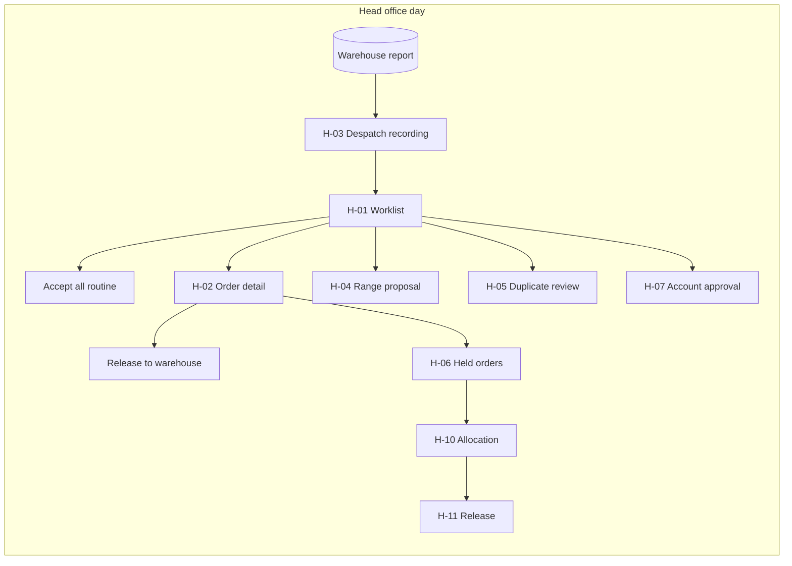
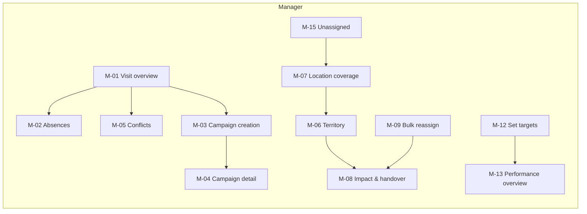

# Field Sales Management System — Screen Inventory & UI Brief

**Generated:** 19 September 2026

> **Amended 23 September 2026 by the UX design sessions** (`../uxdocs/`): principle 2 below has changed. Orders no longer need head office confirmation: every order flag has an automatic disposition, and rep discounts and free goods are applied within manager-set allowances at capture. H-01 now holds only range proposals, duplicate matches and account requests, and H-02 is a read-only record. A new manager screen, **M-16 Add a one-off Visit Due**, was added after M-15. Settled designs are in `../uxdocs/00`–`05`, and story amendments are folded into this folder.
**For:** UX designer
**Derived from:** fourteen area documents containing ~130 user stories
**Purpose:** To describe every screen the system needs, what each one is for, what it must show, and how they connect — so the screens and flows can be designed without reading all fourteen documents first.

---

## How to read this

Each screen has an ID, a one-line purpose, the context it's used in, what it must show, its main actions, its important states, and the stories behind it. Screen IDs are grouped by surface:

| Prefix | Surface | Device | Connectivity |
|---|---|---|---|
| **T** | Rep tablet app | iOS / Android / Windows tablet | **Offline-first** |
| **R** | Rep website | Laptop | Online |
| **M** | Manager website | Laptop | Online |
| **H** | Head office website | Laptop | Online |
| **C** | Customer self-service | Web + app | Online |

The **story references** point at the area documents; read those for full acceptance criteria before designing anything complex.

**Section 2 (global patterns) matters more than any individual screen.** The same handful of conventions recur across dozens of screens, and getting them consistent is most of the design job.

---

## 1. The system in brief

A wholesaler sells into physical shops. **Field Salespersons** visit or phone shops, record what they saw, count stock, and take orders — on a tablet that works offline all day and syncs deliberately. **Sales Managers** organise who covers what, what needs visiting, and what each rep should sell. **Head Office** processes orders to an external warehouse, maintains the catalogue, and controls pricing. **Customers** can order directly online.

Three things shape almost every screen:

1. **The tablet is offline.** It works from a snapshot taken at the morning sync. Everything it shows may be hours old, and everything the rep does waits to be uploaded.
2. **The rep captures; head office confirms.** Orders, price discounts, free goods, range agreements and new prospects are all provisional until someone at head office accepts them. *Superseded in part 23 Sep 2026:* orders, price discounts and free goods now go through without a person; range agreements, duplicate prospects and customer accounts still need head office.
3. **Performance is measured per Location** — per shop, never rolled up to the customer as a whole.

---

## 2. Global patterns — design these once, use everywhere

### 2.1 The "as of sync" rule (tablet only)

Anything on the tablet that came from the server is only as fresh as the last sync. Where staleness could mislead — order status, stock figures, availability — the screen says so: *"Pending — as of 07:42 sync"*, *"about 120 left as of 07:42 sync"*.

**The website and customer site never hedge like this.** They're online, so the figures are current. Don't carry the tablet's phrasing across; it would make the site look unsure of itself.

### 2.2 Unsent work

The tablet holds three kinds of not-yet-uploaded work, and the rep must always be able to see how much:

- **In Progress** — being built, stays on the tablet through any number of syncs
- **Ready to Send** — finished, uploads at the next sync
- **Needs Attention** — the server rejected it; the rep must fix or delete it

A count sits on Home. A late-day "soft reminder" makes it more prominent in text (not a notification). Sync reminders are notifications, capped at one per hour.

### 2.3 Status labels and availability

Products carry one of five availability states, shown wherever a product appears:

| State | Orderable? | Reads as |
|---|---|---|
| Active | Yes | (no label) |
| Discontinuing | Yes | "Being discontinued — replaced by X" |
| Run-out | Yes | "Limited stock, no restock — not guaranteed until confirmed by head office. About 120 left" |
| Temporarily Unavailable | No | "Back in stock around 25 October" |
| Unavailable | No | "Unavailable — no longer in an active range" / "— retired" |

Two rules: **never signal status by colour alone** (text or icon as well — reps work in bright shop lighting, and colour-blind users must be able to distinguish a warning), and **never hide an unorderable product** — a rep searching for something they know exists must find it with a reason, or they'll think the app is broken.

### 2.4 The order line

The densest element in the system. On one row it may need: product name (dominant), availability label, resolved price with its source, a runner-up price, a quantity control, a break prompt, and an offer marker.

Example of a fully loaded line:

> **SPF30 Sun Lotion 200ml** — Health > Skincare > Suncare
> €9.99 — Autumn promotion *(better than your tier price €11.20)*
> Qty [ 8 ] — *2 more for €2.00 each — save €4.00 on 10*
> ⚠ Being discontinued — replaced by SPF30 v2 200ml

Tapping the price opens the full list of candidate prices considered. **Prototype this element early** — it appears on the tablet, the rep website and the customer site, and if it doesn't work small it doesn't work at all.

### 2.5 Impact preview before consequential actions

Several actions change many things at once. Each shows what it will do before it does it, with counts that expand to detail:

- Archiving a Range → "38 products become Unavailable · 20 stay on sale via other ranges · 3 open orders will still be processed"
- Assigning a territory → "23 Locations move from Colm to Aoife. 9 have open visits."
- Moving a category → "4 subcategories and 180 products move"
- Moving a Town to another County → "23 locations move; Primary Rep changes for 23"

**There is no type-to-confirm anywhere except archiving a category branch**, which is the one far-reaching, gradually-visible action. Everything else shows impact and lets the person decide.

### 2.6 Propose, don't impose

A recurring principle. The system suggests; the person decides. Never pre-apply a suggestion:

- A low-stock hint appears as text; the Low tick stays empty
- A manager's suggested visit day sits *beside* the day picker, never pre-filled
- Stock allocation proposes a split; every line is adjustable
- A repeat order prefills a basket; it never submits

### 2.7 Filter → review → apply

The bulk pattern, used for building Ranges, creating campaigns, reassigning Locations and recategorising products:

1. Filter (by Category, Brand, supplier, Customer, Location Profile, region)
2. Review the matches, **all ticked by default**, untick exceptions, with problem rows separated out ("3 have no assigned rep")
3. Set shared details once
4. Confirm in plain terms: "Create 38 visits across 5 reps?"

### 2.8 Archive, never delete

Anything referenced by history can only be archived. **When something is in use, the Delete control is not shown at all** — not greyed out with an explanation. Archive shows what references it: "Used by 24 products and 1 specialist assignment". Lists hide archived items behind a "Show archived (3)" toggle.

### 2.9 Gap lists

Optional fields are allowed, and the gaps are surfaced rather than blocked. Head office and reps each have lists of incomplete things: Locations with no profile, no rep, an inactive main contact, an unconfirmed map position; prospects not yet completed. **Design these as working lists that can be fixed inline**, not read-only reports.

### 2.10 Empty states carry meaning

Several empty states are *good news* and should read that way — "All Locations have a responsible rep", "No products are short", "No routine orders". Others are genuinely empty and should offer the next action.

---

## 3. Tablet app (T) — Field Salesperson, offline

The tablet is used standing in a shop, one-handed, sometimes with no signal, sometimes in poor light. Large touch targets, a dominant product/location name on every row, and no reliance on drag-and-drop without an alternative.

### T-01 · Sync & Unsent Items
- **Purpose:** get the day's data down and the rep's work up, and show what hasn't gone yet.
- **Context:** first thing in the morning with signal; again at the end of the day.
- **Must show:** last sync time; counts by state (In Progress / Ready to Send / Needs Attention); Needs Attention items at the top with the server's reason; progress during sync ("Sending 2 of 3").
- **Actions:** Sync; open an unsent item; fix and re-mark a rejected item; delete a rejected item.
- **States:** no signal ("No connection — your work is saved on this tablet"); partial upload ("2 items not sent — poor connection"); expired sign-in ("Sign in again to send 3 items"); nothing unsent.
- **Stories:** Area 1 US-001, US-002, US-017.

### T-02 · Home (today)
- **Purpose:** answer "where am I going, what have I done, and what am I at risk of missing?"
- **Context:** the app's landing screen, returned to between every visit.
- **Must show:** today's scheduled visits grouped by Town (rep can reorder), marked Done once a call is saved, with any order beneath; unplanned calls and orders taken today; Overdue visits; visits due within 14 days with no day set; deadline markers ("Deadline: Autumn range order deadline"); counts for unsent items, cycle decisions waiting, and schedule conflicts.
- **Actions:** open a visit; reorder today (drag **and** Move up/down); search; open sync.
- **States:** nothing scheduled today (still show Overdue, due-soon and search); covering another rep's location ("Covering for Aoife"); a handover visit ("Handover — finish visit").
- **Customer invitation requests (C1.3):** a customer whose invitation expired can ask for a new one; the Location's rep approves it here with "Send new invitation", in a collapsed "Customer requests" section shown only when one is waiting (C1.4). Requests arrive in the background when in range, an exception to manual sync (C1.5). The same section tells the rep when a manager declines an account they set up (C8.3).
- **Stories:** Area 1 US-003, US-020; Visit Planning US-014; Self-service US-002.

### T-03 · Week agenda
- **Purpose:** move a single visit to another day without a planning screen.
- **Must show:** the week as a scrolling list grouped by day; each visit with its Town, due date and any deadline reason; the manager's suggested day beside the picker.
- **Actions:** "Move to…" day picker; accept the same-Town prompt ("2 other visits in Rathdrum are scheduled Tuesday. Move them too?").
- **States:** moving past a due date (warning, allowed — stronger wording when a reason exists); conflict raised after sync.
- **Note:** week-level planning is deliberately on the laptop (R-01). This screen handles one change at a time.
- **Stories:** Area 1 US-005.

### T-04 · Location search
- **Purpose:** find any assigned shop, offline, for an unplanned call or a phone order.
- **Must show:** results within 1 second across 500 locations; name dominant, Town secondary.
- **States:** no match ("No assigned locations match 'Quinn'" + note that only assigned locations are searchable); closed locations findable but not actionable.
- **Stories:** Area 1 US-004.

### T-05 · Location
- **Purpose:** the hub for everything at one shop.
- **Must show:** address, main contact **with status** ("Mary Walsh (inactive) — replacement needed"), any visit due with its reason, recent calls and orders, map position precision, temporary closure ("Closed until 14 Oct").
- **Actions:** Record Call; New Order; Set location from GPS (quiet control, highlighted once if unconfirmed); extend/shorten a temporary closure; open a sent item.
- **States:** no longer assigned ("your existing order will still be sent", actions withdrawn); closed permanently (read-only); master location (see T-10).
- **Online ordering (C8.1):** tapping a contact opens their details, with "Set up online ordering" or their login status.
- **Stories:** Area 1 US-004; Customer Directory US-005, US-010, US-011; Self-service US-001.

### T-06 · Call & Stock Check
- **Purpose:** record what happened at the visit.
- **Must show:** channel as two large unselected options (In person / Phone); pitch notes; the stock check list; competitor notes; campaign outcomes where a campaign is open.
- **The stock check list** opens on a suggested list (products counted last visit plus those on the last 3 accepted orders), each labelled by source. Counts accept decimals with a unit and step for measure-based products. A "Below usual level" hint may appear beside a count but never ticks Low. Marking Low offers "Add to order" on the spot; on an unavailable line it opens the replacement picker instead.
- **Save review:** a summary before saving — "In person · Pitch notes · 13 counted, 3 not checked · 2 Low · 1 competitor note · Autumn range launch: no outcome".
- **States:** no history (empty suggested list + search); saved calls are read-only after sync; corrections before sync can change values and remove lines but **offer no Add action** — "Record a follow-up call" appears in its place.
- **Stories:** Area 1 US-006, US-007, US-008, US-009, US-010, US-011, US-015, US-016, US-018; Visit Planning US-013.

### T-07 · Order entry (Order Pad)
- **Purpose:** build an order for one location.
- **Must show:** the Order Pad — the rep's ranges plus unranged products plus the chain's agreed range where one applies — by category, each with its resolved price and breadcrumb; the Low list alongside when following a stock check, marking what's already added; the offer summary; search that reaches the whole catalogue.
- **Actions:** add/adjust/remove lines; enter a price override (lower only, with reason); add a free-of-charge line; mark Ready to Send.
- **States:** empty order; a line whose product changed since it was added ("Unavailable since you added it — will still be sent"); restricted products absent entirely; measure-based quantity validation ("Enter at least 1.0 kg in steps of 0.5 kg").
- **Stories:** Area 1 US-012, US-013; Pricing US-005 to US-009; Promotions US-007; Master & Branch US-004.

### T-08 · Sent item view
- **Purpose:** answer the customer's "has it gone through?" honestly.
- **Must show:** status with its age ("Accepted, partly sent — as of 07:42 sync"); per-line despatch ("24 sent to customer 12 Oct · 12 outstanding"); rejection reasons; outcomes of any override or free-goods request.
- **Actions:** "Open on website" (shown but marked "Needs a connection" when offline); record a follow-up call.
- **Stories:** Area 1 US-014.

### T-09 · My Leads & lead capture
- **Purpose:** note somewhere worth calling on, in seconds, and work the list.
- **Must show:** active leads with source; stale ones flagged ("No activity for 9 weeks — follow up or archive"); scheduled ones behind a filter.
- **Actions:** capture (name + note is enough); set "actionable from"; visit → creates a prospect; close as dead with a reason.
- **Stories:** Area 1 US-021; Prospecting US-001 to US-003.

### T-10 · Create / complete prospect
- **Purpose:** record a place that isn't yet a customer.
- **Must show:** identity fields; what they currently sell (free text + optional product/range/category link); susceptibility High/Medium/Low with notes; a **"To complete"** list of what's still missing.
- **States:** saved as a draft and finishable later; duplicate outcome shown after sync ("Already a customer — now assigned to you, last ordered 14 Mar 2026").
- **Stories:** Area 1 US-022; Prospecting US-004 to US-006.

### T-11 · Master location view
- **Purpose:** work a chain's head office.
- **Must show:** branches (closed excluded, temporarily closed flagged), the agreed range with availability, open proposals awaiting head office.
- **Actions:** start a Range Review call; start a multi-branch order.
- **Stories:** Master & Branch US-001; Area 1 US-023.

### T-12 · Range Review (section within T-06)
- **Purpose:** capture what the buyer agreed to add or drop.
- **Must show:** current agreed range; proposed adds and drops; "subject to head office confirmation" stated plainly.
- **Stories:** Master & Branch US-002.

### T-13 · Multi-branch order (tablet)
- **Purpose:** order for many branches in one conversation, on a small screen.
- **Interaction:** branch selection first (all ticked by default) → product-at-a-time → one quantity applied to all → adjust exceptions → running summary per line ("24 × 9 branches, 1 adjusted") and per session ("6 products · 10 branches · 1,380 units"). **No grid.**
- **Stories:** Master & Branch US-005; Area 1 US-023.

### T-14 · Split review
- **Purpose:** check what each branch will get before the session becomes ten orders.
- **Must show:** one row per branch with lines and units, expandable; branches with nothing marked "No order".
- **Stories:** Master & Branch US-007.

---

## 4. Rep website (R) — laptop, online

The rep's planning and correction surface. Everything here is deliberately *not* on the tablet.

### R-01 · Planner
- **Purpose:** turn a pile of due visits into a realistic week.
- **Layout:** a calendar (always shown) beside an unscheduled-visits panel that toggles between **a Town-grouped list sorted by deadline** and **a map** with pins coloured by day *and* marked with a day letter. Selection is shared between the two views.
- **Must show:** each day's load in time ("6h 30m of 8h", "Over by 20m"); absence days blocked; deadline reasons; the manager's suggested day beside the picker; locations with no coordinates listed below the map.
- **Actions:** drag onto a day **and** select-then-"Schedule on…" (keyboard-operable); set a visit's duration when scheduling.
- **Accessibility note:** the map must never be the only way to do something.
- **Stories:** Visit Planning US-003 to US-005.

### R-02 · Cycle End digest
- **Purpose:** decide what happened to visits whose cycle ended without a call.
- **Arrives:** Sunday, as one notification for the week.
- **Actions:** per visit — Keep Overdue or Mark Missed (optional reason); apply to all.
- **States:** unactioned visits stay Overdue and reappear next week under "Still open".
- **Stories:** Visit Planning US-009.

### R-03 · Rep performance
- **Purpose:** "how am I doing?"
- **Must show:** overall progress ("€26,400 of €40,000 · 66% · 5 weeks left"); each range target separately; a per-location breakdown; the unfulfilled note ("€1,240 of this is on orders not yet fully despatched").
- **Must not show:** team figures, or what the rep captured for other locations.
- **Stories:** Targets US-004.

### R-04 · Order & call correction
- **Purpose:** edit a pending order or correct a synced call, online.
- **Note:** reached from the tablet's "Open on website" link. The corrections-versus-follow-up rule applies here as on the tablet.
- **Stories:** Area 1 US-014 (link target); open item in area 1 clarifications.

*(The multi-branch grid, M-11, is also used by reps on the laptop.)*

---

## 5. Manager website (M)

### M-01 · Visit Planning overview
- **Purpose:** find who or where needs attention.
- **Layout:** pivot between **By rep** and **By region**; summary rows with exception counts, drill to detail.
- **Counts per row:** scheduled of due, Overdue, Missed, absence decisions pending, unscheduled due within 14 days, over-capacity days, conflicts, handovers pending; "Covering for another team" where applicable.
- **States:** a rep with no exceptions shows zeros, not an empty row; unassigned locations surfaced in region view.
- **Stories:** Visit Planning US-010.

### M-02 · Absence entry & decisions
- **Purpose:** record when a rep is off and decide what happens to affected visits.
- **Must show:** affected visits with deadline markers; Extend / Keep / Cover per visit; "Apply to all"; undecided absences flagged "Needs a decision — 14 visits affected".
- **Stories:** Visit Planning US-006 to US-008.

### M-03 · Campaign creation
- **Purpose:** ask for extra visits across many locations at once.
- **Flow:** filter (Customer, Location Profile, region) → review (all ticked, "3 have no assigned rep" separated) → set window, reason, duration, outcome list → confirm ("Create 38 visits across 6 reps (10 to specialists)").
- **Stories:** Visit Planning US-011.

### M-04 · Campaign detail
- **Purpose:** track a campaign as one thing.
- **Must show:** progress ("22 of 38 done") and the outcome breakdown ("15 ordered · 7 declined · 3 follow up · 13 not yet visited"); by-rep view; batch actions (extend all, cancel a visit).
- **Stories:** Visit Planning US-012.

### M-05 · Conflicts
- **Purpose:** surface clashes between a rep's offline change and a manager's change.
- **Must show:** both versions side by side; clears when either amends the visit. No resolve action.
- **Stories:** Visit Planning US-014.

### M-06 · Territory assignment
- **Purpose:** assign region / county / town / location to a rep.
- **Must show:** a rep's current assignments; the impact preview before saving; carved-out counts ("Wicklow: 140 Locations, 23 carved out (Rathdrum → Aoife)").
- **Stories:** Coverage US-001, US-008.

### M-07 · Location coverage
- **Purpose:** answer "who covers this shop, and why?"
- **Must show:** effective owner **with its source** ("Aoife (via Rathdrum)"); specialists; the append-only assignment history.
- **Online ordering (C8.4):** "Set up online ordering…" in the footer row; the manager picks a contact, sees the scope line and the invitation goes out on save, with no approval.
- **Stories:** Coverage US-002; Self-service US-001.

### M-08 · Impact preview & handover
- **Purpose:** decide what happens to open visits when a location changes rep.
- **Must show:** locations moving; open visits with the previous rep (Overdue / scheduled counts); Move or Leave per visit with apply-to-all; undecided → "handover pending".
- **Stories:** Coverage US-003.

### M-09 · Bulk reassign & batch reversal
- **Purpose:** move a set of locations between reps, and undo it later without relying on memory.
- **Must show:** named batches ("Colm → Aoife, Paternity cover, 5 Oct 2026, 23 Locations"); on reversal, the batch pre-filled with "Changed since" rows unticked.
- **Stories:** Coverage US-004, US-005.

### M-10 · Specialist assignments
- **Purpose:** attach a rep to locations by Customer, Location Profile or Brand without making them the owner.
- **Stories:** Coverage US-006.

### M-11 · Multi-branch order grid (laptop)
- **Purpose:** the desk version of T-13 — products down, branches across, row/column totals, an "All" cell per row, fully keyboard-operable.
- **Note:** shared with reps (R) and echoed for customers (C-06).
- **Stories:** Master & Branch US-006.

### M-12 · Set targets (by period / by range)
- **Purpose:** set each rep's expectation.
- **Layout:** pick period (and range), list every rep, one figure each (value and/or units), **running total as feedback only**.
- **Rules to make visible:** blank means no target, not zero; the total is never stored or shown to reps.
- **Stories:** Targets US-001 to US-003.

### M-13 · Manager performance overview
- **Purpose:** see who's behind, early.
- **Must show:** actual, target, percentage and expected pace per rep, **furthest behind first**; by-range view; reps without targets listed separately; "Attributed €26,400 / Captured €44,400" clearly labelled as different measures.
- **Stories:** Targets US-005, US-006.

### M-14 · Rep permissions
- **Purpose:** grant or remove restriction-group access, with a record.
- **Stories:** Coverage US-009.

### M-15 · Unassigned locations
- **Purpose:** make sure no shop is silently uncovered.
- **Stories:** Coverage US-007.

### M-17 · Online ordering approvals *(added in session, 26 Sep 2026)*
- **Purpose:** approve or decline rep-created customer accounts, and send re-invitations for Locations with no assigned rep (C8.2, M17.1).
- **Must show:** who set up each account and when, the invitation email, and what the contact will be able to order for.
- **Actions:** Approve; Decline with a required reason the rep sees; Send new invitation. The manager is emailed with a link to this page when an item arrives.
- **Stories:** Self-service US-001, US-002.

---

## 6. Head office website (H)

### H-01 · Worklist
- **Purpose:** clear the day's orders and catch the few that need a person. **The most important screen in the system after the tablet's order entry.**
- **Layout:** three item types, each **labelled** (labels must survive re-sorting) — Range Proposals and Duplicate Matches sorted above Orders; then Flagged Orders; then Routine Orders with a single "Accept all routine" action.
- **Flags to render:** Large ("3.2× target for October"), Watched Product, Rep-flagged, New Location, Unavailable Line, Oversold, Prospect Conversion, Stock Shortfall, Price Override, Free of Charge — shown in plain language on the row.
- **Stories:** Head Office US-001, US-002.

### H-02 · Order detail
- **Purpose:** decide a flagged order.
- **Must show:** flags with explanations; lines with captured prices and availability at capture; override and free-goods lines with their reasons and the resolved price.
- **Actions:** Accept; **Partial Release** (release what's available, rest outstanding); Hold with a note; Reject with a reason; per-line decisions on overrides and free goods ("accept at €9.00" or "accept at resolved €11.20"; with or without the free line).
- **Rule to design around:** quantities and lines can **never** be edited here.
- **Stories:** Head Office US-003; Pricing US-008, US-009.

### H-03 · Despatch recording
- **Purpose:** record what the warehouse actually sent.
- **Must show:** every outstanding line pre-filled at its full remaining quantity with today's date, so "everything shipped" is one action; cumulative history per line ("24 sent 12 Oct · 12 sent 19 Oct").
- **Stories:** Head Office US-004.

### H-04 · Range proposal decision
- **Purpose:** confirm or reject a chain's agreed-range changes, per product, with a reason per rejected line.
- **Stories:** Head Office US-005; Master & Branch US-003.

### H-05 · Duplicate review
- **Purpose:** decide what a rep's new prospect actually matched.
- **Must show:** both records side by side; the existing location's **ordering pattern** ("Last order 14 Mar 2026 · previously ordered roughly every 5 weeks") so a lapsed account can be judged against itself; four outcomes (keep with current rep / hand over / merge / dismiss).
- **Stories:** Head Office US-005b; Prospecting US-006.

### H-06 · Held orders
- **Purpose:** make sure nothing parked is forgotten.
- **Must show:** hold note, days held, short products, a link into allocation.
- **Stories:** Head Office US-006.

### H-07 · Customer user account approval
- **Purpose:** approve or decline online ordering access a rep set up.
- **Must show:** the contact, their locations, and what they'd be able to order for ("Hickey's Head Office and its 12 branches").
- **Stories:** Head Office US-006b; Self-service US-001.

### H-08 · Short products
- **Purpose:** show only the products that need allocating.
- **Must show:** outstanding vs on hand, orders waiting, orders held, oldest wait; drafts left unreleased.
- **Stories:** Stock Allocation US-001, US-005.

### H-09 · Stock entry
- **Purpose:** record what's on hand and what's coming.
- **Must show:** on-hand figure with who entered it and when; incoming deliveries with quantities and dates; flags when a delivery changes ("Delivery changed — review allocation").
- **Stories:** Stock Allocation US-002.

### H-10 · Allocation view
- **Purpose:** divide short stock between competing orders.
- **Must show:** waiting orders with quantity, age, and whether this product **alone** is holding each up; orders marked "Passed over twice · short on 3 products"; a proposed split (complete-what-you-can) that's fully adjustable; a live **"3 orders complete, 2 still short"** header — the figure the manager is actually deciding on.
- **Stories:** Stock Allocation US-003.

### H-11 · Release confirmation
- **Purpose:** send allocated stock to the warehouse — per order or all together, the manager's choice. Nothing leaves until then.
- **Stories:** Stock Allocation US-004.

### H-12 · Product list & search
- **Purpose:** find the right product among near-duplicates.
- **Must show:** code, **breadcrumb**, primary brand, availability state, current price; filters including "include unavailable and archived-category products".
- **Stories:** Product Management US-010.

### H-13 · Product record
- **Purpose:** the full product. Designed so the **minimum** (code, name, category, unit, price, range) can be entered quickly and everything else added later.
- **Sections:** identity; classification (profile, brands with one primary, supplier, restriction group); attributes (name/value); unit of measure with step and minimum; base price with history and future-dated changes; ranges; replacements (shown both ways: "Replaces" and "Replaced by"); availability panel.
- **Stories:** Product Management US-001 to US-004; Range Lifecycle US-003, US-010.

### H-14 · Product availability panel
- **Purpose:** move a product through its lifecycle.
- **Must show:** current state; run-out quantity and live Remaining; expected-back date; impact before making something unavailable ("Stocked in 87 locations · 14 orders in 30 days · 2 open orders will still be processed"); the option to set replacements at that moment.
- **Stories:** Range Lifecycle US-007 to US-009.

### H-15 · Category tree
- **Purpose:** keep a 5–6 level tree findable.
- **Must show:** counts both ways ("180 products beneath · 12 here"); products allowed on branch nodes, listed under "In Suncare" after subcategories; full breadcrumbs everywhere.
- **Actions:** create; rename; move (carries the subtree, with impact); bulk recategorise by filter.
- **Stories:** Product Management US-005 to US-007.

### H-16 · Category archive decision
- **Purpose:** the one screen with real ceremony.
- **Must show:** consequences ("Archiving Suncare will also archive 4 subcategories and take 180 products out of this branch"); three paths — **Move first**, **Archive all**, Cancel; on Archive all, an explicit choice of where products go (parent / elsewhere / stay, with its consequence spelled out); **type-to-confirm**.
- **Stories:** Product Management US-009.

### H-17 · Reference data lists
- **Purpose:** maintain profiles, attribute names, brands, suppliers, restriction groups, location types, contact types — all archive-not-delete.
- **Stories:** Product Management US-008; Customer Directory US-009.

### H-18 · Range list & detail
- **Purpose:** see the live catalogue without last year's clutter; build and fill a range.
- **Must show:** active by default with "58 products · 6 unavailable" per row; three ways to add products (filter-and-select, copy a range, from the product record); removal as a routine edit with an inline note if it makes something unavailable.
- **Stories:** Range Lifecycle US-001 to US-004, US-011.

### H-19 · Range archive confirmation
- **Purpose:** show what an archive actually takes off sale.
- **Must show:** "38 products become Unavailable · 20 stay on sale via other ranges · 3 open orders will still be processed"; the 38 **ordered by impact**, highest first; replacements settable inline. No escalation, no type-to-confirm.
- **Stories:** Range Lifecycle US-005, US-006.

### H-20 · Price tier list & detail
- **Purpose:** hold agreed commercial terms without maintaining a thousand prices.
- **Must show:** percentage tiers with per-product overrides, or price-list tiers; **drift indicators** on fixed prices ("€10.50 — now 20% off (was 16% when set)"), sortable by drift; a warning when an override could never apply.
- **Stories:** Pricing US-001, US-002.

### H-21 · Tier assignment on the customer
- **Purpose:** give a customer one or more tiers, with a sample of resulting prices.
- **Stories:** Pricing US-003.

### H-22 · Quantity breaks (on the product record)
- **Purpose:** set from-quantity prices for counted and measured products, with a warning when a break could never apply.
- **Stories:** Pricing US-004.

### H-23 · Promotion list
- **Purpose:** the trading calendar in one place.
- **Must show:** live by default; scheduled and ended filters; shape, audience, period, product count; flags for "Cannot apply" and "May never apply".
- **Stories:** Promotions US-008.

### H-24 · Promotion setup
- **Purpose:** create one of four shapes — **shape chosen first**, since each needs different fields.
- **Must show:** buy X get Y (trigger + reward); bundle (named products + price); mix and match (eligible set + N + price); spend threshold (value + discount); audience (all customers or named tiers); whole-day period; optional maximum repeats.
- **Critical element — the overlap warning:** "SPF30 is in 2 other live promotions. Autumn Deal gives €9.99; this offer gives €10.50, so it won't apply." Not a bare "this product is in other promotions".
- **Stories:** Promotions US-001 to US-006.

### H-25 · Customer record
- **Purpose:** the buying organisation and its shops.
- **Stories:** Customer Directory US-001.

### H-26 · Location record
- **Purpose:** one shop. Type and Profile (both optional, gaps flagged), Town, Eircode, coordinates with precision, master location, contacts.
- **Actions:** temporary closure with a reopen date; permanent close (open visits cancelled, branches flagged); reopen.
- **Stories:** Customer Directory US-002, US-010, US-011.

### H-27 · Contact record & main contact replacement
- **Purpose:** keep contacts current without leaving a shop with nobody to ask for.
- **Key flow:** removing a main contact **requires naming a replacement**, or marking the contact Inactive, which flags the location "Main contact inactive — replacement needed".
- **Stories:** Customer Directory US-003, US-004.

### H-28 · Location profiles
- **Purpose:** the servicing defaults — visit frequency, visit duration, low-stock thresholds per product — that a handful of profiles spread across hundreds of shops.
- **Must show:** impact when changing a default ("40 locations without an override will change to every 3 weeks").
- **Stories:** Customer Directory US-006.

### H-29 · Geography
- **Purpose:** maintain Region → County → Town, with impact when a town moves ("23 locations move to Wexford; Primary Rep changes from Colm to Brian").
- **Stories:** Customer Directory US-007.

### H-30 · Gap lists
- **Purpose:** one place for locations missing a profile, a rep, a main contact or a confirmed position — fixable inline, filterable by gap type.
- **Stories:** Customer Directory US-008.

---

## 7. Customer self-service (C) — web and app, online

Untrained, infrequent users. **There is no registration** — accounts are created by a rep or manager. Strip all internal vocabulary: no tier names, no price breakdowns, no rep provenance.

### C-01 · Invitation & first sign-in
- Set a password from an invitation. Handle expired invitations and forgotten passwords.
- An expired invitation offers "Request a new invitation"; the rep or manager approves it before a new one is sent (C1.1). The Location's rep approves, with no manager step (C1.2), from T-02 Home on the tablet (C1.3), in its own collapsed section (C1.4); requests arrive and approvals leave in the background when in range (C1.5, C1.7), and the rep is also emailed (C1.6).
- **Stories:** Self-service US-002.

### C-02 · My locations
- Choose which shop an order is for; skip the choice when there's only one; show branches when the contact is at a head office; exclude closed, flag temporarily closed.
- **Stories:** Self-service US-003.

### C-03 · Catalogue & search
- **Opens on** the customer's assigned ranges plus unranged products. A same-page “Your catalogue” / “All products” control widens category browsing and gives a way back; search always shows curated matches first and other permitted matches below in one result list. Restricted products never appear. This supersedes the earlier separate “Search all products” step (C3.1–C3.3).
- Availability messages must stand alone without a rep to explain them — especially "Back in stock around 25 October" versus "no longer available", and the run-out wording.
- **Stories:** Self-service US-004.

### C-04 · Order entry (single location)
- Their price only — no tier name, no list price, no breakdown. Break prompts and the offer summary **are** shown.
- **Stories:** Self-service US-005.

### C-05 · Multi-branch grid
- The simplified version of M-11 for a head office buyer.
- **Stories:** Self-service US-006.

### C-06 · Order history
- Every order for their locations — theirs, colleagues', and their rep's — with despatch status and outstanding quantities.
- A chain submission is one expandable history entry containing its separate branch orders, each with its own status and reference (C6.1).
- Filtering to one branch shows its chain-created orders as ordinary chronological rows, without the expandable chain wrapper (C6.2).
- **All placed orders are read-only to the customer.** A change request goes to the company; no self-service edit or cancel controls appear (C4.1).
- **Stories:** Self-service US-007, US-008.

### C-07 · Order detail & repeat
- Repeat whole or selected lines; **prefills a new order, never submits**; changed products marked; prices resolve fresh, so the total may differ from the original.
- A chain submission has no group-level Repeat. Open a branch order to repeat only that branch into a new single-location order (C7.1); whole-chain Repeat is deferred.
- Repeat is offered on every visible order, whether the customer, a colleague or the rep placed it (C7.2).
- Repeat adds to the Location's current unplaced order; it starts a new order only when none is in progress (C7.3).
- A repeated product already in the order takes the repeated quantity; one warning lists every quantity that will change before anything is applied (C7.4).
- **Stories:** Self-service US-009.

### C-08 · Create customer user (rep/manager side)
- Create the account and state the resulting scope plainly before saving.
- A rep creates it on the tablet, from the contact reached through T-05; the request is sent in the background when in range (C8.1). The manager approves on M-17 (C8.2); a decline reaches the rep in Home's Customer requests section (C8.3). A manager sets one up directly from M-07's footer row, with no approval (C8.4).
- **Stories:** Self-service US-001.

---

## 8. Flows to design

```mermaid
flowchart LR
    subgraph Rep day (tablet)
        A[T-01 Sync] --> B[T-02 Home]
        B --> C[T-05 Location]
        B --> D[T-04 Search] --> C
        B --> E[T-03 Agenda]
        C --> F[T-06 Call & Stock Check]
        F --> G[T-07 Order entry]
        C --> G
        C --> H[T-08 Sent item]
        F --> B
        G --> B
        B --> I[T-09 Leads] --> J[T-10 Prospect] --> F
        C --> K[T-11 Master] --> L[T-12 Range Review]
        K --> M[T-13 Multi-branch] --> N[T-14 Split review] --> B
        B --> A
    end
```





**Also worth mapping:** the rep's week (R-01 planner → tablet agenda → visit → sync), and the customer's reorder (C-06 history → C-07 repeat → C-04 order entry → submit).

---

## 9. What is deliberately *not* a screen

- **Reporting and analytics** — a separate piece of work, not yet designed. Nothing here should try to be a dashboard.
- **Fulfilment, delivery, invoicing, payment, tax, margin** — all external.
- **Customer registration** — accounts are created for customers, never by them.
- **Warehouse stock control** — the system holds only figures head office types in.
- **Rep performance on the tablet** — deliberately website-only.
- **Purchasing from suppliers.**

---

## 10. Suggested design order

1. **T-07 order entry and the order line** (§2.4) — the densest element, used on three surfaces. If it doesn't work, nothing else matters.
2. **T-02 Home and T-01 Sync** — they establish the offline vocabulary (unsent counts, "as of sync") that recurs everywhere.
3. **T-06 Call & Stock Check** — the highest-frequency task in the business.
4. **H-01 Worklist and H-02 Order detail** — where every rep's work lands.
5. **R-01 Planner** — the most complex single layout (calendar + list/map + load).
6. **H-10 Allocation** and **H-16 Category archive** — the two hardest decision screens.
7. Everything else, which is largely conventional admin once the patterns above are settled.

---

## 11. Open questions a designer will hit

These are unresolved in the source documents and will need an answer before or during design:

1. **Tablet snapshot size** — the offline payload has grown considerably (catalogue with breadcrumbs, attributes, tiers, breaks, promotions, suggested lists, thresholds, replacements, leads). A technical spike is outstanding; it may constrain what the tablet can show.
2. **Soft reminder time** — the late-day hour for the sync nudge.
3. **Prospect pricing** — what a prospect prices against before becoming a customer.
4. **Website corrections** — the rule for correcting synced calls on the website (R-04) is defined in principle but its screen isn't designed.
5. **Editing a live promotion** — assumed "end early" only.
6. **App scope for customers** — assumed identical to the website and online-only.
7. **Location Profile vs Location Type** — confirmed as separate concepts, but whether the existing Location Type list should be reused is open. *23 Sep 2026:* a Location may hold many Location Profiles.
