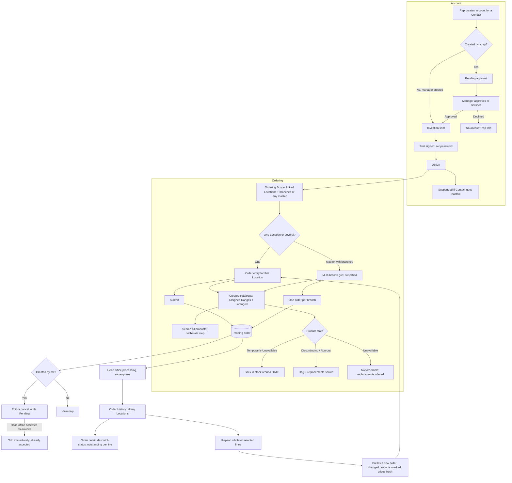

# Self-service: UX & User Stories

**Generated:** 18 September 2026 (amended 23 September 2026 from the UX design sessions — see `../uxdocs/04-user-stories-amendments.md`)
**Bounded context:** Self-service, within Ordering
**Primary users:** Customer User (a Contact with a login); Sales Manager (approving accounts)
**Scope:** The website and app where a customer orders for their own Locations without waiting for a visit, and the rep/manager screens that create their accounts. Seven screens: Create Account (rep/manager), Approve Account (manager), Invitation & First Sign-in, Catalogue & Search, Order Entry (single Location), Multi-Branch Grid, Order History & Detail.

---

## 1. Bounded Context & Scope

### Bounded context

- **Domain area:** Self-service. A Customer User places Orders that join the same Pending queue as reps' orders and are processed identically. Nothing here changes how orders are priced, reviewed or fulfilled.
- **Ubiquitous language:**
  - **Customer User** — a **Contact** with a login. Never self-registered: created by a rep or manager, and **approved by a manager when a rep creates it**. States: **Pending approval**, **Invited**, **Active**, **Suspended**.
  - **Invitation** — the message that lets an approved Customer User set a password and sign in. There is no signup form.
  - **Ordering Scope** — the Locations a Customer User may order for: the Locations their Contact is linked to, plus, where any of those is a **Master Location**, that master's **branches**.
  - **Curated catalogue** — the default view: the Customer's assigned **Ranges** plus unranged products. Assigned Ranges control what is *presented*, not what is *permitted*.
  - **Search all products** — a deliberate step that searches beyond the curated catalogue. Everything not Unavailable or Restricted can be found and ordered; Restricted products are never visible.
  - **Own order** — an Order this Customer User created. Only their own orders can be edited or cancelled; orders placed by a rep or by a colleague are visible but read-only.
  - **Repeat** — prefilling a **new** order from a past one, in full or from selected lines. It never submits; the customer amends and submits as normal. Prices resolve fresh; changed products are marked.
  - **Temporarily Unavailable** — a new availability state (owned by Range Lifecycle): not orderable now, with an optional **Expected Back** date, set by head office by hand as run-out quantities are. Distinct from Unavailable, which means gone.
  - **Live figures** — because the Customer User is online, prices, availability, offers and Run-out Remaining are current. The tablet's "as of sync" hedging has no place in this channel.
- **Upstream contexts:**
  - **Customer Directory** — Contacts, their Location links, Master/branch relationships, Closed and Temporarily Closed states.
  - **Pricing** and **Promotions** — the same resolution as for reps.
  - **Range Lifecycle** / **Product Management** — availability states including Temporarily Unavailable, Replacements, the catalogue.
  - **Coverage Management** — Restriction Groups (Restricted products are hidden from customers entirely).
- **Downstream contexts:**
  - **Head Office Order Processing** — self-service Orders arrive Pending and are processed identically, with no Capturing Rep.
  - **Targets & Performance** — attributed to the For Location's Primary Rep, as any order.
- **Terms that mean something different elsewhere:**
  - **Account** — a login for a Contact; not a customer account in the financial sense.
  - **Unavailable** vs **Temporarily Unavailable** — gone, versus back on a date.
  - **Scope** — here the Locations a user may order for; unrelated to a Specialist Assignment's Scope.

### Scope

- **In scope:**
  - Rep or manager creating a Customer User; manager approval of rep-created accounts
  - Invitation, first sign-in, password set; suspending an account
  - Ordering Scope from Contact links plus a master's branches
  - Curated catalogue, deliberate wider search, Restricted products hidden
  - Order entry for one Location; multi-branch grid for a master's user
  - Editing and cancelling own Pending orders; read-only for others' orders
  - Order history for all their Locations, with despatch status and outstanding quantities
  - Repeat, whole or selective, as a prefill
  - Availability messaging, including Expected Back dates and Replacements
- **Out of scope:**
  - Self-registration (does not exist)
  - Rep-facing provenance: Capturing Rep, Ordered By, tier names, price breakdowns
  - Pricing and promotion rules themselves (Pricing, Promotions)
  - Head office processing (its own area)
  - Payment, credit, invoicing, delivery tracking beyond despatch status
  - Customer-initiated returns or claims
- **Assumptions:**
  - One login per Contact; a person with two Contact records would have two logins.
  - A Customer User may not request a price override or a Free of Charge line.
  - Suspending a Contact (Inactive) suspends their login.
  - The app and website offer the same features; the app is not offline-capable.
  - Prospects have no Customer Users; an account requires a Customer.

---

## 2. Personas

### Customer User

- **Role:** a Contact at one or more Locations — a shop owner, a pharmacist, or a chain's head office buyer.
- **Responsibilities:** orders stock for the Locations they are responsible for, between or instead of rep visits.
- **Context on arrival:** at a desk or on a phone, usually reordering what they always order; untrained, infrequent, and not interested in how the system works.
- **Goal:** "Order what I usually order, for the shops I'm responsible for, without waiting for a visit."
- **Pain points:** hunting for a product they buy every month; not knowing whether something is coming back or gone for good; not being able to fix a quantity they got wrong five minutes ago.

### Sales Manager

- **Role:** approves accounts a rep has set up.
- **Responsibilities:** decides whether a Contact should be able to order directly, and for what.
- **Context on arrival:** a rep has set up a customer at a visit; the manager sees it in their queue.
- **Goal:** "Give online access deliberately, not by accident."

---

## 3. Flow Sketch



---

## 4. Design Decisions

### No self-registration; created and approved

- **Chose:** a rep or manager creates the Customer User; a rep-created account needs manager approval; the customer receives an invitation to set a password.
- **Over:** the elaboration's self-signup with verification.
- **Because:** giving a customer direct ordering access is a commercial decision, not a form submission; it removes unverified accounts, email verification and the whole signup surface; it matches the capture-then-approve pattern used for range proposals. *(Amended 23 Sep 2026: orders and price overrides are no longer approved by a person.)*
- **Trade-off accepted:** a customer cannot get access without someone acting; there is a delay between a rep offering it and the customer having it.

### Scope follows the Contact, and a master carries its branches

- **Chose:** a Customer User may order for the Locations their Contact is linked to, plus the branches of any Master Location among them.
- **Over:** Contact links only (the elaboration's rule).
- **Because:** a head office buyer would otherwise need linking to every branch by hand, and the chain case is exactly where self-service saves the most work; it mirrors what a rep can do at a master.
- **Trade-off accepted:** adding a branch to a chain silently widens an existing user's scope; visible on the account screen.

### Assigned Ranges curate; they do not restrict

- **Chose:** the default catalogue is the Customer's assigned Ranges plus unranged products; a deliberate "search all products" reaches everything else; only Unavailable and Restricted products are truly out of reach.
- **Over:** assigned Ranges as a hard limit (the elaboration's reading); search reaching everything by default.
- **Because:** the same guide-not-limit rule as the rep's Order Pad keeps one model across channels; a manager curates what a customer sees for a reason, and unprompted exposure of other Ranges undercuts that.
- **Trade-off accepted:** a customer may not realise other products exist; the wider search is plainly labelled but not promoted.

### A customer acts only on their own orders, and may edit freely while Pending

- **Chose:** all orders for their Locations are visible; edit and cancel appear only on orders they created; on those, full editing while Pending; read-only once Accepted; if head office accepts mid-edit, they are told at once.
- **Over:** cancel-only; read-only after submission; editing anyone's order for the Location.
- **Because:** a buyer should not alter a colleague's order or one the rep took at a visit; being online means state is always current, so the offline caution that shaped the rep's rules does not apply; a customer who typed 12 instead of 2 should not need a phone call.
- **Trade-off accepted:** a small race with head office, handled by telling the customer plainly rather than by restricting them.
- **Affected 23 Sep 2026:** orders are now accepted automatically on receipt (Head Office Order Processing US-008), so the Pending window this decision relies on may be very short or none. See Requires Clarification 7.

### Nothing is hedged; the customer is online

- **Chose:** prices, availability, offers and Run-out Remaining are shown as current, with no "as of sync" wording anywhere in this channel.
- **Over:** reusing the tablet's phrasing.
- **Because:** the hedging exists because a tablet works from a morning snapshot; repeating it online would make the site look unsure of itself.
- **Trade-off accepted:** two channels word the same information differently; deliberate, and worth stating so nobody copies across.

### Availability is explained, not just enforced

- **Chose:** a new **Temporarily Unavailable** state with an optional Expected Back date, set by head office by hand; Discontinuing, Run-out and Unavailable all show their Replacements; an unavailable line on a repeat is shown with its replacement rather than silently dropped.
- **Over:** one Unavailable state covering both "out of stock" and "gone".
- **Because:** "back around 25 October" tells the customer to wait and "no longer available" tells them to buy something else — collapsing them loses a sale either way; the system holds no warehouse stock, so a person enters it as they do run-out quantities.
- **Trade-off accepted:** another state for head office to maintain and for reps to see (with sync hedging on the tablet); an Expected Back date that slips must be extended by hand.

### Repeat prefills, never submits

- **Chose:** repeat a whole order or selected lines into a new order the customer amends and submits; changed products are marked and prices resolve fresh.
- **Over:** one-tap reorder that submits.
- **Because:** the system proposes and the person decides, as with the rep's Suggested List; a past order may contain products that have changed and prices that have moved, and presenting the old ones as current would be misleading.
- **Trade-off accepted:** one more step than a true one-tap reorder.

---

## 5. User Stories

### US-001: Create a Customer User account

| Field | Value |
|---|---|
| **Story** | As a Field Salesperson or Sales Manager, I want to set up online ordering for a contact so that they can order between my visits |
| **Priority** | Must Have |
| **Status** | Ready |
| **Dependencies** | Customer Directory Contacts |

**Acceptance criteria:**

*Scenario 1: Rep creates, manager approves*
```
Given Mary Walsh is a Contact at Hickey's Rathdrum
When I (a rep) create an account for her
Then it is Pending approval and appears in my manager's queue
And when the manager approves it, an invitation is sent to Mary
```

*Scenario 2: Manager creates directly*
```
When a manager creates the account
Then no approval step is needed and the invitation is sent immediately
```

*Scenario 3: Declined*
```
When the manager declines with a reason
Then no account exists and the rep sees the reason
```

*Scenario 4: Scope shown at creation*
```
Then the screen states what she will be able to order for: "Hickey's Rathdrum, Hickey's Arklow" — or, if her Contact is at a master, "Hickey's Head Office and its 12 branches"
```

*Scenario 5: Contact already has an account*
```
When I try to create a second account for the same Contact
Then I see "Mary Walsh already has a login (Active)"
```

*Scenario 6: Inactive Contact*
```
Given the Contact is marked Inactive
Then their login is suspended and they cannot sign in
```

---

### US-002: Accept an invitation and sign in

| Field | Value |
|---|---|
| **Story** | As a Customer User, I want to set my password from the invitation so that I can start ordering without filling in a registration form |
| **Priority** | Must Have |
| **Status** | Draft |
| **Dependencies** | US-001 |

**Acceptance criteria:**

*Scenario 1: First sign-in*
```
When I follow the invitation and set a password
Then my account becomes Active and I land on my Locations
```

*Scenario 2: Expired invitation*
```
Given the invitation has expired
Then I see "This invitation has expired — contact your sales representative" and can request a new one
```

*Scenario 3: Forgotten password*
```
When I use forgotten password
Then a reset is sent to the email on my Contact record
```

**Open questions:** invitation lifetime and delivery channel (email assumed); password policy.

---

### US-003: See and choose my Locations

| Field | Value |
|---|---|
| **Story** | As a Customer User, I want to see the shops I can order for and pick one so that I order for the right place |
| **Priority** | Must Have |
| **Status** | Ready |
| **Dependencies** | US-002; Customer Directory master/branch |

**Acceptance criteria:**

*Scenario 1: Several Locations*
```
Given my Contact is linked to Hickey's Rathdrum and Hickey's Arklow
When I start an order
Then I must choose which Location it is for
```

*Scenario 2: Head office scope*
```
Given my Contact is at Hickey's Head Office, which has 12 branches
Then I can order for the head office or for any branch, and the multi-branch option is offered
```

*Scenario 3: One Location*
```
Given I am linked to one Location only
Then it is selected automatically with no choice to make
```

*Scenario 4: Closed branch*
```
Given a branch is Closed
Then it is not offered; a Temporarily Closed branch is offered with "Closed until 14 Oct"
```

*Scenario 5: Out of scope*
```
When I attempt to open a Location I am not linked to
Then I am prevented
```

---

### US-004: Find products

| Field | Value |
|---|---|
| **Story** | As a Customer User, I want to browse what I normally buy and be able to look further when I need to so that ordering is quick but nothing is out of reach |
| **Priority** | Must Have |
| **Status** | Ready |
| **Dependencies** | US-003; Product Management, Range Lifecycle |

**Acceptance criteria:**

*Scenario 1: Curated default*
```
Given my Customer has Ranges "Core Stock" and "Summer 2027"
When I browse or search
Then I see those Ranges' products plus unranged products, by category
```

*Scenario 2: Search wider*
```
When I choose Search all products and search "lozenge"
Then products outside my ranges are found and can be ordered
```

*Scenario 3: Restricted never shown*
```
Given a product in a Restriction Group
Then it never appears, in either search
```

*Scenario 4: Temporarily Unavailable*
```
Given "SPF30 Sun Lotion 200ml" is Temporarily Unavailable, Expected Back 25 October 2026
Then it shows "Back in stock around 25 October" and cannot be added
```

*Scenario 5: Discontinuing and Run-out*
```
Given a product is Discontinuing with a Replacement
Then it is orderable and shows "Being discontinued — replaced by SPF30 Sun Lotion v2 200ml"
And a Run-out product shows "Limited stock, no restock — about 120 left"
```

*Scenario 6: Unavailable with replacement*
```
Given a product is Unavailable with Replacements
Then it is shown as unavailable with its replacements offered
```

---

### US-005: Place an order for one Location

| Field | Value |
|---|---|
| **Story** | As a Customer User, I want to build and submit an order for one of my shops so that I get stock without waiting for a visit |
| **Priority** | Must Have |
| **Status** | Ready |
| **Dependencies** | US-004; Pricing, Promotions |

**Acceptance criteria:**

*Scenario 1: Submit*
```
When I add 6 lines and submit
Then the order is Pending and enters head office's queue with no Capturing Rep
```

*Scenario 2: My price*
```
Then each line shows the price I pay, with no tier name, list price or breakdown
```

*Scenario 3: Offers*
```
Given a quantity break at 10 and my line is 8
Then I see "2 more for €2.00 each — save €4.00 on 10"
And the Offer Summary shows any applied offers and what is within reach
```

*Scenario 4: Measure-based product*
```
Given a product sold per kg with step 0.5 and minimum 1.0
Then the quantity control steps accordingly and shows the unit
```

*Scenario 5: Empty order*
```
When I submit with no lines
Then I see "Add at least one product"
```

---

### US-006: Order for several branches at once

| Field | Value |
|---|---|
| **Story** | As a Customer User at a head office, I want to enter quantities for all our shops in one grid so that a chain order is one job |
| **Priority** | Should Have |
| **Status** | Ready |
| **Dependencies** | US-003; Master & Branch Ordering US-006 |

**Acceptance criteria:**

*Scenario 1: Grid*
```
When I choose Order for several branches
Then I see a grid of products down and my branches across, with row and column totals
```

*Scenario 2: Fill a row*
```
When I enter 24 in the row's All cell
Then every branch cell on that row becomes 24 and I can overwrite any cell
```

*Scenario 3: Simplified*
```
Then the grid shows no Capturing Rep, Ordered By, tier names or price breakdowns
```

*Scenario 4: Review and submit*
```
When I review
Then I see lines and units per branch, and on submit one Pending order per branch is created
```

*Scenario 5: Branch with nothing*
```
Given a branch has no quantities
Then no order is created for it
```

---

### US-007: Change or cancel my own order

| Field | Value |
|---|---|
| **Story** | As a Customer User, I want to fix an order I placed while it is still pending so that a mistake doesn't need a phone call |
| **Priority** | Must Have |
| **Status** | Ready |
| **Dependencies** | US-005 |

**Acceptance criteria:**

*Scenario 1: Edit*
```
Given my Pending order
When I change a quantity, add a line and remove a line
Then the order is updated and stays Pending
```

*Scenario 2: Cancel*
```
When I cancel it
Then it is Cancelled and will not be processed
```

*Scenario 3: Someone else's order*
```
Given an order placed by my rep or by a colleague at the same Location
Then I can view it but no edit or cancel controls are shown
```

*Scenario 4: Accepted meanwhile*
```
Given head office accepts the order while I am editing
When I save
Then I see "This order has already been accepted and can't be changed" and my changes are not applied
```

*Scenario 5: After acceptance*
```
Then the order is read-only, with its despatch status shown
```

---

### US-008: See order history and what has been sent

| Field | Value |
|---|---|
| **Story** | As a Customer User, I want to see every order for my shops with what has actually been despatched so that I know what is coming |
| **Priority** | Should Have |
| **Status** | Ready |
| **Dependencies** | Head Office Order Processing US-004 |

**Acceptance criteria:**

*Scenario 1: History*
```
When I open order history
Then I see all orders for my Locations — mine, my colleagues' and my rep's — with date, Location, status and value
```

*Scenario 2: Partly sent*
```
Given an order with a line 24 of 36 despatched
Then the order shows "Accepted, partly sent" and the line shows "24 sent 12 Oct · 12 outstanding"
```

*Scenario 3: Rejected*
```
Given an order was rejected with a reason
Then the reason is shown
```

*Scenario 4: Filter*
```
When I filter by Location and by date range
Then only matching orders are listed
```

---

### US-009: Repeat a past order

| Field | Value |
|---|---|
| **Story** | As a Customer User, I want to start a new order from a previous one, all of it or just some lines, so that a regular reorder takes seconds |
| **Priority** | Should Have |
| **Status** | Ready |
| **Dependencies** | US-005, US-008 |

**Acceptance criteria:**

*Scenario 1: Repeat all*
```
When I choose Repeat on a past order
Then a new order is prefilled with its lines and quantities, not submitted
```

*Scenario 2: Selective repeat*
```
When I tick 4 of 9 lines and choose Repeat selected
Then only those 4 are prefilled
```

*Scenario 3: Changed products*
```
Given one product is now Unavailable with a Replacement and another is Temporarily Unavailable
Then the Unavailable one is not added but is listed with its Replacement offered
And the Temporarily Unavailable one is listed with "Back in stock around 25 October"
```

*Scenario 4: Fresh prices*
```
Given the past order captured a promotional price that has ended
Then the prefilled lines show today's prices, and the order total differs from the original
```

*Scenario 5: Amend and submit*
```
When I change quantities and submit
Then a new Pending order is created; the original is unchanged
```

---

## 6. Requires Clarification

1. **Invitation mechanics:** delivery channel, lifetime, password policy (US-002).
2. **Range Lifecycle amendment (applied):** Temporarily Unavailable with an Expected Back date is defined in Range Lifecycle US-008b.
3. **Area 1 amendment (applied):** reps see Temporarily Unavailable with its date, hedged as of sync.
4. **Head Office Order Processing (applied):** self-service orders have no Capturing Rep, and account approval is a queue item (US-006b).
5. **App vs website:** assumed identical and online-only; confirm no offline mode is expected.
6. **Customer-side contact changes:** whether a Customer User can update their own contact details, or only head office.
7. **Editing while Pending (23 Sep 2026):** with orders accepted automatically on receipt, how long does a self-service order stay Pending and editable? For example, until a processing cut-off, or not at all.

---

## 7. Recommended Next Steps

1. Apply the Temporarily Unavailable amendment to Range Lifecycle and area 1 (items 2 and 3) — it is the one genuinely new concept from this area.
2. Run the full amendment pass; the backlog now spans area 1, Pricing, Range Lifecycle, Head Office Order Processing, Targets and Customer Directory.
3. Confirm the app's scope (item 5) before build; an offline customer app would be a significant addition.
4. Stock Allocation remains the last unstarted area, pending confirmation of the warehouse stock feed.
