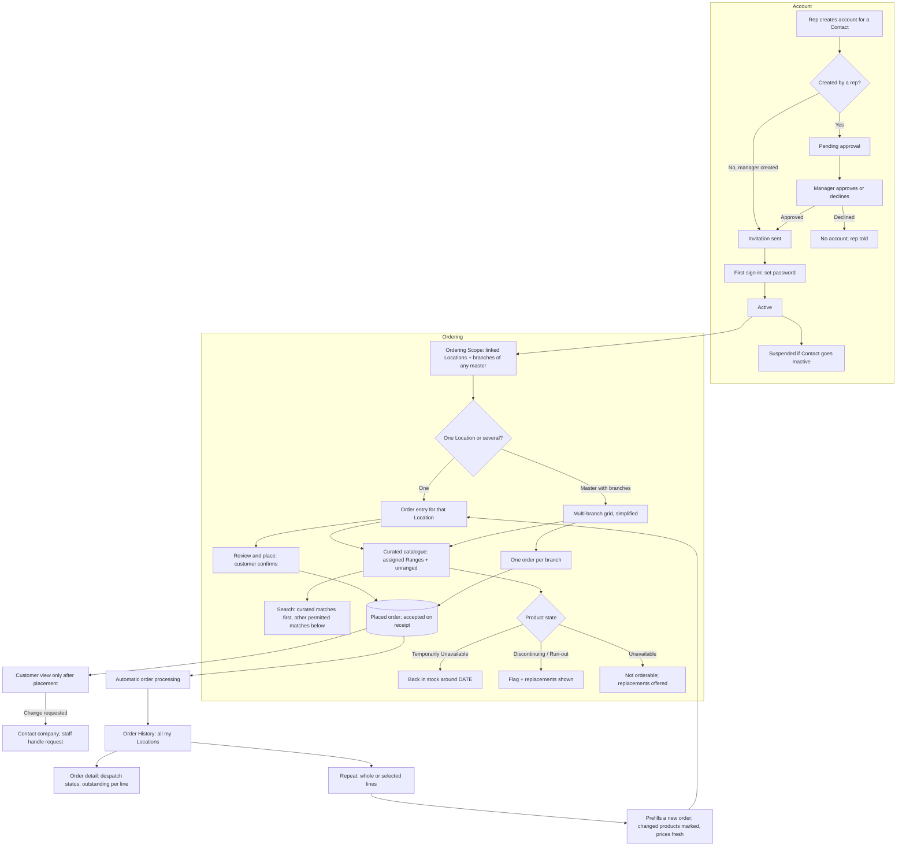

# Self-service: UX & User Stories

**Generated:** 18 September 2026 (amended 23 September 2026 from the UX design sessions — see `../uxdocs/04-user-stories-amendments.md`)
**Bounded context:** Self-service, within Ordering
**Primary users:** Customer User (a Contact with a login); Sales Manager (approving accounts)
**Scope:** The website and app where a customer orders for their own Locations without waiting for a visit, and the rep/manager screens that create their accounts. Seven screens: Create Account (rep/manager), Approve Account (manager), Invitation & First Sign-in, Catalogue & Search, Order Entry (single Location), Multi-Branch Grid, Order History & Detail.

---

## 1. Bounded Context & Scope

### Bounded context

- **Domain area:** Self-service. A Customer User places Orders that enter the same automatic processing as reps' orders. Nothing here changes how orders are priced, reviewed or fulfilled.
- **Ubiquitous language:**
  - **Customer User** — a **Contact** with a login. Never self-registered: created by a rep or manager, and **approved by a manager when a rep creates it**. States: **Pending approval**, **Invited**, **Active**, **Suspended**.
  - **Invitation** — the message that lets an approved Customer User set a password and sign in. There is no signup form.
  - **Ordering Scope** — the Locations a Customer User may order for: the Locations their Contact is linked to, plus, where any of those is a **Master Location**, that master's **branches**.
  - **Curated catalogue** — the default view: the Customer's assigned **Ranges** plus unranged products. Assigned Ranges control what is *presented*, not what is *permitted*.
  - **Product search** — one search shows matches from the curated catalogue first, with other products the Customer may buy underneath. The separate “Search all products” step is superseded by C3.1; Restricted products are never visible.
  - **Browse scope control** — “Your catalogue” / “All products” switches the category browse view in place; “Your catalogue” is the starting selection. Search always shows both result groups (C3.2–C3.3).
  - **Own order** — an Order this Customer User created. After placement, it is read-only in self-service, as are orders placed by a rep or colleague (C4.1).
  - **Repeat** — adding lines from any past order the Customer User can see, whoever placed it (C7.2), in full or from selected lines, to the Location's current unplaced order; a **new** order is started only if none is in progress (C7.3). It never submits; the customer amends and submits as normal. Prices resolve fresh; changed products are marked.
  - **Temporarily Unavailable** — a new availability state (owned by Range Lifecycle): not orderable now, with an optional **Expected Back** date, set by head office by hand as run-out quantities are. Distinct from Unavailable, which means gone.
  - **Live figures** — because the Customer User is online, prices, availability, offers and Run-out Remaining are current. The tablet's "as of sync" hedging has no place in this channel.
- **Upstream contexts:**
  - **Customer Directory** — Contacts, their Location links, Master/branch relationships, Closed and Temporarily Closed states.
  - **Pricing** and **Promotions** — the same resolution as for reps.
  - **Range Lifecycle** / **Product Management** — availability states including Temporarily Unavailable, Replacements, the catalogue.
  - **Coverage Management** — Restriction Groups (Restricted products are hidden from customers entirely).
- **Downstream contexts:**
  - **Head Office Order Processing** — self-service Orders are accepted automatically on receipt under the same disposition rules as reps' orders, with no Capturing Rep.
  - **Targets & Performance** — attributed to the For Location's Primary Rep, as any order.
- **Terms that mean something different elsewhere:**
  - **Account** — a login for a Contact; not a customer account in the financial sense.
  - **Unavailable** vs **Temporarily Unavailable** — gone, versus back on a date.
  - **Scope** — here the Locations a user may order for; unrelated to a Specialist Assignment's Scope.

### Scope

- **In scope:**
  - Rep or manager creating a Customer User; manager approval of rep-created accounts
  - Invitation, first sign-in, password set; suspending an account
  - Ordering Scope from Contact links plus a master's branches
  - Curated category browsing with a same-page “Your catalogue” / “All products” control; one search with curated matches first and other permitted matches below; Restricted products hidden
  - Order entry for one Location; multi-branch grid for a master's user
  - Reviewing and correcting an in-progress order before placement; read-only order history after placement
  - Order history for all their Locations, with despatch status and outstanding quantities
  - Repeat, whole or selective, as a prefill
  - Availability messaging, including Expected Back dates and Replacements
- **Out of scope:**
  - Self-registration (does not exist)
  - Rep-facing provenance: Capturing Rep, Ordered By, tier names, price breakdowns
  - Pricing and promotion rules themselves (Pricing, Promotions)
  - Head office processing (its own area)
  - Payment, credit, invoicing, delivery tracking beyond despatch status
  - Customer self-service changes or cancellations after placement; these requests go to the company
  - Customer-initiated returns or claims
- **Assumptions:**
  - One login per Contact; a person with two Contact records would have two logins.
  - A Customer User may not request a price override or a Free of Charge line.
  - Suspending a Contact (Inactive) suspends their login.
  - The app and website offer the same features; the app is not offline-capable.
  - Prospects have no Customer Users; an account requires a Customer.

---

## 2. Personas

### Customer User

- **Role:** a Contact at one or more Locations — a shop owner, a pharmacist, or a chain's head office buyer.
- **Responsibilities:** orders stock for the Locations they are responsible for, between or instead of rep visits.
- **Context on arrival:** at a desk or on a phone, usually ordering the products they always order — the same products, but rarely the same order (24 Sep 2026); untrained, infrequent, and not interested in how the system works.
- **Goal:** "Order what I usually order, for the shops I'm responsible for, without waiting for a visit."
- **Pain points:** hunting for a product they buy every month; not knowing whether something is coming back or gone for good; needing to contact the company if they discover a mistake after placing an order.

### Sales Manager

- **Role:** approves accounts a rep has set up.
- **Responsibilities:** decides whether a Contact should be able to order directly, and for what.
- **Context on arrival:** a rep has set up a customer at a visit; the manager sees it in their queue.
- **Goal:** "Give online access deliberately, not by accident."

---

## 3. Flow Sketch



---

## 4. Design Decisions

### No self-registration; created and approved

- **Chose:** a rep or manager creates the Customer User; a rep-created account needs manager approval; the customer receives an invitation to set a password.
- **Over:** the elaboration's self-signup with verification.
- **Because:** giving a customer direct ordering access is a commercial decision, not a form submission; it removes unverified accounts, email verification and the whole signup surface; it matches the capture-then-approve pattern used for range proposals. *(Amended 23 Sep 2026: orders and price overrides are no longer approved by a person.)*
- **Trade-off accepted:** a customer cannot get access without someone acting; there is a delay between a rep offering it and the customer having it.

### Scope follows the Contact, and a master carries its branches

- **Chose:** a Customer User may order for the Locations their Contact is linked to, plus the branches of any Master Location among them.
- **Over:** Contact links only (the elaboration's rule).
- **Because:** a head office buyer would otherwise need linking to every branch by hand, and the chain case is exactly where self-service saves the most work; it mirrors what a rep can do at a master.
- **Trade-off accepted:** adding a branch to a chain silently widens an existing user's scope; visible on the account screen.

### Assigned Ranges curate; they do not restrict

- **Chose (updated by C3.1–C3.3 on 26 Sep 2026):** category browsing starts with the Customer's assigned Ranges plus unranged products. A same-page “Your catalogue” / “All products” control widens browsing and provides the way back. One search shows curated matches first and other products the Customer may buy below. Restricted products remain hidden; availability rules determine whether a visible product can be added.
- **Over:** assigned Ranges as a hard limit (the elaboration's reading); the earlier separate “Search all products” step.
- **Because:** Ranges still guide browsing and result order, while customers can find other permitted products with a single query.
- **Trade-off accepted:** a search may expose products outside the curated catalogue, clearly separated below its matches.

### A customer confirms on placement; placed orders are read-only in self-service

- **Chose (C4.1, 26 Sep 2026):** all orders for the Customer User's Locations are visible. The customer reviews and corrects an in-progress order before placing it. “Place order” confirms it; no customer edit or cancel action is available afterward, including during any transient Pending state. A change request goes to the company.
- **Over:** the earlier own-order edit/cancel while Pending rule, which depended on a window that automatic acceptance may eliminate.
- **Because:** the customer explicitly confirms the order at placement, and company staff handle any later amendment or cancellation request.
- **Operational boundary:** how staff amend or cancel an accepted order is not specified by this self-service decision.

### Nothing is hedged; the customer is online

- **Chose:** prices, availability, offers and Run-out Remaining are shown as current, with no "as of sync" wording anywhere in this channel.
- **Over:** reusing the tablet's phrasing.
- **Because:** the hedging exists because a tablet works from a morning snapshot; repeating it online would make the site look unsure of itself.
- **Trade-off accepted:** two channels word the same information differently; deliberate, and worth stating so nobody copies across.

### Availability is explained, not just enforced

- **Chose:** a new **Temporarily Unavailable** state with an optional Expected Back date, set by head office by hand; Discontinuing, Run-out and Unavailable all show their Replacements; an unavailable line on a repeat is shown with its replacement rather than silently dropped.
- **Over:** one Unavailable state covering both "out of stock" and "gone".
- **Because:** "back around 25 October" tells the customer to wait and "no longer available" tells them to buy something else — collapsing them loses a sale either way; the system holds no warehouse stock, so a person enters it as they do run-out quantities.
- **Trade-off accepted:** another state for head office to maintain and for reps to see (with sync hedging on the tablet); an Expected Back date that slips must be extended by hand.

### Land on the person's usual products *(24 Sep 2026)*

- **Chose:** once a shop is chosen, the customer lands on their own usual products (ordered at least twice in six months), each marked when someone else has already ordered it for the shop; a new user sees the shop's regulars as a starting point until their 3rd order.
- **Over:** landing on the curated catalogue; building the landing page around repeating past orders; a Location-wide usual list.
- **Because:** customers buy the same products but rarely the same order; hunting for a monthly product is the persona's main pain point; the mark prevents ordering what the rep or a colleague has just ordered.
- **Trade-off accepted:** a product ordered once from the starting-point section is found by search until it has been ordered twice.

### Repeat prefills, never submits

- **Chose:** repeat a whole order or selected lines into a new order the customer amends and submits; changed products are marked and prices resolve fresh.
- **Over:** one-tap reorder that submits.
- **Because:** the system proposes and the person decides, as with the rep's Suggested List; a past order may contain products that have changed and prices that have moved, and presenting the old ones as current would be misleading.
- **Trade-off accepted:** one more step than a true one-tap reorder.

---

## 5. User Stories

### US-001: Create a Customer User account

| Field | Value |
|---|---|
| **Story** | As a Field Salesperson or Sales Manager, I want to set up online ordering for a contact so that they can order between my visits |
| **Priority** | Must Have |
| **Status** | Ready |
| **Dependencies** | Customer Directory Contacts |

**Acceptance criteria:**

*Scenario 1: Rep creates, manager approves*
```
Given Mary Walsh is a Contact at Hickey's Rathdrum
When I (a rep) create an account for her
Then it is Pending approval and appears in my manager's queue
And when the manager approves it, an invitation is sent to Mary
```

*Scenario 2: Manager creates directly*
```
When a manager creates the account
Then no approval step is needed and the invitation is sent immediately
```

*Scenario 3: Declined*
```
When the manager declines with a reason
Then no account exists and the rep sees the reason
```

*Scenario 4: Scope shown at creation*
```
Then the screen states what she will be able to order for: "Hickey's Rathdrum, Hickey's Arklow" — or, if her Contact is at a master, "Hickey's Head Office and its 12 branches"
```

*Scenario 5: Contact already has an account*
```
When I try to create a second account for the same Contact
Then I see "Mary Walsh already has a login (Active)"
```

*Scenario 6: Inactive Contact*
```
Given the Contact is marked Inactive
Then their login is suspended and they cannot sign in
```

*Scenario 7: Rep sets it up at the shop (C8.1)*
```
Given I am at Hickey's Rathdrum with the tablet
When I open Mary Walsh from the Location screen and choose "Set up online ordering"
Then I confirm the invitation email with Mary and see what Mary will be able to order for
And the request reaches my manager's approval queue as soon as the tablet has signal, without a manual sync
```

*Scenario 8: Manager approves on the approvals page (C8.2)*
```
Given Colm has set up online ordering for Mary Walsh
Then Colm's manager is emailed with a link to "Online ordering approvals"
When the manager approves Mary's account there
Then the invitation is sent to Mary
When the manager declines instead
Then a reason is required, and Colm sees it
```

*Scenario 9: Rep sees the decline on Home (C8.3)*
```
Given the manager declined Mary Walsh's account with "Contact has left the business"
When Colm's tablet has signal
Then Home's Customer requests section shows "Mary Walsh: online ordering declined: Contact has left the business" without Colm syncing
When Colm chooses OK
Then the notice is removed
```

*Scenario 10: Manager sets it up from the Location page (C8.4)*
```
Given I am a manager on the Location page for Hickey's Rathdrum
When I choose "Set up online ordering…" and pick Mary Walsh
Then I see "Mary Walsh will be able to order for: Hickey's Rathdrum" and confirm the email
When I save
Then the invitation is sent immediately, with no approval step
```

---

### US-002: Accept an invitation and sign in

| Field | Value |
|---|---|
| **Story** | As a Customer User, I want to set my password from the invitation so that I can start ordering without filling in a registration form |
| **Priority** | Must Have |
| **Status** | Draft |
| **Dependencies** | US-001 |

**Acceptance criteria:**

*Scenario 1: First sign-in*
```
When I follow the invitation and set a password
Then my account becomes Active and I land on my Locations
```

*Scenario 2: Expired invitation*
```
Given the invitation has expired
Then I see that the invitation has expired and a "Request a new invitation" action (C1.1)
When I request one
Then the request goes to my rep or manager for approval, and I am told a new invitation will follow once it is approved
And no new invitation is sent until they approve it
```

*Scenario 5: My rep approves the request (C1.2)*
```
Given I am a Contact at Hickey's Rathdrum and have requested a new invitation
Then the rep responsible for Hickey's Rathdrum receives the request
When the rep approves it
Then a new invitation is sent to me, with no manager approval step
And if Hickey's Rathdrum has no assigned rep, the request goes to the manager who sees it as Unassigned
```

*Scenario 6: The rep approves from the tablet Home screen (C1.3–C1.6)*
```
Given I requested a new invitation this morning
Then my rep is emailed about the request
And when the rep's tablet has signal, the request appears on Home under "Customer requests" without the rep syncing
And it shows my name, Location, the request date and "Send new invitation"
When the rep chooses "Send new invitation"
Then a new invitation is sent to me as soon as the tablet has signal, without the rep syncing (C1.7)
```

*Scenario 4: Request already awaiting approval (C1.1)*
```
Given I have already requested a new invitation
When I follow the expired link again
Then I see that my request is awaiting approval, and no duplicate request is created
```

*Scenario 3: Forgotten password*
```
When I use forgotten password
Then a reset is sent to the email on my Contact record
```

**Open questions:** invitation lifetime and delivery channel (email assumed); password policy.

---

### US-003: See and choose my Locations

| Field | Value |
|---|---|
| **Story** | As a Customer User, I want to see the shops I can order for and pick one so that I order for the right place |
| **Priority** | Must Have |
| **Status** | Ready |
| **Dependencies** | US-002; Customer Directory master/branch |

**Acceptance criteria:**

*Scenario 1: Several Locations*
```
Given my Contact is linked to Hickey's Rathdrum and Hickey's Arklow
When I start an order
Then I must choose which Location it is for
```

*Scenario 2: Head office scope*
```
Given my Contact is at Hickey's Head Office, which has 12 branches
Then I can order for the head office or for any branch, and the multi-branch option is offered
```

*Scenario 3: One Location*
```
Given I am linked to one Location only
Then it is selected automatically with no choice to make
```

*Scenario 4: Closed branch*
```
Given a branch is Closed
Then it is not offered; a Temporarily Closed branch is offered with "Closed until 14 Oct"
```

*Scenario 5: Out of scope*
```
When I attempt to open a Location I am not linked to
Then I am prevented
```

**UX amendments (24 Sep 2026)** — the shop choice isn't remembered; full record in `../uxdocs/04-user-stories-amendments.md` (US-NEW-007) and `../uxdocs/06-customer.md` (C2.1). Users with several shops are most often managers moving between them, where a remembered choice leads to ordering for the wrong shop.

*Scenario 6: Chosen on every visit*
```
Given I am linked to Hickey's Rathdrum and Hickey's Arklow
When I sign in, on any visit
Then I am asked which shop the order is for, and my previous choice is not preselected
```

**UX amendment (25 Sep 2026)** — the head office buyer's primary job is chain ordering (C2.2 in `../uxdocs/06-customer.md`; AC-NEW-007-12 in `../uxdocs/04-user-stories-amendments.md`).

*Scenario 7: Head office buyer chooses a chain order*
```
Given my Contact is at Hickey's Head Office, with 12 branches in scope
When I open the location choice on any visit
Then "Order for several branches" is the primary action and opens the multi-branch grid directly
And the head office location and eligible branches are listed below for single-location orders, with none preselected
```

---

### US-004: Find products

| Field | Value |
|---|---|
| **Story** | As a Customer User, I want to browse what I normally buy and be able to look further when I need to so that ordering is quick but nothing is out of reach |
| **Priority** | Must Have |
| **Status** | Ready |
| **Dependencies** | US-003; Product Management, Range Lifecycle |

**Acceptance criteria:**

*Scenario 1: Curated browse and first search group*
```
Given my Customer has Ranges "Core Stock" and "Summer 2027"
When I browse by category
Then I see those Ranges' products plus unranged products
And I can choose "All products" to browse other products I am permitted to buy on the same page
And choose "Your catalogue" to return to curated browsing
When I search
Then matching products from that curated catalogue appear first
```

*Scenario 2: Other permitted search matches*
```
When I search "lozenge"
Then matching products from my curated catalogue appear first
And other products I am permitted to buy appear underneath in the same results
And I do not need to choose a wider search or repeat my query
```

*Scenario 3: Restricted never shown*
```
Given a product in a Restriction Group
Then it never appears in browsing or search
```

*Scenario 4: Temporarily Unavailable*
```
Given "SPF30 Sun Lotion 200ml" is Temporarily Unavailable, Expected Back 25 October 2026
Then it shows "Back in stock around 25 October" and cannot be added
```

*Scenario 5: Discontinuing and Run-out*
```
Given a product is Discontinuing with a Replacement
Then it is orderable and shows "Being discontinued — replaced by SPF30 Sun Lotion v2 200ml"
And a Run-out product shows "Limited stock, no restock — about 120 left"
```

*Scenario 6: Unavailable with replacement*
```
Given a product is Unavailable with Replacements
Then it is shown as unavailable with its replacements offered
```

**UX amendments (24 Sep 2026)** — the landing page is the person's usual products (C-09); full record in `../uxdocs/04-user-stories-amendments.md` (US-NEW-007) and `../uxdocs/06-customer.md` (C9.1–C9.4, C9.7). Customers buy the same products but rarely the same order, so the page is built around frequent products; the curated catalogue is reached by search. Scenario 1 now describes browsing and search, not the landing page.

**UX amendment (26 Sep 2026)** — C3.1 replaces the deliberate “Search all products” step with a single search that groups curated matches first and other permitted matches below. C3.2–C3.3 keep category browsing curated by default with a same-page “Your catalogue” / “All products” control and a way back. See AC-SS004-A–D in `../uxdocs/04-user-stories-amendments.md`.

*Scenario 7: Usual products*
```
Given I have ordered Hand Cream 75ml for Rathdrum on two of my own orders in the last six months, and Arnica Gel once
When I open Rathdrum's page
Then Hand Cream is under "Your usual products" and Arnica Gel is not
And products ordered only by others (the rep, colleagues, the chain's head office) never join my usual list
```

*Scenario 8: Starting point for a new user*
```
Given I have placed fewer than 3 orders for Rathdrum
Then a separate section "Often ordered for Hickey's Rathdrum" lists products ordered at least twice in the last six months on any order for the Location
And after my 3rd order the section is no longer shown
```

*Scenario 9: Ordered by someone else*
```
Given the rep ordered 6 Sudocrem for Rathdrum on 2 Oct and it has not been despatched
Then Sudocrem shows "Ordered 2 Oct by your rep · 6 on the way", and I can still add it without any confirmation
And once despatched on 4 Oct it shows "Despatched 4 Oct · expected soon" until the company's expected-delivery period has passed
And the mark appears on the usual products page only, never on catalogue or search rows
```

*Scenario 10: Orders reached by a link*
```
Then the page carries no summary of open orders; order history is reached by a link
```

---

### US-005: Place an order for one Location

| Field | Value |
|---|---|
| **Story** | As a Customer User, I want to build and submit an order for one of my shops so that I get stock without waiting for a visit |
| **Priority** | Must Have |
| **Status** | Ready |
| **Dependencies** | US-004; Pricing, Promotions |

**Acceptance criteria:**

*Scenario 1: Submit*
```
When I review an order with 6 lines and choose "Place order"
Then I have confirmed and submitted it
And it is accepted automatically on receipt with no Capturing Rep
And I can view its current status but cannot edit or cancel it in self-service
```

*Scenario 2: My price*
```
Then each line shows the price I pay, with no tier name, list price or breakdown
```

*Scenario 3: Offers*
```
Given a quantity break at 10 and my line is 8
Then I see "2 more for €2.00 each — save €4.00 on 10"
And the Offer Summary shows any applied offers and what is within reach
```

*Scenario 4: Measure-based product*
```
Given a product sold per kg with step 0.5 and minimum 1.0
Then the quantity control steps accordingly and shows the unit
```

*Scenario 5: Empty order*
```
When I submit with no lines
Then I see "Add at least one product"
```

**UX amendments (24 Sep 2026)** — adding from the usual products page; full record in `../uxdocs/04-user-stories-amendments.md` (US-NEW-007) and `../uxdocs/06-customer.md` (C9.5, C9.6). The usual products page is a launchpad; the order is reviewed on its own page.

*Scenario 6: Add with a quantity*
```
Given I am on Rathdrum's usual products page
When I tap Add on Hand Cream 75ml
Then a quantity popover opens with an empty field — my last quantity is neither prefilled nor offered
And on Add it closes, I stay on the page, and the row reads "In order · 12"
And a bar shows the line count with "View order", which opens the order
```

---

### US-006: Order for several branches at once

| Field | Value |
|---|---|
| **Story** | As a Customer User at a head office, I want to enter quantities for all our shops in one grid so that a chain order is one job |
| **Priority** | Should Have |
| **Status** | Ready |
| **Dependencies** | US-003; Master & Branch Ordering US-006 |

**Acceptance criteria:**

*Scenario 1: Grid*
```
When I choose Order for several branches
Then I see a grid of products down and my branches across, with row and column totals
```

*Scenario 2: Fill a row*
```
When I enter 24 in the row's All cell
Then every branch cell on that row becomes 24 and I can overwrite any cell
```

*Scenario 3: Simplified*
```
Then the grid shows no Capturing Rep, Ordered By, tier names or price breakdowns
```

*Scenario 4: Review and submit*
```
When I review and place the chain order
Then I see lines and units per branch, and on submit one order per branch is created and accepted automatically on receipt
And each placed branch order is read-only to me, with the company phone and email beside its reference if I need to request a change
```

*Scenario 5: Branch with nothing*
```
Given a branch has no quantities
Then no order is created for it
```

**UX amendment (25–26 Sep 2026)** — a chain may hold multiple separate confirmed Agreed Ranges (C5.1–C5.16 in `../uxdocs/06-customer.md`; BR-NEW-008 and AC-SS006-A–O in `../uxdocs/04-user-stories-amendments.md`). A product may belong to several of them. A dropdown offers these ranges, such as “2026 Christmas gift packs”. Each buyer with access to the chain grid may designate a personal default, shown automatically on their next visit; changing it does not affect another buyer. Until then, the first dropdown option is shown without saving a personal preference (current design, may be revisited). Entered rows stay at the top of the grid when switching ranges, with no duplicate row in the selected range. Dropdown ordering remains deferred. Buyers mainly use a laptop or larger tablet; phone entry is product-at-a-time with the same branch-order review. All eligible branches start selected, with Closed excluded and Temporarily Closed flagged; the buyer may remove a branch while it has no quantities in the current chain order. A blocked removal opens that branch's entered quantities for correction. Clearing the last quantity leaves the branch selected until the buyer removes it deliberately. The desktop hierarchy in C-05 is accepted for the initial design round; finer layout details may change during implementation.

*Scenario 6: Predefined grid products*
```
Given Hickey's Head Office has a confirmed Agreed Range
When I start a multi-branch order
Then the predefined products offered in the grid come from that Agreed Range, with no quantities prefilled
And the Agreed Range does not prevent me from finding and ordering a permitted product outside it
```

*Scenario 7: Entered rows stay visible across ranges*
```
Given I have entered quantities for Christmas gift packs in a multi-branch order
When I switch to everyday products
Then the entered Christmas product rows remain visible in the grid with their quantities
```

*Scenario 8: Default range on opening the grid*
```
Given Hickey's has several named ranges and I have designated one as my default
When I open a new multi-branch grid
Then the dropdown shows my default range selected and its products are ready for entry with empty quantities
And I can choose another range from the dropdown without losing entered rows
```

*Scenario 9: Separate Agreed Ranges*
```
Given Hickey's Head Office has a default Agreed Range and a separate “2026 Christmas gift packs” Agreed Range
When I choose “2026 Christmas gift packs” from the grid dropdown
Then I see that range's confirmed products available for entry in the same chain order
And any entered rows from the default range remain visible with their quantities
```

*Scenario 10: Customer designates the default*
```
Given Hickey's has several confirmed Agreed Ranges
When I designate “Everyday” as my default
Then my next multi-branch grid opens with “Everyday” selected and its products ready for entry
```

*Scenario 11: Personal default*
```
Given another Hickey's buyer and I can both open the multi-branch grid
When I designate “2026 Christmas gift packs” as my default
Then only my grid starts on that range; the other buyer's starting range is unchanged
```

*Scenario 12: No personal default yet*
```
Given I have not set a personal default Agreed Range
When I open a new multi-branch grid
Then the first range in the dropdown is selected and its products are available for entry
And that automatic selection does not save a personal default for me
```

*Scenario 13: Entered rows above the selected range*
```
Given I have entered quantities for Christmas gift packs in a multi-branch order
When I select the “Everyday” range
Then the entered Christmas product rows and their quantities remain at the top of the grid
And the Everyday products available for entry appear below them
```

*Scenario 14: Phone entry for a chain order*
```
Given I open a multi-branch order on a phone
When I choose a product from the selected Agreed Range
Then I can enter one quantity for the selected branches and adjust individual branches
And I can see a running summary of products and branch quantities already entered
And I reach the same branch-order review used from the laptop or larger-tablet grid
```

*Scenario 15: Product in two Agreed Ranges*
```
Given Hand Cream 75ml is a confirmed member of both Hickey's Everyday and “2026 Christmas gift packs” Agreed Ranges and is not yet in my chain order
When I select either range in the chain order
Then Hand Cream is available from that range for entry
```

*Scenario 16: Entered product has one row*
```
Given I have entered branch quantities for Hand Cream 75ml and it belongs to the selected Agreed Range
When I view the multi-branch order
Then Hand Cream appears once in “Entered in this order” at the top
And it is absent from the selected range's available-product rows below
And I can edit its existing branch quantities from the top row
```

*Scenario 17: Eligible branches start selected*
```
Given Hickey's has 12 eligible branches, one Closed branch, and one Temporarily Closed branch
When I start a customer multi-branch order
Then all 12 eligible branches are selected, including the Temporarily Closed branch with its closure date shown
And the Closed branch is excluded
And I can deselect eligible branches before entering products
```

*Scenario 18: Branch with quantities cannot be removed*
```
Given Arklow has 24 Hand Cream in my current in-progress chain order
When I try to deselect Arklow from the branch selection
Then Arklow remains selected and its quantities are unchanged
And I see that an active order exists for Arklow and I must clear its quantities before removing the branch
And once all its quantities in this chain order are cleared, I can deselect it
```

*Scenario 19: Open the blocked branch's quantities*
```
Given I tried to remove Arklow but it has quantities on several products in this chain order
When the removal is blocked
Then the view opens directly on the products and quantities entered for Arklow in this chain order, with the reason shown
And I can edit or clear those quantities there
And Arklow remains selected while any quantity remains
```

*Scenario 20: Deliberate branch removal after clearing*
```
Given I reached Arklow's quantities after a blocked removal
When I clear Arklow's last quantity in this chain order
Then Arklow remains selected
And I can return to branch selection and deliberately deselect it
```

---

### US-007: Request a change after placing an order

| Field | Value |
|---|---|
| **Story** | As a Customer User, I want to know how to request a correction after placing an order so that I can contact the company with the order details |
| **Priority** | Must Have |
| **Status** | Amended 26 Sep 2026 (C4.1); customer edit/cancel scenarios superseded |
| **Dependencies** | US-005 |

**Acceptance criteria:**

*Scenario 1: Placed order is read-only*
```
Given I have placed an order
When I open it, including during any transient Pending state
Then I can view its lines and status, but cannot edit or cancel lines or the order in self-service
```

*Scenario 2: Contact the company for a change*
```
Given I need to change or cancel part or all of a placed order
When I view the order
Then its reference, the company's phone number and the company's email address are shown together
And I am told to quote the reference when contacting the company
And no customer self-service amendment or cancellation is offered
```

*Scenario 3: Someone else's order*
```
Given an order placed by my rep or by a colleague at the same Location
Then I can view it but no edit or cancel controls are shown
```

**Superseded 26 Sep 2026:** the earlier scenarios allowing own-order edits and cancellation while Pending, and the accepted-mid-edit race. Company-side amendment or cancellation handling remains a separate operational decision; this story only covers the customer's read-only view and contact route.

---

### US-008: See order history and what has been sent

| Field | Value |
|---|---|
| **Story** | As a Customer User, I want to see every order for my shops with what has actually been despatched so that I know what is coming |
| **Priority** | Should Have |
| **Status** | Ready |
| **Dependencies** | Head Office Order Processing US-004 |

**Acceptance criteria:**

*Scenario 1: History*
```
When I open order history
Then I see all orders for my Locations — mine, my colleagues' and my rep's — with date, Location, status and value
And none offers customer edit or cancel actions after placement
```

*Scenario 2: Partly sent*
```
Given an order with a line 24 of 36 despatched
Then the order shows "Accepted, partly sent" and the line shows "24 sent 12 Oct · 12 outstanding"
```

*Scenario 3: Rejected*
```
Given an order was rejected with a reason
Then the reason is shown
```

*Scenario 4: Filter*
```
When I filter by Location and by date range
Then only matching orders are listed
```

*Scenario 5: Chain submission in history (C6.1)*
```
Given one chain placement created a separate order for each of 12 branches
When I open order history
Then the submission appears as one expandable entry
And expanding it shows each branch's order with its own reference, status and value
And I can open each branch order's read-only detail
```

*Scenario 6: History filtered to one branch (C6.2)*
```
Given Arklow's order was created as part of a chain submission
When I filter history to Arklow
Then its order appears as an ordinary chronological row with its own reference, status and value
And the chain submission's expandable wrapper is not shown
```

---

### US-009: Repeat a past order

| Field | Value |
|---|---|
| **Story** | As a Customer User, I want to start a new order from a previous one, all of it or just some lines, so that a regular reorder takes seconds |
| **Priority** | Should Have |
| **Status** | Ready |
| **Dependencies** | US-005, US-008 |

**Acceptance criteria:**

*Scenario 1: Repeat all*
```
When I choose Repeat on a past order
Then a new order is prefilled with its lines and quantities, not submitted
And if it is a branch order from a chain submission, the new order is for that branch only
```

*Scenario 2: Selective repeat*
```
When I tick 4 of 9 lines and choose Repeat selected
Then only those 4 are prefilled
```

*Scenario 3: Changed products*
```
Given one product is now Unavailable with a Replacement and another is Temporarily Unavailable
Then the Unavailable one is not added but is listed with its Replacement offered
And the Temporarily Unavailable one is listed with "Back in stock around 25 October"
```

*Scenario 4: Fresh prices*
```
Given the past order captured a promotional price that has ended
Then the prefilled lines show today's prices, and the order total differs from the original
```

*Scenario 5: Amend and submit*
```
When I change quantities and choose "Place order"
Then a new order is confirmed and accepted automatically on receipt; the original is unchanged
```

*Scenario 6: Repeat a chain-created branch order (C7.1)*
```
Given a chain submission created separate orders for Arklow and Bray
When I view the chain submission in history
Then its group header has no Repeat action
When I open the Arklow order and repeat all or selected lines
Then I start a new, unsubmitted single-location order for Arklow only
And the original Arklow and Bray orders are unchanged
```

*Scenario 7: Repeat an order placed by my rep or a colleague (C7.2)*
```
Given my rep placed an order for Arklow last Tuesday with a rep discount on Hand Cream
When I open that order from history
Then Repeat all and Repeat selected are available, as on my own orders
When I repeat it
Then a new, unsubmitted order for Arklow is prefilled at today's prices without the rep discount
And the rep's original order is unchanged
```

*Scenario 8: Repeat into an order already in progress (C7.3)*
```
Given Arklow's current unplaced order has 12 Hand Cream
And a past Arklow order has 8 Sudocrem
When I repeat that past order
Then 8 Sudocrem is added to Arklow's current order
And the 12 Hand Cream already there is kept
And no second order for Arklow is started
```

*Scenario 9: Repeated product already in the order (C7.4)*
```
Given Arklow's current order has 6 Hand Cream and 4 Sudocrem
And the order I repeat has 12 Hand Cream, 8 Sudocrem and 5 other lines
When I choose Repeat all
Then one warning lists Hand Cream 6 → 12 and Sudocrem 4 → 8
When I choose Continue
Then Hand Cream is 12 and Sudocrem is 8, each on one line, and the 5 other lines are added
When I choose Cancel instead
Then Arklow's current order is unchanged
```

---

## 6. Requires Clarification

1. **Invitation mechanics:** delivery channel, lifetime, password policy (US-002).
2. **Range Lifecycle amendment (applied):** Temporarily Unavailable with an Expected Back date is defined in Range Lifecycle US-008b.
3. **Area 1 amendment (applied):** reps see Temporarily Unavailable with its date, hedged as of sync.
4. **Head Office Order Processing (applied):** self-service orders have no Capturing Rep, and account approval is a queue item (US-006b).
5. **App vs website:** assumed identical and online-only; confirm no offline mode is expected.
6. **Customer-side contact changes:** whether a Customer User can update their own contact details, or only head office.
7. ~~**Editing while Pending (23 Sep 2026):** with orders accepted automatically on receipt, how long does a self-service order stay Pending and editable?~~ **Resolved 26 Sep 2026 (C4.1):** placement is confirmation; the customer cannot edit or cancel afterward. Company-side amendment/cancellation mechanics remain a separate operational question.
8. ~~**Contact route after placement (26 Sep 2026):** choose the contact channel and exact wording shown on a placed order when the customer needs to request an amendment or cancellation.~~ **Resolved 26 Sep 2026 (C4.2):** show both company phone number and email address beside the order reference. Exact display wording can be refined during implementation.

---

## 7. Recommended Next Steps

1. Apply the Temporarily Unavailable amendment to Range Lifecycle and area 1 (items 2 and 3) — it is the one genuinely new concept from this area.
2. Run the full amendment pass; the backlog now spans area 1, Pricing, Range Lifecycle, Head Office Order Processing, Targets and Customer Directory.
3. Confirm the app's scope (item 5) before build; an offline customer app would be a significant addition.
4. Stock Allocation remains the last unstarted area, pending confirmation of the warehouse stock feed.
