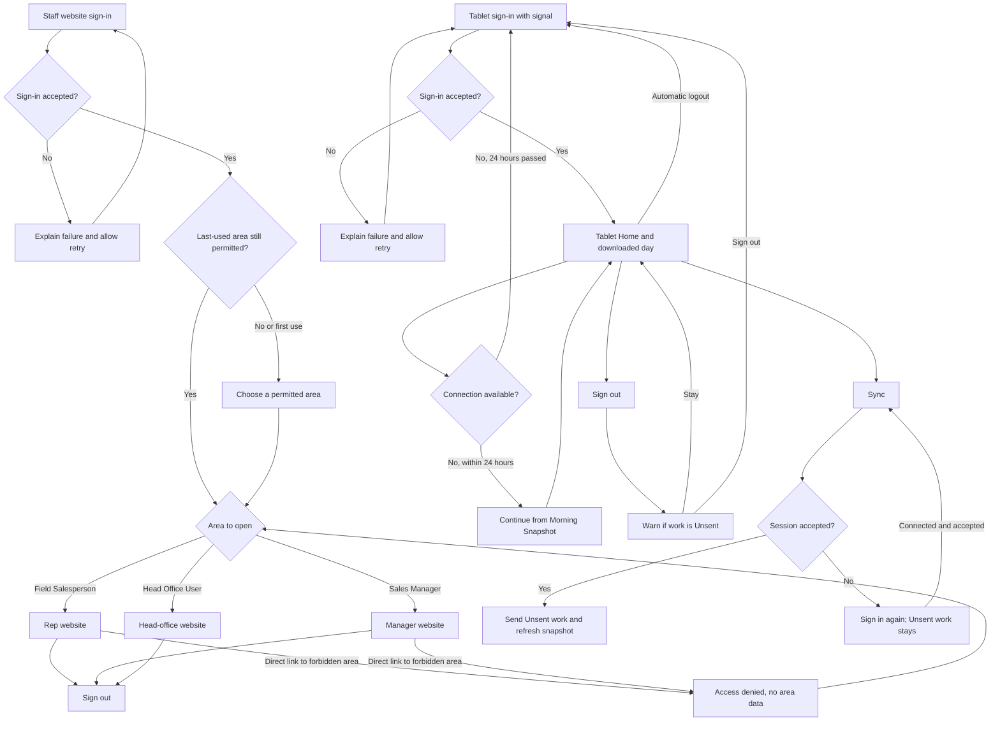

# Staff and Tablet Sign-in: UX & User Stories

**Generated:** 28 September 2026
**Bounded context:** Identity and Access, at the edge of Sales Operations
**Primary users:** Staff Member and Field Salesperson
**Scope:** Staff website sign-in and access by role; rep tablet sign-in, offline return and expired-session recovery. Customer sign-in remains in [Self-service US-002](self-service.md#us-002-accept-an-invitation-and-sign-in).

---

## 1. Bounded Context & Scope

### Bounded context

- **Domain area:** Identity and Access. It establishes who is using a staff surface and which areas they may enter. Sales Operations owns the work they do after entry.
- **Ubiquitous language:**
  - **Staff Member** — a person assigned one or more staff roles: Field Salesperson, Sales Manager or Head Office User. Whether an administrator is a separate role is unresolved (MI-03).
  - **Staff sign-in** — the action that establishes a Staff Member's identity on the online staff website or the rep tablet. One website sign-in covers every staff role the person holds. The credential method is unresolved (MI-03).
  - **Role** — the staff access assignment that determines which website areas are available. A rep's Location coverage and product permissions remain separate business rules.
  - **Session** — the period in which a successful staff sign-in is accepted without asking the person to sign in again. On the tablet, a rep may return and capture offline for up to 24 hours after the last successful connected sign-in. Online role removal takes effect on the next website request; tablet role and permission changes take effect at the next Sync.
  - **Morning Snapshot** — the rep's downloaded Locations and product data used by the tablet offline. It is distinct from the rep's locally captured Unsent work.
  - **Unsent work** — Calls, Orders and schedule changes still held on the tablet. Sign-in recovery must not discard it.
  - **Valid when captured** — tablet work is judged against the roles and business rules in the snapshot used when it was captured. A later role or permission reduction does not prevent that earlier work from uploading; new actions follow the permissions received at the next Sync.
- **Upstream contexts:** Staff directory and role assignment provide identity, roles, account state and the rep-to-manager reporting line. Coverage Management supplies the rep's assigned Locations and permissions.
- **Downstream contexts:** The staff website opens the permitted rep, manager or head-office area. The tablet opens Home and permits work from the Morning Snapshot; Sync uses the current session to send Unsent work.
- **Terms that mean something different elsewhere:** A **Customer User** is a Contact with a customer login, not a Staff Member. Its invitation, first sign-in and password reset are specified in [Self-service US-002](self-service.md#us-002-accept-an-invitation-and-sign-in) and [C-01](../uxdocs/06-customer.md#c-01--invitation--first-sign-in).

### Scope

- **In scope:**
  - Signing in to the online staff website and reaching a permitted area for Field Salesperson, Sales Manager and Head Office User roles.
  - Explaining a failed sign-in and a denied area without exposing the area's data.
  - Signing in on a rep tablet while connected, then returning to previously downloaded work offline for up to 24 hours after the last successful connected sign-in.
  - Recovering an expired tablet sign-in when a connection returns without losing Unsent work.
  - Signing out of the staff website or tablet, with a warning about Unsent tablet work. Automatic tablet logout preserves that work for the rep's next sign-in.
- **Out of scope:**
  - Customer account creation, invitations, customer sign-in and customer password reset; see [Self-service US-001 and US-002](self-service.md#us-001-create-a-customer-user-account).
  - Staff account provisioning, choosing an identity provider, credential policy, multi-factor method and administrator-role design; these are MI-03 decisions.
  - Defining rep coverage or product permissions; this flow consumes them.
  - Snapshot contents, Sync transfer and conflict handling; see [Rep at a Location US-001](rep-at-a-location-tablet.md#us-001-sync-my-tablet).
- **Assumptions:**
  - Staff identities and role assignments exist before sign-in.
  - A tablet needs a successful connected sign-in and a completed download before it can offer offline work.
  - Local Unsent work is stored separately from the Morning Snapshot, as specified for T-4.1.1.
  - The rep website, manager website and head-office website are online surfaces. One sign-in covers all roles a Staff Member holds, whether the areas share one site or several.
  - The 24-hour tablet period is measured from the last successful connected sign-in, not from the last time the app was opened.

---

## 2. Personas

### Staff Member

- **Role:** a Field Salesperson, Sales Manager or Head Office User using the online staff website.
- **Responsibilities:** reach the part of the system needed for the day's work without seeing an area their role does not allow.
- **Context on arrival:** may start at the site's entry page or follow a link to a specific staff page. A Staff Member with several roles returns to their last-used permitted area; on first use, they choose an area.
- **Goal:** “Get into my work and know which areas I can use.”
- **Pain points:** a successful sign-in that leads to the wrong area, an unexplained denial, or losing the intended page when asked to sign in again.

### Field Salesperson

- **Role:** a rep using a tablet while visiting or phoning Locations.
- **Responsibilities:** use the downloaded day offline, capture Calls and Orders, then Sync them when connected.
- **Context on arrival:** signs in and Syncs with signal before visits; later returns to the tablet in a shop with poor or no signal and may have Unsent work.
- **Goal:** “Open my day at the shop and keep my captured work safe even when sign-in needs refreshing.”
- **Pain points:** being locked out mid-visit without signal, or fearing that signing in again will erase work waiting to be sent.

---

## 3. Flow Sketch



---

## 4. Design Decisions

### Treat website areas as role destinations

- **Chose:** one staff sign-in covers every role the Staff Member holds. Open the last-used permitted area, or the only permitted area. If several remain and none was last used, ask the person to choose. Deny direct entry to an area they may not use.
- **Over:** a common start page that shows every area's links regardless of role.
- **Because:** the first screen should let the person start work and should not imply that an inaccessible area is usable. T-1.1.1 already requires a Head Office User to reach the catalogue and a Field Salesperson to be unable to enter it.
- **Trade-off accepted:** a first-time multi-role user makes one area choice before starting work.

### Let the tablet use its downloaded day offline

- **Chose:** after a connected sign-in and download, allow a returning rep to use the stored day and capture offline for up to 24 hours after the last successful connected sign-in.
- **Over:** requiring a network check whenever the tablet app opens.
- **Because:** the tablet is used inside shops without reliable signal. A network check at every return would interrupt the core visit journey.
- **Trade-off accepted:** an offline tablet cannot learn about a remote account change until it reconnects. After 24 hours without a connected sign-in, the rep must sign in again; saved work stays on the tablet.

### Put expired-session recovery at the blocked action

- **Chose:** when Sync finds an expired online sign-in, show the Sign in action there, the number of items waiting and that the work remains on the tablet. A successful sign-in resumes the interrupted Sync automatically.
- **Over:** a generic full-screen error that hides Sync and Unsent state.
- **Because:** the rep needs to know why nothing was sent and what to do next. This follows [Rep at a Location US-001 Scenario 3](rep-at-a-location-tablet.md#us-001-sync-my-tablet) and T-01.
- **Trade-off accepted:** the rep sees the resumed Sync progress after sign-in, rather than choosing when to retry it.

### Keep Unsent work across tablet logout

- **Chose:** warn the rep before a manual sign-out when work is Unsent, and keep that work on the tablet across manual or automatic logout for the same rep's next sign-in.
- **Over:** silently ending the session while the rep cannot tell whether saved work remains.
- **Because:** a logout can happen before the rep regains signal. Captured Calls and Orders must not disappear because authentication ended.
- **Trade-off accepted:** the retained work requires a safe rule for who may reopen it on a shared or reassigned tablet.

### Apply reduced tablet access at the next Sync

- **Chose:** a role or permission reduction changes what the rep may do after their next Sync. Work captured under the earlier snapshot still uploads under the rules in force when captured.
- **Over:** rejecting previously captured work because access changed before upload.
- **Because:** the tablet cannot know about a remote change while offline, and the existing [valid-when-captured rule](../uxdocs/04-user-stories-amendments.md#br-new-006--work-is-judged-as-captured) keeps legitimate work from disappearing.
- **Trade-off accepted:** a rare permission reduction may be visible only at the next Sync. Whether to add a separate audit flag remains optional.

---

## 5. User Stories

### US-001: Sign in to the staff website

| Field | Value |
|---|---|
| **Story** | As a Staff Member, I want to sign in and reach an area allowed by my role so that I can start my work without searching for the right entry point |
| **Priority** | Must Have |
| **Status** | Ready |
| **Dependencies** | Staff identities and assigned roles |

**Acceptance criteria:**

*Scenario 1: Head office entry*
```
Given Niamh is an active Staff Member with the Head Office User role
When Niamh completes staff website sign-in
Then Niamh can open the head-office catalogue area
```

*Scenario 2: Manager entry*
```
Given Aoife is an active Staff Member with the Sales Manager role
When Aoife completes staff website sign-in
Then Aoife can open the manager area
```

*Scenario 3: Rep entry*
```
Given Colm is an active Staff Member with the Field Salesperson role
When Colm completes staff website sign-in
Then Colm can open the rep website area
```

*Scenario 4: Several roles, one sign-in*
```
Given Aoife has both Sales Manager and Head Office User roles
And Aoife last used the manager area
When Aoife signs in to the staff website once
Then the manager area opens
And Aoife can open both the manager area and the head-office area
And neither area asks Aoife to sign in again during the same active session
```

*Scenario 5: First use with several roles*
```
Given Aoife has both Sales Manager and Head Office User roles
And Aoife has no last-used area
When Aoife signs in
Then Aoife is asked to choose the manager or head-office area
And the area Aoife chooses opens without another sign-in
```

*Scenario 6: Last-used area removed*
```
Given Aoife last used the head-office area
And Aoife now holds only the Sales Manager role
When Aoife signs in
Then the manager area opens
And the head-office area is unavailable
```

*Scenario 7: Rejected sign-in*
```
Given Niamh's staff account is inactive
When Niamh attempts to sign in
Then no staff area opens
And Niamh sees that sign-in failed
```

*Scenario 8: Sign out*
```
Given Niamh is signed in to the head-office website
When Niamh chooses Sign out
Then the staff session ends
And opening a head-office page asks Niamh to sign in again
```

**Edge cases addressed:**
- A last-used area that is no longer permitted is skipped; the Staff Member chooses from areas still allowed.
- The credential method and staff credential recovery are separate MI-03 decisions; this story specifies the outcome of sign-in and rejected attempts.

---

### US-002: Enter only staff areas allowed by my role

| Field | Value |
|---|---|
| **Story** | As a Field Salesperson, I want the website to make my permitted area clear so that I can work without entering a head-office function by mistake |
| **Priority** | Must Have |
| **Status** | Ready |
| **Dependencies** | US-001; assigned staff roles |

**Acceptance criteria:**

*Scenario 1: Permitted rep link*
```
Given Colm is signed in as a Field Salesperson
When Colm follows a link to the rep website
Then the rep page opens
```

*Scenario 2: Head-office link denied*
```
Given Colm is signed in as a Field Salesperson without the Head Office User role
When Colm follows a direct link to the catalogue area
Then the catalogue content and actions are not shown
And Colm sees that this area is unavailable to this account
```

*Scenario 3: Role removed during a website session*
```
Given Niamh is signed in to the head-office website
And Niamh's Head Office User role is removed
When Niamh makes the next request for a catalogue page
Then the catalogue content and actions are not shown
And Niamh sees that this area is unavailable to this account
```

**Edge cases addressed:**
- A direct link is checked as well as navigation; hiding a link alone does not define access.
- Online role removal takes effect on the next request in an already open session. A page already visible cannot be recalled, but its actions stop working immediately.

**Non-functional notes:**
- The access check applies to the request that reads data or performs an action, not only to navigation.

---

### US-003: Sign in on the tablet and return to my downloaded day

| Field | Value |
|---|---|
| **Story** | As a Field Salesperson, I want to sign in with signal and return to my downloaded day offline so that I can keep visiting shops when coverage drops |
| **Priority** | Must Have |
| **Status** | Draft |
| **Dependencies** | Staff identity model (MI-03); tablet shell and Morning Snapshot (T-4.1.1) |

**Acceptance criteria:**

*Scenario 1: Connected first entry*
```
Given Colm is an active Field Salesperson and the tablet has a connection
When Colm completes tablet sign-in and taps Sync
And the Morning Snapshot finishes downloading
Then Home opens with Colm's downloaded Locations
And Home shows the last Sync time
```

*Scenario 2: Return without signal*
```
Given Colm previously signed in on this tablet and downloaded a Morning Snapshot
And the last successful connected sign-in was 2 hours ago
When Colm opens the tablet app in a shop without signal
Then Home opens from the stored Morning Snapshot
And Colm can continue work that will remain Unsent until Sync
```

*Scenario 3: No previous download*
```
Given this tablet has no Morning Snapshot for Colm
And there is no connection
When Colm tries to start the tablet day
Then the app explains that a connected sign-in and download are needed first
And it does not show another rep's data
```

*Scenario 4: One day of offline access has passed*
```
Given Colm last signed in with a connection more than 24 hours ago
And Colm has 2 Unsent Calls on the tablet
When Colm opens the tablet app without signal
Then the app asks Colm to sign in again when connected before opening Home
And the 2 Calls remain stored for Colm's next sign-in
```

*Scenario 5: Permission removed after capture*
```
Given Colm captured an Order line for a Pharmacy-only product while the permission was in his Morning Snapshot
And the permission was removed before Colm's next Sync
When Colm Syncs with signal
Then the already captured Order uploads under the rules in force when it was captured
And the new Morning Snapshot removes the Pharmacy-only permission
And Colm cannot add a new Pharmacy-only product after that Sync
```

**Edge cases addressed:**
- A connection failure at first entry has a next step, while a returning rep with an allowed local session can keep working.
- Earlier work still uploads after a later role or permission reduction; new actions use the access received at Sync. Whether to flag this rare change is a separate audit decision.

**Open questions:**
- What happens to previously captured Unsent work when the rep's entire account is disabled before the tablet reconnects?

---

### US-004: Sign in again when tablet Sync requires it

| Field | Value |
|---|---|
| **Story** | As a Field Salesperson, I want an expired sign-in to explain how to send my saved work so that I can recover without losing a Call or Order |
| **Priority** | Must Have |
| **Status** | Ready |
| **Dependencies** | US-003; Sync and Unsent work (Rep at a Location US-001 / T-4.1.1) |

**Acceptance criteria:**

*Scenario 1: Expired sign-in at Sync*
```
Given Colm has 2 saved Calls and 1 Ready to Send Order on the tablet
And the online sign-in has expired
When Colm taps Sync with signal
Then none of the 3 items uploads
And Colm sees "Sign in again to send 3 items" with a Sign in action
And all 3 items remain on the tablet in their previous states
```

*Scenario 2: Sign-in succeeds*
```
Given Colm sees "Sign in again to send 3 items"
When Colm completes sign-in again with signal
Then the 3 items are still present on the tablet
And the interrupted Sync resumes automatically
And the 3 items are sent once each as the server confirms them
```

*Scenario 3: No signal for recovery*
```
Given Colm has 3 Unsent items and the online sign-in has expired
When Colm attempts the Sign in action without a connection
Then the app explains that a connection is needed to sign in again
And the 3 items remain on the tablet in their previous states
```

*Scenario 4: Online sign-in expired during the offline day*
```
Given Colm last signed in with a connection 2 hours ago
And the online sign-in has expired while the tablet has no signal
When Colm records a Call at Murphy's Pharmacy
Then the Call is saved as Unsent on the tablet
And Colm can sign in again and Sync when signal returns
```

**Edge cases addressed:**
- An expired sign-in never turns a saved item into Sent or deletes it.
- A failed recovery does not clear the Unsent count or the rep's work.

---

### US-005: Sign out of the tablet without losing saved work

| Field | Value |
|---|---|
| **Story** | As a Field Salesperson, I want to know when work is still on my tablet before I sign out so that I can leave safely and find that work when I return |
| **Priority** | Must Have |
| **Status** | Ready |
| **Dependencies** | US-003; Unsent work storage (T-4.1.1) |

**Acceptance criteria:**

*Scenario 1: Manual sign-out with work waiting*
```
Given Colm has 2 saved Calls and 1 Ready to Send Order on the tablet
When Colm chooses Sign out
Then Colm sees that 3 items have not synced
And Colm can stay signed in or continue to sign out
```

*Scenario 2: Continue signing out*
```
Given Colm has been warned about 3 Unsent items
When Colm continues signing out
Then the tablet session ends
And the 3 items remain stored for Colm's next sign-in on this tablet
```

*Scenario 3: Automatic logout*
```
Given Colm has 3 Unsent items and the tablet session ends automatically
When Colm signs in again on the same tablet
Then the 3 items remain in their previous states
And Colm can return to Home without recapturing them
```

**Edge cases addressed:**
- A manual sign-out gives the rep a chance to Sync first, while an automatic logout never discards saved work.
- Another Staff Member must not be shown Colm's retained work.

**Non-functional notes:**
- Retained work is associated with the rep who captured it. Recovery from a reassigned or lost tablet is a device administration concern outside this sign-in flow.

---

## 6. Requires Clarification

1. **Disabled rep account (blocks US-003):** When the tablet reconnects after the rep's whole account was disabled, should work captured before disablement upload, remain locally for manager recovery, or wait until the account is restored? In every case, new tablet work must stop once the disablement is known.

Staff credential method and recovery, administrator-role design, customer identity storage, and one-site-versus-several-site structure remain MI-03/MI-51 implementation decisions. They do not change the observable outcomes above. An audit flag for the rare permission reduction and recovery from a reassigned tablet can be specified separately.

---

## 7. Recommended Next Steps

1. Decide the disabled-account rule in section 6, then finish US-003.
2. When the implementation plan is next revised, link US-001 and US-002 from T-1.1.1, and US-003 through US-005 from T-4.1.1 and its scenario gate.
3. Keep customer sign-in in [Self-service US-002](self-service.md#us-002-accept-an-invitation-and-sign-in); its invitation and password-reset questions remain separate from staff sign-in.
