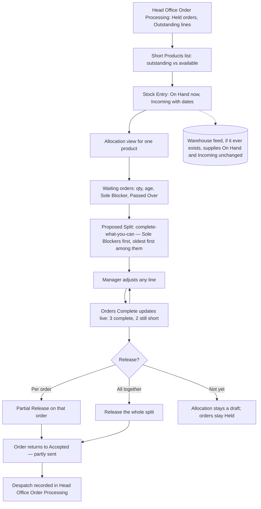

# Stock Allocation: UX & User Stories

**Generated:** 19 September 2026 (amended 23 September 2026 from the UX design sessions — see `../uxdocs/04-user-stories-amendments.md`)
**Bounded context:** Stock Allocation, within Ordering
**Primary user:** Head Office User
**Scope:** Deciding who gets short stock when there isn't enough to fill every order. Four screens: Short Products, Stock Entry (on hand and incoming), Allocation view, Release confirmation.

---

## 1. Bounded Context & Scope

### Bounded context

- **Domain area:** Stock Allocation. It answers one question head office cannot answer order by order: when several orders want the same product and there isn't enough, who gets it. Everything about an order's own lifecycle belongs to Head Office Order Processing.
- **Ubiquitous language:**
  - **Short Product** — a product with Outstanding quantity across orders greater than the stock available for it. Only short products appear here; the rest never need allocating.
  - **On Hand** — the quantity available now, entered by head office for a Short Product. A stand-in for a warehouse feed, entered exactly as a Run-out Quantity is.
  - **Incoming** — an expected delivery: a quantity and a date, entered by head office. Allocatable alongside On Hand, so the view is a timeline rather than a single pool.
  - **Waiting Order** — an order with Outstanding quantity on this product. Shown with its quantity, age, Location and whether this product **alone** is holding it up.
  - **Sole Blocker** — this product is the only thing short on that order, so filling it releases the whole order. Orders short on several products are not Sole Blockers for any of them.
  - **Proposed Split** — the system's suggested allocation, made on a **Complete-what-you-can** basis: Sole Blockers first, oldest first among them, then the rest. Always adjustable.
  - **Orders Complete** — the live count of how many Waiting Orders the current split would fully fill ("3 orders complete, 2 still short"). The figure the manager is really deciding on.
  - **Passed Over** — a Waiting Order that has been left short across repeated allocations, or is short on several products. Surfaced so the manager can deliberately break the default rule.
  - **Release** — sending allocated quantities to the warehouse, as a **Partial Release** on each order (Head Office Order Processing). The manager chooses to release each order as it is allocated, or to hold the whole allocation and release together.
  - **Feed-ready** — On Hand and Incoming are entered by hand now; a warehouse system that can be read would replace the entry without changing the model or the screens.
- **Upstream contexts:**
  - **Head Office Order Processing** — Held orders, Accepted orders with Outstanding lines, the Stock Shortfall flag.
  - **Range Lifecycle** — Run-out Remaining, availability states.
  - **Customer Directory** — Locations, and their Closed state.
  - **Warehouse system** (future) — On Hand and Incoming, if a feed becomes available.
- **Downstream contexts:**
  - **Head Office Order Processing** — Partial Releases and Holds returning to each order; despatch is recorded there as usual.
  - **Rep at a Location** and **Self-service** — the resulting "Accepted, partly sent" status and outstanding quantities, with no new rep- or customer-facing screens.
- **Terms that mean something different elsewhere:**
  - **Allocation** — dividing short stock between orders; unrelated to assigning Locations to reps (Coverage Management).
  - **Release** — the warehouse hand-off; unrelated to un-holding an order, which it happens to cause.
  - **On Hand** — head office's entered figure, not a stock-controlled balance; the system is not a stock system.

### Scope

- **In scope:**
  - Short Products list, driven by Outstanding versus available
  - Entering On Hand per short product; entering, editing and removing Incoming deliveries
  - Allocation view per product: waiting orders with age, quantity, Sole Blocker marker, Passed Over marker
  - Proposed Split on a complete-what-you-can basis, fully adjustable
  - Live Orders Complete figure
  - Releasing per order or all together; leaving an order unallocated (it stays Held)
  - A seam for a warehouse feed to supply On Hand and Incoming
- **Out of scope:**
  - The warehouse feed itself, and any integration work
  - Purchasing from suppliers or raising purchase orders
  - Order states, acceptance, rejection and despatch recording (Head Office Order Processing)
  - Stock control, stock takes, locations within the warehouse
  - Telling customers about delays beyond the status they already see
- **Assumptions:**
  - Allocation is for exceptions; most products are never short and never appear here.
  - On Hand is entered per short product, not maintained for the catalogue.
  - An allocation is a draft until released; nothing reaches the warehouse before that.
  - Cancelled orders drop out of the waiting list automatically.
  - Age is measured from the order's Accepted date.

---

## 2. Personas

### Head Office User

- **Role:** processes orders and keeps the warehouse fed; usually also a Sales Manager.
- **Responsibilities:** decides who gets short stock; records what is on hand and what is coming; releases what can be filled.
- **Context on arrival:** a handful of Held orders flagged with a shortfall, a delivery due next week, and reps asking when their customers will see stock.
- **Goal:** "When I can't fill everything, get as much out of the door as I can, and know who I'm making wait."
- **Pain points:** deciding order by order without seeing who else is waiting; an order that quietly sits for weeks because it is short on three things at once; no record of why one customer was served before another.

---

## 3. Flow Sketch



---

## 4. Design Decisions

### Head office enters the figures; the model is feed-ready

- **Chose:** On Hand and Incoming are typed in by head office for short products only; a warehouse feed would later supply the same two figures without changing the screens or the decisions.
- **Over:** waiting for an integration; assuming no stock information at all.
- **Because:** the system holds no warehouse stock and the feed is not confirmed; the same approach already works for run-out quantities and despatch recording; entering figures only for short products keeps the effort proportionate.
- **Trade-off accepted:** figures are as current as the last time someone typed them; allocation is only as good as that.

### On Hand and Incoming are both allocatable

- **Chose:** the view shows what is here and what is coming with dates, and the manager can allocate from either.
- **Over:** allocating only what is in the warehouse now.
- **Because:** "who gets the 200 we have, and who waits for the 400 on the 22nd" are different questions with different answers; a customer who can wait a week is better served from the incoming batch than left with nothing.
- **Trade-off accepted:** an incoming delivery that arrives late or short invalidates part of the allocation; the manager re-allocates.

### Complete-what-you-can is proposed, never imposed

- **Chose:** the split is proposed so as to fully fill as many orders as possible — orders this product alone is holding up first, oldest first among them — and every line is adjustable, with a live Orders Complete figure.
- **Over:** oldest-first; proportional shares; by customer tier; the manager typing every figure.
- **Because:** getting the most orders out of the door is the usual intent, and the proposal saves the typing; the manager holds the context the system does not (an urgent campaign, a customer on the brink); showing Orders Complete rather than quantities keeps the decision in the terms that matter.
- **Trade-off accepted:** a large order can wait while small ones go out; the manager overrides where that is wrong.

### Orders passed over are surfaced

- **Chose:** an order short on several products, or repeatedly left short, is marked Passed Over in the waiting list.
- **Over:** relying on the default rule alone.
- **Because:** complete-what-you-can systematically disadvantages orders short on several things, since they never top any product's list; without surfacing them the rule quietly creates a set of neglected orders nobody chose to neglect.
- **Trade-off accepted:** the manager must act on the marker; it changes nothing on its own.

### The allocation is a draft until the manager releases it

- **Chose:** nothing reaches the warehouse until the manager says so; they may release each order as it is allocated or hold the whole split and release together.
- **Over:** releasing automatically as quantities are entered; always releasing together.
- **Because:** releasing as you go moves stock sooner when a customer is waiting; holding until the split is complete lets the manager see the whole picture and change their mind on a contentious division; neither suits every case.
- **Trade-off accepted:** a draft left unreleased leaves orders Held; the Short Products list keeps it visible.

---

## 5. User Stories

### US-001: See which products are short

| Field | Value |
|---|---|
| **Story** | As a Head Office User, I want a list of products where outstanding orders exceed what is available so that I only spend time on the ones that need deciding |
| **Priority** | Must Have |
| **Status** | Ready |
| **Dependencies** | Head Office Order Processing US-003, US-006 |

**Acceptance criteria:**

*Scenario 1: Short products listed*
```
Given "SPF30 Sun Lotion 200ml" has 340 units outstanding across 7 orders and 200 On Hand
Then it appears with "340 outstanding · 200 on hand · 7 orders waiting · 2 held"
```

*Scenario 2: Ordered by pressure*
```
Then products are ordered by how many orders are waiting, with the oldest waiting order's age shown
```

*Scenario 3: No stock figure yet*
```
Given a product flagged short by a Held order but with no On Hand entered
Then it appears with "On hand not entered" and an entry action
```

*Scenario 4: Nothing short*
```
Given every outstanding line can be filled
Then the list reads "No products are short"
```

*Scenario 5: Resolved by a delivery*
```
When On Hand is increased above the outstanding quantity
Then the product leaves the list and its waiting orders can be released in full
```

---

### US-002: Record what is on hand and what is coming

| Field | Value |
|---|---|
| **Story** | As a Head Office User, I want to enter the quantity available and any expected deliveries so that I can allocate against both |
| **Priority** | Must Have |
| **Status** | Ready |
| **Dependencies** | US-001 |

**Acceptance criteria:**

*Scenario 1: On hand*
```
When I enter On Hand 200 for "SPF30 Sun Lotion 200ml"
Then the allocation view shows 200 available now, with who entered it and when
```

*Scenario 2: Incoming delivery*
```
When I add Incoming 400 expected 22 October 2026
Then it is shown alongside On Hand as a second pool with its date
```

*Scenario 3: Several deliveries*
```
When I add a second Incoming 250 expected 5 November 2026
Then both are listed in date order and both are allocatable
```

*Scenario 4: Delivery arrives*
```
When the 22 October delivery arrives and I move it to On Hand
Then On Hand increases, the Incoming entry closes, and any allocation against it is marked as now available
```

*Scenario 5: Delivery short or late*
```
When I change the Incoming quantity to 300 or the date to 29 October
Then allocations made against it are flagged "Delivery changed — review allocation"
```

*Scenario 6: Measure-based product*
```
Given a product sold per kg
Then On Hand and Incoming are entered and shown in kg
```

---

### US-003: Allocate a short product across waiting orders

| Field | Value |
|---|---|
| **Story** | As a Head Office User, I want the screen to propose how to divide short stock, showing how many orders each split would complete, so that I can get the most out of the door and see who I'm making wait |
| **Priority** | Must Have |
| **Status** | Ready |
| **Dependencies** | US-002 |

**Acceptance criteria:**

*Scenario 1: Waiting orders shown*
```
When I open the allocation view for "SPF30 Sun Lotion 200ml"
Then each waiting order shows its Location, outstanding quantity, age since acceptance, and whether this product alone is holding it up
```

*Scenario 2: Proposed split*
```
Given 200 On Hand and 7 waiting orders, 4 of which this product alone is holding up
Then the proposal fills those 4 first, oldest first, then allocates what remains
And the header reads "4 orders complete, 3 still short"
```

*Scenario 3: Adjust*
```
When I reduce one order's allocation and give the units to another
Then the header updates live to "3 orders complete, 4 still short"
```

*Scenario 4: Over-allocation prevented*
```
When the allocated total exceeds On Hand plus Incoming
Then I see "60 more allocated than available" and cannot release until it balances
```

*Scenario 5: Allocate from incoming*
```
When I allocate an order against the 22 October delivery rather than On Hand
Then that order shows "Allocated from 22 Oct delivery" and is not released until the stock arrives
```

*Scenario 6: Passed Over surfaced*
```
Given an order short on 3 products and left short in 2 previous allocations
Then it is marked "Passed over twice · short on 3 products" regardless of where the proposal placed it
```

*Scenario 7: Cancelled order*
```
Given a waiting order is cancelled
Then it drops out of the list and its allocation returns to the pool
```

**UX amendments (23 Sep 2026)** — settled in the UX design sessions; full record in `../uxdocs/04-user-stories-amendments.md`.

> An Incoming delivery may be too far away to be useful even though it is technically allocatable. Stock changes preserve the current draft until the manager explicitly chooses to re-propose.

*Scenario SA003-A*
```
Given an allocation draft uses On Hand and one or more Incoming deliveries
When I choose "Re-propose..."
Then I see each stock pool with its quantity and availability/expected date
And pools currently included in the draft start selected
```

*Scenario SA003-B*
```
Given an Incoming delivery is too far away to use for current orders
When I exclude it and apply Re-propose
Then the complete-what-you-can proposal uses only the selected stock pools
```

*Scenario SA003-C*
```
Given I am reviewing the pool selection
When the page describes the effect
Then it states that Re-propose replaces current draft allocations across all waiting orders
```

*Scenario SA003-D*
```
Given I cancel the pool-selection step
When I return to H-10
Then the existing draft remains unchanged
```

---

### US-004: Release an allocation

| Field | Value |
|---|---|
| **Story** | As a Head Office User, I want to choose when allocated stock goes to the warehouse, per order or all at once, so that I can move quickly where it's urgent and think where it's contentious |
| **Priority** | Must Have |
| **Status** | Ready |
| **Dependencies** | US-003; Head Office Order Processing US-003 |

**Acceptance criteria:**

*Scenario 1: Release one*
```
When I release a single order's allocation of 36
Then that order becomes Accepted — partly sent with 36 released, and the rest of the split stays a draft
```

*Scenario 2: Release all*
```
When I release the whole split
Then each allocated order is part-released, orders allocated nothing stay Held, and the product's On Hand reduces by the released total
```

*Scenario 3: Nothing yet*
```
When I leave without releasing
Then the draft is kept, the orders stay Held, and the product stays on the Short Products list
```

*Scenario 4: Full fill*
```
Given an order's whole outstanding quantity is allocated and released
Then it leaves the waiting list and is Accepted, pending despatch
```

*Scenario 5: Location closed*
```
Given a waiting order's Location has been Closed
Then it is flagged "Location closed" and excluded from the proposal, for me to release or reject deliberately
```

*Scenario 6: Run-out product*
```
Given the product is in Run-out
Then allocation cannot exceed its Remaining, and released quantities reduce Remaining as any order does
```

---

### US-005: Pick up an allocation later

| Field | Value |
|---|---|
| **Story** | As a Head Office User, I want unreleased allocations to be visible and current so that a draft I left yesterday is still trustworthy today |
| **Priority** | Should Have |
| **Status** | Ready |
| **Dependencies** | US-003, US-004 |

**Acceptance criteria:**

*Scenario 1: Draft shown*
```
Given I left an allocation unreleased
Then the Short Products list shows "Allocation drafted, not released" with its age
```

*Scenario 2: New orders since*
```
Given 2 more orders began waiting since the draft
Then they appear in the list unallocated and the proposal offers to re-propose across all of them
```

*Scenario 3: Stock changed since*
```
Given On Hand has been reduced below the drafted total
Then the draft is flagged over-allocated and cannot be released until adjusted
```

---

## 6. Requires Clarification

1. **Warehouse feed:** if it becomes available, whether it supplies On Hand only or Incoming too, and how often.
2. **Purchasing:** raising supplier orders is out of scope; confirm it stays outside this system.
3. **Allocation record:** whether a history of who allocated what to whom is needed (not designed; would matter if customers query it).
4. **Passed Over thresholds:** how many times or how long before an order is marked; assumed twice, or short on more than one product.
5. **Head Office Order Processing:** already links Held orders here; no further amendment expected. *Amended 23 Sep 2026:* orders are now accepted automatically, and short quantities from Stock Shortfall and Oversold lines are routed here as Outstanding without a head office decision. Whether Hold survives is open there.

---

## 7. Recommended Next Steps

1. Confirm whether the warehouse feed exists (item 1); it changes nothing structurally but removes the entry work.
2. Decide whether an allocation history is needed (item 3) before build, since it is hard to add retrospectively.
3. With this area complete, review the full set: thirteen area documents now cover the system, and the open items across them are mostly confirmations rather than design gaps.
4. Run the offline storage spike for the tablet snapshot — still the largest technical unknown in the set.
