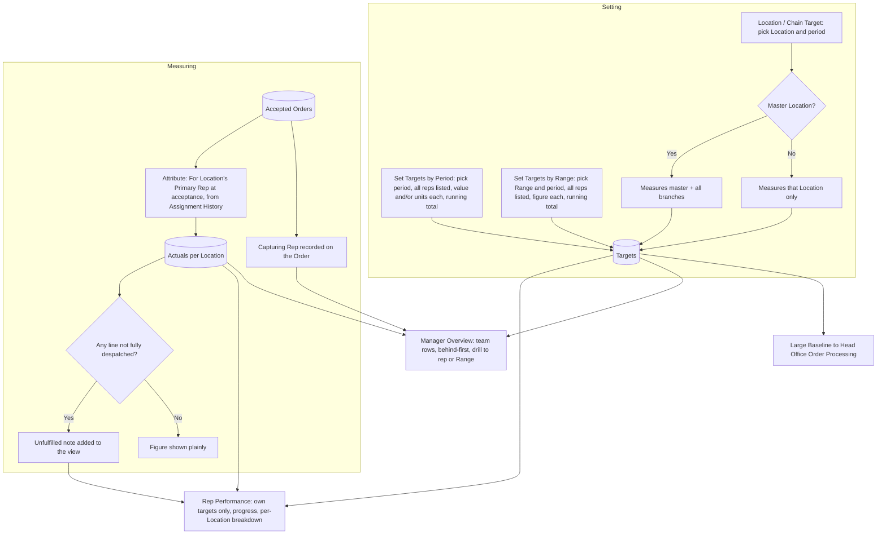

# Targets & Performance: UX & User Stories

**Generated:** 18 September 2026 (amended 19 September 2026 for Promotions; amended 23 September 2026 from the UX design sessions — see `../uxdocs/04-user-stories-amendments.md`)
**Bounded context:** Performance, within Sales Operations
**Primary users:** Sales Manager (setting and monitoring); Field Salesperson (own performance)
**Scope:** The website screens where managers set targets that fit each rep's patch and watch actuals against them, and where reps see how they are doing. Five screens: Set Targets by Period, Set Targets by Range, Location/Chain Target, Rep Performance, Manager Performance Overview.

---

## 1. Bounded Context & Scope

### Bounded context

- **Domain area:** Performance. It sets expectations and measures them. It creates no orders and changes no assignments; it reads what other areas produced.
- **Ubiquitous language:**
  - **Target** — a measurable expectation for a **Period**, expressed as a **value**, a **unit count**, or both. Its **Subject** is one of:
    - **Rep Target** — a Salesperson's overall expectation.
    - **Rep–Range Target** — a Salesperson's expectation for one Product or Range.
    - **Location Target** — occasional; on a **Master Location** it measures the whole chain (see Chain Roll-up).
    - Territory is deliberately **not** a subject: a rep covers a territory, so the Rep Target serves.
  - **No team target** — a manager sets each rep's figure directly. Any team figure is the sum of those, shown as feedback on the setting screen, never stored or shown to reps.
  - **Blank ≠ zero** — a rep with no figure has no target for that Range; a target of zero would mean "sell none of this".
  - **Gross line value** — the sum of line prices as captured, before any order-level promotional discount. Actuals measure this; a Spend Threshold discount is tracked separately at order level, so a suncare target does not move because the customer also bought enough vitamins to cross a threshold.
  - **Actuals** — the gross line value and units on **Accepted** Orders in the period. Rejected and Cancelled Orders never count. Recorded per Location.
  - **Unfulfilled Note** — a line on any actuals view stating how much of the figure sits on Orders not yet fully despatched ("€1,240 of this is on orders not yet fully despatched"). It never reduces the figure.
  - **Attributed Rep** — the **Primary Rep of the For Location at the moment the Order was Accepted**, taken from Coverage Management's Assignment History. Attribution never moves afterwards; a reassignment changes future sales only.
  - **Capturing Rep** — the rep who actually took the Order, recorded on the Order. Equals the Attributed Rep for ordinary orders; differs for a master's order placed for a branch. Self-service Orders have no Capturing Rep.
  - **Captured By** — a manager-facing view of what a rep took, regardless of where it counts. Never part of a rep's target progress.
  - **Chain Roll-up** — a Location Target on a Master Location measures Accepted Orders across the master and all its branches. Performance is still recorded per Location; only the target's measurement rolls up. Aggregation to the Customer remains forbidden.
  - **Large Baseline** — the figure Head Office Order Processing compares an order against for its Large flag: the Location's or Range's target for the period where one exists.
- **Upstream contexts:**
  - **Ordering** — Accepted Orders with value, units, For and Ordered By Locations, Capturing Rep, and despatch state.
  - **Coverage Management** — Assignment History for attribution.
  - **Customer Directory** — master/branch relationships for Chain Roll-up.
  - **Product Catalogue** — Products and Ranges as target subjects.
- **Downstream contexts:**
  - **Head Office Order Processing** — the Large Baseline.
  - **Rep at a Location** (area 1) — the rep's own targets and progress, if surfaced on the tablet (see clarification).
- **Terms that mean something different elsewhere:**
  - **Target** — here a sales expectation; unrelated to a touch target in UI terms.
  - **Actuals** — Accepted order value, not invoiced revenue (which lives in the external system).
  - **Period** — a target's window; unrelated to Visit Planning's Cycle Period.

### Scope

- **In scope:**
  - Creating and editing Rep, Rep–Range and Location Targets with value and/or units for a period
  - Set-by-period screen (all reps, one figure each, running total)
  - Set-by-range screen (all reps for one Range, running total)
  - Location/chain target with roll-up
  - Rep's own performance: targets, actuals, per-Location breakdown, unfulfilled note
  - Manager's overview across the team, including Captured By
  - Attribution by Assignment History; supplying the Large Baseline
- **Out of scope:**
  - Territory targets
  - Commission, bonuses, pay
  - Forecasting and pipeline value (Leads are area 2)
  - Invoiced revenue and margin
  - Tuning the Large flag's multiplier (Head Office Order Processing)
  - Visit-activity measures (call counts, coverage) — see clarification
- **Assumptions:**
  - Periods are calendar months, quarters or years, chosen when setting; overlapping periods for the same subject are allowed.
  - A target's value is in the order's currency; no multi-currency handling.
  - Order value uses the price captured on the Order (valid when captured).
  - A rep who leaves keeps their historical actuals; their targets end with the period.
  - The rep's performance view is on the website; tablet exposure is an open question.

---

## 2. Personas

### Sales Manager

- **Role:** manages a team of reps; usually also a Head Office User.
- **Responsibilities:** sets each rep's overall and per-Range expectations for the period; sets the occasional chain target; watches who is behind and acts early.
- **Context on arrival:** the start of a quarter, or a mid-period check; a handful of reps whose patches they know well — one covering a large rural area with few customers, another a dense town.
- **Goal:** "Set expectations that fit each rep's patch, and see early who's behind."
- **Pain points:** typing the same figure eight times when the figures should differ; not knowing whether a flat-looking rep has actually been winning chain business; a number that turns out to include orders the warehouse never shipped.

### Field Salesperson

- **Role:** the area 1 rep.
- **Responsibilities:** hits their overall and Range targets; knows where they stand mid-period.
- **Context on arrival:** at a laptop, planning the week or checking progress; wants one clear answer, not a dashboard.
- **Goal:** "Know what I'm expected to sell and how I'm doing."
- **Pain points:** team-wide figures that look like personal ones; numbers that move for reasons outside their control.

---

## 3. Flow Sketch



---

## 4. Design Decisions

### Three subjects; no territory, no team target

- **Chose:** targets are set on a rep, a rep-and-Range, or occasionally a Location; the manager enters each rep's figure directly, with the team total shown only as feedback while setting.
- **Over:** the elaboration's four subjects including territory; a team target split between reps.
- **Because:** a rep covers a territory, so a rep target already expresses it; reps' figures differ by design (area size, customer density, local factors), so a split with an even default would be the wrong starting point; an unused subject is screens and tests nobody needs.
- **Trade-off accepted:** pushing a Range across eight reps is eight figures; the by-Range screen makes that one sitting.

### Reps see only their own targets

- **Chose:** the rep's view contains their Rep Target and their Rep–Range Targets, and nothing team-wide.
- **Over:** showing the team figure with the rep's contribution.
- **Because:** every target already has exactly one owner, so the elaboration's open question ("should reps see targets set by others?") does not arise; a team figure beside a personal one invites misreading.
- **Trade-off accepted:** a rep cannot see how the team is doing; the manager can.

### Actuals on acceptance, with an honest note

- **Chose:** a sale counts when the Order is Accepted, for the ordered quantity; any view showing actuals states how much sits on Orders not fully despatched; the figure is never reduced.
- **Over:** counting on despatch; showing two competing figures.
- **Because:** acceptance is the point the rep controls, and despatch is not; measuring on despatch would move a rep's number for warehouse reasons; a target measured on orders that never ship would still overstate, so the note carries that honesty without penalising the rep.
- **Trade-off accepted:** actuals will exceed eventual invoiced revenue; the note is the only reconciliation this system offers.

### Attribution is historical and follows the For Location

- **Chose:** a sale belongs to the Primary Rep of the For Location at the moment of acceptance, from Assignment History, and never moves; a master's order for a branch counts at the branch.
- **Over:** attributing to the current rep; attributing a chain order to the capturing rep.
- **Because:** performance is measured per Location; a rep taking over a Location should not inherit its history, nor lose their own; consistency with "performance is measured per Location" across every area.
- **Trade-off accepted:** the rep who won a chain order sees none of it in their actuals — addressed by Capturing Rep and chain targets, not by changing attribution.

### Capturing Rep recorded, shown to managers only

- **Chose:** every Order records who took it; the manager's overview can show Captured By alongside attributed actuals; it never appears in a rep's target progress.
- **Over:** inferring it from the Ordered By Location; adding it to rep progress.
- **Because:** a rep who wins €18,000 of chain business should be visible as having done so; putting it in their progress would double-count the same sale across two reps.
- **Trade-off accepted:** two figures a manager must not confuse; the overview labels them explicitly.

### A chain target rolls up its branches

- **Chose:** a Location Target on a Master Location measures the master and all its branches, with a per-branch breakdown.
- **Over:** measuring only the master Location.
- **Because:** a head office holds no stock, so a target measured there alone would measure nothing; the chain is the real operating unit.
- **Trade-off accepted:** one target spans Locations belonging to several reps; the breakdown shows who contributed.

---

## 5. User Stories

### US-001: Set rep targets for a period

| Field | Value |
|---|---|
| **Story** | As a Sales Manager, I want to enter each rep's target for a period on one screen, with a running total, so that I can set figures that fit each patch in one sitting |
| **Priority** | Must Have |
| **Status** | Ready |
| **Dependencies** | Reps and reporting lines (Coverage Management) |

**Acceptance criteria:**

*Scenario 1: Set for the team*
```
Given I manage 8 reps
When I choose period Q4 2026 and enter values from €28,000 to €52,000
Then each is saved as that rep's Rep Target and the running total shows €312,000
```

*Scenario 2: Units as well as value*
```
When I enter €40,000 and 4,000 units for Colm
Then both measures are saved and both are tracked
```

*Scenario 3: Blank means no target*
```
When I leave Brian's row empty
Then Brian has no Rep Target for Q4 and his performance view says "No target set for this period"
```

*Scenario 4: Neither measure*
```
When I try to save a row with no value and no units but a period
Then it is rejected with "Enter a value, units, or both"
```

*Scenario 5: Edit mid-period*
```
Given Q4 is under way and Colm's target is €40,000
When I change it to €45,000
Then his progress recalculates against €45,000 and the change is dated in history
```

**UX amendments (23 Sep 2026)** — settled in the UX design sessions; full record in `../uxdocs/04-user-stories-amendments.md`.

> Targets usually change a little from one period to the next, so retyping every figure costs more than the anchoring risk. This is a deliberate exception to *propose, don't impose*. Settled in `../uxdocs/05-manager.md` M12.1–M12.2.

*Scenario TP001-A*
```
Given Colm's Q4 2026 Rep Target was €40,000 and Brian had none
When I choose period Q1 2027
Then Colm's row shows €40,000, editable, and Brian's row is blank
And the running total starts from the carried figures
```

*Scenario TP001-B*
```
Given I changed 2 of 8 rows and left 6 as carried
When I save
Then all 8 figures are saved as Q1 2027 targets and dated in history as set by me today
And the confirmation states "6 of 8 targets were carried forward from Q4 unchanged. You can update them later." and names those reps
```

---

### US-002: Set rep targets for a Range

| Field | Value |
|---|---|
| **Story** | As a Sales Manager, I want a screen per Range and period listing every rep so that I can push a line with a figure that suits each rep's area |
| **Priority** | Must Have |
| **Status** | Ready |
| **Dependencies** | US-001; Ranges (Product Catalogue) |

**Acceptance criteria:**

*Scenario 1: Per rep for a Range*
```
When I choose Range "Summer 2027", period Q2 2027, and enter €12,000 for Aoife, €9,000 for Colm and blank for the rest
Then two Rep–Range Targets exist and the running total shows €21,000
```

*Scenario 2: Product instead of Range*
```
When I choose a single Product rather than a Range
Then the same screen is used and targets measure that Product only
```

*Scenario 3: Archived Range*
```
Given "Summer 2026" is archived
Then it is not offered for a new target; existing targets against it still show their period out
```

*Scenario 4: Running total is feedback only*
```
Then the total is displayed while setting and is not stored, shown to reps, or reported as a team target
```

**UX amendments (23 Sep 2026)** — settled in the UX design sessions; full record in `../uxdocs/04-user-stories-amendments.md`.

> Targets usually change a little from one period to the next, so retyping every figure costs more than the anchoring risk. This is a deliberate exception to *propose, don't impose*. Settled in `../uxdocs/05-manager.md` M12.1–M12.2.

*Scenario TP002-A*
```
Given Aoife had a Rep–Range Target for "Summer 2026" in Q2 2026
When I set targets for the same Range for Q3 2026
Then her row is pre-filled with that figure on the same terms
```

---

### US-003: Set a Location or chain target

| Field | Value |
|---|---|
| **Story** | As a Sales Manager, I want to set a target on a Location, and have it cover the whole chain when it's a master, so that a key account has an expectation of its own |
| **Priority** | Should Have |
| **Status** | Ready |
| **Dependencies** | Customer Directory master/branch |

**Acceptance criteria:**

*Scenario 1: Chain target*
```
Given Hickey's Head Office has 12 branches
When I set €50,000 for Q4 2026 on it
Then the target measures Accepted Orders at the head office and all 12 branches
And the target view breaks the actual down per branch
```

*Scenario 2: Single Location*
```
When I set a target on an ordinary Location
Then it measures that Location only
```

*Scenario 3: Branch added mid-period*
```
When a 13th branch is added in November
Then its Accepted Orders from that point count towards the chain target
```

*Scenario 4: Branch closes*
```
When a branch is Closed in November
Then its earlier Accepted Orders still count and it appears in the breakdown labelled Closed
```

---

### US-004: See my targets and how I'm doing

| Field | Value |
|---|---|
| **Story** | As a Field Salesperson, I want my own targets with progress and a per-Location breakdown so that I know where I stand and where to push |
| **Priority** | Must Have |
| **Status** | Ready |
| **Dependencies** | US-001, US-002; Accepted Orders |

**Acceptance criteria:**

*Scenario 1: Overall progress*
```
Given my Q4 target is €40,000 and my attributed actuals are €26,400
When I open my performance
Then I see "€26,400 of €40,000 · 66% · 5 weeks left"
```

*Scenario 2: Range targets listed separately*
```
Given I have a Summer 2027 target of €12,000
Then it is listed under my own targets with its own progress, with no team figure anywhere
```

*Scenario 3: Per-Location breakdown*
```
When I open the breakdown
Then I see each Location's contribution, highest first, with its number of Accepted Orders
```

*Scenario 3b: Order-level discount*
```
Given an order with gross line value €520.00 and a 5% spend-threshold discount of €26.00
Then my actuals include €520.00 and the €26.00 discount is not deducted from my target progress
```

*Scenario 4: Unfulfilled note*
```
Given €1,240 of my actuals sits on Orders not fully despatched
Then I see "€1,240 of this is on orders not yet fully despatched"
And the €26,400 figure is unchanged
```

*Scenario 5: No target*
```
Given no target is set for me this period
Then I see "No target set for this period" with my actuals still shown
```

*Scenario 6: Chain order not mine*
```
Given another rep took a chain order for a Location I hold
Then it counts towards my actuals, shown in the breakdown against that Location
```

**UX amendments (23 Sep 2026)** — settled in the UX design sessions; full record in `../uxdocs/04-user-stories-amendments.md`.

> R-03 is a target-attainment view. Ordering by highest contribution foregrounds Locations already performing well rather than those needing attention.

*Scenario TP004-A*
```
Given two or more Locations have targets in the selected period
When I open the per-Location target breakdown
Then targeted Locations are ordered by lowest percentage attainment first
```

*Scenario TP004-B*
```
Given one or more Locations have no target in the selected period
When the Location breakdown uses the default "All" filter
Then those Locations appear in a separate "No target set" section beneath targeted Locations
And each shows its actual contribution and Accepted Order count without a percentage
```

*Scenario TP004-C*
```
Given the Location breakdown is open
When I choose "With targets" or "No target"
Then only Locations matching that target-status filter are shown
And choosing "All" restores both sections
```

*Scenario TP004-D*
```
Given I have a target for the selected period
When headline progress renders
Then its progress bar includes a labelled straight-line pace marker
And exact percentage attainment and time remaining are shown in text
```

*Scenario TP004-E*
```
Given a target may be naturally end-weighted
When actual progress is behind the straight-line marker
Then the rep view does not infer "off track", apply warning colour, or change ordering from that difference
```

*Scenario TP004-F*
```
Given a manager creates or edits a target
When they define its period and amount
Then no pacing model is requested or inferred
And reps and managers use their commercial context to interpret the neutral reference marker
```

**Superseded:** US-004 scenario 3's `highest contribution first` ordering for the target breakdown.

---

### US-005: Watch the team against target

| Field | Value |
|---|---|
| **Story** | As a Sales Manager, I want a team view ordered so that whoever is behind appears first so that I act before the period ends |
| **Priority** | Must Have |
| **Status** | Ready |
| **Dependencies** | US-001, US-002 |

**Acceptance criteria:**

*Scenario 1: Behind first*
```
When I open the overview for Q4 2026
Then each rep shows actual, target, percentage and expected pace for the point in the period, ordered furthest behind first
```

*Scenario 2: Drill to a rep*
```
When I open Colm
Then I see his Rep Target, his Rep–Range Targets, and his per-Location breakdown
```

*Scenario 3: By Range*
```
When I switch to Range view
Then each Range shows every rep's target and actual, with the sum of those targets labelled as a sum, not a team target
```

*Scenario 4: Unfulfilled at team level*
```
Then the same unfulfilled note appears, aggregated for the team
```

*Scenario 5: Reps without targets*
```
Then reps with no target for the period are listed separately with actuals only, so they are not read as 0%
```

**UX amendments (23 Sep 2026)** — settled in the UX design sessions; full record in `../uxdocs/04-user-stories-amendments.md`.

> The sort decides who the manager looks at first. Percentage points behind pace ranks each rep against their own expectation; money behind pace shows the biggest holes in the team's number. Settled in `../uxdocs/05-manager.md` M13.1–M13.3.

*Scenario TP005-A*
```
Given we are 75% through Q4, Colm is at 66% of €40,000 and Aoife is at 50% of €12,000
When I open the overview
Then Aoife (25 pts behind pace) is listed before Colm (9 pts behind pace)
```

*Scenario TP005-B*
```
Given the overview is open
When I choose "Sort by € behind pace"
Then Colm (€3,600 behind) is listed before Aoife (€3,000 behind)
And every rep remains listed
```

*Scenario TP005-C*
```
Given Colm has a value target 8 pts ahead of pace and a units target 15 pts behind
When the overview is ordered
Then Colm is ranked by value (8 pts ahead)
And his row still shows the units figure and its pace gap
```

*Scenario TP005-D*
```
Given a rep has a units-only target
When the overview is ordered by percentage points
Then that rep is ranked by units
```

*Scenario TP005-E*
```
Given Niamh has a units-only target 14 pts behind pace
When I choose "Sort by € behind pace"
Then Niamh is listed under a separate "Units targets" heading below the reps ranked by €, ordered by points behind pace
```

---

### US-006: See what a rep captured, not just what counts to them

| Field | Value |
|---|---|
| **Story** | As a Sales Manager, I want to see the orders a rep actually took, including chain orders that count at other Locations, so that a rep who wins central business is visible |
| **Priority** | Should Have |
| **Status** | Ready |
| **Dependencies** | Capturing Rep on the Order (area 1 and Master & Branch Ordering amendment) |

**Acceptance criteria:**

*Scenario 1: Captured vs attributed*
```
Given Colm captured a €18,000 multi-branch order for Hickey's, attributed across 12 branches held by other reps
When I open Colm
Then I see "Attributed: €26,400" and "Captured: €44,400" clearly labelled as different measures
```

*Scenario 2: Not in rep progress*
```
When Colm opens his own performance
Then his progress shows €26,400 against target and no captured figure
```

*Scenario 3: Self-service orders*
```
Given a Customer User placed an order for a Location Colm holds
Then it counts in his attributed actuals and has no Capturing Rep
```

---

### US-007: Supply the Large Baseline

| Field | Value |
|---|---|
| **Story** | As a Head Office User, I want an order's size compared against the relevant target so that the Large flag means something for that Location |
| **Priority** | Should Have |
| **Status** | Draft |
| **Dependencies** | Head Office Order Processing US-002 |

**Acceptance criteria:**

*Scenario 1: Location target used*
```
Given Hickey's Head Office has a €50,000 Q4 chain target
When an order arrives whose value exceeds the configured share of that target
Then the order is flagged Large with "3.2× expected pace for October"
```

*Scenario 2: No location target, Range target used*
```
Given no Location target but a Rep–Range target covering the order's products
Then that is used as the baseline
```

*Scenario 3: No target at all*
```
Then the baseline falls back to the same period in previous years, and with no history no Large flag is raised
```

**Open questions:** whether the comparison is against the whole-period target or the pace to date (Scenario 1 assumes pace), and the multiplier — both to be tuned with head office.

---

## 6. Requires Clarification

1. **Large comparison rule:** whole period vs pace to date, and the multiplier (US-007).
2. **Tablet exposure:** should a rep see their progress on the tablet (a figure in the snapshot), or website only? Assumed website only.
3. **Visit-activity measures:** the elaboration mentions targets only in sales terms; confirm no target on calls made or visits completed.
4. **Period definitions:** calendar months/quarters assumed; confirm no bespoke sales calendar.
5. **Capturing Rep (applied):** recorded on every Order in area 1 and Master & Branch Ordering.
5b. **Promotion reporting:** what each offer cost and sold is not designed (Promotions item 2).
6. **Elaboration:** US-12 lists territory as a target subject; now dropped. US-09's open question about seeing others' targets is resolved by one owner per target.
7. **Inherited visits (23 Sep 2026):** visits inherited through a reassignment are excluded from the new rep's performance until they close (Coverage Management). Sales attribution is unchanged.

---

## 7. Recommended Next Steps

1. Tune the Large comparison rule with head office (item 1); it is the last thing blocking that flag.
2. Apply the Capturing Rep amendment (item 5) with the next batch.
3. Take Stock Allocation next if the warehouse feed is confirmed, otherwise Pricing & Promotions.
4. Confirm items 3 and 4 with the sales team before build.
