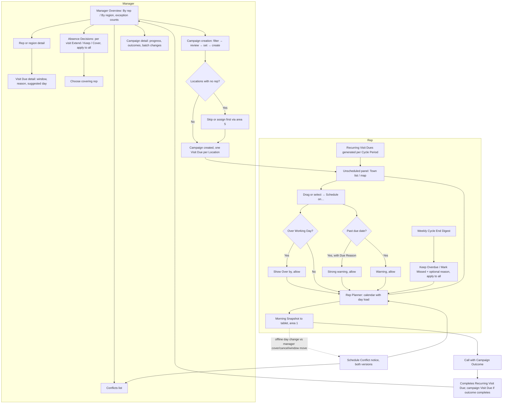

# Visit Planning: UX & User Stories

**Generated:** 17 September 2026 (revised same day after clarification; amended 18 September 2026 for Coverage Management; amended 23 September 2026 from the UX design sessions — see `../uxdocs/04-user-stories-amendments.md`)
**Bounded context:** Visit Planning, within Sales Operations
**Primary users:** Sales Manager; Field Salesperson (planning role)
**Scope:** The website screens where managers decide what needs visiting and when, handle absences and campaigns, and where reps turn their due visits into a weekly schedule. Seven screens: Rep Planner, Cycle End Digest, Manager Overview, Absence Decisions, Campaign Creation, Campaign Detail, Conflicts.

---

## 1. Bounded Context & Scope

### Bounded context

- **Domain area:** Visit Planning, the part of Sales Operations that decides *what* needs visiting and *by when* (manager) and *on which day* (rep). Doing the visit belongs to area 1.
- **Ubiquitous language:**
  - **Visit Due** — a Location a rep is expected to visit within a **Due Window**. Completed by a qualifying Call within the window.
    - **Recurring Visit Due** — generated from the Location's **Visit Frequency** on a fixed calendar. One per **Cycle Period**.
    - **One-off Visit Due** — created by a manager for a reason, alone or as part of a Visit Campaign. A single one-off starts from the Location; it goes to the Primary Rep by default, but the manager may choose another rep for this visit only, without changing the Location's assignment.
  - **Visit Frequency** — how often a Location should be visited, e.g. "every 4 weeks". Defaulted from the Location's Location Profiles (the most frequent wins when several supply one), overridable per Location.
  - **Cycle Start** — the anchor date from which a Location's Cycle Periods are counted. Required: it is asked for whenever a Visit Frequency is set, so no Location is without one.
  - **Cycle Period** — one fixed span of the calendar (Cycle Start plus multiples of the Visit Frequency). The Due Window of a Recurring Visit Due is its Cycle Period.
  - **Due Reason** — optional manager note on a Visit Due explaining why the date matters ("Autumn range order deadline"). Shown wherever the visit appears, and strengthens the past-due warning. When supplied, it has a structured **Due Reason Type** (from a vocabulary maintained by an authorised manager or administrator, each with an icon and colour from a controlled set, never colour alone) plus optional free-text explanation.
  - **Suggested Day** — a manager's recommendation. Shown beside the rep's choice, never applied.
  - **Scheduled Day** — the day the rep has chosen. Owned by the rep.
  - **Visit Duration** — expected time on site. Defaulted from the Location's Location Profiles (the longest wins when several supply one), overridable per Location or per One-off Visit Due. The rep can set the duration of any **Scheduled Visit** when scheduling it.
  - **Scheduled Visit** — one trip to one Location on one day. A Recurring and a campaign Visit Due at the same Location in the same window are scheduled as one Scheduled Visit, and one Call serves both.
  - **Travel Allowance** — a flat system value added to each visit's duration when calculating day load.
  - **Working Day** — a rep's available hours per day, reduced by partial Planned Absence.
  - **Day Load** — scheduled time (durations plus Travel Allowance) against Working Day. **Over** when it exceeds it; never blocks.
  - **Location Profile** — a category of Location ("Large pharmacy") that may carry defaults: Visit Frequency, Visit Duration, Low Stock Thresholds. Renamed from area 1's "Stocking Profile". Distinct from the elaboration's Location Type until area 8 decides otherwise. **A Location may hold many profiles**; each default resolves separately to the most demanding value and is shown with its source ("Every 2 weeks (from Large pharmacy)"). See Customer Directory.
  - **Planned Absence** — days a rep is known to be off, entered in advance. Absence days are always blocked for scheduling.
  - **Absence Decision** — the manager's per-Visit-Due choice for visits whose Due Window overlaps a Planned Absence: **Extend** (push the window out by the absence length), **Keep** (window unchanged), or **Cover** (reassign to another rep for that window). Until decided, windows are kept and the absence shows as **Needs a decision**.
  - **Cover** — a Visit Due temporarily held by a **Covering Rep**. Ownership of the Location does not change; the covering rep sees and can act on that Location for the window only.
  - **Overdue** — a Visit Due whose window ended without a qualifying Call and which is still open.
  - **Missed** — an Overdue Visit Due closed by a person (rep or manager), with an optional reason. Recorded for the manager. Never set by the system.
  - **Generation Horizon** — how far ahead Recurring Visit Dues are created. Set by the manager.
  - **Cycle End Digest** — a weekly website notification, sent on Sunday, listing the rep's Visit Dues whose windows ended without a Call, each with **Keep Overdue** or **Mark Missed**.
  - **Visit Campaign** — a named group of One-off Visit Dues created in bulk ("Autumn range launch") with shared Due Window, Due Reason, optional Visit Duration and Suggested Day, an **Outcome List**, and tracked progress.
  - **Campaign Outcome** — one entry from a campaign's Outcome List, recorded on a Call at the Location. Each outcome has **Completes visit: yes/no**. Recording a completing outcome completes that campaign Visit Due; a non-completing one (e.g. *Follow up*) records what happened and leaves it open. One outcome per campaign per Call.
  - **Schedule Conflict** — a notice raised when a manager's change makes a rep's offline Scheduled Day impossible or pointless (visit covered, cancelled, or its window moved so the day falls outside it). Shown to both with both versions; the manager's change applies meanwhile; clears when either amends the visit.
  - **Unassigned** — a Location with Visit Dues but no Primary Rep (Coverage Management).
  - **Primary Rep / Specialist** — from Coverage Management. Recurring Visit Dues always go to the Location's Primary Rep. A campaign Visit Due goes to the Location's **Specialist** whose scope matches the campaign's link (its Brand, Customer or Location Profile) where exactly one does, else to the Primary Rep. If more than one Specialist matches, or the campaign has no link and several Specialists are at the Location, the manager chooses in campaign Review; nothing is preselected.
  - **Handover Pending** — an open visit still held by a rep who is no longer the Location's Primary Rep (or a specialist whose scope was removed) with no Handover decision made. Counted on the manager overview.
  - **One Call clears all** — a qualifying Call at a Location completes every open Recurring Visit Due there (Overdue and current period). Campaign Visit Dues need their Campaign Outcome. **Exception:** a Call made for a single One-off Visit Due completes only that one-off, whoever holds the recurring visit; the manager and reps decide afterwards whether the recurring visit is kept, moved or cancelled as covered.
  - **Inherited visit** — an open Visit Due that moved to a new rep when a Location changed owner (a leaving rep, a long-absence batch, or a handover Move). Marked "inherited from <rep>" wherever it appears; counts in the new rep's operational figures but is excluded from their performance, until the visit closes (Coverage Management).
- **Upstream contexts:**
  - **Customer Directory** — Locations with Town, Location Profile, coordinates (geocoding is a new dependency).
  - **Coverage Management** (area 5) — Primary Rep and Specialists per Location; manager–rep reporting lines; Handover decisions and Left Visits; cross-team cover permission.
  - **Product Catalogue** — Location Profile defaults (area 8).
  - **Sales Operations (field)** — Calls, with Campaign Outcomes, from the tablet (area 1).
- **Downstream contexts:**
  - **Rep at a Location** (area 1) — Visit Dues, Due Reasons, Suggested Days, open campaigns with Outcome Lists, cover, conflict notices, decision counts, all via the Morning Snapshot.
  - **Performance** (area 6) — Missed and Overdue history, campaign outcomes.
- **Terms that mean something different elsewhere:**
  - **Call** — a recorded sales contact (area 1), not a phone call and not the visit plan; "call cycle" is deliberately not used — the concept is **Visit Frequency**.
  - **Campaign** — here a set of visits with a purpose; not a marketing campaign in any other context.
  - **Cover** — temporary reassignment of a Visit Due, not a change of Location assignment (area 5).
  - **Complete** — a Call *completes* a Visit Due; a campaign is *done* when all its visits are complete.

### Scope

- **In scope:**
  - Visit Frequency, Cycle Start and Visit Duration overrides on a Location
  - Generation of Recurring Visit Dues per Cycle Period
  - Rep Planner: calendar plus unscheduled panel (Town list / map), drag-and-drop and select-then-assign, day load with soft warning
  - Planned Absence entry and per-visit Absence Decisions with bulk apply
  - Cover, including the covering rep's temporary access
  - Weekly Cycle End Digest and Missed recording
  - Manager Overview by rep / by region with exception counts, drill-down to visits
  - Single One-off Visit Dues and bulk Visit Campaigns (filter → review → set → create)
  - Campaign progress, outcome breakdown, batch changes
  - Campaign Outcome capture on the Call (as an amendment to area 1)
  - Schedule Conflict notices on website and tablet; Unassigned exceptions
- **Out of scope:**
  - Assigning Locations or territories to reps (area 5)
  - Maintaining Location Profiles, their defaults, and geocoding Locations (area 8)
  - Route optimisation or driving-time calculation
  - The tablet itself beyond the listed amendments (area 1)
  - Targets and performance reporting (area 6)
  - Leave approval as an HR process — Planned Absence is entered as fact
- **Assumptions:**
  - Each rep reports to one manager. Any rep may be chosen as covering rep; the covering rep's manager is notified, not asked (Coverage Management).
  - The weekly digest is sent on Sunday; the day is a system setting.
  - The Generation Horizon is a manager setting.
  - Travel Allowance is one flat system value.
  - "Due soon" (14 days) and the tablet's same-Town prompt from area 1 apply unchanged.
  - Suggested Day changes never raise a conflict — the rep's Scheduled Day always stands.
  - A visit that nobody actions in the digest stays Overdue indefinitely.
  - Coordinates exist for most Locations; those without appear in the list only.
  - A covering rep's Morning Snapshot carries the covered Location's Suggested List and recent Calls and Orders for the window.

---

## 2. Personas

### Sales Manager

- **Role:** manages a team of Field Salespersons; may also sell.
- **Responsibilities:** sets what needs visiting and by when; handles absences; runs campaigns; watches coverage across reps and regions.
- **Context on arrival:** at a desk, on the website, usually planning by region or by rep; may be managing eight reps across several counties.
- **Goal:** "Every Location is seen when it should be, and I know early when it won't be."
- **Pain points:** finding problems only after visits have gone Overdue; launching a range across 40 shops one visit at a time; a rep's leave quietly leaving shops unvisited.

### Field Salesperson (planning)

- **Role:** the same rep as area 1, now at a laptop planning the week.
- **Responsibilities:** turns due visits into days; groups by geography; keeps Overdue visits under control; decides what to do about visits that slipped.
- **Context on arrival:** Friday afternoon or Monday morning; a pile of Visit Dues with different deadlines; some leave booked; a campaign just landed.
- **Goal:** "Realistic days, sensible routes, nothing with a real deadline left unscheduled."
- **Pain points:** a full day that turns out to be three counties; not knowing which visits actually have a hard reason behind the date; a manager's suggestion getting applied without asking.

---

## 3. Flow Sketch



---

## 4. Design Decisions

### Fixed calendar cycles with human-recorded Missed

- **Chose:** Cycle Periods anchored to a Cycle Start; one Recurring Visit Due per period; a period ending without a Call goes Overdue; only a rep or manager marks it Missed, prompted by a weekly digest.
- **Over:** counting from the last Call; auto-closing after a threshold.
- **Because:** a fixed calendar cannot drift; auto-closing would hide gaps the manager needs to see; a prompt at cycle end puts the decision where it arises.
- **Trade-off accepted:** a visit near the end of one period is followed by another due soon after (the planner shows "last visited N days ago" so the rep can place it late in the new period); Overdue can accumulate if a rep ignores the digest.

### One Call clears all Recurring Visit Dues at a Location

- **Chose:** any qualifying Call completes every open Recurring Visit Due there.
- **Over:** one Call per Visit Due.
- **Because:** the shop's need is met by the visit; stacking several "visits due" for one shop is noise.
- **Trade-off accepted:** the record shows the gap only through the Overdue history, not through multiple completions.
- **Amended 23 Sep 2026:** a Call made for a single One-off Visit Due completes only that one-off, even when the same rep holds the recurring visit. The same rep may need two visits with different contacts; when one visit is enough, the manager moves the existing visit forward instead of adding a one-off. When a one-off is added within a week of another scheduled visit at the Location, the form says so, without blocking or asking for a choice (US-015).

### Absence: days always blocked, decision per visit, manager decides

- **Chose:** absence days are unschedulable; affected Visit Dues get a per-visit Extend / Keep / Cover with Apply-to-all; Keep applies until decided and the absence is flagged Needs a decision.
- **Over:** one rule for all visits; one decision per absence; automatic extension.
- **Because:** a launch-deadline visit and a routine village shop need different handling; a visible undecided flag prevents the problem surfacing only as Overdue later.
- **Trade-off accepted:** manager effort per absence; a rep's long leave may mean many rows.
- **Amended 23 Sep 2026:** saving the absence and deciding its visits are separate commit points (US-006). Short leave never changes ownership: needed visits are Covered, the rest Extended, and the rep's schedule restarts on return. Absences long enough to justify moving ownership use Coverage Management's bulk reassign instead.

### Capacity in time, warned not blocked

- **Chose:** Visit Duration plus a flat Travel Allowance against the rep's Working Day; a day shows "Over by 45m" and still accepts the visit.
- **Over:** a visit count; a hard cap; calculated driving time.
- **Because:** visit lengths differ widely; the rep sets their own day and knows it better than a flat estimate; blocking on rough numbers drives workarounds.
- **Trade-off accepted:** load is an estimate; geography still needs the rep's judgement.

### Planner: calendar plus a list/map panel, with a non-drag path

- **Chose:** calendar always shown; unscheduled visits in a panel switchable between a Town-grouped list (sorted by deadline) and a map; selection shared across views; drag-and-drop plus select-then-"Schedule on…".
- **Over:** calendar and list only; map only.
- **Because:** the list carries deadlines, the map carries geography, and a rep who never opens the map loses nothing; select-then-assign gives keyboard and bulk paths.
- **Trade-off accepted:** map needs geocoding; two views to keep consistent; pins need a day letter as well as colour.

### Suggested Day is shown, never applied — and never a conflict

- **Chose:** the manager's Suggested Day sits beside the day picker; changing it never touches the rep's Scheduled Day and never raises a Schedule Conflict.
- **Over:** pre-filling; treating a differing suggestion as a clash.
- **Because:** automation bias; the common case (rep prefers a nearer day) should generate no noise.
- **Trade-off accepted:** a manager who needs a specific day must use a Due Window and Due Reason, not a suggestion.

### Manager overview by rep or by region, exceptions first

- **Chose:** a pivot between By rep and By region; summary rows with exception counts (Overdue, Missed, absence decisions, unscheduled near deadline, Over days, conflicts, Unassigned); drill to visits; region view lists by Location's Town with the responsible rep beside each.
- **Over:** a single list of every visit; assuming one rep per region.
- **Because:** managers plan by region or rep; assignments can be by region, town or Location, so a region may have several reps.
- **Trade-off accepted:** two groupings to maintain; an Unassigned Location can only be fixed in area 5.
- **Amended 23 Sep 2026:** By rep is the first-use default and the last-selected view is remembered; each rep row carries a compact coverage reminder (US-010). Because an Unassigned Location generates no visits and so never shows as an exception, the overview header shows a standing "N Locations unassigned" count whenever it is above zero (Coverage US-007).

### Campaigns: bulk by Customer or Profile, tracked as a group, completed by outcome

- **Chose:** filter → review (all ticked, exceptions unticked, Unassigned shown separately) → set details once → create; kept as a named Visit Campaign with progress and batch actions; each campaign Visit Due completed only by a Campaign Outcome whose "Completes visit" is yes; a campaign visit rides on the same trip as a Recurring one.
- **Over:** independent Visit Dues; any Call completing the campaign; completion by order content.
- **Because:** a launch is one decision the manager tracks as one; "done" should mean the campaign was actually covered; a decline is still a covered visit; outcomes are countable where free text is not.
- **Trade-off accepted:** one more field on the Call for the rep; an outcome forgotten on the tablet must be added by Follow-up Call; a badly designed Outcome List can misreport (mitigated by the per-outcome completes flag).
- **Amended 23 Sep 2026:** creation is a four-step wizard, Filter → Review → Details → Confirm (US-011). Campaign detail always opens on Overall, with By rep as a diagnostic pivot (US-012).

### Schedule Conflict as a notice, not a workflow

- **Chose:** raised only when a manager's change makes the rep's offline day impossible (cover, cancel, window moved past the day); both versions shown to both people; the manager's change applies meanwhile; clears when either amends the visit; no resolve action or record of who won.
- **Over:** manager always wins silently; a resolution workflow with confirmation.
- **Because:** rare; the two people will talk; another rep may already be en route so the manager's version must apply in the gap; a formal record nobody would use is dead weight.
- **Trade-off accepted:** no audit of how a conflict was settled.
- **Amended 23 Sep 2026 (supersedes "no record" above):** a cleared conflict leaves the Open list but stays in a separate Resolved view, which keeps both versions, the clearing amendment, who made it and when. Open is ordered by earliest affected visit; Resolved by most recently cleared (US-014). There is still no resolve action.

---

## 5. User Stories

### US-001: Override Visit Frequency and Duration on a Location

| Field | Value |
|---|---|
| **Story** | As a Sales Manager, I want to set a Location's own Visit Frequency, Cycle Start and Visit Duration where its profile default doesn't fit so that its visits are generated at the right rhythm without maintaining every Location by hand |
| **Priority** | Must Have |
| **Status** | Blocked |
| **Dependencies** | Location Profile defaults (area 8) |

**Acceptance criteria:**

*Scenario 1: Default inherited*
```
Given Murphy's Pharmacy has Location Profile "Large pharmacy" with Visit Frequency 4 weeks and Duration 45 min
When I open Murphy's Pharmacy planning settings
Then I see "Every 4 weeks (profile default)" and "45 min (profile default)"
```

*Scenario 2: Override with drift shown*
```
When I set Visit Frequency to 2 weeks
Then it shows "Every 2 weeks (profile default: 4 weeks)"
And future Cycle Periods are regenerated from the next Cycle Start
```

*Scenario 3: Clear an override*
```
Given an override of 2 weeks
When I choose Use profile default
Then it reverts to 4 weeks and shows as default
```

*Scenario 4: Invalid frequency*
```
When I enter 0 weeks
Then it is rejected with "Enter 1 week or more"
```

*Scenario 5: Cycle Start required*
```
When I set a Visit Frequency override and leave Cycle Start empty
Then it is rejected with "Set a cycle start date"
```

**Edge cases addressed:** changing frequency never alters the current period's open Visit Due; a change to the profile default flows to Locations without overrides.

**Open questions:** whether Location Profile is the existing Location Type (area 8).

---

### US-002: Generate Recurring Visit Dues per Cycle Period

| Field | Value |
|---|---|
| **Story** | As a Sales Manager, I want each Location's Recurring Visit Dues generated automatically on its fixed calendar so that coverage doesn't depend on anyone remembering to create them |
| **Priority** | Must Have |
| **Status** | Ready |
| **Dependencies** | US-001; assignments (area 5) |

**Acceptance criteria:**

*Scenario 1: Period and window*
```
Given Murphy's Pharmacy has Cycle Start 5 January 2026 and Visit Frequency 4 weeks
Then a Recurring Visit Due exists with Due Window 28 September – 25 October 2026
And the next one has window 26 October – 22 November 2026
```

*Scenario 2: Completed by any Call*
```
Given the current period's Visit Due is open
When the responsible rep records a Call there on 3 October 2026
Then the Visit Due is complete
```

*Scenario 3: Early visit shown*
```
Given Murphy's was last visited on 24 September 2026
When the rep views the 28 Sep – 25 Oct Visit Due
Then it shows "Last visited 24 Sep — 4 days ago"
```

*Scenario 4: Unassigned Location*
```
Given Walsh's Shop has no responsible rep
When its period begins
Then its Visit Due is created as Unassigned and counted on the manager overview
```

**Edge cases addressed:** periods are generated ahead by the manager-set Generation Horizon; a Cycle Start is required, so no Location is without one.

---

### US-003: View my planner

| Field | Value |
|---|---|
| **Story** | As a Field Salesperson, I want a calendar of my scheduled visits beside my unscheduled Visit Dues, as a Town list or a map, so that I can see deadlines and geography together |
| **Priority** | Must Have |
| **Status** | Ready |
| **Dependencies** | US-002 |

**Acceptance criteria:**

*Scenario 1: Calendar and list*
```
Given I have 14 Visit Dues due in the next 4 weeks, 6 scheduled
When I open the planner for week of 28 September 2026
Then I see the 6 on their days with each day's load
And the panel lists the 8 unscheduled grouped by Town, sorted by due date within each Town
```

*Scenario 2: Map view*
```
When I switch the panel to Map
Then the 8 unscheduled appear as pins, and the 6 scheduled as pins marked with their day letter and colour
And 2 Locations without coordinates are listed below the map with "No map position"
```

*Scenario 3: Shared selection*
```
Given I select 3 pins in Rathdrum on the map
When I switch to List
Then the same 3 are selected
```

*Scenario 4: Due Reason and suggestion visible*
```
Given a Visit Due has Due Reason "Autumn range order deadline" and Suggested Day Wed 30 Sep
Then its row shows "Deadline: Autumn range order deadline" and "Suggested: Wed 30 Sep"
```

*Scenario 5: Nothing unscheduled*
```
Given every Visit Due in the next 14 days is scheduled
Then the panel shows "Nothing unscheduled due in the next 2 weeks"
```

**Non-functional notes:** every map action has a list equivalent; keyboard operable; day colour paired with a letter.

**UX amendments (23 Sep 2026)** — settled in the UX design sessions; full record in `../uxdocs/04-user-stories-amendments.md`.

> Resolves the source story's mismatch between its four-week example and two-week empty state, and replaces the fixed-week assumption in the first R-01 wireframe.

*Scenario VP003-A*
```
Given I open the planner
When the scheduler loads
Then I can select Day, Week or Month view and navigate the corresponding timeframe
```

*Scenario VP003-B*
```
Given an open Visit Due is Overdue or due within the next four weeks and has no Scheduled Day
When I view the unscheduled panel
Then it appears in the Town list and map where coordinates exist
```

*Scenario VP003-C*
```
Given an unscheduled Visit Due is due later than four weeks from today and is not Overdue
When I view the unscheduled panel
Then it does not appear until it enters the four-week horizon
```

*Scenario VP003-D*
```
Given there are no Overdue or unscheduled Visit Dues due within the next four weeks
When I view the panel
Then it shows "Nothing unscheduled due in the next 4 weeks"
```

*Scenario VP003-E*
```
Given I change the scheduler between Day, Week and Month
When the calendar timeframe changes
Then the unscheduled panel continues to use the same four-week horizon
```

*Scenario VP003-F*
```
Given I have never opened the planner before
When it loads
Then the scheduler opens in Week view
```

*Scenario VP003-G*
```
Given I previously selected Day, Week or Month view
When I return to the planner
Then it opens in my last-selected view
```

*Scenario VP003-H*
```
Given I select Month view
When the month renders
Then each day shows its number of scheduled visits and does not render individual visit cards
And it shows town names only when the day cell has room
```

*Scenario VP003-I*
```
Given a day in Month view contains one or more scheduled visits
When I select that day
Then the scheduler switches to Day view with that date active
And the day's individual visits are shown there
```

*Scenario VP003-J*
```
Given I am using Day, Week or Month view and there is enough horizontal room
When the planner renders
Then the unscheduled panel remains visible beside the calendar
```

*Scenario VP003-K*
```
Given available width is too limited for both usable calendar cells and the open panel
When the planner renders
Then the panel collapses to an "Unscheduled (n)" control
And I can reopen it without losing my selection or changing its four-week horizon
```

*Scenario VP003-L*
```
Given a scheduled visit has a Due Reason
When I view it in Week view
Then its card shows the Reason Type's icon and colour without the free-text explanation
And the icon has an accessible type label
```

*Scenario VP003-M*
```
Given a scheduled visit has a Due Reason
When I view it in Day view
Then the reason text is shown when space permits
And opening the visit always shows the Reason Type and full explanation
```

**Superseded:** Visit Planning US-003 scenario 5's “next 2 weeks” empty-state wording.

---

### US-004: Schedule visits onto days

| Field | Value |
|---|---|
| **Story** | As a Field Salesperson, I want to place one or many Visit Dues onto a day by dragging or by selecting and choosing a day so that a Town's visits land together with little effort |
| **Priority** | Must Have |
| **Status** | Ready |
| **Dependencies** | US-003 |

**Acceptance criteria:**

*Scenario 1: Drag one*
```
When I drag Doyle's Shop from the panel onto Thursday 1 October 2026
Then its Scheduled Day is 1 October and it leaves the panel
```

*Scenario 2: Select then assign*
```
Given I select 8 Rathdrum visits in the list
When I choose Schedule on… and pick Tuesday 29 September 2026
Then all 8 are scheduled on 29 September, grouped under Rathdrum in that day's sequence
```

*Scenario 3: Absence day blocked*
```
Given I have Planned Absence on Friday 2 October 2026
When I try to drop a visit on it
Then the day is shown as unavailable and the drop is refused with "You're off on 2 Oct"
```

*Scenario 4: Past due date*
```
Given Kelly's Chemist is due by 25 September 2026 with no Due Reason
When I schedule it on 28 September 2026
Then I see "After the due date (25 Sep) — it will be Overdue" and can confirm
```

*Scenario 5: Past due date with reason*
```
Given the Visit Due has Due Reason "Autumn range order deadline"
When I schedule it after the due date
Then I see "After the due date (25 Sep). Due by then because: Autumn range order deadline." and can confirm
```

*Scenario 6: Suggested Day differs*
```
Given Suggested Day is Wed 30 Sep
When I schedule it on Tue 29 Sep
Then it is scheduled on 29 Sep and no warning or conflict is raised
```

**UX amendments (23 Sep 2026)** — settled in the UX design sessions; full record in `../uxdocs/04-user-stories-amendments.md`.

> Distinguishes the immediate drag accelerator from the explicit `Schedule on...` route while preserving the source stories' default-duration and warning rules.

*Scenario VP004-A*
```
Given an unscheduled Visit Due has a resolved default duration
When I drag it onto an available day
Then it is scheduled immediately with that duration and the day's load updates
```

*Scenario VP004-B*
```
Given a scheduled visit uses its default duration
When I select the visit and amend its duration
Then the visit and day load update immediately
```

*Scenario VP004-C*
```
Given a normal drop takes the day over its Working Day
When the visit is scheduled
Then the drop succeeds and the day shows "Over by" with the amount
```

*Scenario VP004-D*
```
Given the dropped date is after the Visit Due's due date
When I drop the visit
Then the existing US-004 confirmation is shown before scheduling, including the Due Reason when present
```

*Scenario VP004-E*
```
Given the destination is blocked by Planned Absence
When I try to drop the visit
Then the drop is refused as specified by US-004
```

---

### US-005: See day load and over-limit warnings

| Field | Value |
|---|---|
| **Story** | As a Field Salesperson, I want each day to show scheduled time against my Working Day so that I don't build a day I can't do |
| **Priority** | Should Have |
| **Status** | Ready |
| **Dependencies** | US-004; Visit Duration (US-001) |

**Acceptance criteria:**

*Scenario 1: Load shown*
```
Given my Working Day is 8h and Travel Allowance is 20 min
And Tuesday has 6 visits of 45 min each
Then Tuesday shows "6h 30m of 8h"
```

*Scenario 2: Over, allowed*
```
When I add a 90 min visit to Tuesday
Then Tuesday shows "Over by 20m" in text and the visit is scheduled
```

*Scenario 3: Half-day absence*
```
Given Planned Absence for the afternoon of Thursday 1 October 2026
Then Thursday's Working Day shows as 4h
```

*Scenario 4: Campaign visit duration*
```
Given a campaign Visit Due carries Visit Duration 60 min for a Location whose default is 45
Then the campaign visit contributes 60 min plus Travel Allowance
```

*Scenario 5: Set duration when scheduling*
```
Given Murphy's Pharmacy has both a Recurring Visit Due (default 45 min) and an open campaign Visit Due (60 min)
When I schedule it on Tuesday 29 September 2026
Then it is one Scheduled Visit with duration pre-filled at 60 min
And when I change it to 75 min, Tuesday's load uses 75 min plus Travel Allowance
```

**Edge cases addressed:** a Recurring and a campaign Visit Due at the same Location are one Scheduled Visit; duration pre-fills at the longer default and the rep can change it.

---

### US-006: Record a Planned Absence

| Field | Value |
|---|---|
| **Story** | As a Sales Manager or Field Salesperson, I want to record days a rep is off in advance so that the schedule blocks them and the manager can decide what happens to affected visits |
| **Priority** | Must Have |
| **Status** | Ready |
| **Dependencies** | US-002 |

**Acceptance criteria:**

*Scenario 1: Enter an absence*
```
When I record Colm off 5–9 October 2026, reason "Annual leave"
Then those days are blocked in Colm's planner
And the absence appears on the manager overview as "Needs a decision — 14 visits affected"
```

*Scenario 2: Visits already scheduled on those days*
```
Given 3 visits were scheduled on 6 October 2026
When the absence is recorded
Then the 3 return to unscheduled and are listed on the absence as affected
```

*Scenario 3: No affected visits*
```
Given no Due Windows overlap 5–9 October
When the absence is recorded
Then it is saved with "No visits affected" and needs no decision
```

*Scenario 4: Overlapping absence*
```
When I record a second absence overlapping the first
Then I see "Overlaps existing absence 5–9 Oct" and can adjust or merge
```

**UX amendments (23 Sep 2026)** — settled in the UX design sessions; full record in `../uxdocs/04-user-stories-amendments.md`.

> Calendar blocking is urgent and factual; Extend / Keep / Cover decisions may require review and are already allowed to remain pending.

*Scenario VP006-A*
```
Given I enter a valid planned absence
When I save it
Then the absence is committed and the affected calendar time is blocked immediately
And any visits scheduled on those days return to Unscheduled as specified by US-006
```

*Scenario VP006-B*
```
Given the saved absence affects one or more Visit Dues
When the save completes
Then I see the affected count and can choose "Decide affected visits" or "Return to overview"
```

*Scenario VP006-C*
```
Given I return without deciding
When the rep or manager views an affected visit
Then its Due Window is unchanged and it shows "Absence — decision pending"
And the saved absence remains in effect
```

*Scenario VP006-D*
```
Given the saved absence affects no Visit Dues
When the save completes
Then I see "No visits affected" and no decision step is offered
```

*Scenario VP006-E*
```
Given a new absence genuinely overlaps an existing absence for the same rep
When the overlap is detected
Then I see the existing absence, the proposed combined range and an "Extend existing absence" option
And its reason remains editable before save
```

*Scenario VP006-F*
```
Given two absences are adjacent but do not overlap in date/time
When I save the new absence
Then they remain separate entries and no extension prompt is shown
```

**Superseded:** US-006 scenario 4's `merge` wording; the action is `Extend existing absence` and applies only to genuine overlap.

---

### US-007: Decide how an absence affects visits

| Field | Value |
|---|---|
| **Story** | As a Sales Manager, I want to choose Extend, Keep or Cover for each visit affected by a rep's absence, with one choice applicable to all, so that deadline-critical visits get cover while routine ones simply wait |
| **Priority** | Must Have |
| **Status** | Ready |
| **Dependencies** | US-006, US-008 |

**Acceptance criteria:**

*Scenario 1: Bulk then exception*
```
Given Colm's absence affects 14 visits, 2 with Due Reasons
When I choose Apply to all: Extend
Then all 14 show Extend, and the 2 with Due Reasons are marked "Deadline"
And when I change those 2 to Cover and confirm
Then 12 Due Windows end 5 days later and 2 are covered
```

*Scenario 2: Extend applied*
```
Given a Visit Due with window 28 Sep – 25 Oct 2026 and a 5-day absence inside it
When Extend is confirmed
Then its window ends 30 October 2026
```

*Scenario 3: Keep applied*
```
When Keep is confirmed for a visit
Then its window is unchanged and it appears in Colm's planner with the reduced days available
```

*Scenario 4: Undecided*
```
Given no decision has been made
When Colm opens his planner
Then affected visits show "Absence — decision pending" and their windows are unchanged
```

**Edge cases addressed:** any decision can be changed at any time, including after the absence has started.

**UX amendments (23 Sep 2026)** — settled in the UX design sessions; full record in `../uxdocs/04-user-stories-amendments.md`.

> Calendar blocking is urgent and factual; Extend / Keep / Cover decisions may require review and are already allowed to remain pending.

*Scenario VP007-A*
```
Given an absence affects multiple Visit Dues
When I choose "Apply to all: Cover"
Then a review opens with all eligible visits selected
And I can Select all, Clear all, or unselect individual rows
```

*Scenario VP007-B*
```
Given I selected one covering rep for the batch
When I apply Cover
Then that rep covers only the selected visits
And excluded visits remain available for Extend, Keep or a different covering rep
```

*Scenario VP007-C*
```
Given the selected covering rep is over capacity during the affected period
When the review renders
Then it shows the existing capacity warning and still allows confirmation
```

*Scenario VP007-D*
```
Given the covering rep belongs to another manager
When I apply Cover
Then cover takes effect immediately and the other manager receives the source-story notification without an approval step
```

---

### US-008: Cover a visit with another rep

| Field | Value |
|---|---|
| **Story** | As a Sales Manager, I want to assign a Visit Due to a covering rep for its window so that the customer is seen on time without changing who owns the Location |
| **Priority** | Should Have |
| **Status** | Ready |
| **Dependencies** | US-007; assignments (area 5); Morning Snapshot (area 1) |

**Acceptance criteria:**

*Scenario 1: Choose covering rep*
```
Given Murphy's Pharmacy Visit Due (28 Sep – 25 Oct 2026) is set to Cover
When I choose Aoife as covering rep
Then the Visit Due appears in Aoife's planner and, after her next Sync, on her tablet
And Murphy's Pharmacy remains assigned to Colm
```

*Scenario 2: Covering rep's access*
```
Given Aoife is covering the visit
When she opens Murphy's Pharmacy on her tablet during the window
Then she can record a Call and Order there
And after 25 October the Location no longer appears in her lists
```

*Scenario 3: Cover completes the visit*
```
When Aoife records a Call at Murphy's on 7 October 2026
Then the Visit Due is complete for Colm's record
```

*Scenario 3b: Covering rep from another team*
```
When I choose Ciara, who reports to another manager
Then the cover is set immediately and Ciara's manager sees "Covering for another team" on her row
```

*Scenario 4: Rep already over capacity*
```
Given Aoife's affected week already shows Over on 3 days
When I choose her
Then I see "Aoife is over capacity on 3 days that week" and can still confirm
```

**Edge cases addressed:** the covering rep's Morning Snapshot includes the Location's Suggested List and recent Calls and Orders for the window.

---

### US-009: Action the weekly Cycle End Digest

| Field | Value |
|---|---|
| **Story** | As a Field Salesperson, I want a weekly list of visits whose cycle ended without a Call so that I decide, in one sitting, which stay Overdue and which are Missed |
| **Priority** | Must Have |
| **Status** | Ready |
| **Dependencies** | US-002 |

**Acceptance criteria:**

*Scenario 1: Digest arrives*
```
Given 3 of my Visit Dues had windows ending this week with no Call
When Sunday arrives
Then I receive one website notification "3 visits reached the end of their cycle" opening a list
```

*Scenario 2: Decide per visit*
```
When I mark Kelly's Chemist as Missed with reason "Closed for refurbishment" and keep the other 2 Overdue
Then Kelly's closes as Missed and appears in the manager's Missed list with the reason
And the 2 remain Overdue in my planner
```

*Scenario 3: Apply to all*
```
When I choose Apply to all: Keep Overdue
Then all 3 stay Overdue and the digest is cleared
```

*Scenario 4: Not actioned*
```
Given I ignore the digest
Then all 3 stay Overdue and appear again in next week's digest under "Still open"
```

*Scenario 5: Tablet count only*
```
Given 3 items in my digest
When I open Home on the tablet
Then I see "3 cycle decisions waiting — on the website" and no notification
```

**Edge cases addressed:** a Call recorded before the rep actions the digest removes that visit from it; Missed needs no reason.

**UX amendments (23 Sep 2026)** — settled in the UX design sessions; full record in `../uxdocs/04-user-stories-amendments.md`.

> Replaces immediate `Apply to all` behavior. The rep chooses an outcome first, reviews every candidate across both digest sections, and may exclude individual visits before applying it.

*Scenario VP009-A*
```
Given the digest contains visits in "Still open from earlier weeks" and "This week"
When I choose "Review Keep Overdue..." or "Review Mark Missed..."
Then a dedicated review page lists all candidate visits under those same section headings
And every candidate starts selected
```

*Scenario VP009-B*
```
Given the bulk review is open
When I use Select all, Clear all, or change an individual checkbox
Then the selected count and the set to be changed update immediately
```

*Scenario VP009-C*
```
Given I excluded one or more visits
When I apply the chosen outcome
Then only selected visits receive it
And excluded visits remain undecided in the digest
```

*Scenario VP009-D*
```
Given no visits are selected
When the review renders
Then the apply action is unavailable and the review explains that at least one visit must be selected
```

*Scenario VP009-E*
```
Given I apply the chosen outcome successfully
When processing completes
Then I return to the Cycle End digest
And excluded or otherwise undecided visits remain visible there
```

*Scenario VP009-F*
```
Given I leave the review without applying
When I return to the digest
Then no visit decisions have changed
```

*Scenario VP009-G*
```
Given I am reviewing "Mark Missed" for selected visits
When I enter an optional shared reason
Then that reason is applied to every selected visit that has no individual override
```

*Scenario VP009-H*
```
Given a selected visit has a different cause
When I override or clear its reason
Then that visit keeps its individual value while the other selected visits retain the shared reason
```

*Scenario VP009-I*
```
Given I change the shared reason after adding an individual override
When the review updates
Then the override is preserved and only non-overridden selected visits receive the new shared value
```

*Scenario VP009-J*
```
Given I apply "Mark Missed" to selected Visit Dues
When processing succeeds
Then each selected Visit Due is closed and recorded as Missed with its applicable optional reason
And no replacement visit, notification or automatic follow-up workflow is created
And the next fixed-cycle Visit Due is unchanged
```

*Scenario VP009-K*
```
Given a missed visit should be attempted again
When the rep or a reviewing manager decides to reschedule it
Then they create a one-off Visit Due through the normal planning flow
```

*Scenario VP009-L*
```
Given I want to make different decisions for individual visits
When I use a row's "Keep Overdue / Missed" controls on the digest
Then I can save those decisions without entering either bulk-review page
```

*Scenario VP009-M*
```
Given the digest first loads
When I have not made a decision for a visit
Then neither row outcome is preselected
```

*Scenario VP009-N*
```
Given I select "Missed" on one digest row
When the row expands
Then an optional reason field appears directly beneath that visit
```

*Scenario VP009-O*
```
Given I entered a row-level Missed reason
When I switch that row to "Keep Overdue"
Then the reason field is hidden and its value is not saved
```

**Superseded:** Visit Planning US-009 scenario 3's immediate `Apply to all` behavior.

---

### US-010: Manager overview by rep or region

| Field | Value |
|---|---|
| **Story** | As a Sales Manager, I want to see coverage by rep or by region with exceptions counted on each row so that I find who or where needs attention without reading every visit |
| **Priority** | Must Have |
| **Status** | Ready |
| **Dependencies** | US-002, US-006, US-009 |

**Acceptance criteria:**

*Scenario 1: By rep*
```
Given I manage 8 reps
When I open the overview By rep for the current period
Then each row shows scheduled of due, Overdue, Missed, absence decisions pending, unscheduled due within 14 days, Over days, conflicts, handover pending
```

*Scenario 1b: Cross-team cover shown*
```
Given another manager set my rep Aoife to cover Murphy's Pharmacy 5–9 October 2026
Then Aoife's row shows "Covering for another team: Murphy's Pharmacy, 5–9 Oct, requested by M. Byrne" with no approve or decline action
```

*Scenario 1c: Handover pending*
```
Given 4 of Colm's open visits are for Locations reassigned to Aoife with no Handover decision
Then Colm's row shows "4 handover pending" linking to the Handover list in Coverage Management
```

*Scenario 2: By region*
```
When I switch to By region and open Wicklow
Then I see its Visit Dues grouped by Town, each with the responsible rep
And Rathdrum shows "3 Overdue, 1 absence decision"
```

*Scenario 3: Unassigned*
```
Given Walsh's Shop (Laragh) has no responsible rep
Then Laragh shows "1 Unassigned" and Walsh's Shop links to assignment in Coverage Management
```

*Scenario 4: Drill to a visit*
```
When I open an Overdue visit
Then I see its window, Due Reason, last Call date, the rep's Scheduled Day if any, and can mark it Missed with an optional reason
```

*Scenario 5: All clear*
```
Given a rep has no exceptions
Then their row shows counts of zero, not an empty row
```

**UX amendments (23 Sep 2026)** — settled in the UX design sessions; full record in `../uxdocs/04-user-stories-amendments.md`.

> Managers normally plan for a rep. Coverage context helps distinguish patches but should not duplicate the full assignment screens.

*Scenario VP010-A*
```
Given I have never opened the Visit Planning overview
When it loads
Then it opens in "By rep"
```

*Scenario VP010-B*
```
Given I previously selected "By rep" or "By region"
When I return to the overview
Then it opens in my last-selected view
```

*Scenario VP010-C*
```
Given a rep has effective Location coverage
When their summary row renders
Then it shows the broadest meaningful effective area, any carve-out or overflow count, and the effective Location count
And fragmented coverage with no coherent territory shows up to two representative area names followed by "+ N areas"
And detailed assignment rules remain available through the Coverage Management screens
```

---

### US-011: Create a Visit Campaign

| Field | Value |
|---|---|
| **Story** | As a Sales Manager, I want to create One-off Visit Dues for a whole Customer or Location Profile at once, reviewing the list first, so that a range launch reaches every relevant shop without 40 separate entries |
| **Priority** | Must Have |
| **Status** | Ready |
| **Dependencies** | US-002 |

**Acceptance criteria:**

*Scenario 1: Filter, review, create*
```
When I filter Location Profile "Large pharmacy" in Wicklow and Wexford
Then 40 Locations are listed, all ticked
And when I untick 2, set window 5–30 October 2026, Due Reason "Autumn range launch", Duration 60 min, name "Autumn range launch", Outcome List [Pitched — ordered (completes), Pitched — declined (completes), Follow up (does not complete)]
Then I am asked "Create 38 visits across 5 reps?" and on confirm 38 Visit Dues exist in the campaign
```

*Scenario 1b: Routed to a Specialist*
```
Given the campaign is linked to Brand "SunCo" and Brian is SunCo Specialist on 10 of the 38 Locations
Then those 10 visits go to Brian and the other 28 to each Location's Primary Rep
And the confirmation reads "Create 38 visits across 6 reps (10 to specialists)"
```

*Scenario 2: Unassigned matches*
```
Given 3 matched Locations have no responsible rep
Then they are listed separately as "3 have no assigned rep" and unticked by default
```

*Scenario 3: Single One-off Visit Due*
```
When I add a One-off Visit Due for Byrne's Chemist alone with a Due Reason
Then it is created without a campaign
```

*Scenario 4: Outcome List validation*
```
When I try to save a campaign with no completing outcome
Then I see "At least one outcome must complete the visit"
```

*Scenario 5: Empty filter*
```
When the filter matches 0 Locations
Then I see "No Locations match" and cannot create
```

**UX amendments (23 Sep 2026)** — settled in the UX design sessions; full record in `../uxdocs/04-user-stories-amendments.md`.

> The candidate set, per-campaign details and routing summary have genuine dependencies and should not compete on one long screen.

*Scenario VP011-A*
```
Given I start creating a Visit Campaign
When the flow renders
Then it has four labelled steps: "Filter", "Review", "Details", "Confirm"
```

*Scenario VP011-B*
```
Given I move backward or forward between completed steps
When a step reopens
Then my filters, selected Locations and campaign details are preserved
```

*Scenario VP011-C*
```
Given the current filter matches no Locations
When the Filter step renders
Then it shows "No Locations match" and I cannot advance to Review
```

*Scenario VP011-D*
```
Given my reviewed selection and campaign details are valid
When I reach Confirm
Then it states the visit count, rep count and number routed to specialists before creation
```

*Scenario VP011-E*
```
Given a selected Location has no Primary Rep
When I choose its campaign rep
Then Review states that this rep will also become the Location's permanent Primary Rep
```

*Scenario VP011-F*
```
Given a selected Location already has a Primary Rep
When I choose another rep for this campaign
Then only the campaign Visit Due is routed to that rep
And the existing Primary Rep remains unchanged
```

*Scenario VP011-G*
```
Given one or more selected Locations will receive a Primary Rep
When I reach Confirm
Then those permanent assignments are counted and listed separately from campaign-only routing
```

*Scenario VP011-H*
```
Given I confirm campaign creation with a Primary Rep assignment for an unassigned Location
When creation succeeds
Then the direct Primary Rep assignment and its Assignment History entry are saved atomically with the campaign
And future recurring visits, tablet access and performance attribution use that assignment normally
```

*Scenario VP011-I*
```
Given multiple selected Locations are unassigned
When I choose a bulk Primary Rep default
Then that rep is applied to all selected unassigned rows
And I can override the rep on any individual row before advancing
```

*Scenario VP011-J*
```
Given one or more rows override the bulk Primary Rep default
When Review and Confirm show assignment counts
Then they use each row's effective rep and list every permanent assignment accurately
```

---

### US-012: Track and change a campaign

| Field | Value |
|---|---|
| **Story** | As a Sales Manager, I want to see a campaign's progress and outcome breakdown and change its deadline for all remaining visits so that I manage a launch as one thing |
| **Priority** | Should Have |
| **Status** | Ready |
| **Dependencies** | US-011, US-013 |

**Acceptance criteria:**

*Scenario 1: Progress*
```
Given 38 campaign visits, 22 with completing outcomes and 3 with Follow up
Then the campaign shows "22 of 38 done" and "15 ordered · 7 declined · 3 follow up · 13 not yet visited"
```

*Scenario 2: Extend all*
```
When I extend the campaign window to 13 November 2026
Then all 16 open visits get the new window and reps see it on next Sync
And completed visits are unchanged
```

*Scenario 3: Cancel a visit*
```
When I cancel the campaign visit for a Location that has closed
Then it is removed from the rep's planner and counted as "1 cancelled"
```

*Scenario 3b: Specialist removed*
```
Given Brian's SunCo Specialist Assignment is removed with 6 campaign visits still open
Then those 6 become Handover Pending for the manager to Move to each Primary Rep or Leave with Brian
```

*Scenario 4: By rep within campaign*
```
When I view the campaign By rep
Then I see each rep's done of due for this campaign
```

**UX amendments (23 Sep 2026)** — settled in the UX design sessions; full record in `../uxdocs/04-user-stories-amendments.md`.

> The campaign is the primary object; rep performance within it is a drill-down rather than the default framing.

*Scenario VP012-A*
```
Given I open or return to a campaign
When its detail page loads
Then "Overall" is selected
And I see total progress, the outcome breakdown and the visit list
```

*Scenario VP012-B*
```
Given I switch to "By rep"
When the detail table changes
Then each rep shows done of due for this campaign
And the campaign's overall progress and outcome breakdown remain visible above it
```

*Scenario VP012-C*
```
Given the outcome breakdown is visible
When I select Ordered, Declined, Follow up, Not yet visited or Cancelled
Then the visit list shows only records behind that count
And the selected outcome is identified by text/state, not colour alone
```

*Scenario VP012-D*
```
Given an outcome filter is active
When I select it again or choose "All visits"
Then the complete visit list returns
And all headline counts continue to show campaign totals while filtered
```

*Scenario VP012-E*
```
Given a campaign has open visits
When I choose "Extend remaining..."
Then a review opens with every open visit selected by default
And I can exclude individual visits before applying the change
And I see the proposed new campaign window
```

*Scenario VP012-F*
```
Given I apply an extension from the review
When the change is saved
Then only the selected open visits move into the new window
And excluded open visits retain their existing dates
And completed and cancelled visits remain unchanged
```

---

### US-013: Record a Campaign Outcome on a Call *(amendment to area 1)*

| Field | Value |
|---|---|
| **Story** | As a Field Salesperson, I want the Call screen to show any open campaign at this Location and let me record its outcome so that the campaign visit counts only when I actually covered it |
| **Priority** | Must Have |
| **Status** | Ready |
| **Dependencies** | US-011; area 1 Call screen and Morning Snapshot |

**Acceptance criteria:**

*Scenario 1: Outcome completes*
```
Given Murphy's Pharmacy has open campaign "Autumn range launch"
When I record a Call and choose outcome "Pitched — declined"
Then the campaign Visit Due is complete and the Recurring Visit Due is also complete
```

*Scenario 2: Non-completing outcome*
```
When I choose "Follow up"
Then the outcome is recorded and the campaign Visit Due stays open
```

*Scenario 3: No campaign*
```
Given no open campaign at the Location
Then no Campaigns section is shown on the Call
```

*Scenario 4: Forgotten outcome*
```
Given an open campaign and no outcome chosen
When I tap Save
Then the save review shows "Autumn range launch: no outcome" and I can go back or save
And the campaign Visit Due stays open
```

*Scenario 5: Added later*
```
Given I saved the Call without an outcome
When I want to add one
Then I record it on a Follow-up Call
```

**Edge cases addressed:** two open campaigns show two outcome choices; offline via snapshot.

---

### US-014: See and clear a Schedule Conflict

| Field | Value |
|---|---|
| **Story** | As a Field Salesperson or Sales Manager, I want to be told when a manager's change has overtaken my offline day change, with both versions shown, so that we can settle it directly |
| **Priority** | Should Have |
| **Status** | Ready |
| **Dependencies** | US-004, US-008; area 1 Sync |

**Acceptance criteria:**

*Scenario 1: Cover overtakes a move*
```
Given Colm moved Murphy's to Thu 8 Oct on his tablet while offline
And his manager set the visit to Cover by Aoife before he synced
When Colm syncs
Then the visit shows on his tablet "Conflict — your change: Thu 8 Oct; manager's change: covered by Aoife" and the cover applies
And the manager's overview shows "1 conflict" on Colm's row
```

*Scenario 2: Cleared by amendment*
```
When the manager removes the cover after speaking to Colm
Then the conflict clears for both and Colm's Thu 8 Oct stands
```

*Scenario 3: Cleared by the rep*
```
When Colm reschedules the visit himself
Then the conflict clears for both
```

*Scenario 4: Not a conflict*
```
Given the manager changed only the Suggested Day
Then no conflict is raised
```

**UX amendments (23 Sep 2026)** — settled in the UX design sessions; full record in `../uxdocs/04-user-stories-amendments.md`.

> Schedule conflicts are time-sensitive operational exceptions, so the affected visit date is more useful than the time the conflict was detected.

*Scenario VP014-A*
```
Given more than one unresolved Schedule Conflict exists
When I open the conflict list
Then conflicts for overdue affected visits appear first
And conflicts affecting today appear next
And future conflicts follow in ascending affected-visit date order
```

*Scenario VP014-B*
```
Given a rep row on the Visit Planning overview shows one or more conflicts
When I select that conflict count
Then the Schedule Conflicts page opens filtered to that rep
And the active filter identifies the rep in text
And I can clear it with "View all conflicts"
```

*Scenario VP014-C*
```
Given I open the Schedule Conflicts page directly
When the page loads
Then it shows unresolved conflicts for all reps in the default earliest-first order
```

*Scenario VP014-D*
```
Given either party amends a visit and thereby clears its Schedule Conflict
When the conflict leaves the unresolved list
Then it remains accessible to a manager in resolved-conflicts history
And the history retains both conflicting versions
And it identifies the clearing amendment, who made it and when
```

*Scenario VP014-E*
```
Given I open Schedule Conflicts
When the page loads
Then "Open" is selected by default
And "Resolved" is available as a separate adjacent view
```

*Scenario VP014-F*
```
Given I entered Schedule Conflicts from a rep row
When I switch between "Open" and "Resolved"
Then the active rep filter is retained
And I can still clear it with "View all conflicts"
```

*Scenario VP014-G*
```
Given more than one cleared Schedule Conflict exists
When I open "Resolved"
Then the most recently cleared conflict appears first
And each record identifies its affected visit date separately from its clearing date and time
```

---

### US-015: Add a single One-off Visit Due with a reason

| Field | Value |
|---|---|
| **Story** | As a Sales Manager, I want to ask for one extra visit at a Location with a reason and window so that a problem account or a request from the customer gets seen |
| **Priority** | Should Have |
| **Status** | Ready |
| **Dependencies** | US-002 |

**Acceptance criteria:**

*Scenario 1: Create*
```
When I add a One-off Visit Due for Byrne's Chemist, window 21–25 September 2026, Due Reason "Customer complaint follow-up", Suggested Day Tue 22 Sep
Then it appears in the rep's planner and on their tablet after Sync with the reason and suggestion
```

*Scenario 2: Completed by any Call*
```
When the rep records a Call there on 23 September 2026
Then the One-off Visit Due is complete
```

*Scenario 3: Missing window*
```
When I save without a window
Then it is rejected with "Set a due window"
```

**UX amendments (23 Sep 2026)** — settled in the UX design sessions; full record in `../uxdocs/04-user-stories-amendments.md`.

> A one-off visit is triggered by something at a Location, so the flow starts there. The manager picks who goes, based on the reason or on who will be nearby, and confirms with that rep by phone. Sending a rep other than the Primary Rep is a convenience for this visit only, as with campaign routing (Coverage US-001 amendment). Settled in `../uxdocs/05-manager.md` M16.1–M16.5 and M16.7.

*Scenario VP015-A*
```
Given I am viewing a Location
When I choose to add a one-off visit
Then the form opens with that Location already filled in
```

*Scenario VP015-B*
```
Given the add form is open for a Location with a Primary Rep
When it renders
Then the Primary Rep is selected as the rep who will make the visit
```

*Scenario VP015-C*
```
Given the add form is open
When I open the rep picker
Then reps with any assignment at the Location are listed first, followed by the rest of the team
```

*Scenario VP015-D*
```
Given Byrne's Primary Rep is Colm
When I choose Aoife to make the one-off visit
Then the form states "Aoife will make this visit. Colm remains Byrne's Primary Rep."
And saving leaves Byrne's assignments and Assignment History unchanged
```

*Scenario VP015-E*
```
Given Colm has a visit scheduled at Byrne's on Thu 24 Sep
When I add a one-off visit with a due window of 21–25 Sep
Then the form shows "Colm is scheduled at Byrne's on Thu 24 Sep."
And the notice asks for no choice and does not prevent saving
```

*Scenario VP015-F*
```
Given Aoife holds a one-off Visit Due at Byrne's and Colm holds an open Recurring Visit Due there
When Aoife records a Call at Byrne's
Then the one-off Visit Due is complete
And Colm's Recurring Visit Due remains open and unchanged
```

*Scenario VP015-F2*
```
Given Colm holds both a one-off Visit Due and an open Recurring Visit Due at Byrne's
When he records a Call for the one-off visit
Then the one-off Visit Due is complete
And the Recurring Visit Due remains open
```

*Scenario VP015-G*
```
Given I have saved a one-off Visit Due
When the confirmation and the saved visit are shown
Then neither shows whether the visit has reached the rep's tablet
```

**Superseded:** "the effective rep follows the Location assignment rules" as the only way to set the visit's rep. "One Call clears all" gains the exception in scenario VP015-F and F2: a Call for a one-off visit never completes a Recurring Visit Due.

---

### US-016: Maintain Visit Due Reason Types

| Field | Value |
|---|---|
| **Story** | As an authorised manager or administrator, I want to maintain Visit Due Reason Types so that planners use consistent reasons that can be recognised, filtered and reported |
| **Priority** | Should Have |
| **Status** | Ready |
| **Dependencies** | Due Reason on Visit Dues (US-011, US-015); added 23 Sep 2026 from the UX design sessions |

**Acceptance criteria:**

*Scenario 1: Create*
```
Given I am authorised to maintain Reason Types
When I create a type with a unique name
Then it becomes available when a manager supplies a Due Reason
```

*Scenario 2: Rename*
```
Given a Reason Type is referenced by existing Visit Dues
When I rename it
Then those visits show the new name while retaining their original reason explanation
```

*Scenario 3: Retire*
```
Given a Reason Type is referenced by existing or historical Visit Dues
When I retire it
Then it is archived rather than deleted, remains visible on those visits and is unavailable for new reasons
```

*Scenario 4: Duplicate name*
```
Given another active Reason Type already has the same name
When I try to save a duplicate
Then the save is rejected with a message naming the existing type
```

*Scenario 5: Icon and colour*
```
Given I create or edit a Reason Type
When I choose its presentation
Then I select an icon and colour from the controlled system set
And the UI previews them together with the type name
```

**Edge cases addressed:** a Visit Due may still have no Due Reason; colour is never offered as a free-form value and never the only signal; the Reason Type and explanation travel with the Visit Due to the rep website and the tablet snapshot.

---

## 6. Requires Clarification

1. **Location Profile vs Location Type:** are they the same entity, and who maintains profile defaults? Blocks US-001 (area 8). *Partly settled 23 Sep 2026:* a Location may hold many Location Profiles, with each default resolved to the most demanding value (see Customer Directory).
2. **Geocoding:** Locations need coordinates for the map; source and upkeep (area 8).
3. **Area 5 (resolved):** cover permissions, Unassigned and reporting lines are defined in Coverage Management; campaign routing to Specialists and Handover Pending are now reflected here.

Priorities are confirmed as shown on each story.

---

## 7. Recommended Next Steps

1. Settle Location Profile ownership and geocoding in area 8 to unblock US-001 and the map view.
2. Spike the map panel against real Location data to check coordinate coverage before committing to it as more than a Should Have.
3. Take Coverage Management (area 5) next; cover, Unassigned and reporting lines all depend on it.
4. Confirm the tablet amendments in the revised area 1 document match how the Call screen is built.
