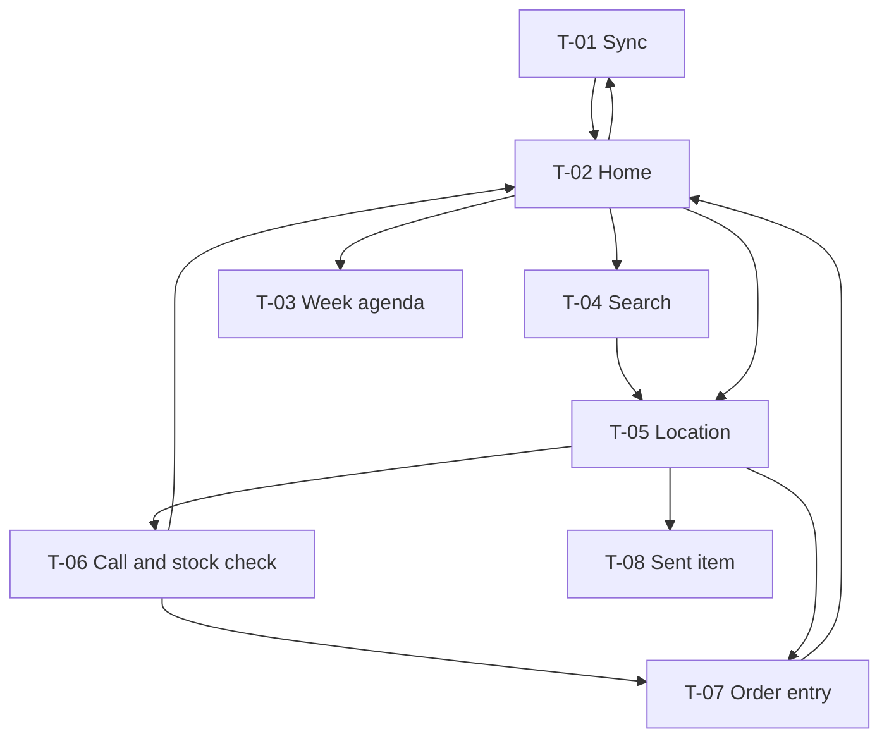

# 01 — Tablet app: the rep's day (T-01 … T-08)

**Device assumptions:** tablet, held one-handed while standing, poor light, no signal assumed.
**Consequences carried through every frame below:** one dominant name per row; no hover; no drag as the only route; touch targets on the row's right edge or full-width; no two-pane layouts.

---

## Flow



---

## T-02 · Home (today)

**Job:** *where am I going, what have I done, and what am I at risk of missing?* — answered without scrolling.

```
+----------------------------------------------------------------+
| Tue 22 Sep                    [ Search ]     Sync 07:42    (3) >|
+----------------------------------------------------------------+
| (!) 3 to send   2 cycle decisions   1 conflict   1 not supplied |
+----------------------------------------------------------------+
| TODAY - 6 visits, 1 done                        [ Reorder ]     |
|                                                                 |
| RATHDRUM                                                        |
| +------------------------------------------------------------+ |
| | Quinn's Centra                                      DONE    | |
| | Call 09:15 - Order 12 lines, Ready to Send             >    | |
| +------------------------------------------------------------+ |
| +------------------------------------------------------------+ |
| | Hickey's Pharmacy                                      >    | |
| | Deadline: Autumn range order - Fri 25 Sep                   | |
| +------------------------------------------------------------+ |
| +------------------------------------------------------------+ |
| | Byrne's Londis                                         >    | |
| +------------------------------------------------------------+ |
|                                                                 |
| WICKLOW TOWN                                                    |
| +------------------------------------------------------------+ |
| | Carey's Pharmacy            Covering for Aoife         >    | |
| +------------------------------------------------------------+ |
| ...                                                             |
+----------------------------------------------------------------+
| UNPLANNED TODAY (2)                                        v    |
+----------------------------------------------------------------+
| OVERDUE (4)                                                v    |
+----------------------------------------------------------------+
| DUE WITHIN 14 DAYS, NO DAY SET (11)                        v    |
+----------------------------------------------------------------+
```

**Reorder mode** — replaces the chevrons, keeps the cards in place:

```
| RATHDRUM                                        [ Done ]        |
| +------------------------------------------------------------+ |
| | Hickey's Pharmacy                            [ ^ ]  [ v ]  | |
| +------------------------------------------------------------+ |
```

**States**

```
  Nothing scheduled today
  +------------------------------------------------------------+
  | Nothing scheduled for today.                                |
  +------------------------------------------------------------+
  | OVERDUE (4)                                            v    |
  | DUE WITHIN 14 DAYS, NO DAY SET (11)                    v    |
  |                        [ Search locations ]                 |
  +------------------------------------------------------------+

  Handover visit card
  | Carey's Pharmacy                    Handover - finish visit |
```

> **DECISION T2.1 — Today stays at the top even when Overdue is non-empty.** *(confirmed 24 Sep 2026)*
> The tempting alternative is to float Overdue above Today when it has items. I've kept Today first: the rep opens this screen between every visit, so the cost of demoting the answer to "where next" is paid ten times a day, while Overdue is a once-a-morning read. Overdue is a collapsed section with a live count, which is enough to be noticed without displacing the primary job.

> **DECISION T2.2 — the three exception counts are one strip, not three cards.** *(confirmed 24 Sep 2026)*
> *Hick's law.* Three cards read as three places to go and cost a scan before every visit. One strip of three small counters reads as a status line — glanceable, and only tapped when a number is non-zero.

> **DECISION T2.3 — done visits stay in place rather than moving to a "done" section.** *(confirmed 24 Sep 2026)*
> Keeps the day's shape stable. The rep's model of the day is a route, and a route doesn't reorder itself as you drive it.

> **DECISION T2.4 — deadline reason is on the card, not behind an icon.** *(confirmed 24 Sep 2026)*
> "Deadline: Autumn range order - Fri 25 Sep" is the single most consequential thing on that card and it fits. *Recognition over recall.*

> **DECISION T2.5 — a fourth counter: lines that couldn't be supplied.**
> When an unavailable line is auto-removed at head office (see 02, H1.7), the order total changes after the rep quoted it, and for most shops the rep is the only channel to the customer. The counter prompts that call. It's a different kind of item from the other three — an action in the world, not on the tablet — so the tablet can't observe it being done. With four counters, T2.2's Hick's-law argument is at its limit; a fifth should force a rethink of the strip.
> ~~**Open:** what clears it — opening the order, an explicit "Told them", or the next call at that location.~~ **Resolved (24 Sep 2026)** — see T2.6.

**Not supplied list** — opened from the counter; one card per affected order:

```
+----------------------------------------------------------------+
| < Home                 Not supplied (1)                        |
+----------------------------------------------------------------+
| Quinn's Centra - Order Tue 22 Sep                        >     |
|   (x) SPF30 Sun Lotion 200ml - no longer available             |
|   (x) Nappy Wipes 64pk - no longer in an active range          |
|                                       [ Told them ]            |
+----------------------------------------------------------------+
| Carey's Pharmacy - Order Mon 21 Sep                      >     |
|   (x) Hand Cream 75ml - no longer available                    |
|   Told 14:20                               [ Undo ]            |
+----------------------------------------------------------------+
```

> **DECISION T2.6 — "Told them" clears the count; the next Call at the Location is the backstop.** *(settled 24 Sep 2026)*
> Reps phone the shop the same day, so the completion signal is *declared*. Opening the order clears too early (the rep opens it to see what to say, and a failed call would leave no trace). Waiting for the next call clears too late. A declared signal goes stale if the rep skips the tap, so an inferred **backstop** sits behind it: any Call logged at the Location, visit or phone, clears every affected order there, because by then the rep has spoken to the shop.
> - **Unit is the order.** The count counts orders. "Told them" is marked once per order and records against every removed line on it, because one phone call covers the whole order.
> - **In both places.** "Told them" appears on each order in the list behind the counter and on T-08, next to the lines it confirms (*proximity*).
> - **Mis-tap recovery.** A told order stays in the list, greyed, with "Told 14:20" and "Undo", until the rep leaves the list (*user control and freedom*). T-08 keeps the record.
> - **A declaration covers what was known.** If a later sync removes another line from an order already marked told (e.g. a part-despatched order), the order comes back into the count with only the new line flagged; earlier lines keep their "Told" record. A new removal is a new issue.
> - **Rejected:** clearing on opening the order; clearing on the next call only; delivery as the backstop; no backstop; per-line or per-Location marking; order staying cleared after a later removal.

> **DECISION T2.7 — reordering happens only in Reorder mode, with ^/v buttons.** *(settled 24 Sep 2026)*
> Cards are tapped about ten times a day to open a Location, and reordered at most once a day. A mode keeps the rare, disruptive action away from the frequent, harmless one: in normal mode a tap always opens the card. ^/v buttons are more reliable than dragging when used one-handed.
> **Rejected:** an always-visible drag handle (a mis-tap target, and a slipped drag silently reorders the route); long-press to drag (can't be discovered, and triggers by accident).

---

## T-01 · Sync & unsent items

**Job:** get the day's data down, get the rep's work up, and never lie about what has and hasn't gone.

```
+----------------------------------------------------------------+
| < Home                 Sync & unsent                            |
+----------------------------------------------------------------+
| Last sync  07:42 today                                          |
|                                                                 |
|                    [     Sync now     ]                         |
+----------------------------------------------------------------+
| NEEDS ATTENTION (1)                                             |
| +------------------------------------------------------------+ |
| | Order - Quinn's Centra - 12 lines                           | |
| | Couldn't be sent - the upload was incomplete                | |
| |                             [ Open ]        [ Delete ]      | |
| +------------------------------------------------------------+ |
+----------------------------------------------------------------+
| READY TO SEND (2)                                               |
| +------------------------------------------------------------+ |
| | Order - Hickey's Pharmacy - 8 lines            21 Sep  >    | |
| | Call - Byrne's Londis                          21 Sep  >    | |
| +------------------------------------------------------------+ |
+----------------------------------------------------------------+
| IN PROGRESS (3)                                                 |
| +------------------------------------------------------------+ |
| | Order - Carey's Pharmacy - 3 lines             22 Sep  >    | |
| | Prospect - Murphy's, Aughrim (draft)           20 Sep  >    | |
| | Lead - petrol station, Arklow Rd               19 Sep  >    | |
| +------------------------------------------------------------+ |
+----------------------------------------------------------------+
```

**During sync** — the button region becomes the progress region, so nothing below moves:

```
|                   Sending 2 of 3...                             |
|                   [=============--------]                       |
```

**States**

```
  No signal
  | Last sync  07:42 today                                        |
  | No connection - your work is saved on this tablet.            |
  |                    [  Sync now  ]  (greyed)                   |

  Partial upload
  | Last sync  16:20 today                                        |
  | (!) 2 items not sent - poor connection. Try again when        |
  |     you have signal.                                          |

  Expired sign-in
  | (!) Sign in again to send 3 items                             |
  |                    [  Sign in  ]                              |

  Nothing unsent
  | Last sync  16:20 today                                        |
  | Everything has been sent.                                     |
  |                    [  Sync now  ]                             |
```

> **DECISION T1.1 — Needs Attention is first and is the only section with per-item buttons.** *(confirmed 24 Sep 2026)*
> Ready to Send and In Progress need no decision from the rep; Needs Attention needs two. Putting the only actionable buttons in the only actionable section stops the screen reading as a wall of controls.
> *24 Sep 2026:* work is **judged as captured** (BR-NEW-006). A reassignment, archive or other rule change after capture never rejects it, so Needs Attention holds only technical faults (an incomplete or corrupt upload, a duplicate) and should be rare.

> **DECISION T1.2 — the rejection reason is a sentence, not a code.** *(confirmed 24 Sep 2026)*
> *Help users recognise, diagnose and recover.* The server's reason is rendered in the rep's vocabulary. Anything the rep can't act on ("FK constraint violation") should surface as "This couldn't be sent — contact the office" with the raw text available to support, not shown by default.

> **DECISION T1.3 — no automatic sync on regaining signal.** *(confirmed 24 Sep 2026)*
> The brief describes sync as deliberate. An automatic background sync would make the counts on Home change while the rep isn't looking, which undermines the entire "you can see what hasn't gone" contract. Notifications nudge; the rep presses the button.
> *Confirmed 24 Sep 2026:* manual only, in both directions. When signal returns and there is unsent work, a gentle reminder with Sync now appears, at most once an hour (Area 1 US-002 Scenario 2). **Rejected:** automatic upload with manual download; automatic both ways.

---

## T-03 · Week agenda

**Job:** move one visit to another day, in a shop doorway, without a planning screen.

```
+----------------------------------------------------------------+
| < Home            This week      Mon 21 - Sun 27          >     |
+----------------------------------------------------------------+
| MON 21                                                          |
| +------------------------------------------------------------+ |
| | Quinn's Centra         Rathdrum       due 24 Sep            | |
| |                                          [ Move to... ]     | |
| +------------------------------------------------------------+ |
| TUE 22 - today                                                  |
| +------------------------------------------------------------+ |
| | Hickey's Pharmacy      Rathdrum       due 25 Sep            | |
| | Deadline: Autumn range order                                | |
| |                                          [ Move to... ]     | |
| +------------------------------------------------------------+ |
| WED 23                                                          |
| | Nothing scheduled                                            |
| ...
+----------------------------------------------------------------+
```

**Move sheet** — the manager's suggestion sits beside the picker, never inside it:

```
+----------------------------------------------------------------+
|  Move Hickey's Pharmacy                                   [ X ] |
+----------------------------------------------------------------+
|  Your manager suggests Thursday 24 Sep                          |
|                                                                 |
|  ( ) Mon 21    ( ) Tue 22    ( ) Wed 23    ( ) Thu 24           |
|  ( ) Fri 25    ( ) Sat 26    ( ) Sun 27                         |
|                                                                 |
|  (!) Sat 26 is after this visit's due date.                     |
|      The Autumn range order deadline is Fri 25 Sep.             |
|                                                                 |
|                              [ Cancel ]   [ Move visit ]        |
+----------------------------------------------------------------+
```

**Same-town prompt, after the move:**

```
|  Moved to Thursday.                                             |
|  2 other visits in Rathdrum are scheduled Tuesday.              |
|                              [ Leave them ]  [ Move them too ]  |
```

> **DECISION T3.1 — the same-town prompt fires after the move, not before.** *(confirmed 24 Sep 2026)*
> Asking first turns one decision into two before anything has happened. Asking after means the rep's intended move always succeeds, and the bulk offer is a genuine convenience rather than an obstacle. *User control and freedom* — the offer is dismissible and nothing is pre-applied (§2.6).

> **DECISION T3.2 — the past-due warning escalates in wording only when a reason exists.** *(confirmed 24 Sep 2026)*
> Plain: "Sat 26 is after this visit's due date." With a reason, the deadline sentence is appended. Both still allow the move. The brief is explicit that this is a warning, not a block.

---

## T-04 · Location search

**Job:** find any assigned shop offline, in under a second, for an unplanned call.

```
+----------------------------------------------------------------+
| < Home       [ quin|                                   ]  [X]   |
+----------------------------------------------------------------+
| Quinn's Centra                                            >     |
| Rathdrum                                                        |
+----------------------------------------------------------------+
| Quinn's Gala                                              >     |
| Aughrim                                                         |
+----------------------------------------------------------------+
| Quinlan's Pharmacy                        Closed until 14 Oct   |
| Wicklow Town                                              >     |
+----------------------------------------------------------------+
```

**No match:**

```
| No assigned locations match "Quinn".                            |
| Only locations assigned to you can be searched on the tablet.   |
```

> **DECISION T4.1 — the "assigned only" explanation appears on the empty result, not above the field.** *(confirmed 24 Sep 2026)*
> A permanent caveat above the search box is read once and then never again; the same sentence at the moment of failure is read every time it matters. *Error prevention* is preferable to error messages generally, but a permanent banner here would be noise on every successful search.

---

## T-05 · Location

**Job:** the hub for one shop — what's true here, and what can I do.

```
+----------------------------------------------------------------+
| < Home                                                          |
+----------------------------------------------------------------+
| Quinn's Centra                                                  |
| Main St, Rathdrum, Co. Wicklow   A67 X123                       |
| Mary Walsh (inactive) - replacement needed                (!)   |
+----------------------------------------------------------------+
| Visit due 24 Sep - every 3 weeks                                |
| Deadline: Autumn range order - Fri 25 Sep                       |
+----------------------------------------------------------------+
|              [   Record call   ]      [   New order   ]         |
+----------------------------------------------------------------+
| RECENT                                                          |
| Order 12 lines   Accepted, partly sent                     >    |
| Call 3 Sep       13 counted, 2 low                         >    |
| Order 9 lines    Accepted, sent in full                    >    |
|                                                    Show more v  |
+----------------------------------------------------------------+
| Map position approximate            [ Set from GPS ]            |
+----------------------------------------------------------------+
```

**States**

```
  No longer assigned
  | (!) This location is no longer assigned to you.               |
  |     Your existing order will still be sent.                   |
  |     (Record call and New order are absent)                    |

  Temporarily closed
  | Closed until 14 Oct                         [ Change dates ]  |

  Permanently closed        entire screen read-only, no actions

  Position confirmed        the "Map position approximate / Set from GPS" row is absent
```

> **DECISION T5.1 — two primary actions, side by side, equal weight.** *(confirmed 24 Sep 2026)*
> The brief implies a visit usually means call-then-order, but phone orders and call-only visits are both common. Making "Record call" the single primary and burying "New order" would punish the phone-order path. Two equal targets, both thumb-sized. If usage shows one dominates, demote the other later — that's a cheap change.

> **DECISION T5.2 — the inactive main contact appears in the identity block, not in a warnings area.** *(confirmed 24 Sep 2026)*
> The contact *is* part of who this shop is to the rep. Pulling it into a separate warnings region separates the problem from the thing it's a problem about. *Proximity.*

> **DECISION T5.3 — "Set from GPS" shows only while the position is unconfirmed; quiet, highlighted exactly once.** *(confirmed and amended 24 Sep 2026)*
> The brief's "quiet control, highlighted once if unconfirmed" is drawn as a plain secondary button with the precision statement above it. The one-time highlight is a first-visit-only treatment, not a standing badge — a standing badge would be ignored within a week.
> *Amended 24 Sep 2026:* the action appears **only while the position is not set** — Precision is Eircode or Town (defaulted), not "Confirmed on site". Once confirmed, the row and the action are absent. A wrong confirmed position is corrected by head office reverting the capture (Customer Directory US-005 Scenario 5), which brings the action back. **Superseded:** the action staying available, unhighlighted, with "Replace the confirmed position?".

---

## T-06 · Call & stock check

**Job:** record what happened at the visit. The highest-frequency task in the business.

```
+----------------------------------------------------------------+
| < Quinn's Centra          Record call                           |
+----------------------------------------------------------------+
| HOW                                                             |
|   +---------------------------+  +---------------------------+  |
|   |       In person           |  |         Phone             |  |
|   +---------------------------+  +---------------------------+  |
+----------------------------------------------------------------+
| STOCK CHECK                         13 counted, 3 not checked   |
|                                            [ Add product ]      |
| +------------------------------------------------------------+ |
| | Sudocrem 125g                        [ - ]   4   [ + ]      | |
| | Counted last visit                             [ ] Low      | |
| +------------------------------------------------------------+ |
| +------------------------------------------------------------+ |
| | SPF30 Sun Lotion 200ml               [ - ]   2   [ + ]      | |
| | On last 3 orders                               [x] Low      | |
| | Below low-stock level (6)                                   | |
| |                                     [ Add to order ]        | |
| +------------------------------------------------------------+ |
| +------------------------------------------------------------+ |
| | Loose Porridge Oats               [ - ]  3.5  [ + ] kg      | |
| | Counted last visit                             [ ] Low      | |
| +------------------------------------------------------------+ |
| +------------------------------------------------------------+ |
| | SPF50 Kids Sun Spray 150ml           not checked            | |
| | (x) Back in stock around 25 October            [ ] Low      | |
| +------------------------------------------------------------+ |
+----------------------------------------------------------------+
| PITCH NOTES                                                v    |
+----------------------------------------------------------------+
| COMPETITOR NOTES (1)                                       v    |
+----------------------------------------------------------------+
| AUTUMN RANGE LAUNCH - outcome not set                      v    |
+----------------------------------------------------------------+
|                          [ Review and save ]                    |
+----------------------------------------------------------------+
```

**Marking Low offers "Add to order". Add opens the quantity popover** — the same component used from the Low tab in T-07:

```
+----------------------------------------------------------------+
|  SPF30 Sun Lotion 200ml                                   [ X ] |
|  counted 2                                                      |
|                                                                 |
|  Quantity   [        ]                                          |
|  EUR 9.99   Autumn promotion                                    |
|                                                                 |
|                              [ Cancel ]    [ Add to order ]     |
+----------------------------------------------------------------+
```

Break prompts appear live beneath the price as the number is typed, so "2 more for EUR 2.00 each" lands while the customer is still deciding rather than after the line is committed.

**Marking Low on an unavailable line** opens the replacement picker instead of "Add to order":

```
+----------------------------------------------------------------+
|  SPF50 Kids Sun Spray 150ml is unavailable                [ X ] |
|  Back in stock around 25 October.                               |
|                                                                 |
|  REPLACEMENTS                                                   |
|  SPF50 Kids Sun Lotion 150ml       EUR 8.40   [ Add to order ]  |
|  SPF30 Kids Sun Spray 150ml        EUR 7.20   [ Add to order ]  |
|                                                                 |
|                                          [ Just mark Low ]      |
+----------------------------------------------------------------+
```

**Save review** — the last screen before it's committed:

```
+----------------------------------------------------------------+
|  Save this call?                                          [ X ] |
+----------------------------------------------------------------+
|  In person                                                      |
|  Pitch notes added                                              |
|  13 counted, 3 not checked                                      |
|  2 marked Low                                                   |
|  1 competitor note                                              |
|  (!) Autumn range launch: no outcome recorded                   |
|                                                                 |
|                          [ Back ]        [ Save call ]          |
+----------------------------------------------------------------+
```

**States**

```
  No history
  | STOCK CHECK                        Nothing counted here before |
  |                                           [ Add product ]      |
  | Search the catalogue to build this shop's first stock check.   |

  Read-only after sync
  | Saved 3 Sep - sent 3 Sep. This call can't be changed.          |
  |                            [ Record a follow-up call ]         |

  Correctable before sync
  | Not sent yet. You can change counts and remove lines.          |
  |   (each line keeps its stepper; "Add to order" is absent)      |
  |                            [ Record a follow-up call ]         |
```

> **DECISION T6.1 — one scrolling page with collapsed secondary sections, not a wizard.** *(confirmed 24 Sep 2026)*
> Stock check is 80% of the time on this screen and 100% of the reason it exists; pitch notes, competitor notes and campaign outcomes are occasional. A wizard would impose four steps on a task that is usually one. *Progressive disclosure* — the occasional sections are collapsed headers with counts, so their presence is visible and their bulk isn't.

> **DECISION T6.2 — channel selection sits at the top as two large unselected options.** *(confirmed 24 Sep 2026)*
> Both start unselected, per §2.6. Its position is first because it's the only field that changes what the rest of the screen means (on Phone the stock check becomes "Stock mentioned" — T6.5).

> **DECISION T6.3 — the low-stock hint sits under the Low tick, not next to the count.** *(confirmed 24 Sep 2026)*
> It is *about* the Low decision, not about the count. Placing it next to the number invites the rep to read it as a target quantity.
> *Wording settled 24 Sep 2026:* "Below low-stock level (6)", naming the resolved threshold (BR-NEW-005). "Below usual level (usually 8)" is superseded: no usual level exists in the data (T7.7), and "usually" implies a top-up target. **Rejected:** "Looks low for this shop" (no number); "Below 6" (doesn't say what 6 is).

> **DECISION T6.4 — save review is a dialog, not a page.** *(confirmed 24 Sep 2026)*
> It's a confirmation of work already done. The one thing it adds is the `(!)` on the unrecorded campaign outcome — which is the real reason the screen exists, since a missed campaign outcome is invisible everywhere else.

**Channel = Phone** — the stock check becomes "Stock mentioned" (`*` marks the selected channel):

```
+----------------------------------------------------------------+
| < Doyle's                 Record call                          |
+----------------------------------------------------------------+
| HOW                                                            |
|   +---------------------------+  +---------------------------+ |
|   |       In person           |  |      * Phone              | |
|   +---------------------------+  +---------------------------+ |
+----------------------------------------------------------------+
| STOCK MENTIONED                                 2 marked Low   |
| [ Filter or search...                                     ]    |
| +------------------------------------------------------------+ |
| | SPF30 Sun Lotion 200ml                [x] Low   [ ] Out    | |
| | On last 3 orders                       [ Add to order ]    | |
| |                                        Add count           | |
| +------------------------------------------------------------+ |
| +------------------------------------------------------------+ |
| | Sudocrem 125g                         [x] Low   [x] Out    | |
| | Counted last visit                     [ Add to order ]    | |
| |                                        count 0             | |
| +------------------------------------------------------------+ |
| +------------------------------------------------------------+ |
| | Loose Porridge Oats                   [ ] Low   [ ] Out    | |
| | Counted last visit                     Add count           | |
| +------------------------------------------------------------+ |
| ...                                                            |
+----------------------------------------------------------------+
| PITCH NOTES                                                v   |
+----------------------------------------------------------------+
|                          [ Review and save ]                   |
+----------------------------------------------------------------+
```

> **DECISION T6.5 — on Phone, the stock check becomes "Stock mentioned".** *(settled 24 Sep 2026)*
> Channel is a *mode*: the screen follows it. On a phone call the shopkeeper most likely says "we're low on X" or "we're out of Y" rather than reading counts, but that is unconfirmed, so the shape is chosen to be cheap if wrong.
> - **No steppers.** Each row has Low, Out and "Add to order"; "Add count" per row covers the shopkeeper who does read a number (one extra tap if that turns out common).
> - **Same starting rows as in person** (the suggested list), with a **filter box** on top: typing narrows the list, and a product not in it falls through to catalogue search (*recognition over recall* without the scan cost).
> - **Out is its own mark** (*match between system and real world* — the shopkeeper distinguishes low from out). It is stored as Low with a count of 0, the same data an in-person count of 0 produces. Out ticks Low with it.
> - **Header counts what was marked** ("2 marked Low"), never "not checked". Unmarked rows on a phone call are not recorded, so they are **not** saved as Not checked and don't disturb the next visit's suggested list. Save review reads "Phone · 2 marked Low (1 out)".
> - **Switching channel keeps what was entered:** counts taken in person show as the row's count on Phone; Out rows show a count of 0 in person.
> - **Rejected:** unchanged screen with optional counts; starting empty with search only; no stock section on Phone; Low covering out; Low plus count 0 as the only way to record out.

**Open:**
- ~~Does selecting **Phone** collapse or hide the stock check?~~ **Resolved (24 Sep 2026)** — T6.5.
- ~~3 not checked out of 16: is "not checked" a state the rep sets, or just the absence of a count? Drawn as absence.~~ **Resolved (24 Sep 2026)** — absence of a count; the save review is where a forgotten row is caught (matches Area 1 US-007 Scenario 4). Phone calls excepted (T6.5).

---

## T-07 · Order entry (Order Pad)

**Job:** build an order for one location. §10 calls this the screen everything else depends on.

```
+----------------------------------------------------------------+
| < Quinn's Centra        New order            12 lines  >        |
+----------------------------------------------------------------+
| [ Order pad ]  [ Low (2) ]  [ Search all ]                      |
+----------------------------------------------------------------+
| HEALTH > SKINCARE > SUNCARE                                v    |
| +------------------------------------------------------------+ |
| | SPF30 Sun Lotion 200ml               [ - ]   8   [ + ]      | |
| | EUR 9.99  Autumn promotion                        (i)       | |
| | 2 more for EUR 2.00 each - save EUR 4.00 on 10              | |
| | (!) Being discontinued - replaced by SPF30 v2 200ml         | |
| +------------------------------------------------------------+ |
| +------------------------------------------------------------+ |
| | Aftersun Gel 200ml                   [ - ]   0   [ + ]      | |
| | EUR 5.60  Your price                              (i)       | |
| +------------------------------------------------------------+ |
+----------------------------------------------------------------+
| HEALTH > SKINCARE > BABY                                   v    |
| ...                                                             |
+----------------------------------------------------------------+
|  12 lines   EUR 486.20                    [ Review order ]      |
+----------------------------------------------------------------+
```

**Low tab** — a catch-up list, not the main route. Most Low items are added at tick-time on T-06; this tab holds the ones the rep ticked and moved past.

```
| [ Order pad ]  [ Low (3) ]  [ Search all ]                      |
+----------------------------------------------------------------+
| From your stock check at Quinn's Centra                         |
| +------------------------------------------------------------+ |
| | SPF30 Sun Lotion 200ml            ADDED - 8    [ - ] 8 [+]  | |
| | counted 2                                         (i)       | |
| +------------------------------------------------------------+ |
| +------------------------------------------------------------+ |
| | Nappy Wipes 64pk                  not added                 | |
| | counted 1                             [    Add    ]         | |
| +------------------------------------------------------------+ |
| +------------------------------------------------------------+ |
| | Sudocrem 125g                     REMOVED                   | |
| | you took this off the order           [    Add    ]         | |
| +------------------------------------------------------------+ |
| +------------------------------------------------------------+ |
| | SPF50 Kids Sun Spray 150ml        REPLACED                  | |
| | SPF50 Kids Sun Lotion 150ml added instead - 6               | |
| +------------------------------------------------------------+ |
| +------------------------------------------------------------+ |
| | Calpol 6+ 200ml                   CAN'T ADD                 | |
| | (x) Back in stock 25 Oct     [ Find replacement ]           | |
| +------------------------------------------------------------+ |
```

`[ Add ]` opens the quantity popover drawn under T-06. Five signal states, each earning its place:

| State | Means | Why it isn't collapsed into another |
|---|---|---|
| `not added` | ticked Low, nothing done yet | the only genuinely outstanding state |
| `ADDED - n` | on the order, quantity shown | stepper stays live for adjustment |
| `REMOVED` | added, then taken off the order | a decision was made; distinct from never-added |
| `REPLACED` | unavailable, an alternative was added | closes the loop or the list looks unfinished |
| `CAN'T ADD` | unorderable, no replacement chosen | otherwise the rep keeps tapping a dead row |

The tab count `Low (3)` counts `not added` and `CAN'T ADD` only — the states that still want something from the rep.

**Low tab on an order with no Call** — e.g. Carey's phones in an order and the rep goes T-05 → New order:

```
| [ Order pad ]  [ Low (2) ]  [ Search all ]                     |
+----------------------------------------------------------------+
| No stock check with this order.                                |
| Still open from your call at Carey's - Tue 15 Sep              |
| +------------------------------------------------------------+ |
| | Nappy Wipes 64pk                  not added                | |
| | marked Low 15 Sep                     [    Add    ]        | |
| +------------------------------------------------------------+ |
| +------------------------------------------------------------+ |
| | Aftersun Gel 200ml                CAN'T ADD                | |
| | (x) Back in stock 25 Oct     [ Find replacement ]          | |
| +------------------------------------------------------------+ |
| [ Record call ]                                                |
+----------------------------------------------------------------+

  No earlier call, or nothing still open
| [ Order pad ]  [ Low (0) ]  [ Search all ]                     |
+----------------------------------------------------------------+
| No stock check with this order.                                |
| [ Record call ]                                                |
+----------------------------------------------------------------+
```

> **DECISION T7.13 — with no Call, the Low tab carries the gaps from the Location's most recent Call.** *(settled 24 Sep 2026)*
> The tab stays (T7.1's stable screen model) and surfaces known gaps rather than an empty panel.
> - **Which items:** only that Call's gaps — `not added` and `CAN'T ADD` — **minus any product ordered at the Location since** (by any route). On 15 Sep Carey's had 5 Low: SPF30 and Hand Cream were added, Sudocrem and Nappy Wipes not added, Aftersun CAN'T ADD; Sudocrem was ordered on 18 Sep, so Nappy Wipes and Aftersun remain (*signal over noise*).
> - **No age limit.** The date label ("Still open from your call at Carey's - Tue 15 Sep") is the guard; the rep judges staleness.
> - Carried items behave as any Low item: `[ Add ]` opens the quantity popover, CAN'T ADD offers replacements, and the tab count includes them.
> - The same Call's rows appear on the Low tab of the order linked to that Call; the carry-over applies only to an order with no Call of its own.
> - **Rejected:** hiding the tab; empty state only; all Low marks with their states; gaps ignoring later orders; a cut-off by visit cycle or fixed days.
>
> - The tab shows "No stock check with this order." with a `[ Record call ]` link, both when nothing carries and above carried items *(confirmed 24 Sep 2026)*.
> - Recording a Call during the order **replaces** the carried rows with that Call's Low items *(confirmed 24 Sep 2026)*.

> **DECISION T7.6 — no "Add all".**
> A bulk add was only coherent while the system was guessing quantities. Once each line needs a number the rep confirms aloud with the customer, per-item pacing matches the actual conversation and a bulk action would have to either invent quantities or open five dialogs.

> **DECISION T7.7 — the quantity field opens empty, with no suggestion.**
> Earlier drafts proposed a top-up quantity (counted 2, usually 8 → suggest 6). Dropped. There is no "usual level" anywhere in the data model — H-28 holds a low-stock *threshold*, which is a floor, not a target, and topping up to it leaves the shop at the low mark the day the delivery lands. Beyond the missing data, a pre-filled number is an **anchor**: people adjust away from it rather than deciding independently, and they under-adjust. The rep is going to say a number out loud to the customer either way, so the field costs no time it doesn't already spend.

> **DECISION T7.8 — unticking Low does not remove an added line.**
> The two acts are separable: Low records what the shelf looked like, the order line records what was agreed. Removal stays explicit, and the line shows as `REMOVED` here if the rep takes it off the pad.

**Review order** — where overrides, free goods and the offer summary live:

```
+----------------------------------------------------------------+
| < Back               Review order - Quinn's Centra              |
+----------------------------------------------------------------+
| 12 lines                                                        |
| SPF30 Sun Lotion 200ml        8    EUR  79.92                >  |
| Aftersun Gel 200ml           24    EUR 134.40                >  |
| Nappy Wipes 64pk            960    EUR 1,872.00              >  |
|   (!) Usually about 96 here                                     |
| ...                                                             |
+----------------------------------------------------------------+
| OFFERS APPLIED                                                  |
| Autumn promotion       SPF30 x8            saved EUR 32.08      |
| Quantity break         Aftersun x24        saved EUR  9.60      |
+----------------------------------------------------------------+
| (!) Aftersun Gel 200ml became unavailable since you added it.   |
|     It will still be sent.                                      |
+----------------------------------------------------------------+
|                 [ Add free-of-charge line ]                     |
+----------------------------------------------------------------+
| Total                                     EUR 2,358.20          |
|          [ Keep in progress ]      [ Mark Ready to Send ]       |
+----------------------------------------------------------------+
```

**Price override sheet** — reached from a line on Review. The lowest price is shown before the rep types, so going below it is never an error they discover.

Promotion smaller than the allowance — the rep's discount stacks on it:

```
+----------------------------------------------------------------+
|  Price override - Hand Cream 75ml                        [ X ] |
+----------------------------------------------------------------+
|  Your tier price       EUR 4.00                                |
|  Spring offer          EUR 3.80   5% off                       |
|  Lowest you can offer  EUR 3.42   10% off the offer price      |
|                                                                |
|  Your price            [ EUR       ]                           |
|  Reason                [                                   ]   |
|                                                                |
|                                    [ Cancel ]   [ Apply ]      |
+----------------------------------------------------------------+
```

Promotion larger than the allowance, and lower than anything the rep could otherwise reach — no further discount (8 units, so no quantity break applies):

```
+----------------------------------------------------------------+
|  Price override - SPF30 Sun Lotion 200ml                 [ X ] |
+----------------------------------------------------------------+
|  Your tier price       EUR 11.20                               |
|  Autumn promotion      EUR  9.99   11% off                     |
|                                                                |
|  This promotion is already more than your 10% limit,           |
|  so no further discount can be added on this line.             |
|                                                                |
|                                                  [ Close ]     |
+----------------------------------------------------------------+
```

Promotion larger than the allowance, but the allowance off the bulk price is lower — the rep falls back to it (24 units):

```
+----------------------------------------------------------------+
|  Price override - SPF30 Sun Lotion 200ml x24             [ X ] |
+----------------------------------------------------------------+
|  Autumn promotion      EUR  9.99   11% off - can't stack       |
|  Bulk price (24+)      EUR 10.08                               |
|  Lowest you can offer  EUR  9.07   10% off the bulk price      |
|                                                                |
|  Your price            [ EUR       ]                           |
|  Reason                [                                   ]   |
|                                                                |
|                                    [ Cancel ]   [ Apply ]      |
+----------------------------------------------------------------+
```

Line in a multi-buy, bundle or mix-and-match — never stackable:

```
+----------------------------------------------------------------+
|  Price override - Sudocrem 125g                          [ X ] |
+----------------------------------------------------------------+
|  Buy 3 get 1 free      4 for EUR 14.55                         |
|                                                                |
|  This line is part of a multi-buy offer,                       |
|  so a rep discount can't be added.                             |
|                                                                |
|                                                  [ Close ]     |
+----------------------------------------------------------------+
```

**Free-of-charge picker** — reached from "Add free-of-charge line" on Review:

```
+----------------------------------------------------------------+
|  Add free-of-charge line                                  [ X ] |
|  Only products being discontinued can be given free.            |
+----------------------------------------------------------------+
|  Aftersun Gel 150ml         being discontinued    [ Add ]       |
|  SPF30 Sun Lotion 200ml     being discontinued    [ Add ]       |
+----------------------------------------------------------------+
|  12 free units left this month - 0 used today                   |
+----------------------------------------------------------------+
```

> **DECISION T7.9 — overrides are applied, not requested.**
> Business rule, not in the brief: the tablet enforces a rep discount allowance. An override inside it is within policy by construction, so it goes through without head office review — the button says Apply. This turns a *gatekeeper* into a *guardrail*: the rep can't promise a customer a price that will later be refused. *Error prevention* over error recovery.
> **Policy scope — working model:** a manager groups eligible products into a commercial policy profile such as "Allow 10% rep discount and 12 FOC units per rep per month". The profile's rules and product membership travel in the tablet snapshot. "Profile" is provisional terminology: the final model may become explicit business rules, and must be reconciled with the existing one-per-product Product Profile classification before implementation.
> **How the allowance works** — a percentage off the resolved price:
> - No promotion (tier, list or quantity-break price): the rep can go up to the allowance below it. Quantity breaks are bulk pricing, not an offer, so they never block the rep's discount.
> - A promotion no larger than the allowance: the rep's discount **stacks** on the promotion price.
> - A promotion larger than the allowance (measured as head office set it, against tier or list): the rep can't stack on the promotion, but can still go to the allowance off the best non-promotional price (tier, list or break) if that is lower than the promotion. Only when the promotion is lower than that too is the line blocked.
> - A line in a buy X get Y, bundle or mix-and-match promotion: no rep discount, whatever the promotion's size. The sheet names the promotion the line is part of.
> - A spend-threshold promotion ("spend €200, get 5% off"): whether the order qualifies is checked on resolved prices, **before** rep discounts, so a rep discount can never knock the customer under the threshold. Assumed: the threshold discount then applies to the order total as it finally stands.
> **Why the fallback:** without it, running a promotion could *raise* the lowest price a rep can reach. SPF30 at 24 units would go from €9.07 (10% off the €10.08 break) to €9.99 (the promotion) — a rep who did €9.07 last month couldn't this month. A promotion must never leave the rep worse off than no promotion (*monotonicity*).
> **The one accepted exception:** multi-buys, bundles and mix-and-match are never stackable. A weak multi-buy (buy 10 get 1 free, about 9%) therefore blocks the rep where a simple price promotion of the same size would let them stack or fall back. Knowingly traded for a rule a rep can state in one sentence.
> **State this wherever the allowance is set:** because of stacking, the effective maximum discount is nearly twice the allowance — a 9% promotion plus a 10% rep discount is about 18% off.

> **DECISION T7.12 — a blocked override explains itself.**
> When the promotion is lower than anything the rep could reach, the sheet still opens and says why. The rep is usually tapping it because the customer has just asked "can you do better?", and needs a sentence to give them — an absent control leaves them with nothing to say.

> **DECISION T7.10 — free of charge only on Discontinuing products, up to a per-rep monthly cap.**
> Business rule, not in the brief: FOC exists to clear discontinuing stock. Under the working profile model, a manager puts eligible products into a commercial policy profile and sets how many units each rep may give free per month. The picker lists only eligible Discontinuing products and shows that rep's remaining monthly allowance; inside the cap the line is applied like any other.
> **Ordinary-line rule:** FOC is not a separate stock or fulfilment type. It is a normal order line with a resolved price of €0.00, so it follows the same stock, availability, allocation, despatch and removal lifecycle as every other product line. It counts against the monthly allowance while the line exists; removing the line releases the quantity. If it becomes unavailable during processing, the normal Unavailable Line path removes it and the returned allowance reaches the tablet at Sync.

> **DECISION T7.11 — Review marks quantities that are out of pattern for this location.**
> With orders no longer passing a person at head office, Review is the last point a fat-finger (48 typed as 480) can be caught — and the rep is the only person who knows instantly whether it's real. But people check their own work against what they *meant*, not what's on screen, so a plain list doesn't catch slips reliably. The marker puts the reference point on the line: *recognition over recall*. It appears only on out-of-pattern lines, so it doesn't fire on normal orders and doesn't become noise.
> **Source:** the last 3 accepted orders for that product at this location — the same data T-06 already uses to build the suggested stock-check list, so it's already in the snapshot.
> **No history** (first time this product is ordered here): no marker, because there's nothing to compare against.
> **High only.** An unusually low quantity is common on genuine orders (quiet month, shop still overstocked), so a low marker would mostly be a false alarm — and a glyph that's usually wrong teaches the rep to skim past it, including on the high lines where it's usually right. A missed low slip costs a top-up order next visit; a missed high slip costs a return.
> **It's a fallback, not a control.** The marker is text on the line. It never blocks Mark Ready to Send and never asks to be acknowledged. The threshold is an implementation detail rather than a design decision.

> **DECISION T7.1 — the Low list is a tab. Settled.**
> The brief says it sits "alongside" the Order Pad; on a tablet there is no alongside. Three shapes were considered — a strip pinned above the pad (shrinks to nothing when empty, but eats vertical space whenever it isn't), a bottom sheet (thumb-friendly, but a rep who never drags it never learns it exists), and a tab strip. Tabs chosen: the count `Low (n)` keeps the list's existence visible at zero vertical cost, and it survives the shift to a catch-up list — a strip that appears and vanishes between visits costs the rep a stable mental model of the screen. Accepted cost: switching tabs loses scroll position in the pad.

> **DECISION T7.2 — overrides and free goods live on Review, not on the pad row.** *(confirmed 24 Sep 2026)*
> Both are exceptional, both require a reason, and both are bounded by limits the tablet enforces. Putting them on the pad row would add two controls to every row to serve maybe one row in fifty. *Progressive disclosure*, and it keeps the row from §2.4 buildable.

> **DECISION T7.3 — categories are collapsible section headers with the full breadcrumb.** *(confirmed 24 Sep 2026)*
> A 5–6 level tree can't be a nav sidebar on a tablet. Breadcrumb-as-header means the rep always knows where they are in the catalogue without a separate navigation model. *Visibility of system status.*

> **DECISION T7.4 — "Mark Ready to Send", never "Submit" or "Send".** *(confirmed 24 Sep 2026)*
> The rep is offline. A button saying "Send" that doesn't send is the single most damaging word choice available on this screen. *Match between system and the real world.*

> **DECISION T7.5 — restricted products are absent with no trace.** *(confirmed 24 Sep 2026)*
> Deliberately different from unavailable products (§2.3 rule 2), which are always findable with a reason. A restricted product the rep may never sell isn't a gap in their mental model — but it's worth confirming this is really what the business wants, because a rep who knows the product exists will report the app as broken.
> *Confirmed 24 Sep 2026:* no trace, accepting that risk. **Rejected:** a "Not available to you" row.

**Open:**
- ~~Does the sticky footer show line count and value, or line count only? Drawn with value — but the customer may be reading over the rep's shoulder and the value is pre-confirmation.~~ **Resolved (24 Sep 2026)** — line count and value, as drawn. Prices resolve from the morning snapshot, so the running value is accurate at capture. **Rejected:** line count only; value revealed by tapping the footer.
- ~~Where does the chain's agreed range appear for a branch of a master?~~ **Resolved (24 Sep 2026)** — T7.14.

> **DECISION T7.14 — on a branch order, the chain's agreed range is a labelled section at the top; each product appears once.** *(settled 24 Sep 2026)*
> A branch order is worked through the agreed range as a set, so the set sits together (*proximity*): "Hickey's agreed range (30)" above the normal pad, including products outside the rep's ranges. A product in both lists appears **only in the section**, never again in its category below (*one item, one place*). Search all still finds it.
> **Rejected:** merged into the pad with a per-row marker; merged with an "Agreed range only" filter; a shared line in both places; a pointer row in the category.

---

## T-08 · Sent item view

**Job:** answer "has it gone through?" honestly, from a snapshot that may be hours old.

```
+----------------------------------------------------------------+
| < Quinn's Centra          Order 12 Oct                          |
+----------------------------------------------------------------+
| Accepted, partly sent                                           |
+----------------------------------------------------------------+
| SPF30 Sun Lotion 200ml                                          |
|   24 sent to customer 12 Oct - 12 outstanding                   |
+----------------------------------------------------------------+
| Aftersun Gel 200ml                                              |
|   24 sent to customer 12 Oct                                    |
+----------------------------------------------------------------+
| Nappy Wipes 64pk                                                |
|   (x) Not supplied - no longer in an active range.              |
|       Removed from the order. Let the customer know.            |
|                                        [ Told them ]            |
+----------------------------------------------------------------+
| SPF30 at your price EUR 9.25 (resolved EUR 9.99)                |
| Aftersun Gel 150ml x6 free - being discontinued                 |
+----------------------------------------------------------------+
|  [ Open on website ]  Needs a connection                        |
|  [ Record a follow-up call ]                                    |
+----------------------------------------------------------------+
```

> **DECISION T8.1 — the sync chip attaches to the status line only, and only when the last sync wasn't today.** *(amended 24 Sep 2026)*
> The line-level despatch figures came down in the same snapshot, but repeating "as of 07:42 sync" six times trains the rep to stop reading it. One chip on the headline fact governs the panel beneath it (see convention §3).
> *Amended 24 Sep 2026:* reps sync every morning, so the chip appears only when the last sync was before today, reading "as of Mon 21 Sep" (convention §3 rule 4). On a normal day the status line has no chip, as drawn.

> **DECISION T8.2 — "Open on website" is shown and disabled with its reason, rather than hidden offline.** *(confirmed 24 Sep 2026)*
> Hiding it means the rep who needs it can't learn it exists. Showing it greyed with "Needs a connection" teaches the capability and explains the block in four words. This is a deliberate exception to §2.8's rule against greyed-out controls, which is about *destructive* actions being hidden rather than disabled.

> **DECISION T8.3 — "Told them" sits beside the removed lines.** *(settled 24 Sep 2026)*
> Same action as the Not supplied list (T2.6), marked per order. Once marked, the removed lines read "Customer told, 14:20" with "Undo". A line removed at a later sync shows its own "Told them" until marked.

---

## Open questions from this file

1. ~~T-07 Low list: tabs, pinned strip, or bottom sheet?~~ **Resolved — tab.** (T7.1)
2. ~~**Quantity popover: does it dismiss on add, or advance to the next un-added Low item?**~~ **Resolved (24 Sep 2026)** — always dismisses, from T-06 and from the Low tab. Predictable everywhere; the rep taps Add on the next row. **Rejected:** advance from the Low tab only; always advance.
3. ~~**T-06 with channel = Phone** — does the stock check stay, collapse, or disappear?~~ **Resolved (24 Sep 2026)** — it becomes "Stock mentioned": same rows with a filter, Low / Out / Add to order, optional count, no Not checked. (T6.5)
4. ~~**T-02 Overdue** — confirm it stays below Today when non-empty.~~ **Confirmed (24 Sep 2026)** — below Today. (T2.1)
5. ~~**T-07 footer** — does the running order value show while the customer can see the screen?~~ **Resolved (24 Sep 2026)** — yes, line count and value.
6. ~~**T-07 agreed range** for a branch — merged into the pad or a labelled section?~~ **Resolved (24 Sep 2026)** — labelled section at the top; each product once. (T7.14)
7. **T-05** — do two equal primary actions survive contact with real usage, or does one dominate?
8. ~~**T-01** — confirm no automatic sync on regaining signal.~~ **Confirmed (24 Sep 2026)** — manual, with a once-an-hour reminder when signal returns and work is unsent. (T1.3)
9. ~~**T-02 "not supplied" counter** — what clears it: opening the order, an explicit "Told them", or the next call at that location?~~ **Resolved (24 Sep 2026)** — "Told them" per order, on the list and T-08, with the next Call at the Location as backstop; a later removal re-raises the order. (T2.6, T8.3)
10. ~~**T-07 allowance and FOC cap granularity and accounting.**~~ **Resolved at UX level — a manager groups eligible products into a commercial policy profile containing rules such as 10% rep discount and X FOC units per rep per month.** Products outside such a policy cannot use those actions. An FOC item is an ordinary order line at €0.00; while the line exists its quantity counts against the rep's monthly allowance, and normal line removal releases it. The profile/entity shape is provisional and may become explicit business rules. (Only promotions count as an "offer"; tier and quantity-break prices are the base.)
11. ~~T-07 out-of-pattern marker — threshold and direction?~~ **Resolved.** High only; a non-blocking fallback. (T7.11)
12. ~~T-07 allowance vs multi-buy promotions~~ **Resolved.** Buy X get Y, bundle and mix-and-match lines never take a rep discount. (T7.9)
13. ~~T-07 allowance vs spend-threshold promotions~~ **Resolved.** Qualification is checked before rep discounts. (T7.9)
14. ~~**T-07 Low tab on an order with no stock check**~~ **Resolved (24 Sep 2026)** — shows the gaps (not added, CAN'T ADD) from the Location's most recent Call, minus products ordered since, dated, no age limit. (T7.13)
