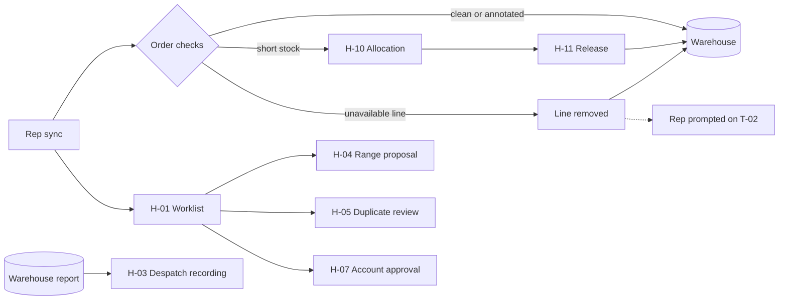

# 02 — Head office (H-01, H-02, H-03, H-10, H-16)

**Device assumptions:** laptop, online, trained daily user, high volume, keyboard-driven where possible.
**Consequence carried through every frame:** density is a feature here, not a risk. These people clear a queue.

---

## Flow



Orders no longer pass through a person. The worklist holds only range proposals, duplicate matches and account requests.

---

## H-01 · Worklist

**Job:** catch the few things that need a person. Once the rules below apply, no order is one of them.

### How orders are dispositioned

A flag no longer means "a person must look". Each flag has one of four dispositions — and "routine" stops being a category, because it was only ever the absence of flags.

| Disposition | Flags | What happens |
|---|---|---|
| **Divert** | *(none)* | — |
| **Route** | Stock Shortfall, Oversold | Order accepted; the short quantity goes to H-10 Allocation. Never on the worklist. |
| **Auto-resolve** | Unavailable Line | Order accepted; the line is removed with its reason; the rep is prompted on T-02 Home to tell the customer. |
| **Annotate** | Large, Watched Product, Rep-flagged, New Location, Prospect Conversion | Recorded on the order, readable on H-02. No human step. |

Two business rules, enforced at capture on the tablet, are what empty Divert. Neither is in the brief:

- **Price floor** — a rep cannot enter an override below the allowance configured by the product's commercial policy profile. Overrides inside it are applied, not requested. (T-07, T7.9)
- **Free of charge** — only on eligible Discontinuing products, up to the monthly quantity allowance configured per rep by their commercial policy profile. Inside the allowance, applied as an ordinary order line whose price is €0.00; stock and fulfilment are unchanged. (T-07, T7.10)

```
+---------------------------------------------------------------------------------------+
| Worklist                Tue 22 Sep                                4 need a decision   |
+---------------------------------------------------------------------------------------+
| TYPE            | ITEM                        | WHY                         | WAITING  |
+---------------------------------------------------------------------------------------+
| Range proposal  | Hickey's Head Office        | 6 adds, 2 drops             | 1d 4h  > |
| Range proposal  | Symbol Group A              | 12 adds                     | 6h     > |
| Duplicate match | Quinn's, Rathdrum (new)     | matches Quinn's Centra,     | 2d 1h  > |
|                 |                             | last ordered 14 Mar 2026    |          |
| Account request | Mary Walsh, Hickey's        | head office + 12 branches   | 3h     > |
+---------------------------------------------------------------------------------------+
```

**Empty state** — good news, no action (§2.10):

```
+---------------------------------------------------------------------------------------+
| Worklist                Tue 22 Sep                                                    |
+---------------------------------------------------------------------------------------+
|                                                                                       |
|   Nothing needs a decision.                                                           |
|                                                                                       |
+---------------------------------------------------------------------------------------+
```

> **DECISION H1.1 — Type is a column, not just a section heading.**
> Labels must survive re-sorting; section headings don't. Still holds with three item types.

> **DECISION H1.6 — orders leave the worklist entirely.**
> Price Override and Free of Charge were the only flags where a person had a real decision; H-02 forbids editing lines, so for every other flag the only choices were accept, hold or reject a whole order, and "this shop is new" argues for none of them. Moving both limits to capture turns head office from a *gatekeeper* into the owner of *guardrails*: out-of-policy requests can't be raised, so nothing in-policy needs reviewing. The failure avoided is **alarm fatigue** — ten flag types feeding a human queue teaches the operator that flags don't mean much.

> **DECISION H1.7 — Unavailable Line auto-resolves rather than stopping.**
> Stopping achieves nothing: the line can't be supplied and can't be removed by hand. Removing it automatically changes the order total after the rep quoted it, so the rep is prompted (T-02, T2.5) — for most shops the rep is the only channel to the customer.

> **SUPERSEDED — H1.2 and H1.5, "Accept all routine".** There is no routine/non-routine split when no order needs a decision. H1.3 (flags as plain sentences) and H1.4 (rep name shown) move to H-02, where annotations are now read.

---

## H-02 · Order detail

**Job:** was a decision screen; is now a **record**. It shows what was captured, what the system did with it, and why. Reached from search, the customer record or allocation — no longer from the worklist.

```
+---------------------------------------------------------------------------------------+
| < Back           O-10412   Carey's Pharmacy, Arklow                                   |
|                  Captured by Colm  ·  21 Sep 16:42  ·  accepted automatically 17:10   |
+---------------------------------------------------------------------------------------+
| NOTES ON THIS ORDER                                                                   |
|   Large order: €2,924 is 3.2x this location's October target                          |
|   1 line could not be supplied and was removed - Colm prompted to tell the customer   |
+---------------------------------------------------------------------------------------+
| LINES (18)                                                                            |
|                                                                                       |
| Hand Cream 75ml                   48   €3.42   Rep's price             €164.16        |
|   Spring offer €3.80, then 10% rep discount · "Matching competitor quote"             |
|                                                                                       |
| Aftersun Gel 200ml               120   €5.60   Your price              €672.00        |
|                                                                                       |
| Nappy Wipes 64pk                  96   (x) Not supplied - no longer in an              |
|                                        active range. Removed automatically.           |
|                                                                                       |
| Aftersun Gel 150ml             FOC 6   €0.00   Free - being discontinued              |
| ... 14 more                                                                      v    |
+---------------------------------------------------------------------------------------+
| Total as captured                                                     €3,111.36       |
| Total accepted                                                        €2,924.16       |
+---------------------------------------------------------------------------------------+
```

> **DECISION H2.6 — H-02 records; it no longer decides.**
> Per-line radios, Accept, Partial release, Hold and Reject are gone from this frame. Partial release now happens by routing — the short quantity goes to H-10 without anyone asking for it. Whether Hold and Reject survive at all is open: nothing in the flag set drives them any more.

> **DECISION H2.3 — two totals, both labelled.** *(retained)*
> Captured and accepted now differ whenever a line is removed. The difference is exactly the conversation the rep has to have with the customer.

> **DECISION H2.7 — annotations read as plain sentences under "Notes on this order".** *(was H1.3)*
> Ten flag types is too many to encode as icons anyone will learn. Sentences, most consequential first.

> **DECISION H2.8 — override lines show their working.**
> The rep's discount stacks on smaller promotions (01, T7.9), so the price is a calculation, not a comparison. Offer price, rep discount and reason sit on one line, so anyone querying it later can see how it was reached and that it was inside policy.

---

## H-03 · Despatch recording

**Job:** record what the warehouse actually sent. Designed so that "everything shipped" is one action.

```
+---------------------------------------------------------------------------------------+
| Despatch recording              Order O-10412  Carey's Pharmacy, Arklow               |
+---------------------------------------------------------------------------------------+
| Despatch date  [ 22 Sep 2026 ]                        [ Record everything remaining ] |
+---------------------------------------------------------------------------------------+
| PRODUCT                        | ORDERED | ALREADY SENT       | SENDING NOW            |
+---------------------------------------------------------------------------------------+
| SPF30 Sun Lotion 200ml         |    48   | 24 sent 12 Oct     |   [  24  ]             |
| Aftersun Gel 200ml             |   120   | 96 sent 12 Oct     |   [  24  ]             |
|                                |         | 12 sent 19 Oct     |                        |
| Nappy Wipes 64pk               |    96   | -                  |   [  96  ]             |
+---------------------------------------------------------------------------------------+
|                                                    [ Cancel ]   [ Record despatch ]   |
+---------------------------------------------------------------------------------------+
```

> **DECISION H3.1 — "Sending now" is pre-filled at the full remaining quantity.**
> The brief asks for this and it's worth naming why it's safe: this records a fact that has already happened, so the default matches the overwhelmingly common case and the operator's job becomes *correcting exceptions* rather than *typing every number*. Compare with §2.6, where pre-filling is forbidden — the difference is that those are decisions, this is a transcription.

> **DECISION H3.2 — cumulative history stacks in its own column rather than expanding.**
> Two or three despatches per line is normal; hiding them behind a chevron costs a click on the exact information needed to judge the number being typed beside it. *Proximity.*

---

## H-10 · Allocation view

**Job:** divide short stock between competing orders. One of the two hardest decision screens in the system.

```
+---------------------------------------------------------------------------------------+
| < Short products      SPF30 Sun Lotion 200ml                                          |
+---------------------------------------------------------------------------------------+
| On hand 180   ·   Outstanding 312   ·   Short by 132                                  |
| Next delivery  200 on 29 Sep                                                          |
+---------------------------------------------------------------------------------------+
|  Allocating 180 of 180        3 orders complete, 2 still short   [ Re-propose... ]   |
+---------------------------------------------------------------------------------------+
| ORDER          | LOCATION           | WANTS | WAITING | ONLY SHORT ON | ALLOCATE       |
+---------------------------------------------------------------------------------------+
| O-10388        | Kelly's, Avoca     |   24  | 11 days | this product  |  [  24  ] OK   |
|                | Passed over twice · short on 3 products                               |
| O-10401        | Quinn's, Rathdrum  |   48  |  6 days | this product  |  [  48  ] OK   |
| O-10412        | Carey's, Arklow    |   48  |  4 days | + 2 others    |  [  48  ] OK   |
| O-10418        | Byrne's, Aughrim   |  120  |  2 days | this product  |  [  60  ] short|
| O-10421        | Doyle's, Tinahely  |   72  |  1 day  | + 1 other     |  [   0  ] short|
+---------------------------------------------------------------------------------------+
|                                        [ Save draft ]   [ Go to release ]             |
+---------------------------------------------------------------------------------------+
```

**Re-propose — the manager chooses which stock pools are timely enough to use:**

```
+---------------------------------------------------------------------------------------+
| Re-propose allocation                                                           [ X ] |
+---------------------------------------------------------------------------------------+
| Choose stock the proposal may use                                                     |
|                                                                                       |
| [x] On Hand                         180   available now                                |
| [x] Incoming                        200   expected 29 Sep                              |
| [ ] Incoming                        120   expected 29 Oct                              |
|                                                                                       |
| This will replace the current draft allocation across all waiting orders.             |
|                                              [ Cancel ]   [ Re-propose allocation ]   |
+---------------------------------------------------------------------------------------+
```

> **DECISION H10.1 — the live "3 orders complete, 2 still short" header is the largest text on the screen.**
> The brief identifies it as "the figure the manager is actually deciding on". Everything else is input to that number, so it gets the visual weight and it updates on every keystroke. *Visibility of system status* applied to a decision rather than a process.

> **DECISION H10.2 — "only short on this product" is a column, and it's the reason the proposal works.**
> An order held up by this product *alone* is completed by allocating to it; an order short on three products isn't. Without this column the complete-what-you-can proposal looks arbitrary. With it, the manager can see why the algorithm skipped a bigger, older order.

> **DECISION H10.3 — the proposal is pre-filled and every cell is editable, with a Reset.**
> This is a genuine exception to §2.6. The system isn't proposing a *decision* about the world, it's proposing arithmetic that sums to the constraint. Reset makes the proposal recoverable, which is what makes pre-filling acceptable. *User control and freedom.*

> **DECISION H10.4 — "Passed over twice" sits under the order, not in a column.**
> It applies to perhaps one row in twenty. A column would be 95% empty, and empty columns read as missing data.

> **DECISION H10.5 — release is a separate screen, and nothing leaves until then.**
> Drawn as a navigation, not a dialog, because H-11 covers a per-order-or-all-together choice that a dialog would cramp.

> **DECISION H10.6 — stock changes preserve the draft and require explicit review. Source-confirmed.**
> If an Incoming quantity/date or On Hand figure changes, the system does not silently rewrite the manager's allocations. It keeps the draft, shows `Delivery changed — review allocation`, and marks the affected pool/rows. If the drafted total now exceeds available stock, release is blocked until the manager adjusts it. A fresh proposal is offered explicitly, never applied automatically.

> **DECISION H10.7 — Re-propose uses manager-selected stock pools and replaces the whole draft. Settled.**
> Before recalculating, the manager sees On Hand and every Incoming delivery with quantity and expected date, and includes or excludes each pool. This lets them omit stock that is too far away to make a useful promise. Re-propose then runs complete-what-you-can across all waiting orders using only selected pools and clearly states that it will replace current draft allocations. The currently included pools are preselected; this reflects the draft being reviewed rather than making a new decision silently.

---

## H-16 · Category archive decision

**Job:** the one screen in the system with real ceremony. Far-reaching and gradually-visible consequences.

```
+---------------------------------------------------------------------------------------+
| < Category tree        Archive "Suncare"                                              |
+---------------------------------------------------------------------------------------+
|  WHAT THIS DOES                                                                       |
|                                                                                       |
|  Archiving Suncare will also archive 4 subcategories                             v    |
|  and take 180 products out of this branch.                                       v    |
|                                                                                       |
|  Products stop appearing under Health > Skincare > Suncare.                           |
|  This is not immediately visible - reps and customers will find                       |
|  products missing from the catalogue over the following weeks.                        |
+---------------------------------------------------------------------------------------+
|  CHOOSE A PATH                                                                        |
|                                                                                       |
|  ( ) Move the products first, then archive                                            |
|      Recommended. You pick new categories before anything is archived.                |
|                                                                                       |
|  ( ) Archive everything now                                                           |
|      Then: where do the 180 products go?                                              |
|        ( ) Up to Health > Skincare                                                    |
|            They stay findable, one level higher.                                      |
|        ( ) Choose another category...                                                 |
|        ( ) Leave them in the archived branch                                          |
|            They stay in the catalogue but cannot be browsed to.                       |
|            Only search will find them.                                                |
+---------------------------------------------------------------------------------------+
|  Type ARCHIVE SUNCARE to confirm    [                          ]                      |
|                                                                                       |
|                                        [ Cancel ]   [ Archive Suncare ]               |
+---------------------------------------------------------------------------------------+
```

> **DECISION H16.1 — the gradual-visibility warning is written out, not implied by the ceremony.**
> Type-to-confirm signals "this is serious" but not *why*. The sentence about products going missing over the following weeks is the actual reason this action is dangerous, and it's the thing the operator can't work out from the counts.

> **DECISION H16.2 — "Move first" is named as recommended, and is listed first.**
> The brief gives three paths without a hierarchy. One of them is materially safer. *Error prevention* — the safe path should be the path of least resistance, and a recommendation is cheaper than a restriction.

> **DECISION H16.3 — one typed confirmation; no second confirmation for leaving products behind. Settled.**
> Choosing `Leave them in the archived branch` already exposes the exact browsing consequence, and the archive operation still requires the category-name confirmation. The selected consequence is repeated immediately above that field — `180 products will remain orderable and searchable but disappear from category browsing` — so the confirmation is informed without asking the manager to confirm the same decision twice.

> **DECISION H16.3 — the destination choice is nested inside "Archive everything now", not a separate step.**
> The brief calls for "an explicit choice of where products go, with its consequence spelled out". Nesting means the operator sees the consequence of the path before committing to it, rather than discovering it on the next screen.

> **DECISION H16.4 — type-to-confirm is last, after the path is chosen.**
> A confirm field that's live before the decision is made invites typing it early and then deciding under time pressure.

---

## Open questions from this file

1. ~~Large orders now ship with no human glance.~~ **Resolved.** Large stays Annotate. Slips are caught at capture: T-07's Review screen marks quantities that are out of pattern for the location (01, T7.11).
2. **Do orders appear on H-01 at all** — e.g. a read-only "today's orders" feed — or only via search and the customer record?
3. **Hold and Reject** — do they survive with no flag driving them? (Credit stops would be the obvious case, but credit is external per brief §9.)
4. ~~**Rep discount allowance and FOC cap granularity and accounting.**~~ **Resolved at UX level:** a manager groups eligible products into a commercial policy profile with rules such as a 10% rep discount and X FOC units per rep per month (01, T7.9–T7.10). Products outside a policy do not expose those actions. An FOC item is an ordinary order line at €0.00, with the same stock and fulfilment lifecycle as any other line; its quantity counts against the monthly allowance while the line exists and is released by normal line removal. The entity name and rule model are provisional and must be reconciled with the catalogue's existing Product Profile classification. The discount allowance stacks on promotions no larger than it; a larger promotion stops stacking, but the rep can still reach the allowance off the tier or break price if that is lower; lines in multi-buys, bundles and mix-and-match never take a rep discount; spend thresholds qualify on prices before rep discounts. Only promotions count as an "offer"; tier and quantity-break prices are the base the allowance applies to. The applicable rules, membership and current monthly FOC balance must be in the tablet snapshot (brief §11).
5. ~~**H-10** — what happens to a draft allocation when the incoming delivery changes?~~ **Resolved:** preserve and flag the draft; block release only when over-allocated; explicit Re-propose lets the manager choose usable On Hand/Incoming pools, then replaces the whole draft across waiting orders.
6. ~~**H-16** — does "Leave them in the archived branch" need its own second confirmation?~~ **Resolved — no.** Repeat the exact consequence immediately above the single category-name confirmation.

*Superseded:* queue ownership, the routine section's default state, blocking Accept on unset radios, and per-line reject — none apply once orders leave the worklist.
