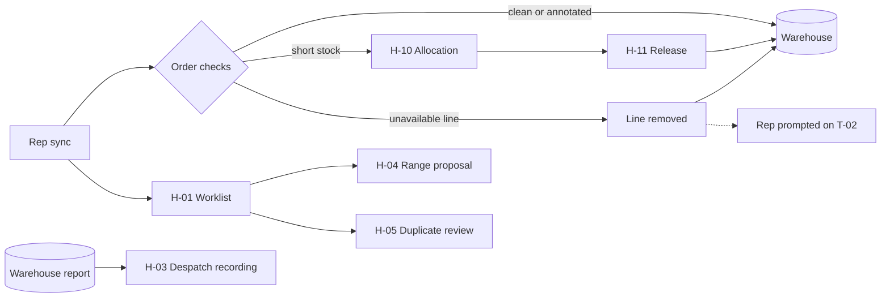

# 02 — Head office (H-01 … H-11 except H-07, H-16, H-31)

**Device assumptions:** laptop, online, trained daily user, high volume, keyboard-driven where possible.
**Consequence carried through every frame:** density is a feature here, not a risk. These people clear a queue.

---

## Flow


```mermaid
flowchart LR
    S[Rep sync] --> AUTO{Order checks}
    AUTO -->|clean or annotated| WH[(Warehouse)]
    AUTO -->|short stock| AL[H-10 Allocation]
    AL --> R2[H-11 Release] --> WH
    AUTO -->|unavailable line| REJ[Line removed] --> WH
    REJ -.-> HOME[Rep prompted on T-02]
    S --> W[H-01 Worklist]
    W --> P[H-04 Range proposal]
    W --> D[H-05 Duplicate review]
    %% H-07 Account approval replaced by M-17 on the manager website (26 Sep 2026)
    WHR[(Warehouse report)] --> DS[H-03 Despatch recording]
```

Orders no longer pass through a person. The worklist holds only range proposals and duplicate matches. *26 Sep 2026:* account requests moved to the Sales Manager on M-17, which replaces H-07.

---

## H-01 · Worklist

**Job:** catch the few things that need a person. Once the rules below apply, no order is one of them.

### How orders are dispositioned

A flag no longer means "a person must look". Each flag has one of four dispositions — and "routine" stops being a category, because it was only ever the absence of flags.

| Disposition | Flags | What happens |
|---|---|---|
| **Divert** | *(none)* | — |
| **Route** | Stock Shortfall, Oversold | Order accepted; the short quantity goes to H-10 Allocation. Never on the worklist. |
| **Auto-resolve** | Unavailable Line | Order accepted; the line is removed with its reason; the rep is prompted on T-02 Home to tell the customer. |
| **Annotate** | Large, Watched Product, Rep-flagged, New Location, Prospect Conversion | Recorded on the order, readable on H-02. No human step. |

Two business rules, enforced at capture on the tablet, are what empty Divert. Neither is in the brief:

- **Price floor** — a rep cannot enter an override below the allowance configured by the product's commercial policy profile. Overrides inside it are applied, not requested. (T-07, T7.9)
- **Free of charge** — only on eligible Discontinuing products, up to the monthly quantity allowance configured per rep by their commercial policy profile. Inside the allowance, applied as an ordinary order line whose price is €0.00; stock and fulfilment are unchanged. (T-07, T7.10)

```
+---------------------------------------------------------------------------------------+
| Worklist                Tue 22 Sep                                3 need a decision   |
+---------------------------------------------------------------------------------------+
| TYPE            | ITEM                        | WHY                         | WAITING  |
+---------------------------------------------------------------------------------------+
| Range proposal  | Hickey's Head Office        | add 1 range, remove 1       | 1d 4h  > |
| Range proposal  | Symbol Group A              | add 2 ranges                | 6h     > |
| Duplicate match | Quinn's, Rathdrum (new)     | matches Quinn's Centra,     | 2d 1h  > |
|                 |                             | last ordered 14 Mar 2026    |          |
+---------------------------------------------------------------------------------------+
| 2 orders on hold (H-06)                                                            >  |
|                                                                        View orders >  |
+---------------------------------------------------------------------------------------+
```

*26 Sep 2026 (H2.9, confirmed):* a line under the items counts orders on hold and opens H-06, so held orders are seen daily. Orders themselves stay off the Worklist (H1.6).

**Empty state** — good news, no action (§2.10):

```
+---------------------------------------------------------------------------------------+
| Worklist                Tue 22 Sep                                                    |
+---------------------------------------------------------------------------------------+
|                                                                                       |
|   Nothing needs a decision.                                                           |
|                                                                                       |
+---------------------------------------------------------------------------------------+
```

> **DECISION H1.1 — Type is a column, not just a section heading.**
> Labels must survive re-sorting; section headings don't. Still holds with two item types (account requests moved to M-17, 26 Sep 2026).

> **DECISION H1.6 — orders leave the worklist entirely.**
> Price Override and Free of Charge were the only flags where a person had a real decision; H-02 forbids editing lines, so for every other flag the only choices were accept, hold or reject a whole order, and "this shop is new" argues for none of them. Moving both limits to capture turns head office from a *gatekeeper* into the owner of *guardrails*: out-of-policy requests can't be raised, so nothing in-policy needs reviewing. The failure avoided is **alarm fatigue** — ten flag types feeding a human queue teaches the operator that flags don't mean much.
> *Amended 26 Sep 2026 (BR-NEW-009):* orders still never pass through a person, but they are accepted at the next **order cut-off**, not on receipt. Until then an order is Pending and the rep can edit it on R-04.

> **DECISION H1.7 — Unavailable Line auto-resolves rather than stopping.**
> Stopping achieves nothing: the line can't be supplied and can't be removed by hand. Removing it automatically changes the order total after the rep quoted it, so the rep is prompted (T-02, T2.5) — for most shops the rep is the only channel to the customer.

> **DECISION H1.8 — no orders feed on the Worklist, but a secondary "View orders" link. Settled 26 Sep 2026.**
> The Worklist stays a list of things that need a decision (H1.6), so orders are not listed on it. A quiet **View orders >** link sits below the items, never the primary thing on the screen, and opens **H-31 Order list** (added in session; to be drafted with the head office batch). Orders are still also reached from search, the customer record and allocation. Resolves Q6 / RC-NEW-004. **Rejected:** a "Today's orders" count on the Worklist; no way to view orders from it.

> **SUPERSEDED — H1.2 and H1.5, "Accept all routine".** There is no routine/non-routine split when no order needs a decision. H1.3 (flags as plain sentences) and H1.4 (rep name shown) move to H-02, where annotations are now read.

---

## H-02 · Order detail

**Job:** was a decision screen; is now a **record**. It shows what was captured, what the system did with it, and why. Reached from search, the customer record or allocation — no longer from the worklist.

```
+---------------------------------------------------------------------------------------+
| < Back           O-10412   Carey's Pharmacy, Arklow                                   |
|                  Captured by Colm  ·  21 Sep 16:42  ·  accepted automatically 17:10   |
+---------------------------------------------------------------------------------------+
| NOTES ON THIS ORDER                                                                   |
|   Large order: €2,924 is 3.2x this location's October target                          |
|   1 line could not be supplied and was removed - Colm prompted to tell the customer   |
+---------------------------------------------------------------------------------------+
| LINES (18)                                                                            |
|                                                                                       |
| Hand Cream 75ml                   48   €3.42   Rep's price             €164.16        |
|   Spring offer €3.80, then 10% rep discount · "Matching competitor quote"             |
|                                                                                       |
| Aftersun Gel 200ml               120   €5.60   Your price              €672.00        |
|                                                                                       |
| Nappy Wipes 64pk                  96   (x) Not supplied - no longer in an              |
|                                        active range. Removed automatically.           |
|                                                                                       |
| Aftersun Gel 150ml             FOC 6   €0.00   Free - being discontinued              |
| ... 14 more                                                                      v    |
+---------------------------------------------------------------------------------------+
| Total as captured                                                     €3,111.36       |
| Total accepted                                                        €2,924.16       |
+---------------------------------------------------------------------------------------+
```

> **DECISION H2.6 — H-02 records; it no longer decides.**
> Per-line radios, Accept, Partial release, Hold and Reject are gone from this frame. Partial release now happens by routing — the short quantity goes to H-10 without anyone asking for it. Whether Hold and Reject survive at all is open: nothing in the flag set drives them any more.

> **DECISION H2.3 — two totals, both labelled.** *(retained)*
> Captured and accepted now differ whenever a line is removed. The difference is exactly the conversation the rep has to have with the customer.

> **DECISION H2.7 — annotations read as plain sentences under "Notes on this order".** *(was H1.3)*
> Ten flag types is too many to encode as icons anyone will learn. Sentences, most consequential first.

> **DECISION H2.8 — override lines show their working.**
> The rep's discount stacks on smaller promotions (01, T7.9), so the price is a calculation, not a comparison. Offer price, rep discount and reason sit on one line, so anyone querying it later can see how it was reached and that it was inside policy.

> **DECISION H2.9 — Hold and Reject return, by hand, before the cut-off. Settled 26 Sep 2026.**
> Orders now wait as Pending until the order cut-off (BR-NEW-009), which gives head office a window to step in. While an order is Pending, H-02 offers **Hold** and **Reject**; nothing flags an order for them, so they are a person's deliberate choice (a credit stop, a suspected mistake). **Hold** keeps the order from being accepted at the cut-off until someone releases or rejects it; held orders are listed on H-06. **Reject** ends the order with a reason. Once an order is accepted, neither is offered. This resolves RC-NEW-003 and amends H2.6 (H-02 still never accepts or partly releases). **Rejected:** removing both and retiring H-06; Reject only.
> *Confirmed 26 Sep 2026:* Hold requires a note, which stays internal; the rep and customer see "On hold — we'll be in touch". Reject requires a reason, which the rep and customer see ("Rejected — Account on hold", as in Area 1 US-014 S4). A held order can't be edited by the rep or customer. **Release** accepts it at once, applying BR-NEW-001's dispositions then. Under BR-NEW-006, a hold or rejection concerns the order itself, never a rule that changed after it was captured.

```
  Pending order, before the cut-off
  | O-10412   Carey's Pharmacy, Arklow        Pending - accepted at 4pm unless held      |
  |                                                          [ Hold... ]  [ Reject... ]  |

  Hold, inline
  | Hold note (required, internal)  [ Credit stop - check with accounts   ]              |
  |                                                    [ Cancel ]   [ Hold order ]       |
```

---

## H-03 · Despatch recording

**Job:** record what the warehouse actually sent. Designed so that "everything shipped" is one action.

```
+---------------------------------------------------------------------------------------+
| Despatch recording              Order O-10412  Carey's Pharmacy, Arklow               |
+---------------------------------------------------------------------------------------+
| Despatch date  [ 22 Sep 2026 ]                        [ Record everything remaining ] |
+---------------------------------------------------------------------------------------+
| PRODUCT                        | ORDERED | ALREADY SENT       | SENDING NOW            |
+---------------------------------------------------------------------------------------+
| SPF30 Sun Lotion 200ml         |    48   | 24 sent 12 Oct     |   [  24  ]             |
| Aftersun Gel 200ml             |   120   | 96 sent 12 Oct     |   [  24  ]             |
|                                |         | 12 sent 19 Oct     |                        |
| Nappy Wipes 64pk               |    96   | -                  |   [  96  ]             |
+---------------------------------------------------------------------------------------+
|                                                    [ Cancel ]   [ Record despatch ]   |
+---------------------------------------------------------------------------------------+
```

> **DECISION H3.1 — "Sending now" is pre-filled at the full remaining quantity.**
> The brief asks for this and it's worth naming why it's safe: this records a fact that has already happened, so the default matches the overwhelmingly common case and the operator's job becomes *correcting exceptions* rather than *typing every number*. Compare with §2.6, where pre-filling is forbidden — the difference is that those are decisions, this is a transcription.

> **DECISION H3.2 — cumulative history stacks in its own column rather than expanding.**
> Two or three despatches per line is normal; hiding them behind a chevron costs a click on the exact information needed to judge the number being typed beside it. *Proximity.*

---

## H-04 · Range proposal decision

> Drafted 26 Sep 2026 as a first-iteration default from the stories. Every decision below is a drafting call awaiting confirmation.

**Job:** confirm or reject a chain's proposed Range changes, one Range at a time, so chain agreements stay controlled without blocking branches.

**From the source:** reached from the Worklist, labelled "Range proposal — Hickey's Pharmacies"; decided per line with a reason for each rejection; Partly Confirmed when mixed; the rep sees the outcome and reasons on their Call, including a rep who has since lost the master (Head Office US-005; Master & Branch US-003). *Revised 26 Sep 2026 (T12.2):* lines are whole catalogue Ranges to assign or remove, never products.

```
+---------------------------------------------------------------------------------------+
| < Worklist        Range proposal - Hickey's Pharmacies        from Colm's call 24 Sep |
+---------------------------------------------------------------------------------------+
| Hickey's is assigned: Everyday (30) · Sun care 2026 (18)                              |
+---------------------------------------------------------------------------------------+
| CHANGE                             | DECISION                                         |
+---------------------------------------------------------------------------------------+
| Add 2026 Christmas gift packs (12) | (x) Confirm  ( ) Reject                          |
| Remove Sun care 2026 (18)          | ( ) Confirm  (x) Reject [ Contracted to Dec ]    |
+---------------------------------------------------------------------------------------+
| 1 confirmed, 1 rejected - Partly confirmed          [ Cancel ]   [ Save decision ]    |
+---------------------------------------------------------------------------------------+
```

> **Drafting calls H4.1–H4.4, awaiting confirmation:**
> - **H4.1** One screen per proposal, with the chain's current Ranges above the changes, so the decision is read against what the chain takes now.
> - **H4.2** Each line starts undecided; Save is blocked until every line is decided, and a Reject needs its reason on the same row.
> - **H4.3** The result (Confirmed, Partly Confirmed, Rejected) is stated before saving, as the rep will read it.
> - **H4.4** A confirmed Range reaches branch Order Pads at their next Sync as its own section (T7.15).

---

## H-05 · Duplicate review

> Drafted 26 Sep 2026 as a first-iteration default from the stories. Every decision below is a drafting call awaiting confirmation.

**Job:** decide what a rep's new prospect actually matched, and tell the rep.

**From the source:** both records side by side; the existing Location's own pattern ("Primary: Colm · Last order 14 Mar 2026 · previously ordered roughly every 5 weeks"), with no stale flag; four outcomes — keep with the current rep, hand to the cold-calling rep, merge with an existing prospect, or dismiss so the prospect stands; the rep sees the outcome and reason at next Sync (Head Office US-005b; Prospecting US-006).

```
+---------------------------------------------------------------------------------------+
| < Worklist        Duplicate match - Byrne's Chemist, Rathdrum                         |
+---------------------------------------------------------------------------------------+
| NEW PROSPECT (Aoife, 25 Sep)             | EXISTING LOCATION                          |
| Byrne's Chemist                          | Byrne's Pharmacy                           |
| Main St, Rathdrum                        | Main St, Rathdrum                          |
| Likely to buy: High                      | Primary: Colm                              |
| "Owner keen on suncare"                  | Last order 14 Mar 2026                     |
|                                          | previously ordered roughly every 5 weeks   |
+---------------------------------------------------------------------------------------+
| What is it?                                                                           |
| ( ) Colm's live customer - keep with Colm; tell Aoife                                 |
| ( ) Lapsed customer - hand to Aoife                                                   |
| ( ) Same as another prospect - merge                                                  |
| ( ) Genuinely new - dismiss the match                                                 |
| Note to the rep  [                                            ]         [ Decide ]    |
+---------------------------------------------------------------------------------------+
```

> **Drafting calls H5.1–H5.4, awaiting confirmation:**
> - **H5.1** The four outcomes are phrased as what the match *is*, with the consequence after the dash, so the choice reads as a judgement rather than an action list.
> - **H5.2** "Hand to Aoife" goes through Coverage Management as a reassignment of that one Location, with M-08's impact shown before it is confirmed.
> - **H5.3** The note to the rep is optional; the outcome sentence the rep sees is generated ("Already a customer, covered by Colm").
> - **H5.4** Merge is offered only when the match is another prospect; for an existing customer it is absent.

---

## H-06 · Held orders

> Started 26 Sep 2026 from H2.9. Frame and details are first-iteration defaults from the brief and Head Office US-006, confirmed the same day.

**Job:** make sure nothing parked is forgotten.

**From the source:** each held order with its hold note, days held and any short products, with a link into allocation; an order whose Location closes while held is flagged for a Reject or Release decision (Head Office US-006). Holds are now manual only (H2.9); short stock no longer holds an order (BR-NEW-001), so US-006 S2's "allocation releases it" no longer applies.

```
+---------------------------------------------------------------------------------------+
| Held orders (2)                                                                        |
+---------------------------------------------------------------------------------------+
| ORDER     | LOCATION                  | HOLD NOTE                       | HELD   |        |
+---------------------------------------------------------------------------------------+
| O-10412   | Carey's Pharmacy, Arklow  | Credit stop - check accounts    | 2d 3h  |      > |
|           |                           | 1 short product - Allocate >    |        |        |
| O-10433   | Byrne's, Aughrim          | Suspected duplicate of O-10431  | 5h     |      > |
|           | (!) Location closed       |                                 |        |        |
+---------------------------------------------------------------------------------------+
|                                   Each row: [ Reject... ]  [ Release ]                 |
+---------------------------------------------------------------------------------------+

  Empty
  | No orders on hold.                                                                    |
```

> *Confirmed 26 Sep 2026:* oldest hold first; each row offers **Release** (accepts it now, H2.9) and **Reject…** (reason required); a Location that closes while an order is held shows "(!) Location closed" on the row; H-01's Worklist shows a count "2 orders on hold >" linking here, so held orders are seen daily without returning orders to the Worklist.

---

## H-08 · Short products

> Drafted 26 Sep 2026 as a first-iteration default from the stories. Every decision below is a drafting call awaiting confirmation.

**Job:** show only the products that need allocating, most pressing first.

**From the source:** a product appears when outstanding orders exceed what is available: "340 outstanding · 200 on hand · 7 orders waiting · 2 held"; ordered by how many orders are waiting, with the oldest wait shown; "On hand not entered" with an entry action; a drafted-but-unreleased allocation shows "Allocation drafted, not released" with its age, and over-allocation is flagged; empty state "No products are short" (Stock Allocation US-001, US-005). *26 Sep 2026:* orders are accepted at the cut-off with short quantities outstanding (BR-NEW-001, BR-NEW-009), so "waiting" means an order with a quantity outstanding, and "held" now means held by hand (H2.9).

```
+---------------------------------------------------------------------------------------+
| Short products (3)                                                                    |
+---------------------------------------------------------------------------------------+
| PRODUCT                  OUTSTANDING    ON HAND       WAITING       OLDEST WAIT       |
+---------------------------------------------------------------------------------------+
| SPF30 Sun Lotion 200ml        340         200         7 (2 held)    11 days       >   |
|   Allocation drafted, not released - 1 day                                            |
| Aftersun Gel 200ml            120     not entered     3             4 days        >   |
|                                       [ Enter on hand ]                               |
| Nappy Wipes 64pk               96          40         2             2 days        >   |
|   (!) Over-allocated - on hand reduced since the draft                                |
+---------------------------------------------------------------------------------------+

  Empty
  | No products are short.                                                              |
```

> **Drafting calls H8.1–H8.3, awaiting confirmation:**
> - **H8.1** A row opens H-10 for that product; "Enter on hand" opens H-09 in place.
> - **H8.2** Draft and over-allocation notices sit under their product's row, not in a separate list.
> - **H8.3** A product leaves the list as soon as everything outstanding can be filled (US-001 S5).

---

## H-09 · Stock entry

> Drafted 26 Sep 2026 as a first-iteration default from the stories. Every decision below is a drafting call awaiting confirmation.

**Job:** record what is on hand and what is coming, so allocation works from real figures.

**From the source:** On Hand with who entered it and when; Incoming deliveries with quantity and expected date, several in date order, all allocatable; a delivery that arrives is moved to On Hand and closes; changing an Incoming quantity or date flags allocations "Delivery changed — review allocation"; measure-based products in their unit (Stock Allocation US-002). A change never rewrites a draft; the manager reviews or re-proposes (H10.6–H10.7).

```
+---------------------------------------------------------------------------------------+
| < SPF30 Sun Lotion 200ml        Stock                                                 |
+---------------------------------------------------------------------------------------+
| On hand     [  200  ]   entered by [name], 26 Sep 09:14                               |
+---------------------------------------------------------------------------------------+
| INCOMING                                                                              |
| 400   expected 22 Oct 2026                        [ Arrived ]   [ Edit ]              |
| 250   expected  5 Nov 2026                        [ Arrived ]   [ Edit ]              |
| [ + Add delivery ]                                                                    |
+---------------------------------------------------------------------------------------+
| (!) Delivery changed - review allocation  >                                           |
+---------------------------------------------------------------------------------------+
```

> **Drafting calls H9.1–H9.3, awaiting confirmation:**
> - **H9.1** Stock is entered per product, reached from H-08, H-10 or the product record (H-13); there is no bulk stock sheet in this iteration.
> - **H9.2** **Arrived** moves the delivery's quantity into On Hand and closes it, with a chance to correct the quantity that actually came.
> - **H9.3** Editing a delivery's quantity or date shows the "Delivery changed — review allocation" link to H-10 when a draft uses it.

---

## H-10 · Allocation view

**Job:** divide short stock between competing orders. One of the two hardest decision screens in the system.

```
+---------------------------------------------------------------------------------------+
| < Short products      SPF30 Sun Lotion 200ml                                          |
+---------------------------------------------------------------------------------------+
| On hand 180   ·   Outstanding 312   ·   Short by 132                                  |
| Next delivery  200 on 29 Sep                                                          |
+---------------------------------------------------------------------------------------+
|  Allocating 180 of 180        3 orders complete, 2 still short   [ Re-propose... ]   |
+---------------------------------------------------------------------------------------+
| ORDER          | LOCATION           | WANTS | WAITING | ONLY SHORT ON | ALLOCATE       |
+---------------------------------------------------------------------------------------+
| O-10388        | Kelly's, Avoca     |   24  | 11 days | this product  |  [  24  ] OK   |
|                | Passed over twice · short on 3 products                               |
| O-10401        | Quinn's, Rathdrum  |   48  |  6 days | this product  |  [  48  ] OK   |
| O-10412        | Carey's, Arklow    |   48  |  4 days | + 2 others    |  [  48  ] OK   |
| O-10418        | Byrne's, Aughrim   |  120  |  2 days | this product  |  [  60  ] short|
| O-10421        | Doyle's, Tinahely  |   72  |  1 day  | + 1 other     |  [   0  ] short|
+---------------------------------------------------------------------------------------+
|                                        [ Save draft ]   [ Go to release ]             |
+---------------------------------------------------------------------------------------+
```

**Re-propose — the manager chooses which stock pools are timely enough to use:**

```
+---------------------------------------------------------------------------------------+
| Re-propose allocation                                                           [ X ] |
+---------------------------------------------------------------------------------------+
| Choose stock the proposal may use                                                     |
|                                                                                       |
| [x] On Hand                         180   available now                                |
| [x] Incoming                        200   expected 29 Sep                              |
| [ ] Incoming                        120   expected 29 Oct                              |
|                                                                                       |
| This will replace the current draft allocation across all waiting orders.             |
|                                              [ Cancel ]   [ Re-propose allocation ]   |
+---------------------------------------------------------------------------------------+
```

> **DECISION H10.1 — the live "3 orders complete, 2 still short" header is the largest text on the screen.**
> The brief identifies it as "the figure the manager is actually deciding on". Everything else is input to that number, so it gets the visual weight and it updates on every keystroke. *Visibility of system status* applied to a decision rather than a process.

> **DECISION H10.2 — "only short on this product" is a column, and it's the reason the proposal works.**
> An order held up by this product *alone* is completed by allocating to it; an order short on three products isn't. Without this column the complete-what-you-can proposal looks arbitrary. With it, the manager can see why the algorithm skipped a bigger, older order.

> **DECISION H10.3 — the proposal is pre-filled and every cell is editable, with a Reset.**
> This is a genuine exception to §2.6. The system isn't proposing a *decision* about the world, it's proposing arithmetic that sums to the constraint. Reset makes the proposal recoverable, which is what makes pre-filling acceptable. *User control and freedom.*

> **DECISION H10.4 — "Passed over twice" sits under the order, not in a column.**
> It applies to perhaps one row in twenty. A column would be 95% empty, and empty columns read as missing data.

> **DECISION H10.5 — release is a separate screen, and nothing leaves until then.**
> Drawn as a navigation, not a dialog, because H-11 covers a per-order-or-all-together choice that a dialog would cramp.

> **DECISION H10.6 — stock changes preserve the draft and require explicit review. Source-confirmed.**
> If an Incoming quantity/date or On Hand figure changes, the system does not silently rewrite the manager's allocations. It keeps the draft, shows `Delivery changed — review allocation`, and marks the affected pool/rows. If the drafted total now exceeds available stock, release is blocked until the manager adjusts it. A fresh proposal is offered explicitly, never applied automatically.

> **DECISION H10.7 — Re-propose uses manager-selected stock pools and replaces the whole draft. Settled.**
> Before recalculating, the manager sees On Hand and every Incoming delivery with quantity and expected date, and includes or excludes each pool. This lets them omit stock that is too far away to make a useful promise. Re-propose then runs complete-what-you-can across all waiting orders using only selected pools and clearly states that it will replace current draft allocations. The currently included pools are preselected; this reflects the draft being reviewed rather than making a new decision silently.

---

## H-11 · Release confirmation

> Drafted 26 Sep 2026 as a first-iteration default from the stories. Every decision below is a drafting call awaiting confirmation.

**Job:** send allocated stock to the warehouse, per order or all together; nothing leaves until then.

**From the source:** release one order's allocation or the whole split; released orders become "Accepted — partly sent" or, when filled, leave the waiting list; orders allocated nothing stay waiting; On Hand reduces by the released total; an over-allocated draft can't be released; a closed Location's order is excluded for a deliberate decision; Run-out products can't exceed Remaining (Stock Allocation US-004, US-005).

```
+---------------------------------------------------------------------------------------+
| < Allocation      Release - SPF30 Sun Lotion 200ml                                    |
+---------------------------------------------------------------------------------------+
| Release 180 units to the warehouse                                                    |
| O-10388   Kelly's, Avoca        24   completes the order                              |
| O-10401   Quinn's, Rathdrum     48   completes the order                              |
| O-10412   Carey's, Arklow       48   completes this line; 2 other lines still short   |
| O-10418   Byrne's, Aughrim      60   60 still outstanding                             |
| On hand after release: 0                                                              |
+---------------------------------------------------------------------------------------+
|                                            [ Back ]   [ Release 4 orders ]            |
+---------------------------------------------------------------------------------------+
```

> **Drafting calls H11.1–H11.3, awaiting confirmation:**
> - **H11.1** "Go to release" on H-10 opens this confirmation listing every order in the split; releasing one order is done from its row on H-10 without this screen.
> - **H11.2** Each row states the consequence for that order ("completes the order", "still outstanding"), so the release is read as outcomes, not numbers.
> - **H11.3** The button names the count ("Release 4 orders"); orders allocated nothing aren't listed.

---

## H-16 · Category archive decision

**Job:** the one screen in the system with real ceremony. Far-reaching and gradually-visible consequences.

```
+---------------------------------------------------------------------------------------+
| < Category tree        Archive "Suncare"                                              |
+---------------------------------------------------------------------------------------+
|  WHAT THIS DOES                                                                       |
|                                                                                       |
|  Archiving Suncare will also archive 4 subcategories                             v    |
|  and take 180 products out of this branch.                                       v    |
|                                                                                       |
|  Products stop appearing under Health > Skincare > Suncare.                           |
|  This is not immediately visible - reps and customers will find                       |
|  products missing from the catalogue over the following weeks.                        |
+---------------------------------------------------------------------------------------+
|  CHOOSE A PATH                                                                        |
|                                                                                       |
|  ( ) Move the products first, then archive                                            |
|      Recommended. You pick new categories before anything is archived.                |
|                                                                                       |
|  ( ) Archive everything now                                                           |
|      Then: where do the 180 products go?                                              |
|        ( ) Up to Health > Skincare                                                    |
|            They stay findable, one level higher.                                      |
|        ( ) Choose another category...                                                 |
|        ( ) Leave them in the archived branch                                          |
|            They stay in the catalogue but cannot be browsed to.                       |
|            Only search will find them.                                                |
+---------------------------------------------------------------------------------------+
|  Type ARCHIVE SUNCARE to confirm    [                          ]                      |
|                                                                                       |
|                                        [ Cancel ]   [ Archive Suncare ]               |
+---------------------------------------------------------------------------------------+
```

> **DECISION H16.1 — the gradual-visibility warning is written out, not implied by the ceremony.**
> Type-to-confirm signals "this is serious" but not *why*. The sentence about products going missing over the following weeks is the actual reason this action is dangerous, and it's the thing the operator can't work out from the counts.

> **DECISION H16.2 — "Move first" is named as recommended, and is listed first.**
> The brief gives three paths without a hierarchy. One of them is materially safer. *Error prevention* — the safe path should be the path of least resistance, and a recommendation is cheaper than a restriction.

> **DECISION H16.3 — one typed confirmation; no second confirmation for leaving products behind. Settled.**
> Choosing `Leave them in the archived branch` already exposes the exact browsing consequence, and the archive operation still requires the category-name confirmation. The selected consequence is repeated immediately above that field — `180 products will remain orderable and searchable but disappear from category browsing` — so the confirmation is informed without asking the manager to confirm the same decision twice.

> **DECISION H16.3 — the destination choice is nested inside "Archive everything now", not a separate step.**
> The brief calls for "an explicit choice of where products go, with its consequence spelled out". Nesting means the operator sees the consequence of the path before committing to it, rather than discovering it on the next screen.

> **DECISION H16.4 — type-to-confirm is last, after the path is chosen.**
> A confirm field that's live before the decision is made invites typing it early and then deciding under time pressure.

---

## H-31 · Order list

> Added in session (26 Sep 2026) from H1.8; not in the brief. Drafted as a first-iteration default. Every decision below is a drafting call awaiting confirmation.

**Job:** let head office look at orders when it wants to, without orders sitting on the Worklist.

**From the source:** reached from a secondary "View orders >" link on H-01 (H1.8); each row opens H-02. Orders are Pending until the cut-off, may be Held or Rejected by hand before it, then Accepted (BR-NEW-009, H2.9).

```
+---------------------------------------------------------------------------------------+
| < Worklist      Orders                                                                |
| Status [ Pending v ]   Date [ Today v ]   Location [ All v ]   Rep [ All v ]   Search |
+---------------------------------------------------------------------------------------+
| O-10433   Byrne's, Aughrim        Colm        Pending - 4pm        EUR  412.60     >  |
| O-10412   Carey's, Arklow         Colm        Held                 EUR 2,924.16    >  |
| O-10431   Hickey's Rathdrum       Online      Pending - 4pm        EUR   84.40     >  |
| ...                                                                                   |
+---------------------------------------------------------------------------------------+
| 58 orders today · 41 Pending until 4pm · 2 Held                                       |
+---------------------------------------------------------------------------------------+
```

> **Drafting calls H31.1–H31.3, awaiting confirmation:**
> - **H31.1** Opens filtered to today's Pending orders, the ones head office can still act on before the cut-off.
> - **H31.2** Filters: status, date, Location, rep (with "Online" for customer-placed orders), and a search box for order number or Location.
> - **H31.3** A footer counts the filtered set; the list itself has no actions, since Hold and Reject happen on H-02.

---

## Open questions from this file

1. ~~Large orders now ship with no human glance.~~ **Resolved.** Large stays Annotate. Slips are caught at capture: T-07's Review screen marks quantities that are out of pattern for the location (01, T7.11).
2. ~~**Do orders appear on H-01 at all** — e.g. a read-only "today's orders" feed — or only via search and the customer record?~~ **Resolved 26 Sep 2026 (H1.8):** no feed; a secondary "View orders" link opens H-31 Order list.
3. ~~**Hold and Reject** — do they survive with no flag driving them?~~ **Resolved 26 Sep 2026 (H2.9):** both return, by hand, before the cut-off; held orders are listed on H-06.
4. ~~**Rep discount allowance and FOC cap granularity and accounting.**~~ **Resolved at UX level:** a manager groups eligible products into a commercial policy profile with rules such as a 10% rep discount and X FOC units per rep per month (01, T7.9–T7.10). Products outside a policy do not expose those actions. An FOC item is an ordinary order line at €0.00, with the same stock and fulfilment lifecycle as any other line; its quantity counts against the monthly allowance while the line exists and is released by normal line removal. The entity name and rule model are provisional and must be reconciled with the catalogue's existing Product Profile classification. The discount allowance stacks on promotions no larger than it; a larger promotion stops stacking, but the rep can still reach the allowance off the tier or break price if that is lower; lines in multi-buys, bundles and mix-and-match never take a rep discount; spend thresholds qualify on prices before rep discounts. Only promotions count as an "offer"; tier and quantity-break prices are the base the allowance applies to. The applicable rules, membership and current monthly FOC balance must be in the tablet snapshot (brief §11).
5. ~~**H-10** — what happens to a draft allocation when the incoming delivery changes?~~ **Resolved:** preserve and flag the draft; block release only when over-allocated; explicit Re-propose lets the manager choose usable On Hand/Incoming pools, then replaces the whole draft across waiting orders.
6. ~~**H-16** — does "Leave them in the archived branch" need its own second confirmation?~~ **Resolved — no.** Repeat the exact consequence immediately above the single category-name confirmation.

*Superseded:* queue ownership, the routine section's default state, blocking Accept on unset radios, and per-line reject — none apply once orders leave the worklist.
