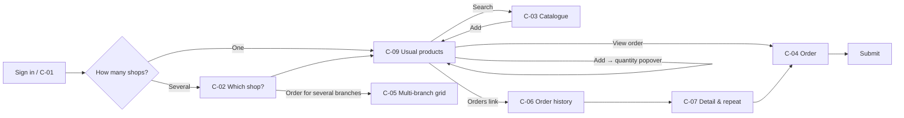

# 06 — Customer self-service (C-01 … C-09)

> C-01–C-08 follow the brief (§7). **C-09 Usual products** isn't in the brief and was added in session (24 Sep 2026): it is the customer's landing page once a shop is chosen. It's numbered after C-08 so it doesn't clash with the brief's IDs, following M-16.

**Device assumptions:** website and app, online, on a phone or at a desk. The app has the same features and no offline mode (Self-service RC 5, assumed).
**Users:** untrained and infrequent. No internal vocabulary: no tier names, price breakdowns or rep provenance (brief §7). No "as of sync" wording anywhere — figures are live (Self-service §4).
**Consequence:** the landing page *is* the product for most customers. Its primary job must be one step from sign-in, and everything else sits a click further in.

---

## Jobs to be done

**Primary job (settled 24 Sep 2026):** "Order the products I usually buy for this shop." Colm's correction to the persona: customers buy **the same products**, but **rarely the same order**. Repeating a past order (C-07, Self-service US-009) is therefore secondary; the landing page is built around frequent products, not past orders.

**Secondary job:** "What's coming, and what's outstanding?" — served by C-06, reached by a link (C9.7).



---

## C-01 · Invitation & first sign-in

**Job:** get an invited contact from the invitation email to their first order with no registration form, and back in again when they forget their password.

**From the source:** accounts are created by a rep or manager, never self-registered (brief §7, Self-service US-001). The invitee follows the invitation and sets a password; the account becomes Active. Expired invitation: "This invitation has expired — contact your sales representative" and the invitee can request a new one. Forgotten password: a reset goes to the email on the Contact record (US-002). US-002 S1 says the customer lands "on my Locations"; the flow above refines that: one shop goes straight to C-09, several go to C-02. Open in the source: invitation lifetime, delivery channel (email assumed), password policy.

**Decision C1.1 — an expired invitation offers "Request a new invitation", approved before it is sent. Settled 26 Sep 2026.** The expired page gives one action instead of a dead end. The request goes to the rep or manager; a new invitation is sent only when one of them approves it. The page then confirms the request was sent. Following the old link again shows that the request is awaiting approval and creates no duplicate. Rejected: resending automatically (an expired link would be enough to reissue access); "contact your sales representative" with no action.

```text
+------------------------------------------------+
|  This invitation has expired                   |
|                                                |
|  Invitations are valid for a limited time.     |
|  Ask for a new one and we'll let your sales    |
|  representative know.                          |
|                                                |
|          [ Request a new invitation ]          |
+------------------------------------------------+

After requesting:
+------------------------------------------------+
|  Request sent                                  |
|  You'll get a new invitation by email once     |
|  it's approved.                                |
+------------------------------------------------+
```

The wording is a drafting call.

**Decision C1.2 — the Location's rep approves the request. Settled 26 Sep 2026.** The account was approved once already (US-001 S1); only the link has expired. The rep responsible for the contact's Location receives the request and sends the new invitation, without a manager step. If the Location has no assigned rep, the request goes to the manager who would see that Location as Unassigned (M15.2); confirmed 26 Sep 2026. Rejected: rep then manager, as for a new account; manager only. Where the rep sees and acts on the request is open.

**Decision C1.3 — the rep sees and approves the request on T-02 Home. Settled 26 Sep 2026.** The rep opens Home between every visit, so a request there is seen the same day. The request shows the contact, the Location and the date it was made, with one action: **Send new invitation**. Consequence: the tablet syncs only when the rep chooses (T-01), so a request reaches the rep at their next sync and the new invitation goes out at the sync after they approve it. Mary may wait several hours, but not days. Rejected: T-05 (waits for a visit); the rep website R-01 (used less often). How it sits on Home is open: T2.5 says a fifth counter in the exception strip should force a rethink of the strip.

**Decision C1.4 — requests have their own collapsed section on Home. Settled 26 Sep 2026.** "CUSTOMER REQUESTS (1)" sits with Home's other collapsed sections below Today and appears only when a request is waiting. The exception strip stays at four counters (T2.5). *Confirmed 26 Sep 2026:* it is the first of the collapsed sections, because it is the only one where someone outside is waiting. Rejected: a fifth counter in the strip.

**Decision C1.5 — customer requests reach the tablet whenever it has signal. Settled 26 Sep 2026.** This is a narrow exception to T1.3 (manual sync in both directions): customer requests are delivered in the background when the tablet is in range, without the rep pressing Sync. Orders, calls and all other work still sync only when the rep chooses. Because requests appear only in their own section (C1.4), the strip counts the rep relies on still change only on a manual sync. This supersedes C1.3's "arrives at the next sync". Whether "Send new invitation" also goes out in the background is open.

**Decision C1.6 — a request also emails the rep. Settled 26 Sep 2026.** When a customer requests a new invitation, the rep who will approve it (or the manager, for a Location with no assigned rep, C1.2) also gets an email. This covers a rep who is out of range or not using the tablet that day. The email prompts the rep; the approval itself still happens on T-02.

**Decision C1.7 — "Send new invitation" also goes out in the background. Settled 26 Sep 2026.** The approval leaves the tablet as soon as there is signal, without a manual sync, so Mary gets the new invitation within minutes. The whole customer-request loop (request in, approval out) runs outside manual sync, widening C1.5's exception to T1.3 to both directions for customer requests only. *Confirmed 26 Sep 2026:* after sending, the request stays in the section greyed with "Sent 14:20" until the rep leaves Home, then disappears (the same mis-tap pattern as T2.6); if there is no signal it shows "Will send when in range". Rejected: waiting for the rep's next manual sync.

**C-01 first-pass status:** the expired-invitation path (C1.1–C1.7) is ready for the initial design round. First sign-in (set a password, then C-09 or C-02) and forgotten password follow US-002 as written. Invitation lifetime, delivery channel and password policy remain business questions in the source, not screen decisions.

---

## C-02 · My locations

**Job:** choose a chain order or the shop for a single-location order, so stock goes to the intended places.

```
+--------------------------------------------------------+
|  Which shop is this order for?                         |
|                                                        |
|  Hickey's Rathdrum                               >     |
|  Hickey's Arklow                                 >     |
|    Closed until 14 Oct                                 |
+--------------------------------------------------------+
```

> **DECISION C2.1 — a user with more than one shop chooses the shop on every visit; the last choice isn't remembered. Settled.**
> Multi-shop users are most likely managers who move between shops frequently, which is exactly where a remembered context turns into a mode error (ordering for Rathdrum while believing it's Arklow). One extra tap per visit is the accepted cost. A user with one shop skips the choice (Self-service US-003 S3). Rejected: remembering the last shop with a header switcher; remembering within a session.

For a chain head office buyer, C-02 leads with the chain order:

```
+--------------------------------------------------------+
|  What would you like to order?                         |
|                                                        |
|  [ Order for several branches                 > ]      |
|                                                        |
|  Order for one location                                |
|  Hickey's Head Office                            >     |
|  Hickey's Rathdrum                              >      |
|  Hickey's Arklow                                >      |
|    Closed until 14 Oct                                 |
|  ... 10 more branches                                  |
+--------------------------------------------------------+
```

> **DECISION C2.2 — for a chain head office buyer, “Order for several branches” is the primary action above the individual locations. Settled 25 Sep 2026.**
> Chain orders are what this buyer mostly signs in to do, so the action leads directly to C-05. The head office location and eligible branches remain below for single-location orders. This is still a choice on every visit (C2.1); nothing is preselected. Rejected: making the single-location list primary; giving the two paths equal weight.

*Still to design:* the remaining C-05 details. The individual-location list follows Self-service US-003's Closed and Temporarily Closed rules.

---

## C-05 · Multi-branch grid

**Job:** enter one chain order across branches, using the chain's confirmed product set as the starting point.

**Structure sketches — first-pass desktop hierarchy confirmed (C5.16); phone composition remains a drafting call.** Branch columns are abbreviated; the figures illustrate hierarchy only. The first frame is for laptop or larger tablet, and the second is the phone's product list before opening a product for branch quantities.

Laptop / larger tablet:

```
+------------------------------------------------------------------------------------------+
| Hickey's Head Office · Order for several branches · 12 branches                          |
| Branches [ 10 of 12 selected · Change ]   Range [ Everyday v ]   Search [...........]    |
|                                                                                          |
| Entered in this order             All | Rathdrum | Arklow | ... | Total                  |
| Hand Cream 75ml                   24  |    24    |   12   | ... |  ...                   |
| Christmas Gift Pack A              6  |     6    |    6   | ... |  ...                   |
|                                                                                          |
| Everyday · products not yet in this order                                                |
| Sudocrem 125g                     [ ] |   [ ]    |  [ ]   | ... |   0                    |
| ...                                                                                      |
|                                                                                          |
| 6 products · 10 branches · 1,380 units                 [ Review branch orders ]          |
+------------------------------------------------------------------------------------------+
```

Phone:

```
+--------------------------------------------------+
| Hickey's · Order for several branches            |
| Branches [ 10 of 12 · Change ]                   |
| Range [ Everyday v ]                             |
|                                                  |
| Entered in this order                            |
| Hand Cream 75ml                                  |
|   24 × 9 branches · 1 adjusted          [ Edit ] |
| Christmas Gift Pack A                            |
|   6 × 10 branches                       [ Edit ] |
|                                                  |
| Everyday · products not yet in this order        |
| Sudocrem 125g                          [ Choose ] |
| ...                                              |
|                                                  |
| 6 products · 10 branches · 1,380 units           |
| [ Review branch orders ]                         |
+--------------------------------------------------+
```

Phone product entry after the buyer has entered a quantity for all and adjusted two branches — **drafting call**, not confirmed:

```
+--------------------------------------------------+
| SPF30 Sun Lotion v2 200ml                        |
| 10 selected branches                             |
|                                                  |
| Quantity for all branches [ 24 ]                 |
| Adjust branches                                  |
| Wicklow Town               [ 36 ]                |
| Rathdrum                   [  0 ]                |
| ...                                              |
|                                                  |
| 24 × 8 branches · 1 adjusted · 1 none            |
| [ Save product ]                                 |
+--------------------------------------------------+
```

Branch quantities opened after a blocked removal (C5.13–C5.14):

```
Arklow · quantities in this order
Arklow has an active order here.
Clear its quantities before removing this branch.

Hand Cream 75ml                       24  [ Edit ]
Christmas Gift Pack A                   6  [ Edit ]
```

After the last Arklow quantity is cleared, Arklow remains selected; the buyer returns to Branches and removes it there (C5.15).

> **DECISION C5.1 — the chain's confirmed Agreed Range supplies the grid's predefined products. Settled 25 Sep 2026.**
> The buyer expects a stable set chosen for the chain, such as an Agreed Range named “2026 Christmas gift packs”. Agreed Ranges live on the Master Location and guide ordering without limiting it (Master & Branch Ordering §1, amended by C5.4). This changes the customer grid's starting product source from M-11's recent-orders list. Quantities open empty, as elsewhere in order entry.

> **DECISION C5.2 — entered product rows remain visible with their quantities when the buyer changes ranges. Settled 25 Sep 2026.**
> A buyer can enter Christmas gift packs, switch to everyday products, and still see the entered Christmas rows in the same grid. Changing the selected range changes the products offered for entry without hiding work already entered. C5.8 places those rows at the top.

> **DECISION C5.3 — a dropdown selects among the chain's named ranges, with the buyer's default shown automatically when the grid opens. Settled 25 Sep 2026 at UX level; default scope clarified by C5.6.**
> The buyer can start entering quantities immediately from their default range or choose another, such as “2026 Christmas gift packs”. Entered rows remain visible when the selection changes (C5.2). Before a buyer has set a default, the first dropdown option opens (C5.7).

> **DECISION C5.4 — a chain can have multiple separate Agreed Ranges. Settled 26 Sep 2026.**
> The dropdown's options are distinct Agreed Ranges held by the Master Location, not named subsets inside one list. This supersedes Master & Branch Ordering's one-Agreed-Range-per-chain assumption. Each buyer can designate their own default among them (C5.5–C5.6). The effect on rep screens and range-proposal targeting needs its own design pass.

> **DECISION C5.5 — the customer designates the default Agreed Range. Settled 26 Sep 2026.**
> The automatically shown range is controlled by the signed-in customer buyer. C5.6 clarifies that this is their personal default.

> **DECISION C5.6 — the default is personal to the buyer who sets it. Settled 26 Sep 2026.**
> If one Hickey's buyer sets “2026 Christmas gift packs” as their default, another buyer's starting range does not change. Each buyer with access to the chain grid may set their own default. C5.7 covers the first opening before a personal choice has been made.

> **DECISION C5.7 — until a buyer sets a personal default, the first range in the dropdown is shown. Settled for the current design 26 Sep 2026; Colm may change this later.**
> The first dropdown option is selected automatically on opening the grid. This display fallback does not itself save a personal default; only the buyer's deliberate choice does (C5.5–C5.6). The dropdown's sort order is deferred for now; “first” means the first option presented by the current list.

> **DECISION C5.8 — entered product rows sit at the top of the grid, above the selected range's remaining products. Settled 26 Sep 2026.**
> After entering Christmas products and selecting Everyday, the Christmas rows and their quantities stay visible in the top group; Everyday products appear below for further entry. This gives the buyer a stable view of work already entered while browsing another range. C5.10 confirms that a product can belong to both ranges, and C5.11 keeps an entered product in the top group only.

> **DECISION C5.9 — the grid is the main laptop and larger-tablet presentation; phone uses product-at-a-time entry. Settled 26 Sep 2026.**
> Chain buyers mainly build these orders on a laptop or larger tablet. On a phone, the same chain order is still possible through the existing rep-tablet pattern: pick a product, set one quantity for the selected branches, adjust exceptions, and keep a running summary before review. Twelve branch columns are not squeezed into the phone viewport. Both presentations retain the chosen Agreed Range and the entered work from C5.2/C5.8, and lead to the same branch-order review. The exact phone composition remains a drafting task.

> **DECISION C5.10 — a product may belong to more than one Agreed Range for the same chain. Settled 26 Sep 2026.**
> “Hand Cream 75ml” may be in both Everyday and “2026 Christmas gift packs”. Each range keeps its own confirmed membership. This affects the customer grid and the earlier one-product-one-place rule on the rep branch pad; C5.11 settles the customer grid's display once the product is entered.

> **DECISION C5.11 — an entered product appears only in the top group, never a second time in the selected range below. Settled 26 Sep 2026.**
> Once Hand Cream has quantities in the chain order, it stays in “Entered in this order” when the buyer changes ranges. Even if Hand Cream belongs to the selected range, its lower available-product row is omitted. The buyer edits the existing row and its branch quantities, avoiding two apparent order lines for one product.

> **DECISION C5.12 — all eligible branches start selected; the buyer may remove branches before entering products. Settled 26 Sep 2026.**
> This follows the rep multi-branch session's starting scope (Master & Branch US-005). Closed branches are excluded; Temporarily Closed branches remain selected with their closure date visible. The buyer can deselect branches not receiving this chain order before working through products. C5.13 governs removal after quantities have been entered.

> **DECISION C5.13 — a branch with any quantity in the current chain order cannot be removed from selection. Settled 26 Sep 2026.**
> If Arklow has 24 Hand Cream in this in-progress chain order, an attempt to deselect Arklow is blocked. Message: “Arklow has an active order here. Clear its quantities before removing this branch.” A branch with no quantities may be deselected. The message refers to the current chain-order session, not a separate previously submitted order.

> **DECISION C5.14 — the blocked-removal message opens that branch's quantities. Settled 26 Sep 2026.**
> Attempting to remove Arklow while it has quantities opens directly on Arklow's entered products and quantities in the current chain order, with the blocking message visible there. The buyer can edit or clear them. The branch stays selected while its quantities remain (C5.13), and after they are cleared until the buyer removes it deliberately (C5.15).

> **DECISION C5.15 — clearing a branch's last quantity does not remove the branch. Settled 26 Sep 2026.**
> After clearing all of Arklow's quantities, Arklow stays selected. The buyer returns to branch selection and deliberately deselects it. Clearing quantities and changing the branch scope are separate actions, so the earlier failed removal attempt is not carried through automatically.

> **DECISION C5.16 — the desktop/larger-tablet hierarchy above is accepted for the initial design round. Settled 26 Sep 2026.**
> Entered products remain at the top, the selected Agreed Range's remaining products sit below, branch quantities run across each row, and a running summary leads to Review. Colm expects details to evolve during implementation, so the frame is a first-pass structure rather than a fixed pixel-level layout. The phone product list and entry frames remain drafting calls for later feedback.

---

## C-03 · Catalogue & search

**Job:** help a customer find a product outside their usual list while keeping their assigned products easy to browse.

**From the source:** category browsing starts with the Customer's assigned catalogue Ranges plus unranged products. Restricted products never appear. Availability labels must explain whether a product is temporarily out, being discontinued, running out, or gone, with replacements where relevant (Self-service US-004; brief §7). C9.9 keeps “ordered by someone else” marks off this screen.

**Decision C3.1 — one search, curated matches first. Settled 26 Sep 2026.** A search shows matches from the Customer's curated catalogue first, with other products the Customer is permitted to buy underneath. The buyer does not have to choose a separate “Search all products” action or repeat the query. This supersedes US-004's separate wider-search step.

**Decision C3.2 — curated browsing with a wider option. Settled 26 Sep 2026.** Before a search, category browsing shows the curated catalogue (assigned Ranges plus unranged products). The buyer can choose to browse the wider permitted catalogue. Restricted products remain hidden.

**Decision C3.3 — switch browse scope on the same page. Settled 26 Sep 2026.** A simple two-option control above the categories reads “Your catalogue” and “All products”. “Your catalogue” is selected initially. Choosing “All products” widens browsing in place; choosing “Your catalogue” returns to the curated view without leaving C-03. The selected category is retained when it exists in both views. The control changes browsing scope only; search continues to show both result groups under C3.1. Exact control styling can be refined during implementation.

```text
+--------------------------------------------------------+
|  Search products [                                ]     |
+--------------------------------------------------------+
|  Browse products                                       |
|  [ Your catalogue ]  [ All products ]                  |
|  Viewing: Your catalogue                               |
|    Health & beauty  >                                  |
|    Medicines        >                                  |
|    Seasonal         >                                  |
|    ...                                                 |
+--------------------------------------------------------+
```

```text
+--------------------------------------------------------+
|  Search products [ lozenge                        ]     |
+--------------------------------------------------------+
|  From your catalogue                                   |
|    Honey & Lemon Lozenges                  [ Add ]       |
|    ...                                                 |
+--------------------------------------------------------+
|  Other products you can buy                            |
|    Sugar Free Lozenges                     [ Add ]       |
|    ...                                                 |
+--------------------------------------------------------+
|  [ Browse your catalogue by category ]                 |
+--------------------------------------------------------+
```

**First-pass display rule:** show each matching product once. If the curated section has no matches, the other permitted matches still appear under their own heading. The availability treatments above apply to visible catalogue products; Restricted products stay hidden. Exact row content and long-result handling are drafting calls for implementation feedback.

**Availability row examples from US-004 (first-pass wording):**

```text
SPF30 Sun Lotion 200ml
  Back in stock around 25 October                     [ Unavailable ]

SPF30 Sun Lotion 200ml (old)
  Being discontinued — replaced by SPF30 Sun Lotion v2  [ Add ]

Vitamin Pack
  Limited stock, no restock — about 120 left            [ Add ]

Herbal Balm (old)
  No longer available · Replacement: Herbal Balm 100ml [ View replacement ]
```

These examples apply in both browse scopes and in search. Product state determines whether Add is available; the browse control does not change that rule. The existing source wording and replacement behaviour are carried forward rather than reopened here.

**C-03 first-pass status:** the browse and search structure is ready for the initial design round. C3.1–C3.3 are settled; exact control and row styling remain drafting calls for implementation feedback.

---

## C-04 · Order entry (single location)

**Job:** review and amend the current order for one shop, understand the price and offers, and submit it.

**From the source:** C-09 and C-03 add products while keeping the customer on the list; “View order” opens this page. Show the customer's price without tier or list-price breakdown, quantity-break prompts, applied and nearly reached offers, and a clear empty-order message (Self-service US-005).

**Decision C4.1 — placing the order is the customer's confirmation. Settled 26 Sep 2026.** The customer can review and correct the in-progress order before choosing “Place order”. Once placed, the order is read-only to the customer, including its quantities and lines: there are no customer edit, part-cancel, or cancel actions, even if a transient Pending status appears. To request a change afterward, the customer contacts the company; company staff handle any amendment or cancellation outside the customer self-service flow. The company's operational method for changing an accepted order is a separate decision and is not implied by this customer screen. This supersedes the customer Pending edit/cancel promise in Self-service US-007.

**Decision C4.2 — show both contact channels. Settled 26 Sep 2026.** On the placed-order detail, show the company's phone number and email address together with the order reference, so the customer has the details needed to request a change. This is contact information, not a self-service change action. The same read-only and contact rule applies to each branch order created from C-05.

**Structure sketch — first pass:**

```text
+--------------------------------------------------------+
|  Order for Hickey's Rathdrum                           |
|  [ Add more products ]                                 |
+--------------------------------------------------------+
|  Hand Cream 75ml          12  ×  €3.80     €45.60 [Edit]|
|  Sudocrem 125g             8  ×  €4.85     €38.80 [Edit]|
|    2 more for €2.00 each — save €4.00 on 10            |
|  ...                                                   |
+--------------------------------------------------------+
|  Offers                                                |
|    Applied: ...                                        |
|    Within reach: ...                                   |
+--------------------------------------------------------+
|  Total                                   €84.40         |
|  [ Place order ]                                       |
+--------------------------------------------------------+
```

The order rows are editable before placement. An empty order cannot be placed and shows “Add at least one product”. Exact row controls and offer placement are drafting calls for implementation feedback.

**First-pass post-submit state:** show the placed order and its status, with no customer edit or cancel controls. The pre-submit order remains the place to correct mistakes.

```text
+--------------------------------------------------------+
|  Order #12345                           Accepted       |
|  Hickey's Rathdrum · placed 26 Sep 2026               |
|  To request a change, contact the company and quote    |
|  order #12345.                                         |
|  Phone: [company phone number]                         |
|  Email: [company email address]                        |
+--------------------------------------------------------+
|  Order lines and fulfilment status (read-only)         |
+--------------------------------------------------------+
```

**C-04 first-pass status:** the pre-submit review and post-submit read-only/contact states are ready for the initial design round. Exact row controls and styling remain drafting calls for implementation feedback.

---

## C-06 · Order history

**Job:** help the customer find orders across their Locations, see what has been sent and what remains outstanding, and open a read-only order detail.

**From the source:** include the customer's, colleagues' and rep's orders for accessible Locations, with date, Location, status and value; support Location and date filters (Self-service US-008). A chain order creates one order per branch (US-006). C4.1–C4.2 remove all customer edit and cancel actions after placement; the order detail shows its reference with company phone and email if a change is needed.

**Decision C6.1 — group branch orders by chain submission. Settled 26 Sep 2026.** The one chain order the buyer placed appears as one expandable history entry. Expanding reveals each resulting branch order, with that branch's reference, status and value. A single-location order remains one ordinary history row. This grouping is a presentation of the existing branch orders, not a new combined order.

**Decision C6.2 — a single-branch filter shows ordinary rows. Settled 26 Sep 2026.** When the customer filters history to one branch, a branch order that came from a chain submission appears as a normal chronological order row for that branch. The expandable chain wrapper is used in the all-Locations view, where it prevents one placement from filling the list with many rows.

```text
+--------------------------------------------------------+
|  Order history                                         |
|  Location [ All v ]          Dates [ This month v ]    |
+--------------------------------------------------------+
|  26 Sep · Hickey's chain · 12 branch orders       [v]  |
|    Arklow    #12345   Accepted              €84.40  >  |
|    Bray      #12346   Accepted, partly sent €62.10  >  |
|    ...                                                 |
|  24 Sep · Rathdrum       #12280   Accepted   €48.20  >  |
+--------------------------------------------------------+
```

The expanded rows open their own read-only order details. With `Location [ Arklow v ]`, order `#12345` appears as an ordinary Arklow row; the chain wrapper is not shown.

**C-06 first-pass status:** the history grouping and single-branch filter are ready for the initial design round. Exact row layout and other filter details remain drafting calls for implementation feedback.

---

## C-07 · Order detail & repeat

**Job:** show what happened to an individual placed order and let the customer use all or selected lines as a starting point for a new order.

**From the source:** order detail is read-only after placement, shows despatch and outstanding quantities, and carries the order reference with company phone and email for change requests (C4.1–C4.2). Repeat creates a new unsubmitted order with fresh prices; changed or unavailable products are marked, and the original is unchanged (Self-service US-008/US-009). A chain submission in C-06 contains separate branch orders (C6.1).

**Decision C7.1 — Repeat one branch order at a time. Settled 26 Sep 2026.** A chain history group's header has no Repeat action. The buyer opens an individual branch order and can repeat that order's full set of lines or selected lines into a new, unsubmitted single-location order for that branch. Repeating an entire multi-branch submission is deferred as a possible future change. The original branch order remains read-only; the new order uses current prices and availability under US-009.

**Decision C7.2 — Repeat is offered on any order the customer can see. Settled 26 Sep 2026.** Every order in C-06 for a Location the customer can access can be repeated, whether the customer, a colleague or the rep placed it. The detail screen and its Repeat actions are therefore the same for every order, and no explanation for a missing button is needed. Repeat never submits, so the customer still reviews and places the new order themselves. Consequence: prices resolve fresh (US-009 S4), so a rep's discount on the original isn't copied, and the new total may be higher than the order it came from. Rejected: Repeat on the customer's own orders only.

**Decision C7.3 — Repeat adds to the Location's current order. Settled 26 Sep 2026.** Each Location has one unplaced order (C9.5). If it already has lines, Repeat adds the chosen lines to it; nothing already there is discarded. If the Location has no unplaced order, Repeat starts one. Where C7.1 and US-009 say "a new order", this is the order that Repeat fills: a new order only when none is in progress. Rejected: replacing the current order's lines; asking the customer to choose Add or Replace every time.

**Decision C7.4 — a repeated product takes the repeated quantity, after one warning. Settled 26 Sep 2026.** A product that is already in the current order stays on one line (one product, one place, as in C5.12). Its quantity becomes the one on the repeated order. If any quantity would change, one warning appears before anything is added. It lists every affected product with its old and new quantity, and it appears once however many products are affected. Continue applies the whole repeat; Cancel leaves the current order untouched. If no quantity would change, no warning appears. Rejected: adding the quantities together; keeping the current quantity; one warning per product. *Confirmed 26 Sep 2026:* the warning comes before the repeat is applied and offers Continue and Cancel.

```text
+--------------------------------------------------------+
|  Replace 2 quantities in Arklow's order?               |
|                                                        |
|  Hand Cream 75ml          6  ->  12                    |
|  Sudocrem 125g            4  ->   8                    |
|                                                        |
|  The other 5 lines will be added.                      |
|                        [ Cancel ]   [ Continue ]       |
+--------------------------------------------------------+
```

After Repeat, the customer lands on C-04 with the updated order (flow above).

**C-07 first-pass status:** Repeat scope (C7.1–C7.2), where the lines go (C7.3) and quantity conflicts (C7.4) are ready for the initial design round. Exact placement of the selection controls and the warning's wording remain drafting calls for implementation feedback.

```text
+--------------------------------------------------------+
|  Order #12345 · Arklow · Accepted                      |
|  Phone: [company phone] · Email: [company email]       |
+--------------------------------------------------------+
|  [x] Hand Cream 75ml       12 ordered · 12 sent        |
|  [x] Sudocrem 125g          8 ordered · 4 outstanding  |
|      Herbal Balm (old)     No longer available         |
|      Replacement: Herbal Balm 100ml                    |
+--------------------------------------------------------+
|  [ Repeat all ]             [ Repeat selected ]        |
+--------------------------------------------------------+
```

The selection controls and replacement line illustrate US-009's existing selective-repeat and changed-product rules. Exact placement of those controls remains a drafting call.

---

## C-08 · Create customer user (rep/manager side)

**Job:** let a rep or manager give a shop contact online ordering, and state plainly what that person will be able to order for before the account is created.

**From the source:** accounts are created from an existing Contact. A rep's account is Pending approval and goes to the manager's queue; on approval the invitation is sent. A manager's account needs no approval. A declined account does not exist, and the rep sees the reason. The screen states the resulting scope: "Hickey's Rathdrum, Hickey's Arklow", or for a contact at a master, "Hickey's Head Office and its 12 branches". A second account for the same Contact is blocked: "Mary Walsh already has a login (Active)". An Inactive Contact's login is suspended (Self-service US-001). Nothing in the rep or manager screens drawn so far creates or approves customer accounts, and T-05 shows the main contact with status (T5.2). C1.2–C1.7 have the rep approve re-invitations on T-02, delivered in the background.

**Decision C8.1 — the rep creates the account on the tablet, from the contact on T-05. Settled 26 Sep 2026.** The need usually comes up at the shop ("can I order online between your visits?"), so the rep can create the account there and confirm the email address with the contact present. The create request travels over the same background channel as customer requests (C1.5, C1.7), so it reaches the manager's approval queue as soon as the tablet has signal, without a manual sync. Rejected: the rep website (done later at a desk, and easily forgotten after the visit). *Confirmed 26 Sep 2026:* T-05 shows only the main contact (T5.2). Tapping a contact opens their details, where **Set up online ordering** sits; a contact who already has a login shows its status there instead ("Online ordering: Active").

```
+----------------------------------------------------------------+
| < Hickey's Rathdrum                                             |
+----------------------------------------------------------------+
| Mary Walsh                                                      |
| Pharmacist · mary@hickeys.ie · 0404 12345                       |
+----------------------------------------------------------------+
| Online ordering                                                 |
| Mary will be able to order for: Hickey's Rathdrum              |
|                                                                 |
|   Email for invitation  [ mary@hickeys.ie          ]            |
|                                                                 |
|   Your manager approves before the invitation is sent.          |
|                               [ Set up online ordering ]        |
+----------------------------------------------------------------+
```

The scope line and approval note come from US-001 S1 and S4. The wording and layout are drafting calls.

**Decision C8.2 — the manager approves on a new page, M-17, announced by email. Settled 26 Sep 2026.** A rep-created account goes to **M-17 Online ordering approvals** on the manager website (see `05-manager.md` M17.1). The manager is emailed with a link to that page; Approve sends the invitation, and Decline asks for the reason the rep will see (US-001 S3). Re-invitations for Locations with no assigned rep (C1.2) go to the same page. Rejected: a count in M-01's exceptions column; approving from the email alone.

**Decision C8.3 — a decline reaches the rep in Home's Customer requests section. Settled 26 Sep 2026.** When the manager declines on M-17, the rep who set up the account sees it on T-02 in the CUSTOMER REQUESTS section (C1.4): "Mary Walsh: online ordering declined: Contact has left the business". It arrives over the background channel (C1.5), so the rep sees it the same day and can tell the contact. Rejected: only on the contact's details on T-05, which waits for the rep to open that shop. *Confirmed 26 Sep 2026:* the notice has one action, **OK**, which removes it (it needs no approval, only acknowledgement). The section keeps its name, although it now holds outcomes as well as requests.

```
| CUSTOMER REQUESTS (1)                                      v    |
|   Mary Walsh - Hickey's Rathdrum                                |
|   Online ordering declined: Contact has left the business      |
|                                                      [ OK ]     |
```

**Decision C8.4 — a manager creates an account from the Location page, M-07. Settled 26 Sep 2026.** **Set up online ordering…** joins M-07's footer row of Location actions, beside Add one-off visit (see `05-manager.md`, M-07 addition). The manager picks the contact, confirms the email and sees the same scope line as the rep ("Mary Walsh will be able to order for: Hickey's Rathdrum"). No approval is needed (US-001 S2), so the invitation goes out on save. This follows M7.1 (one page per Location) and M16.1 (Location-first). Rejected: a "Set up an account" button on M-17 with a contact search.

**C-08 first-pass status:** creation on the tablet (C8.1) and on M-07 (C8.4), approval on M-17 (C8.2) and decline feedback on T-02 (C8.3) are ready for the initial design round. The contact-details frame, OK action and M-17 layout were confirmed 26 Sep 2026; exact wording and styling can change during implementation.

---

## C-09 · Usual products (landing page)

**Job:** add the products this person usually orders for this shop, without hunting for them.

```
+--------------------------------------------------------+
|  Hickey's Rathdrum                          [ Change ] |
|  [ Search products...                            ]     |
+--------------------------------------------------------+
|  Your usual products                                   |
|                                                        |
|  Hand Cream 75ml                   €3.80      [ Add ]  |
|  Sudocrem 125g                     €4.85      [ Add ]  |
|    Ordered 2 Oct by your rep · 6 on the way            |
|  SPF30 Sun Lotion 200ml                 In order · 12  |
|  Arnica Gel 50g                    €5.10      [ Add ]  |
|    Despatched 4 Oct · expected soon                    |
|  ...                                                   |
|                                                        |
+--------------------------------------------------------+
|  Often ordered for Hickey's Rathdrum                   |
|                                                        |
|  Paracetamol 500mg 16s             €0.95      [ Add ]  |
|  ...                                                   |
+--------------------------------------------------------+
|  7 lines                               [ View order ]  |
+--------------------------------------------------------+
```

Add opens:

```
+--------------------------------------------------------+
|  Hand Cream 75ml · €3.80                               |
|                                                        |
|  Quantity  [          ]                                |
|                                                        |
|  [ Cancel ]                              [ Add ]       |
+--------------------------------------------------------+
```

First visits — no usual products yet, shop regulars shown as a starting point:

```
+--------------------------------------------------------+
|  Hickey's Rathdrum                          [ Change ] |
|  [ Search products...                            ]     |
+--------------------------------------------------------+
|  Often ordered for Hickey's Rathdrum                   |
|                                                        |
|  Hand Cream 75ml                   €3.80      [ Add ]  |
|  Sudocrem 125g                     €4.85      [ Add ]  |
|  ...                                                   |
+--------------------------------------------------------+
```

> **DECISION C9.1 — the usual list is the signed-in person's own orders at this shop: products they ordered at least twice in the last six months. Settled.**
> A frequency rule keeps the list stable from visit to visit, which matters for infrequent users who find things by where they sat last time, and it drops one-offs. Built from the person's own orders only, so a pharmacist who orders cosmetics online isn't shown the medicines the rep handles. Rejected: the rep's last-3-orders rule (churns; monthly products drop in and out); everything in six months (too long to scan); orders from every source at the Location (describes the shop, not the person).

> **DECISION C9.2 — a product on the page is marked when anyone else has ordered it for this shop. Settled.**
> Guardrail by information, not a block: the rep, a colleague or the chain's head office may have ordered it, and the customer shouldn't order it twice. The same idea as the branch Suggested List's "Ordered recently" (Master & Branch §4). Adding the product is still allowed, with no confirmation.

> **DECISION C9.3 — the mark has two stages, and the second ends a fixed number of days after despatch. Settled.**
> Before despatch: "Ordered 2 Oct by your rep · 6 on the way". After despatch: "Despatched 4 Oct · expected soon". A partial despatch shows both, as C-06 does ("24 sent 4 Oct · 12 outstanding"). The system knows despatch but not delivery, so "expected soon" ends after a company setting matching normal transit time (e.g. 3 days). Rejected: ending the mark at despatch (goods still in the van); a fixed period from ordering; clearing on the customer's next order of the product.

> **DECISION C9.4 — until the person's third order, a separate section shows the shop's regulars as a starting point. Settled.**
> With C9.1, a new user's list is empty on day one and still empty after their first order (nothing has been ordered twice). The section "Often ordered for Hickey's Rathdrum" uses the same frequency rule across every order for the Location, whatever its source. It is removed entirely after the person's 3rd order; a product they ordered only once from it is then found through search until it qualifies. Rejected: an empty state with a single Browse action; relaxing the threshold while history is short; letting the section empty product by product (it would never empty, becoming the rejected Location-wide list).

> **DECISION C9.5 — the page is a launchpad; the order lives on C-04. Settled.**
> Browsing and the order stay apart, which is clearer for a large order. The footer bar shows the line count and **View order**. Rejected: the list as the order form with inline quantities.

> **DECISION C9.6 — Add opens a quantity popover that opens empty; the customer stays on the list. Settled.**
> Same behaviour as the rep's popover (T7.7, RC-NEW-005): the field opens empty, and the popover always dismisses. The row then reads "In order · 12". The customer's last quantity isn't prefilled or offered as a hint — propose, don't impose (brief §2.6); a shop low after a busy weekend shouldn't be anchored to last time's 12. Rejected: add at quantity 1 and set quantities on C-04; open C-04 on each Add; a "last ordered 12" hint chip; prefilling the last quantity.

> **DECISION C9.7 — orders are reached by a link to C-06; nothing about open orders sits on this page. Settled.**
> The page serves the primary job only. The C9.3 marks already answer "is it coming?" for the products on it. Rejected: a compact "2 orders on the way" strip above the list.

> **DECISION C9.9 — the mark appears on C-09 only; catalogue, search and repeat rows carry none. Settled.**
> The mark guards the products a customer orders routinely, which is where double ordering happens. Accepted: a product outside the usual list and the starting-point section that someone else has ordered can be ordered twice from search. Rejected: the mark on every product row (C-03, search, C-07 prefills).

> **DECISION C9.8 — mark wording names the source plainly: "your rep", a colleague's name, or the chain's head office by name. Settled 26 Sep 2026.**
> "Rep provenance" is stripped from the customer channel (brief §7), but that refers to capture metadata such as Capturing Rep; who ordered is what makes the mark useful. Confirmed by Colm 26 Sep 2026.

---

## Open questions

1. ~~**C-03 Catalogue** — does the C9.2 mark also show on catalogue and search rows?~~ **Resolved 24 Sep 2026 — no; C-09 only (C9.9).**
2. ~~**C-02** — the chain head office buyer and the entry to C-05.~~ **Resolved (C2.2)** — chain ordering leads; the head office and branch choices sit below.
3. **C-05** — desktop hierarchy accepted for the first pass (C5.16); phone composition can be refined during implementation. Reconcile multiple Agreed Ranges with the rep screens and range proposals. C5.7's first-option fallback and dropdown sort order can be revisited later.
4. ~~**C-04** — editing while Pending now that orders are accepted on receipt (Self-service RC 7).~~ **Resolved 26 Sep 2026 (C4.1–C4.2):** submission confirms the order; after placement the customer can only request changes by contacting the company, with phone and email beside the order reference. Company-side amendment mechanics remain outside this screen.
5. ~~**C9.8** — mark wording (drafting call).~~ **Resolved 26 Sep 2026 — confirmed as drafted.**
6. **C-03** — first-pass structure ready (C3.1–C3.3); exact styling can be refined during implementation.
7. **C-06** — first-pass settled (C6.1–C6.2): chain submissions expand in all-Locations history; a single-branch filter shows its order as an ordinary row.
8. **C-07** — whole-chain Repeat is deferred (C7.1); any visible order can be repeated, whoever placed it (C7.2); Repeat adds to the Location's current unplaced order (C7.3); a product already there takes the repeated quantity after one warning (C7.4). **First-pass settled 26 Sep 2026.**
9. **C-01** — expired invitation offers "Request a new invitation", approved by the rep or manager (C1.1); the Location's rep approves it, with no manager step (C1.2), on T-02 Home (C1.3), in its own collapsed section (C1.4); requests arrive in the background when in range (C1.5) and also email the rep (C1.6); the approval goes out in the background too (C1.7). **First-pass settled 26 Sep 2026.** Invitation lifetime and password policy remain source questions.
10. **C-08** — the rep creates the account on the tablet from the contact on T-05, sent in the background (C8.1); the manager approves on the new M-17 page, prompted by email (C8.2); a decline reaches the rep in Home's Customer requests section (C8.3); a manager creates one directly from M-07 (C8.4). **First-pass settled 26 Sep 2026.**
