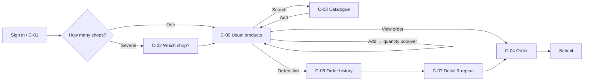

# 06 — Customer self-service (C-01 … C-09)

> C-01–C-08 follow the brief (§7). **C-09 Usual products** isn't in the brief and was added in session (24 Sep 2026): it is the customer's landing page once a shop is chosen. It's numbered after C-08 so it doesn't clash with the brief's IDs, following M-16.

**Device assumptions:** website and app, online, on a phone or at a desk. The app has the same features and no offline mode (Self-service RC 5, assumed).
**Users:** untrained and infrequent. No internal vocabulary: no tier names, price breakdowns or rep provenance (brief §7). No "as of sync" wording anywhere — figures are live (Self-service §4).
**Consequence:** the landing page *is* the product for most customers. Its primary job must be one step from sign-in, and everything else sits a click further in.

---

## Jobs to be done

**Primary job (settled 24 Sep 2026):** "Order the products I usually buy for this shop." Colm's correction to the persona: customers buy **the same products**, but **rarely the same order**. Repeating a past order (C-07, Self-service US-009) is therefore secondary; the landing page is built around frequent products, not past orders.

**Secondary job:** "What's coming, and what's outstanding?" — served by C-06, reached by a link (C9.7).



---

## C-02 · My locations

**Job:** pick the shop this order is for, so stock never arrives at the wrong one.

```
+--------------------------------------------------------+
|  Which shop is this order for?                         |
|                                                        |
|  Hickey's Rathdrum                               >     |
|  Hickey's Arklow                                 >     |
|    Closed until 14 Oct                                 |
+--------------------------------------------------------+
```

> **DECISION C2.1 — a user with more than one shop chooses the shop on every visit; the last choice isn't remembered. Settled.**
> Multi-shop users are most likely managers who move between shops frequently, which is exactly where a remembered context turns into a mode error (ordering for Rathdrum while believing it's Arklow). One extra tap per visit is the accepted cost. A user with one shop skips the choice (Self-service US-003 S3). Rejected: remembering the last shop with a header switcher; remembering within a session.

*Not yet designed:* the chain head office buyer (Hickey's Head Office with 12 branches, US-003 S2) and the entry to the multi-branch grid (C-05).

---

## C-09 · Usual products (landing page)

**Job:** add the products this person usually orders for this shop, without hunting for them.

```
+--------------------------------------------------------+
|  Hickey's Rathdrum                          [ Change ] |
|  [ Search products...                            ]     |
+--------------------------------------------------------+
|  Your usual products                                   |
|                                                        |
|  Hand Cream 75ml                   €3.80      [ Add ]  |
|  Sudocrem 125g                     €4.85      [ Add ]  |
|    Ordered 2 Oct by your rep · 6 on the way            |
|  SPF30 Sun Lotion 200ml                 In order · 12  |
|  Arnica Gel 50g                    €5.10      [ Add ]  |
|    Despatched 4 Oct · expected soon                    |
|  ...                                                   |
|                                                        |
+--------------------------------------------------------+
|  Often ordered for Hickey's Rathdrum                   |
|                                                        |
|  Paracetamol 500mg 16s             €0.95      [ Add ]  |
|  ...                                                   |
+--------------------------------------------------------+
|  7 lines                               [ View order ]  |
+--------------------------------------------------------+
```

Add opens:

```
+--------------------------------------------------------+
|  Hand Cream 75ml · €3.80                               |
|                                                        |
|  Quantity  [          ]                                |
|                                                        |
|  [ Cancel ]                              [ Add ]       |
+--------------------------------------------------------+
```

First visits — no usual products yet, shop regulars shown as a starting point:

```
+--------------------------------------------------------+
|  Hickey's Rathdrum                          [ Change ] |
|  [ Search products...                            ]     |
+--------------------------------------------------------+
|  Often ordered for Hickey's Rathdrum                   |
|                                                        |
|  Hand Cream 75ml                   €3.80      [ Add ]  |
|  Sudocrem 125g                     €4.85      [ Add ]  |
|  ...                                                   |
+--------------------------------------------------------+
```

> **DECISION C9.1 — the usual list is the signed-in person's own orders at this shop: products they ordered at least twice in the last six months. Settled.**
> A frequency rule keeps the list stable from visit to visit, which matters for infrequent users who find things by where they sat last time, and it drops one-offs. Built from the person's own orders only, so a pharmacist who orders cosmetics online isn't shown the medicines the rep handles. Rejected: the rep's last-3-orders rule (churns; monthly products drop in and out); everything in six months (too long to scan); orders from every source at the Location (describes the shop, not the person).

> **DECISION C9.2 — a product on the page is marked when anyone else has ordered it for this shop. Settled.**
> Guardrail by information, not a block: the rep, a colleague or the chain's head office may have ordered it, and the customer shouldn't order it twice. The same idea as the branch Suggested List's "Ordered recently" (Master & Branch §4). Adding the product is still allowed, with no confirmation.

> **DECISION C9.3 — the mark has two stages, and the second ends a fixed number of days after despatch. Settled.**
> Before despatch: "Ordered 2 Oct by your rep · 6 on the way". After despatch: "Despatched 4 Oct · expected soon". A partial despatch shows both, as C-06 does ("24 sent 4 Oct · 12 outstanding"). The system knows despatch but not delivery, so "expected soon" ends after a company setting matching normal transit time (e.g. 3 days). Rejected: ending the mark at despatch (goods still in the van); a fixed period from ordering; clearing on the customer's next order of the product.

> **DECISION C9.4 — until the person's third order, a separate section shows the shop's regulars as a starting point. Settled.**
> With C9.1, a new user's list is empty on day one and still empty after their first order (nothing has been ordered twice). The section "Often ordered for Hickey's Rathdrum" uses the same frequency rule across every order for the Location, whatever its source. It is removed entirely after the person's 3rd order; a product they ordered only once from it is then found through search until it qualifies. Rejected: an empty state with a single Browse action; relaxing the threshold while history is short; letting the section empty product by product (it would never empty, becoming the rejected Location-wide list).

> **DECISION C9.5 — the page is a launchpad; the order lives on C-04. Settled.**
> Browsing and the order stay apart, which is clearer for a large order. The footer bar shows the line count and **View order**. Rejected: the list as the order form with inline quantities.

> **DECISION C9.6 — Add opens a quantity popover that opens empty; the customer stays on the list. Settled.**
> Same behaviour as the rep's popover (T7.7, RC-NEW-005): the field opens empty, and the popover always dismisses. The row then reads "In order · 12". The customer's last quantity isn't prefilled or offered as a hint — propose, don't impose (brief §2.6); a shop low after a busy weekend shouldn't be anchored to last time's 12. Rejected: add at quantity 1 and set quantities on C-04; open C-04 on each Add; a "last ordered 12" hint chip; prefilling the last quantity.

> **DECISION C9.7 — orders are reached by a link to C-06; nothing about open orders sits on this page. Settled.**
> The page serves the primary job only. The C9.3 marks already answer "is it coming?" for the products on it. Rejected: a compact "2 orders on the way" strip above the list.

> **DECISION C9.9 — the mark appears on C-09 only; catalogue, search and repeat rows carry none. Settled.**
> The mark guards the products a customer orders routinely, which is where double ordering happens. Accepted: a product outside the usual list and the starting-point section that someone else has ordered can be ordered twice from search. Rejected: the mark on every product row (C-03, search, C-07 prefills).

> **DECISION C9.8 — mark wording names the source plainly: "your rep", a colleague's name, or the chain's head office by name. Drafting call.**
> "Rep provenance" is stripped from the customer channel (brief §7), but that refers to capture metadata such as Capturing Rep; who ordered is what makes the mark useful. Awaiting confirmation.

---

## Open questions

1. ~~**C-03 Catalogue** — does the C9.2 mark also show on catalogue and search rows?~~ **Resolved 24 Sep 2026 — no; C-09 only (C9.9).**
2. **C-02** — the chain head office buyer and the entry to C-05.
3. **C-04** — editing while Pending now that orders are accepted on receipt (Self-service RC 7).
4. **C9.8** — mark wording (drafting call).
