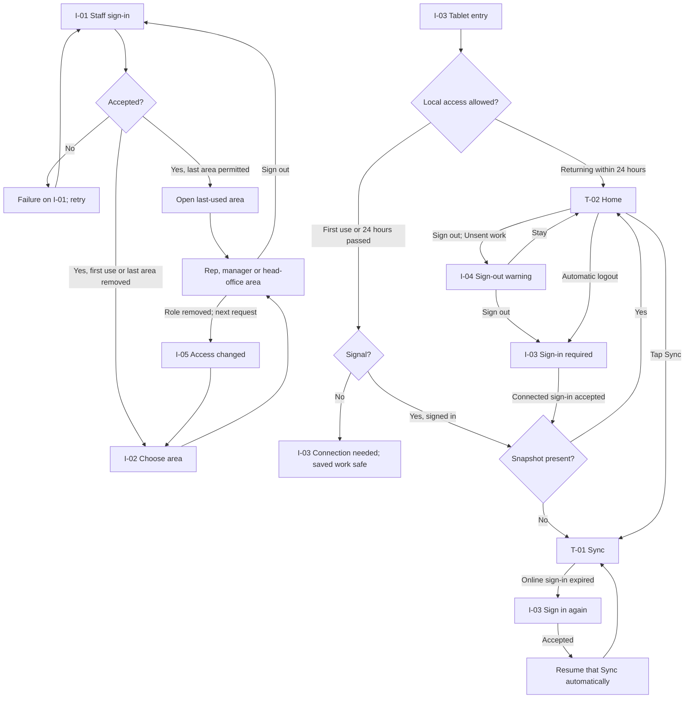

# 07 — Staff and tablet access (I-01 … I-05)

**Added:** 28 Sep 2026. These are shared Identity and Access screens added after the original T/R/M/H/C screen inventory. `I-` means a shared access screen, not a new business area.
**Source:** [Staff and Tablet Sign-in](../stories/staff-and-tablet-sign-in.md) US-001–US-005. Customer invitation and sign-in remain on [C-01](06-customer.md#c-01--invitation--first-sign-in); this file does not change the customer flow.
**Status:** layout proposals for review. The role, offline and recovery behaviour below was settled in the sign-in stories. The staff credential control is left open by MI-03. A fully disabled rep's previously captured work at reconnect remains unresolved; no screen here claims it has uploaded or been deleted.

---

## Flow



**Flow boundary:** returning within 24 hours uses the downloaded day even without signal. The 24 hours run from the last successful connected sign-in. The automatic retry after reauthentication is the continuation of a Sync the rep already started; T1.3 still forbids a new Sync merely because signal returns. T-01 remains the home for Sync and Unsent states.

---

## I-01 · Staff website sign-in

**Job:** let a Staff Member enter the permitted staff area without choosing a role before authentication.
**Context:** shared by the rep, manager and head-office website areas. One accepted sign-in covers every staff role the person holds.

```text
+------------------------------------------------------------------------------------------------+
| Field Sales                                                                                    |
+------------------------------------------------------------------------------------------------+
|                                                                                                |
|                            Sign in to the staff workspace                                     |
|                            Use your staff account to continue.                                |
|                                                                                                |
|                            +------------------------------------------+                        |
|                            | Staff sign-in control — MI-03            |                        |
|                            +------------------------------------------+                        |
|                            [ Continue to staff sign-in ]                                       |
|                                                                                                |
|                            Need help signing in? Contact your administrator.                   |
|                                                                                                |
+------------------------------------------------------------------------------------------------+
```

`Staff sign-in control — MI-03` is a wireframe placeholder, not product copy. MI-03 still has to choose the credential method and recovery route. The screen's job and exit do not depend on whether that control becomes a password form or a redirect to a staff identity service. Customer invitation and password reset are never linked from here.

**States**

```text
  Attempt in progress
  | Signing in...                                      |
  | The action cannot be submitted twice.             |

  Rejected sign-in
  | Couldn't sign in. Try again or contact your        |
  | administrator for help.                            |
  | [ Try again ]                                      |
```

After a successful sign-in, open the last-used area if still permitted. If there is only one permitted area, open it. If several are permitted and there is no usable last-used area, show I-02. A failed attempt leaves the person on I-01 with a way to retry. Website Sign out ends the one staff session and returns here with “Signed out.”

> **DECISION I1.1 — one sign-in, then route by the roles held. Settled 28 Sep 2026.** A manager who also has Head Office User access signs in once and can use both areas. The login page does not ask them to choose a role before their identity is known.

> **DECISION I1.2 — preserve the destination where it is still allowed. Settled direction.** The last-used permitted area is the default. A first-time multi-role user, or one whose last-used area was removed, goes to I-02 when several permitted areas remain. A direct link to a permitted page opens that page after sign-in; it does not get lost behind a default landing.

---

## I-02 · Choose a staff area

**Job:** give a multi-role Staff Member one clear destination when there is no usable last-used area.

```text
+------------------------------------------------------------------------------------------------+
| Field Sales                                       Aoife Murphy                    [ Sign out ]   |
+------------------------------------------------------------------------------------------------+
| Choose where to start                                                                          |
| You can change area later without signing in again.                                           |
|                                                                                                |
| +--------------------------------------------------------------------------------------------+ |
| | Sales manager                                                                             > | |
| | Plan visits, manage coverage and review the team.                                          | |
| +--------------------------------------------------------------------------------------------+ |
| +--------------------------------------------------------------------------------------------+ |
| | Head office                                                                               > | |
| | Work with the catalogue, customers and orders.                                            | |
| +--------------------------------------------------------------------------------------------+ |
+------------------------------------------------------------------------------------------------+
```

Only currently permitted areas are listed. The whole labelled row is an action; keyboard focus follows the visible order. In a staff area, the account/area control shows the current area and the other held roles, so Aoife can switch without signing in again. Switching updates the last-used area. An area removed while I-02 is open disappears on the next request; choosing a stale row leads to I-05, never to restricted content.

> **DECISION I2.1 — choose only when there is no safe default. Settled 28 Sep 2026.** Last-used area is the normal path. Asking every multi-role user on every visit would add a repeated choice for a decision they rarely change.

---

## I-03 · Tablet entry and return

**Job:** let the rep reach their downloaded day when allowed, and tell them what is safe when a connected sign-in is needed.
**Context:** entry to T-02 Home and, on first use, T-01 Sync. The tablet remains offline capable; staff website role choice is not shown here.

```text
+----------------------------------------------------------------+
| Field Sales                                                     |
+----------------------------------------------------------------+
|                                                                |
|                    Sign in on this tablet                       |
|                                                                |
|           Sign in with a connection to start your day.         |
|                                                                |
|           [ Continue to staff sign-in ]                        |
|                                                                |
|           Work saved on this tablet stays here.                |
|                                                                |
+----------------------------------------------------------------+
```

The sign-in control follows the same MI-03 decision as I-01. The locked screen does not display a previous rep's name, Locations or Unsent item details. After the owner signs in, T-02 and T-01 show their own work and counts. First use has no snapshot, so successful sign-in leads to T-01 with Sync as the next action; signing in alone does not start a new Sync.

**States**

```text
  First use, no signal
  | A connection is needed for your first sign-in and download. |
  | No downloaded day is available yet.                         |
  | [ Try again ]                                               |

  Returning within 24 hours, no signal
  | I-03 is skipped. T-02 Home opens from the saved snapshot.    |
  | Calls and Orders can still be captured as Unsent work.      |

  More than 24 hours since connected sign-in, no signal
  | Connect to sign in again before opening your day.           |
  | Work already saved on this tablet is still here.            |
  | [ Try again ]                                               |

  Sign-in required by a Sync already in progress
  | Sign in again to send 3 items.                               |
  | [ Sign in ]                                                 |
  | After sign-in, this Sync resumes automatically.             |
```

If an online sign-in expires while the local 24-hour period remains valid, the rep can continue capturing offline. T-01 presents the expired-sign-in message when they try to Sync; I-03 handles reauthentication and returns to that same Sync. If the connection fails during sign-in, the rep returns to the T-01 message with all Unsent work unchanged. After 24 hours, Home is locked until a connected sign-in succeeds; the saved work is retained.

> **DECISION I3.1 — a one-day local window. Settled 28 Sep 2026.** The rep can reopen and capture offline for 24 hours after the last successful connected sign-in. Reopening the app offline does not extend that window. This draws the line between a normal gap in shop coverage and a tablet that has not checked its user for a full day.

> **DECISION I3.2 — a blocked Sync resumes after sign-in. Settled 28 Sep 2026.** The rep already asked to Sync. Requiring a second tap after authentication adds a hidden step and increases the chance that work stays unsent. It is not background Sync on regaining signal (T1.3).

---

## I-04 · Sign out with Unsent work

**Job:** make the state of saved work clear before a deliberate tablet sign-out.

```text
+----------------------------------------------------------------+
| Sign out?                                                      |
|                                                                |
| 3 items have not synced: 2 Calls and 1 Order.                 |
| They will stay on this tablet for you after sign-out.         |
|                                                                |
| [ Stay signed in ]                           [ Sign out ]     |
|                                                                |
| Open Sync & unsent >                                           |
+----------------------------------------------------------------+
```

The warning appears only when Unsent work exists. With nothing Unsent, Sign out ends the session without a warning. **Open Sync & unsent** closes the dialog and opens T-01; if the tablet has no signal, T-01 explains that Sync needs a connection. **Stay signed in** returns to the previous screen. **Sign out** ends local access while retaining the work for this rep's next sign-in on this tablet. Automatic logout has no decision dialog but preserves the same work. Another Staff Member never sees it.

The dialog uses named actions and moves keyboard or assistive focus into the warning; closing it returns focus to Sign out. On the tablet, both actions remain large tap targets and the warning does not rely on colour alone.

> **DECISION I4.1 — warn, then preserve. Settled 28 Sep 2026.** The rep chooses whether to Sync first, but sign-out itself never deletes captured work. The count and item types make the consequence concrete; the primary question is whether to leave now, not whether to discard data.

---

## I-05 · Staff area access changed

**Job:** explain why a staff area stopped working after a role change, without showing its content.

```text
+------------------------------------------------------------------------------------------------+
| Field Sales                                            Aoife Murphy              [ Sign out ]   |
+------------------------------------------------------------------------------------------------+
| Access to Head office has changed                                                           |
| This area is no longer available to your staff account.                                      |
| A change you just tried to make was not saved.                                               |
|                                                                                                |
| [ Open Sales manager ]                    [ Choose another area ]                             |
+------------------------------------------------------------------------------------------------+
```

The “not saved” line appears only when a write was attempted; for a direct page link, the page simply explains that access has changed. Show **Open Sales manager** only when that area is still permitted; show **Choose another area** only when several areas remain. If none remain, offer Sign out and a route to contact the administrator. The changed area does not render behind this message.

> **DECISION I5.1 — online role removal takes effect on the next request. Settled 28 Sep 2026.** A page already on screen cannot be recalled, but its next read or action is checked and denied. Hiding navigation alone would leave direct links and open forms usable.

**Tablet counterpart:** a role or permission reduction reaches the tablet at its next Sync. Previously captured work uploads under the snapshot in force when captured (BR-NEW-006). The new snapshot removes newly forbidden actions; T-01 may show a short “Access updated” note after the Sync, while the affected control or product disappears from its usual place. A possible audit flag for this rare change is a later decision.

---

## Open questions

1. **MI-03 sign-in control:** choose the staff credential method and staff account recovery route. Replace the labelled wireframe placeholder on I-01 and I-03; keep the surrounding flow and states.
2. **Fully disabled tablet account:** after reconnection, whether previously captured work uploads, stays locally for manager recovery, or waits for account restoration is unresolved in [US-003](../stories/staff-and-tablet-sign-in.md#us-003-sign-in-on-the-tablet-and-return-to-my-downloaded-day). The blocked state must say what happened to the work once that rule is chosen. New tablet work stops as soon as disablement is known.
